# Layers of the Internet

> [计算机网络体系结构与参考模型 - 408](../408/计算机网络体系结构与参考模型.md)

## Layers of the Internet

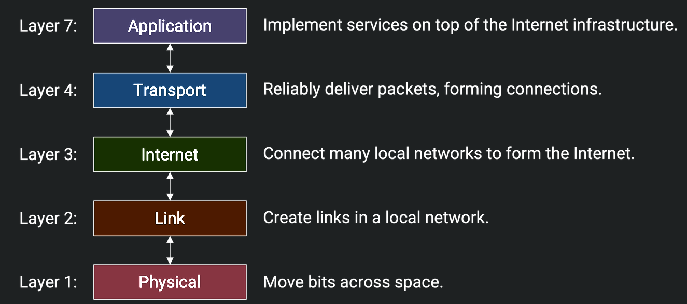

Pay attention to how dose the Internet is organized from underlying physical infrastructure to the application layer, what problem does each layer solve, and the thought about **Layers of Abstraction**.

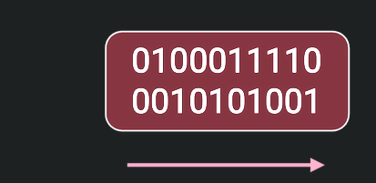

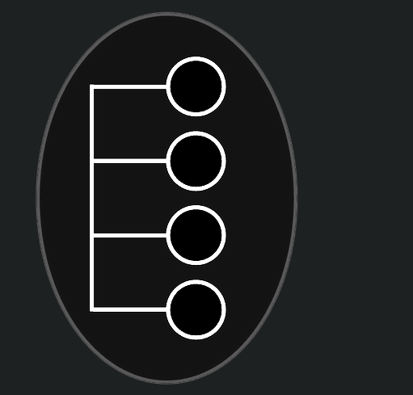

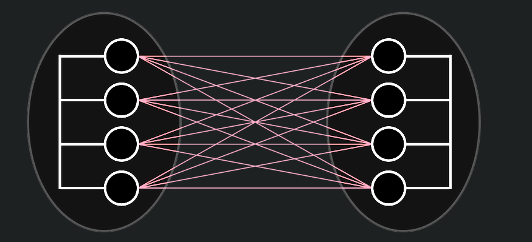

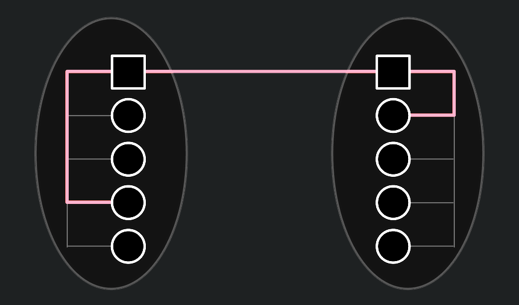

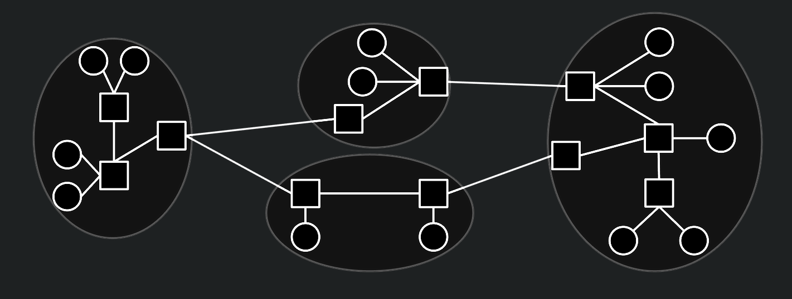

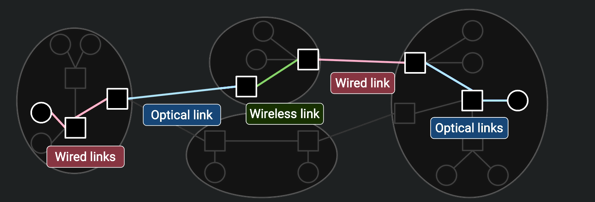

Why did the designers choose such a weak service model? One major reason is, it is much easier to build networks that satisfy these weaker demands[^1].

## Headers

### Why do we need headers?

To tell the network infrastructure what to do with the packet, we need to attach additional metadata, just like a letter needs to be addressed to the recipient.

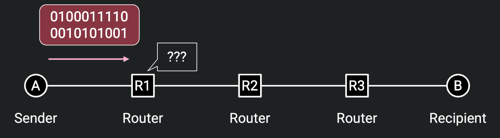

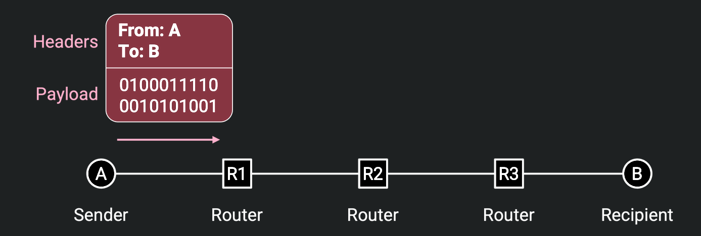

In a packet, the header is the metadata that is added to the packet by the network layer, and the rest part called *payload* (**有效载荷**), which contains the actual data.

### Headers Should be Standardized

Obviously, **headers should be standardized** ensure that different devices can understand each other. 

Everybody on the Internet (every end host, every switch) needs to agree on the format of a header. This also means we need to be careful about designing headers. Once we design a header and deploy it on the Internet, it’s very hard to change the design (we’d have to get everybody to agree to change it)[^2].

### What Should a Header Contain?

- **Destination Address**: where to send the packet.

- **Source Address**: where the packet comes from, allows some infomation backtracking.

- **checksum**: a value that is used to verify the integrity of the packet.

- ...so on.

### Multiple Headers

As we can know in the [previous section](#Layers-of-the-Internet), internet contains multiple layers, it means that a pcaket will pass through multiple layers while traveling through the internet, which like a letter from CEO of company A to the CEO of company B:

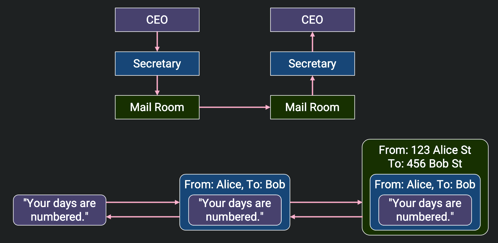

!!! tip
    **Different headers only care about its own layer**.

    While a packet is traveling through the internet, different headers only care about its own layer, and the headers of different layers are independent of each other.

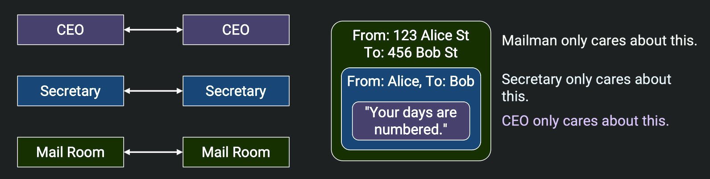

### Layers at Different Devices

- For an end host, it need to implement all layers so that you can get web application services, and in underlying, end hosts should also have the functionality that can send, receive and decode messages.

- For a router, it isn't to run some application like web browser to display some user interface, so it doesn't need to think about layer4 to layer7.

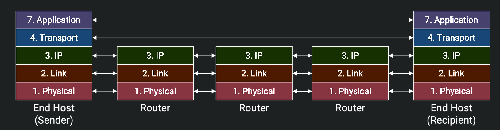

### Multiple Headers Traveling Through Different Devices

In [previous section](#Multiple-Headers), we know that each headers only care about its related layer, and how dose it work in detail?

While a packet is sent from a host, it must pass through some routers, and how do the routers know what to do with the packet? 

The anwser is obviously, which is exactly the functionality of headers. However, there are many headers in a packet, how to extract? This just the discusstion we'll take below.

Think about the example we took above, before the letter get the CEO of company B, it may pass through some post offices. For this offices, they can only care about the destination of *next hop*, instead of all the infomation of the letter which contains some info about the receiver (CEO B).

Next, think about those steps: 

1. Company A wrapped the letter in an envelope, which was then put in a box.

    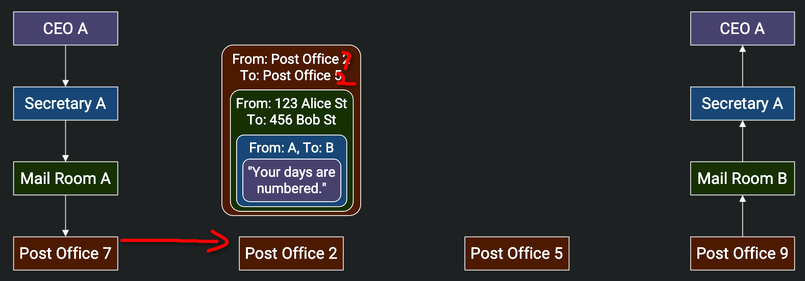

2. At each post office, the mailman opens the box and sorts through the mail. The mailman looks at the envelope (the next header revealed after opening the box), and sees that the envelope is meant for Company B.

    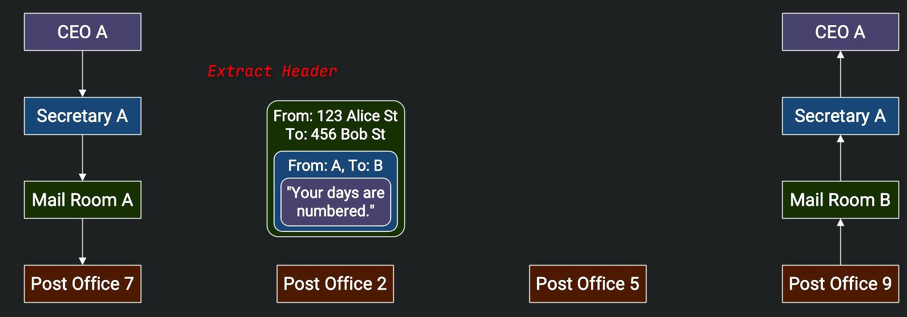

3. The mailman then puts the envelope in another box, possibly different, so that the letter can reach the next post office on the way to Company B.

    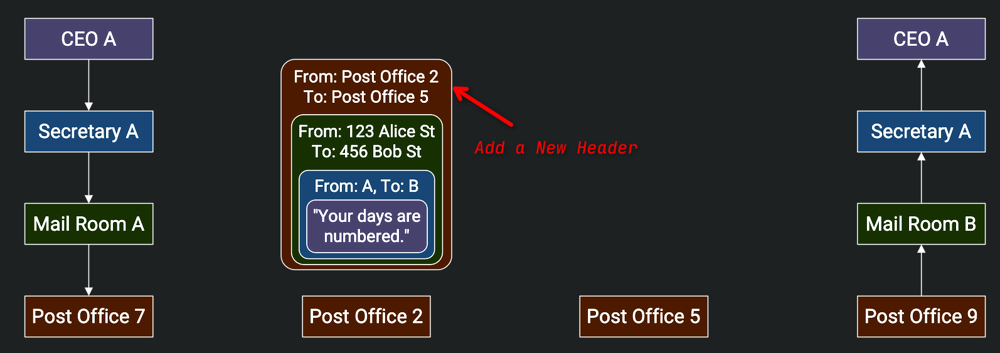

4. Repeat the process until the letter reaches the CEO of company B.

    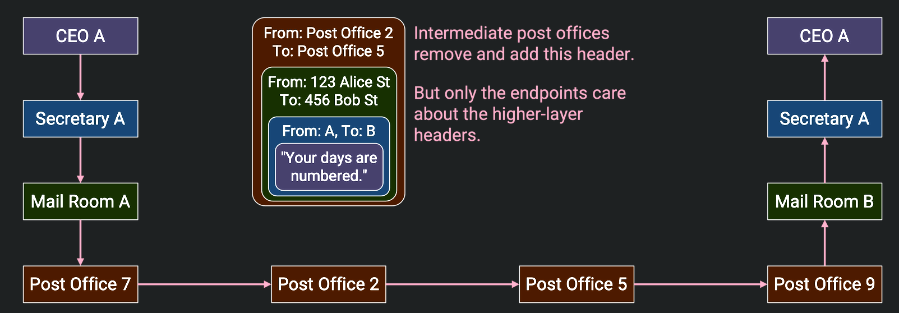

In a similar way, the experience of a packet traveling through the Internet are also "wrapping" and "unwrapping" packets processes like the letter we discussed above:

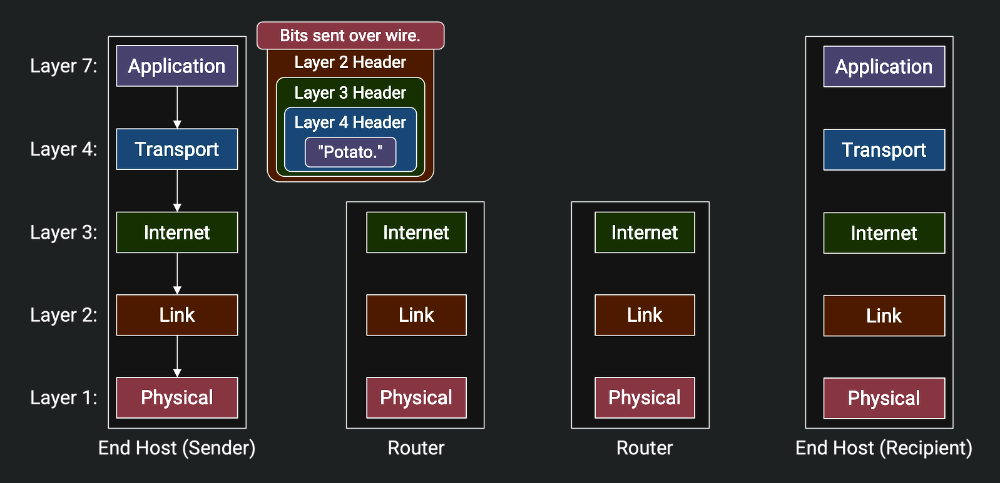

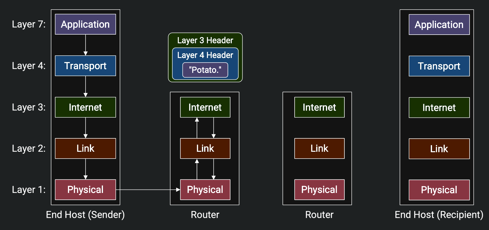

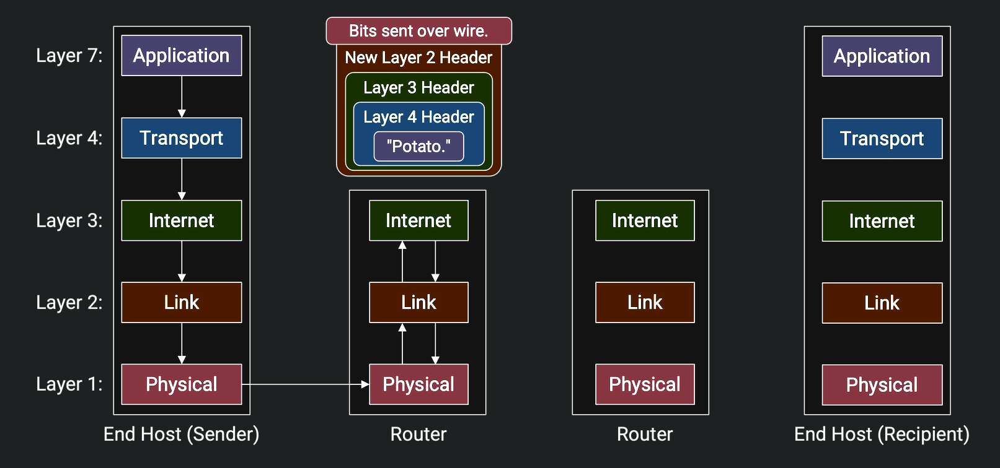

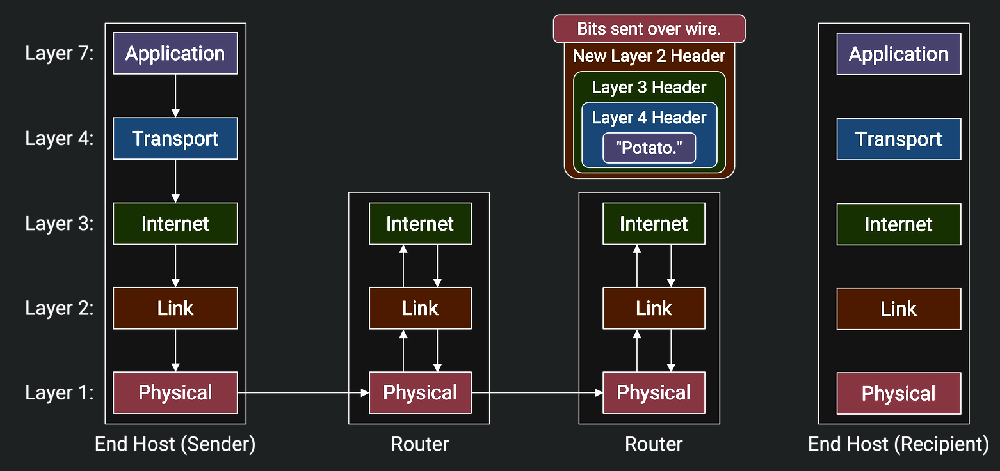

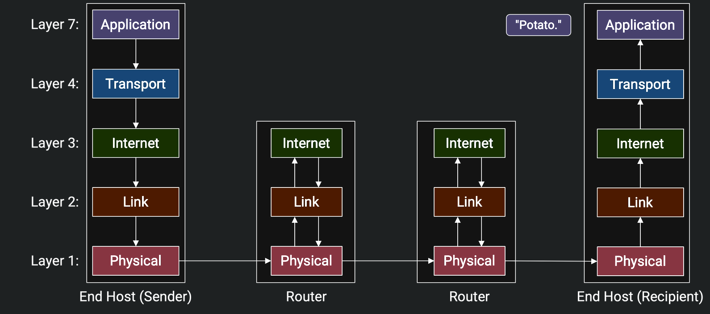

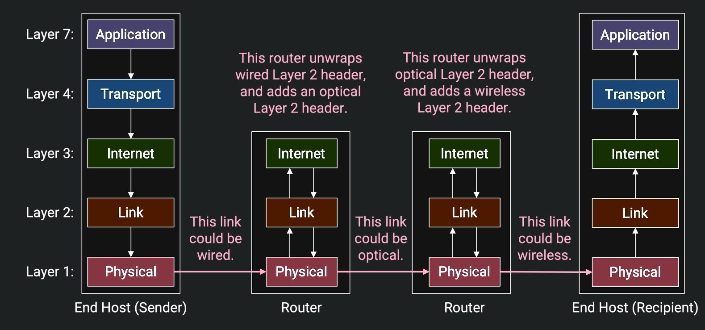

[^1]: [Layers of the Internet | CS168 Textbook](https://textbook.cs168.io/intro/layers.html)

[^2]: [Headers | CS168 Textbook](https://textbook.cs168.io/intro/headers.html)