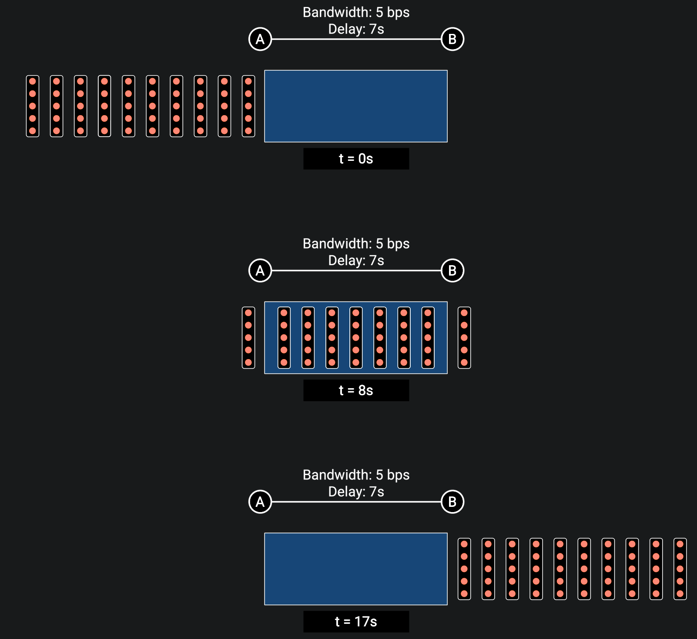
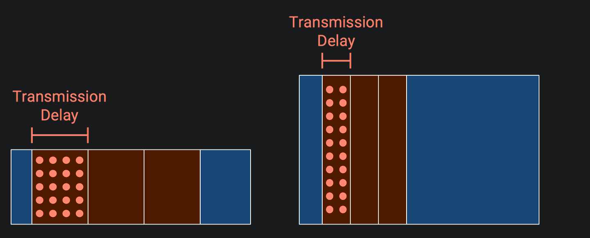

# Links

## Properties of Links

- *Bandwidth*（[**带宽**](../408/计算机网络概述.md#带宽)）: The properties tells us how many bits we can send on the link per unit time.

- *Propagation Delay*（[**传播时延**](../408/计算机网络概述.md#时延)）: The properties tells us how long it takes for a bit to travel from one end of the link to the other.

- *Bandwidth Delay Product*（[**时延带宽积**](../408/计算机网络概述.md#时延带宽积)）: As the name suggests, it is the product of the bandwidth and the propagation delay.

    Intuitively, this is the capacity of the link, or the number of bits that exist on the link at any given instant. In the pipe analogy, if we fill up the pipe and freeze time, the capacity of the pipe is how much water is in the pipe in that instant[^1].

    

## Timing Diagram

The left bar is the sender, and the right bar is the recipient. Time starts at 0 and increases as we move down the diagram.

## Pipe Diagram

Another way to view packets being sent across the network is to draw the bits on the link at a frozen moment in time, which called *pipe diagram*.

Imagine the link is a pipe (similar to the water analogy) and draw the pipe as a rectangle, where the width is the propagation delay, and the height is the bandwidth. The area of the pipe is the capacity of the link.

Pipe diagrams can be useful for comparing different links. Let’s look at the exact same packets traveling through three different links.

If we shorten the propagation delay, the pipe width gets shorter. The pipe height stays the same, and the shape of each rectangular packet is the same:

This corresponds exactly to the variation trend of transmission delay.

## Overloaded Links

> [Overloaded Links - Links | CS168 Textbook](https://textbook.cs168.io/intro/links.html#overloaded-links)

When two packets arriving simultaneously, and we can only send out one. The *transient overload* happens, and it’s extremely common at switches in the Internet.

To cope with transient overload, the switch maintains a queue of packets. If two packets arrive simultaneously, the switch queues one of them and sends out the other one. And the sending process is controlled by a *packet scheduling algorithm*.

However, if we face *persistent overload*, that just isn’t enough capacity on the outgoing link to support the level of incoming traffic. We could still fill he queue up, but that still isn’t enough to support the incoming load. One way or another, **the switch will drop packets**.

[^1]: [Properties of Links - Links | CS168 Textbook](https://textbook.cs168.io/intro/links.html#properties-of-links)