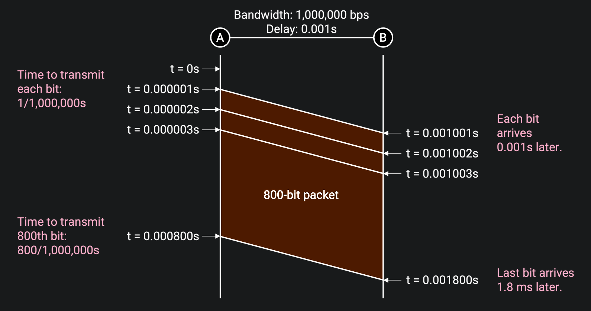

# Links

## Properties of Links

- *Bandwidth*（[**带宽**](../408/计算机网络概述.md#带宽)）: The properties tells us how many bits we can send on the link per unit time.

- *Propagation Delay*（[**传播时延**](../408/计算机网络概述.md#时延)）: The properties tells us how long it takes for a bit to travel from one end of the link to the other.

- *Bandwidth Delay Product*（[**延时带宽积**](../408/计算机网络概述.md#延时带宽积)）: As the name suggests, it is the product of the bandwidth and the propagation delay.

    Intuitively, this is the capacity of the link, or the number of bits that exist on the link at any given instant. In the pipe analogy, if we fill up the pipe and freeze time, the capacity of the pipe is how much water is in the pipe in that instant[^1].

    

## Timing Diagrams

The left bar is the sender, and the right bar is the recipient. Time starts at 0 and increases as we move down the diagram.

[^1]: [Properties of Links - Links | CS168 Textbook](https://textbook.cs168.io/intro/links.html#properties-of-links)