# Routing States

> [Routing States | CS168 Textbook](https://textbook.cs168.io/routing/solutions.html)

## Destination-Based Routing

### Routing Decision

The basic challenge of Routing is that *when a packet arrives at a router, how does the router know where to send it next, such that it will eventually arrive at the desired destination?*

#### Bad Routing Strategies

- *Random*: Send along a random link – bad because packet might not reach destination.

- *Broadcast*: Send along every link – bad because wasting bandwidth.

#### Destination-Based Routing

The Internet uses *destination-based forwarding*:

- Each router keeps a *table*, mapping destinations to next hops.

- The decision only depends on the destination field of the packet.

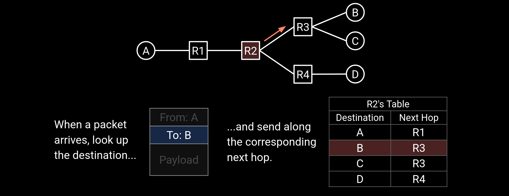

!!! tip "Real World Routing Table"
    In real life, the table often uses physical ports instead of next hops.

    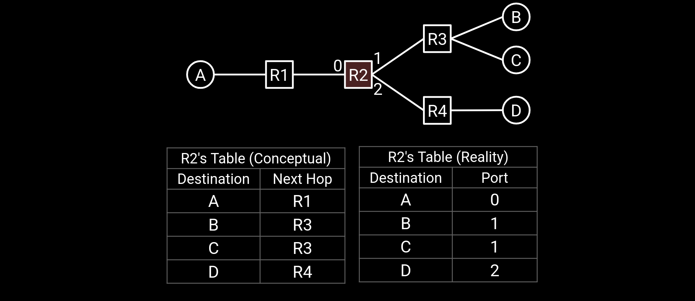

### Routing vs. Forwarding

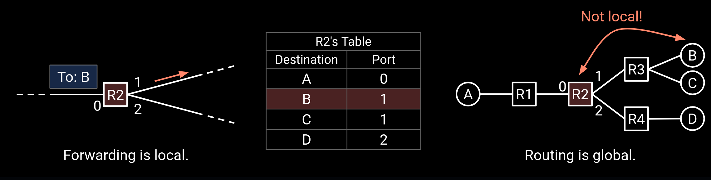

- *Forwarding*（**转发**）

    - Look up packet's destination in table, and send packet to neighbor.

    - *Inherently local*. Depends only on arriving packet and local table.

    - Occurs every time a packet arrives (nanoseconds).

- *Routing*（**路由**）

    - Communicates with other routers to determine how to populate tables.

    - *Inherently global*. Must know about all destinations, not just local ones.

    - Occurs every time the network changes (e.g. a link fails).

## Routing State Validity[^1]

### Routing State Validity is Global

*A routing state is valid if packets actually reach their destinations.*

A local routing state is a table in a single router. By itself, the state in a single router can't be evaluated for validity. [As we know](Introduction%20to%20Routing.md#Some-Points-in-Routing), because a singal router dosen't has the global view of the network.

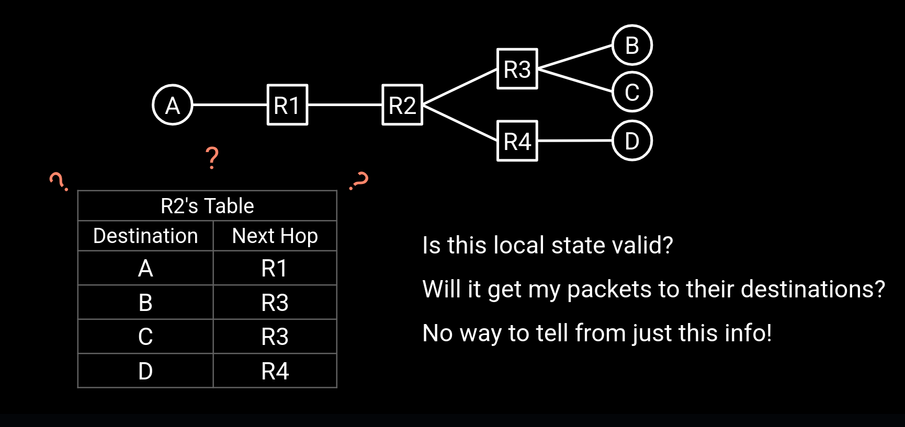

A global routing state is a *collection of tables* in all routers.

- Global state determines the paths a packet takes.

- Global state is valid if it produces forwarding decisions that deliver packets to their destinations.

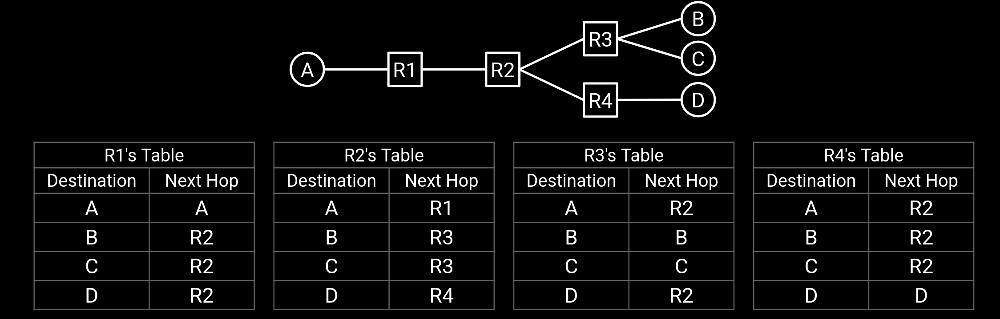

### Routing State Validity Conditions

A global routing state is valid if and only if there are *no dead ends* and *no loops*.

- *Dead end*: A packet arrives at a router, but there is no next hop to forward it. Packet arriving at destination doesn't count as a dead end.

    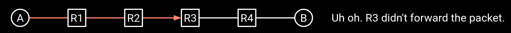

- *Loop*: A packet cycles around the same set of routers. If forwarding only depends on destination field, if a packet gets stuck in a loop, it can never escape.

    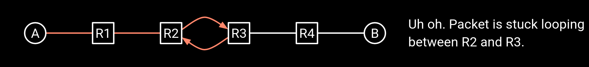

### Verifying Routing State Validity

How do we apply this condition to check if a global state is valid?

- *Strategy*: Check each destination separately.

- For a given destination: Use the tables to see how each router forwards packets.

- The next-hop becomes an outgoing arrow.

- The result is a *directed delivery tree*（**有向传递树**） for that destination.

!!! tip "Directed Delivery Tree"
    The essence of the directed delivery tree is the *minimum spanning tree*（[**最小生成树**](../../DataStructure/408/图的应用.md#最小生成树)）, which *rooted at the destination*. 

    - directed = Edges have arrows.

    - Tree = No cycles, no disconnected components.

    - Spanning = Tree touches every node, so every node can talk to the destination

    - All edges point toward destination.

    - Starting at any node and following edges will reach the destination.
    
    It shows how packets get forwarded toward one destination.

- Properties of Directed Delivery Trees (considering nodes as routers):

    - At each router, 1 next-hop per destination. 1 outgoing arrow per node!

    - Once paths meet, they never split. (Same destination = same next hop.)

    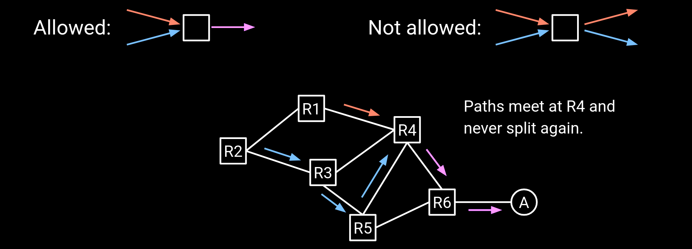

#### Steps to Verify Routing State Validity

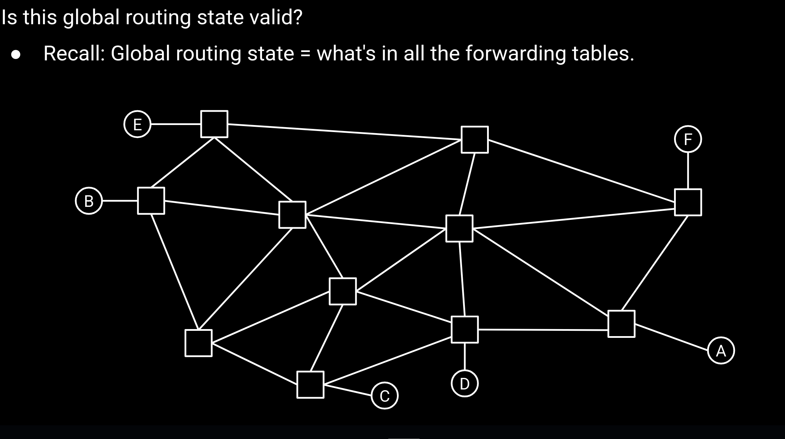

1. Pick a single destination.

    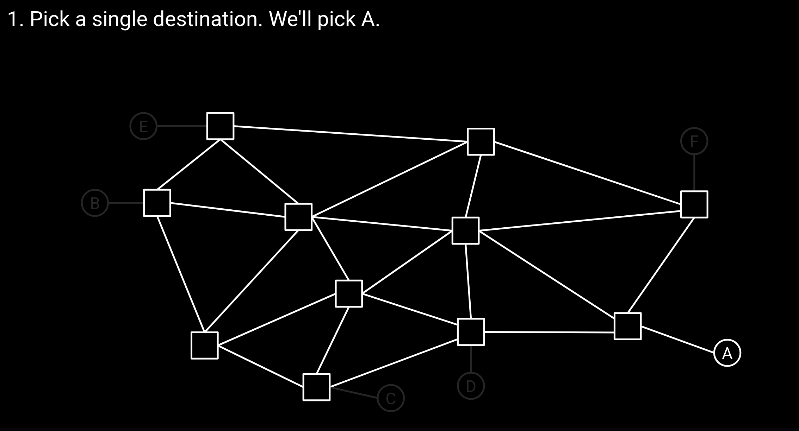

2. For each router, draw an arrow to the next-hop.

    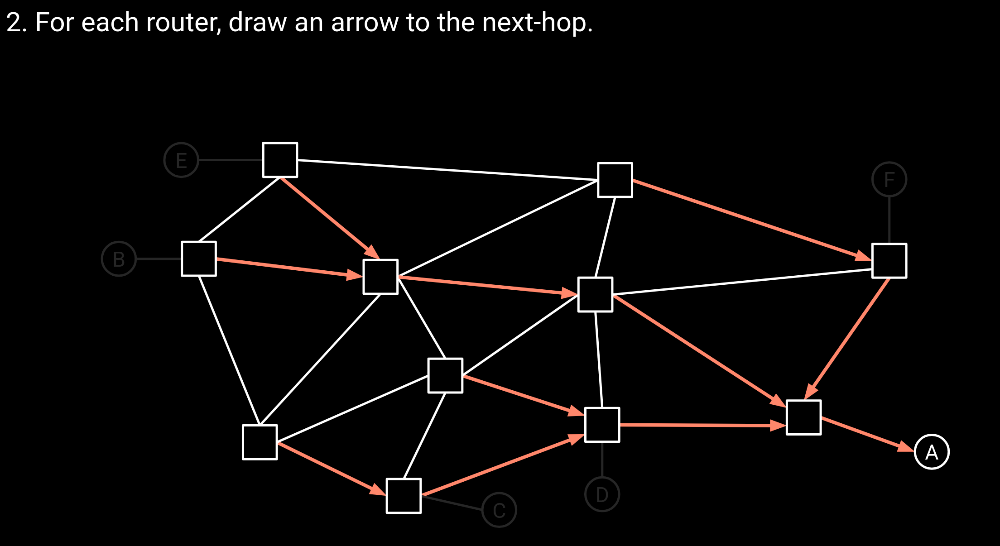

    - Destination-based forwarding = there is only one outgoing arrow.

3. Delete all links with no arrows.

4. State is valid if and only if the remaining graph is a valid directed delivery tree.

    - No dead ends. (Node with no outgoing arrow.)

        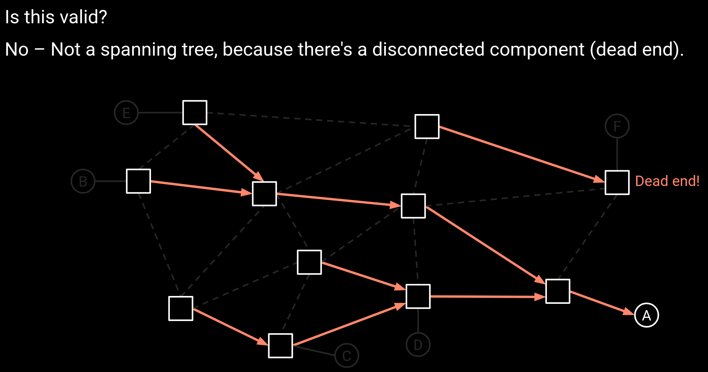

    - No loops. (Cycles in the graph.)

        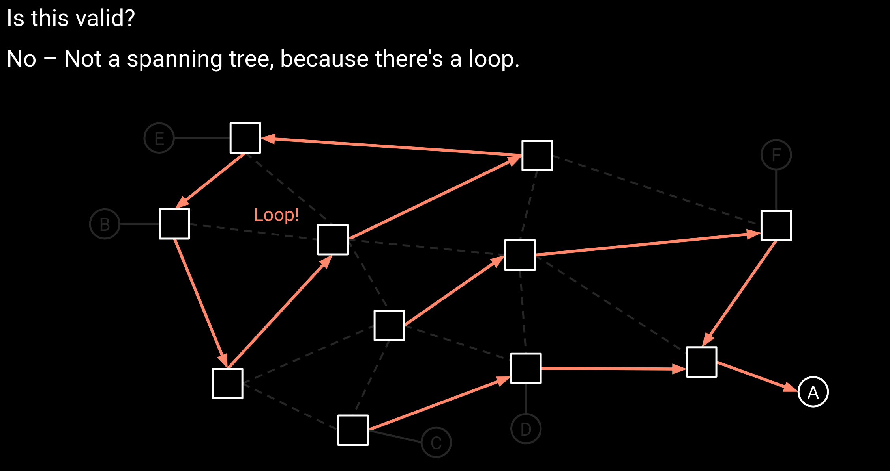

    - A directed spanning tree where all edges point toward the destination.

5. Repeat for every destination!

    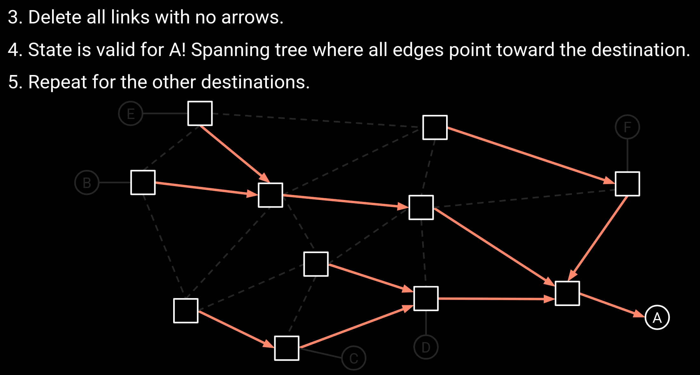

### Least-Cost Routing

Least-cost routing: Assign costs to every edge, and find paths with lowest cost.

- Cost depends on the metric the operator wants to minimize.

- Costs can be arbitrary. Routing protocols don't care where the costs come from.

To simply, it is to *weight each link based on actual conditions*, and then find the *shortest weighted path*（[**最短带权路径**](../../DataStructure/408/图的应用.md#最短路径)）.

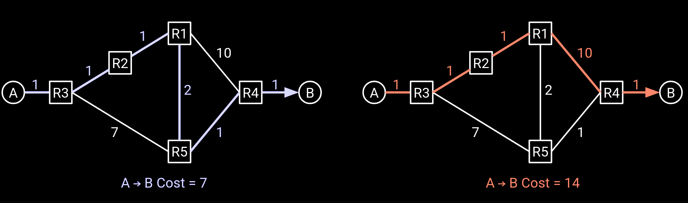

#### Properties of Cost

- Costs are always positive integers.

    - Can't traverse an edge and make a path cheaper.

    - Consistent with almost any practical metric you'd use.

- Costs are always symmetrical.

    - A → B costs the same as B → A.

    - Exceptions possible in theory (e.g. different upload/download bandwidth).

## Static Routing

One possible way to generate routes is to have the network operator manually populate the forwarding table. This is known as *static routing*（**静态路由**）.

### Special Route Types

!!! review
    In a routing protocol, routers talk to each other to populate forwarding tables and learn paths to destinations.

Some table entries can be manually *hard-coded*.

- Connected/Direct routes let us forward to things we're connected to directly.

    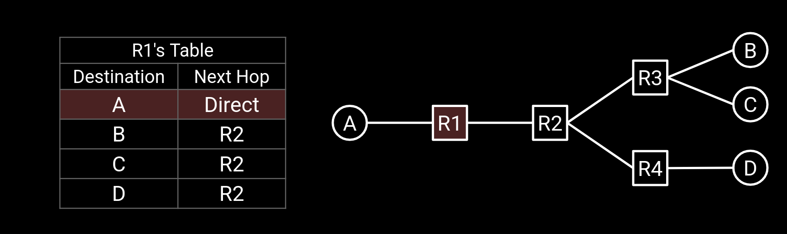

- These routes are created when the operator configures the router.

- *No routing protocol needed for these entries.*

- *Static routes are hard-coded entries that we always want to be there.*

- Router isn't necessarily directly connected to the destination.

- The route is *static* because:

    - It never changes.

    - No routing protocol used to discover it.

[^1]: The term "routing state validity" might only be used at Berkeley.