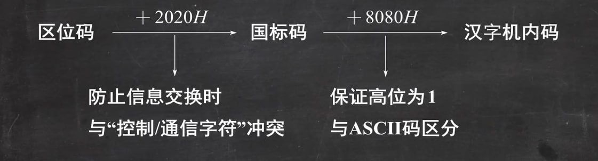
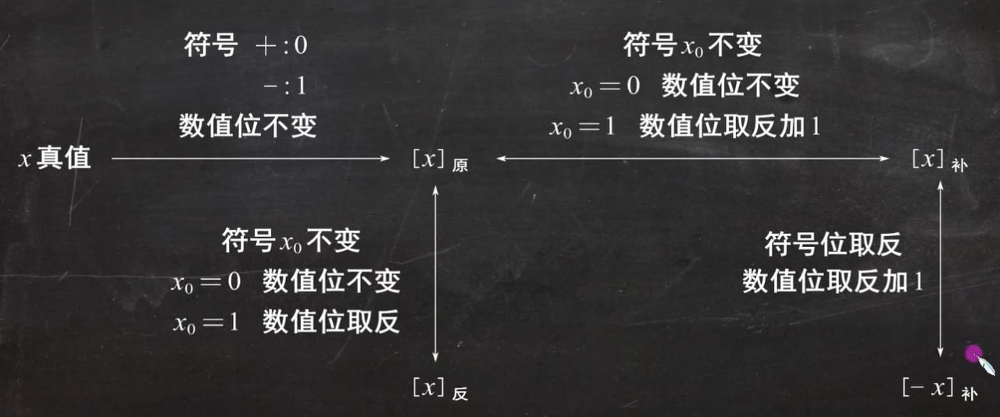

# 数据的表示

## 数制与编码

### 进制计数制

- **基数**（$r(2, 8, 10, 16)$）: 表示该进制中每个数码位上可能的取值个数。数值逢 $r$ 进一

- **权重**（$w_i$）: 表示该数码位上所代表的数值。例如，在十进制数 $123.45$ 中，$1$ 的权重为 $10^2$，$2$ 的权重为 $10^1$，$3$ 的权重为 $10^0$，$4$ 的权重为 $10^{-1}$，$5$ 的权重为 $10^{-2}$。

计算机科学中常用的进制有二进制、八进制、十进制和十六进制:

| 二进制 | 八进制 | 十进制 | 十六进制 |
|:-:|:-:|:-:|:-:|
| $B$ | $O$ | $D$ | $H$ / $0x$ |

#### r进制转换为十进制

各位数码位与其权值的乘积之和，即为该数对应的十进制数。

例如，二进制数 $1011.01B$ 对应的十进制数为 $1 \times 2^3 + 0 \times 2^2 + 1 \times 2^1 + 1 \times 2^0 + 0 \times 2^{-1} + 1 \times 2^{-2} = 11.25$。

#### 二进制与八进制的相互转换

每**三个二进制位**对应一个八进制位。以小数点为中心开始向两边看，每三位一组，转换为对应的八进制数，不足三位时，在高位补零。

#### 二进制与十六进制的相互转换

与二进制与八进制的相互转换类似，每**四个二进制位**对应一个十六进制位。

#### 十进制转换为二进制

将十进制数使用**短除法**拆分成 $2^n\ (n = 0, 1, \cdots)$ 之和即可。

!!! tip "短除法"
    将十进制数除以 $2$，取余数，直到商为 $0$ 为止，将余数从下到上排列，即为对应的二进制数。

#### 十进制转换为八进制或十六进制

先将十进制数转换为二进制数，在按照上面提到的方法转换为八进制或十六进制。

### 编码

#### BCD编码

二进制编码的十进制数（*Binary-Coded Decimal*，BCD），指用**四位二进制数**来表示一个十进制数中的一个数码。

!!! example "8421码"
    8421码是一种有权码，即每个二进制位上的权值为 $8, 4, 2, 1$。
    
    | 十进制数 | 0 | 1 | 2 | 3 | 4 | 5 | 6 | 7 | 8 | 9 |
    |:-:|:-:|:-:|:-:|:-:|:-:|:-:|:-:|:-:|:-:|:-:|
    | 8421码 | 0000 | 0001 | 0010 | 0011 | 0100 | 0101 | 0110 | 0111 | 1000 | 1001 |

    在使用8421码进行运算时，若计算结果不在上面的映射表中，则需要进行**十进制调整**，即加上 $6$（$1010B$），高位组不满四位时，在高位继续补零。

    !!! tip "加6调整的原因"
        8421码有四个二进制位，可以表示 $16$ 种状态，而十进制只有 $10$ 种状态，有 $6$ 种状态没有被使用，因此需要加上 $6$ 进行调整，使得计算结果在8421码的映射表中。

#### ASCII码

ASCII码（*American Standard Code for Information Interchange*），是一种**7位二进制编码**（通常用 $8$ 位表示一个字符，最高位为 $0$），用于表示 $128$ 种字符。

在ASCII码中:

- 所有数字、大写和小写字母被连续分配代码

- 常见的ACSII码:

    - `'0'`: $(48)_{10} = (30)_{16} = (00110000)_2$

    - `'A'`: $(65)_{10} = (41)_{16} = (01000001)_2$

    - `'a'`: $(97)_{10} = (61)_{16} = (01100001)_2$

    若求存储单元存放的内容，则需要如上式所示使用 $8$ 位二进制数表示；但如果是问ASCII码（值），则需使用 $7$ 位二进制数表示。

#### 汉字的表示和编码

- **区位码**: 将汉字分为 $94$ 个区，每个区有 $94$ 个位，共 $94 \times 94 = 8836$ 个汉字。
    
    区位码的表示方法为：$区码 + 位码$，例如：`'中'` 的区位码为 `'1601'`。

- **国标码**（GB 2312 交换码）: 在区位码基础上，将区码和位码各加上 $32$（即 $20H$），使每个字节落在可打印的图形字符范围内，便于传输与交换。

    公式：国标码 $=$ 区位码 $+ 2020H$（区码、位码分别加 $20H$）。例如：`'中'` 的区位码为 $5448$（区 $54$、位 $48$，十六进制 $3630H$），国标码为 $5650H$。

- **汉字机内码**: 计算机内部存储汉字时使用的编码。

    在国标码基础上，将两个字节各加上 $128$（即 $80H$），使每个字节最高位为 $1$，从而与 ASCII 码（最高位为 $0$）区分，避免与西文冲突。公式：机内码 $=$ 国标码 $+ 8080H$。例如：`'中'` 的国标码为 $5650H$，机内码为 $D6D0H$。

#### 字符串

- 字符串是按地址从高到低连续存储的多个字符的集合，通常以 `'\0'` 结尾

- 对于多字节的数据（如汉字），可采用大/小端模式存储

    - 大端模式: 将数据的最高有效字节存放在低地址单元中

    - 小端模式: 将数据的最高有效字节存放在高地址单元中

#### 校验码

校验码是一种用于检测和纠正数据传输或存储过程中错误的技术。它通过在数据中添加冗余信息，以便在接收端进行错误检测和纠正。

常用的校验码有:

- 奇偶校验码

- 海明码

- 循环冗余校验码（CRC）

##### 奇偶校验码

奇偶校验码是一种简单的校验码，它通过在数据中添加一个校验位，使得数据中 $1$ 的个数为奇数或偶数。

| 奇偶校验码 | 有效信息位 |
|:-:|:-:|
| $1$ 位 | $n$ 位 |

!!! example
    例如，对于数据 $1011011$，其奇校验码为 $01011011$（原本有奇数个 $1$，校验位（最高位）为 $0$）；偶校验码为 $11011011$（原本不是偶数个 $1$，校验位（最高位）为 $1$）。

## 定点数的表示

### 定点整数

定点整数为**纯整数**，约定小数点的位置在有效数值部分最低位之后。

<table>
<tr>
  <td style="text-align:center">x0</td>
  <td style="text-align:center">,</td>
  <td style="text-align:center">x1</td>
  <td style="text-align:center">x2</td>
  <td style="text-align:center">...</td>
  <td style="text-align:center">xn</td>
  <td style="text-align:center">.</td>
</tr>
<tr>
  <td style="text-align:center">符号位</td>
  <td style="text-align:center"></td>
  <td colspan="4" style="text-align:center">数值部分</td>
  <td style="text-align:center">小数点（隐含）</td>
</tr>
</table>

### 定点小数

定点小数为**纯小数**（小于 $1$ 的小数），约定小数点的位置在符号位之后，有效数值部分最高位之前。

<table>
<tr>
  <td style="text-align:center">x0</td>
  <td style="text-align:center">.</td>
  <td style="text-align:center">x1</td>
  <td style="text-align:center">x2</td>
  <td style="text-align:center">...</td>
  <td style="text-align:center">xn</td>
</tr>
<tr>
  <td style="text-align:center">符号位</td>
  <td style="text-align:center">小数点（隐含）</td>
  <td colspan="4" style="text-align:center">数值部分</td>
</tr>
</table>

### 原码、反码、补码、移码之间的转换

!!! example
    

      <iframe src="https://player.bilibili.com/player.html?isOutside=true&aid=113966823117737&bvid=BV1taNuerEVq&p=3&t=1336&autoplay=0" 
      scrolling="no" 
      border="0" 
      frameborder="no" 
      framespacing="0" 
      allowfullscreen="true"> 
      </iframe>
    

#### 原码表示法

用机器数的最高位表示符号（$0$ 表示正数，$1$ 表示负数），其余位表示数值的绝对值。

!!! warning "真值零"
    原码表示法中，真值 $0$ 有两种表示方法: $[+0]_{原} = 0,000$ 和 $[-0]_{原} = 1,000$。

#### 反码表示法

- 正数的反码与原码相同

- 负数的反码为原码的每一位取反（符号位除外）

同理，真值 $0$ 也有两种表示方法: $[+0]_{反} = 0,000$ 和 $[-0]_{反} = 1,111$。

#### 补码表示法

- 正数的补码与原码相同

- 负数的补码为原码的每一位取反（符号位除外），然后加 $1$

!!! tip
    - 补码的定义也可以“逆着用”，即“取反加一”也可以用于补码转换为原码。

    - 真值零的补码只有一种表示方法: $[+0]_{补} = 0,000$。

#### 移码表示法

将补码的符号位取反，即可得到移码。

!!! tip
    - **移码只能用于表示定点整数（多用于表示浮点数的阶码）**

    - 基于移码的定义和补码的特性，移码的真值零也只有一种表示方法: $[+0]_{移} = 1,000$

### 原码、反码、补码、移码的表示范围

#### 定点整数

- 原码表示法：$-2^{n-1} \le [x]_{原} \le +2^{n-1} - 1$

- 反码表示法：$-2^{n-1} \le [x]_{反} \le +2^{n-1} - 1$

- 补码表示法：$-2^{n} \le [x]_{补} \le +2^{n-1} - 1$

- 移码表示法：$-2^{n} \le [x]_{移} \le +2^{n-1} - 1$

#### 定点小数

- 原码表示法：$-(1 - 2^{-n}) \le [x]_{原} \le +(1 - 2^{-n})$

- 反码表示法：$-(1 - 2^{-n}) \le [x]_{反} \le +(1 - 2^{-n})$

- 补码表示法：$-1 \le [x]_{补} \le +1 - 2^{-n}$

## 浮点数的表示

浮点数是一种表示实数的方法，它将实数表示为**尾数**和**阶码**的乘积。

$$
N = M \times R^E
$$

其中，

- $r$ 是浮点数阶码的底（隐含），与尾数的基数相同，通常为 $2$

- $M$ 和 $E$ 分别是尾数和阶码，都是有符号的定点数

| $J_f$ | $J_1 J_2 J_m$ | $S_f$ | $S_1 S_2 S_n$ |
|:-:|:-:|:-:|:-:|
| 阶码符号位 | 阶码数值部分 | 尾数符号位 | 尾数数值部分 |

!!! tip
    - 阶码是整数，阶符 $J_f$ 和阶码的位数 $m$ 共同决定浮点数的表示范围和小数点的实际位置

    - 数符 $S_f$ 表示浮点数的符号，尾数的位数 $n$ 决定浮点数的精度

### 规格化浮点数

### IEEE 754标准

| $m_s$ | $E$ | $M$ |
|:-:|:-:|:-:|
| 数符 | 阶码（移码表示） | 尾数（原码表示） |

IEEE 754标准规定的常用的浮点数有短浮点数（$32$ 位, `float`）、长浮点数（$64$ 位, `double`）和临时浮点数（$128$ 位）:

| 类型 | 符号位 | 阶码 | 尾数数值 | 偏置值 |
|:-:|:-:|:-:|:-:|:-:|
| 短浮点数 | $1$ | $8$ | $23$ | $7FH$（$127_{10}$） |
| 长浮点数 | $1$ | $11$ | $52$ | $3FFH$（$1023_{10}$） |
| 临时浮点数 | $1$ | $15$ | $112$ | $3FFFH$（$16383_{10}$） |
