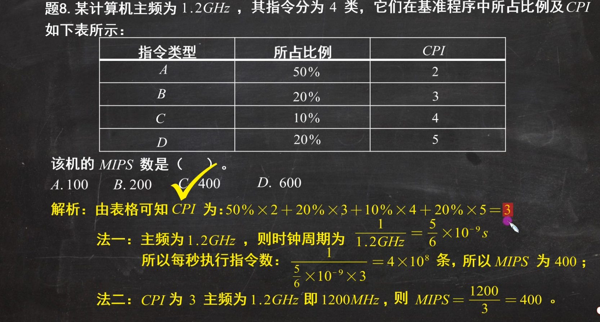

# 计算机概述

## 计算机的重要硬件部件

### 冯诺依曼机的特点

- 计算机由五大部件组成: 运算器、控制器、存储器、输入设备、输出设备

- 指令和数据以同等地位存放在存储器中，并可按地址寻访

- 指令和数据都用二进制表示

- 指令由操作码和地址码组成

- 存储程序并按地址顺序执行

- 以运算器为中心（现代计算机以存储器为中心）

!!! note
	冯诺依曼结构计算机中数据采用二进制编码表示，主要原因有:

    - 二进制的运算规则简单

    - 制造两个稳态的物理器件比较容易

    - 便于用逻辑门电路实现算术运算（逻辑运算/真值运算）

### 主存储器

#### 主存储器的组成

- 存储体: 数据在存储体中按**地址**存储

- MAR（存储地址寄存器）: MAR位数反映存储单元个数，即地址范围

- MDR（存储数据寄存器）: MDR位数反映存储字长，即每次存取的数据位数

#### 相关概念

- 存储元: 即存储二进制的电子元件，每个存储元可存储 $1 bit$

- 存储单元: 每个存储单元存放一串二进制代码，由若干个存储元组成

- 存储字: 存储单元中二进制代码的组合

- 存储字长: 存储单元中二进制代码的位数

- 在同一个存储器中，每个存储单元的宽度，即存储字长是固定的

- $1 Byte = 8 bit$

### 运算器

#### 运算器的组成

- ACC（累加器）

- MQ（乘商寄存器）

- X（通用操作数寄存器）

- ALU（算术逻辑单元）

#### 相关概念

##### 各个部件运算过程中存储的数据

| | $+$ | $-$ | $\times$ | $\div$ |
|:---:|:---:|:---:|:---:|:---:|
| ACC | 被加数、和 | 被减数、差 | 乘积高位 | 被除数、商 |
| MQ | - | - | 乘数、乘积低位 | 商 | 
| X | 加数 | 减数 | 被乘数 | 除数 |

!!! tip "乘积高位与乘积低位"
    在计算机组成原理的二进制乘法运算中，为了处理 $n$ 位数相乘得到 $2n$ 位积的情况，通常将结果分为乘积高位和乘积低位存储。高位由累加器（ACC）存放，低位由乘商寄存器（MQ）存放，并在相乘过程中配合右移操作完成计算[^1]。例如，当十进制运算 $0.1 \times 0.1 = 0.01$ 积为两位小数，这时ACC和MQ就需要各存一位。

### 控制器

#### 控制器的组成

- CU（控制单元）: 分析指令

- IR（指令寄存器）: 存放当前执行的指令

- PC（程序计数器）: 存放下一条指令的地址，有自增功能

!!! tip
    - CPU = 运算器 + 控制器 （+ 若干寄存器）

#### 硬件工作过程

初始时指令和数据存入主存，PC指向第一条指令，从主存中取出指令放入IR中，PC自动加1，指向下一条指令，CU分析指令并发出控制信号控制其他部件来执行指令。

## 计算机的层次结构

### 层次结构

- 虚拟机器 $M_4$ （高级语言机器）

- 虚拟机器 $M_3$（汇编语言机器）

- 虚拟机器 $M_2$（操作系统机器）

- 传统机器 $M_1$（机器指令系统）

- 微程序机器 $M_0$（微指令系统）

### 相关概念

## 计算机的性能指标

### 存储器的性能指标

- 存储器容量 $=$ 存储单元个数 $\times$ 存储字长

#### 相关概念

- $n$ 位二进制数可以表示 $2^n$ 种不同的状态

- 与存储容量相关的计算中: $1K = 2^10 = 1024$, $1M = 2^20 = 1024K$, $1G = 2^30 = 1024M$, $1T = 2^40 = 1024G$

- 与时间相关（如传输速率）的计算中: $1K = 10^3$, $1M = 10^6$, $1G = 10^9$, $1T = 10^{12}$

!!! note
    - 看清题干中说的是**按字节**编址还是**按字**编址

    - 寻址范围无单位，存储容量有单位

### CPU的性能指标

- CLK: CPU时钟周期，一台计算机中最小的时间单位

- CPU主频（时钟频率）$= \frac{1}{CLK}$

- CPI: 执行一条指令所需的时钟周期*数*

- IPS: 每秒执行的指令条数 = $\frac{1}{CPI \times CLK}$

- FLOPS: 每秒执行的浮点运算次数

- 执行一条指令的耗时 $= CPI \times CLK$

- CPU执行时间 $= \frac{时钟周期数}{主频} = \frac{指令条数 \times CPI}{主频}$

    <iframe src="//player.bilibili.com/player.html?isOutside=true&aid=113966823117737&bvid=BV1taNuerEVq&p=1&t=944" 
        scrolling="no"
        border="0"
        frameborder="no"
        framespacing="0"
        allowfullscreen="true">
    </iframe>

[^1]: [计算机组成原理笔记第六章：计算机的运算方式 - 7号的文章 | 知乎](https://zhuanlan.zhihu.com/p/682261491)