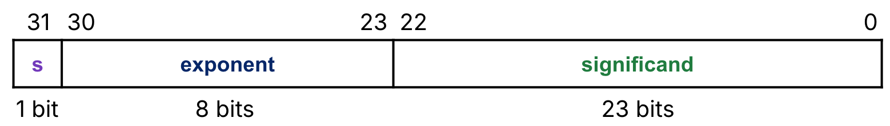
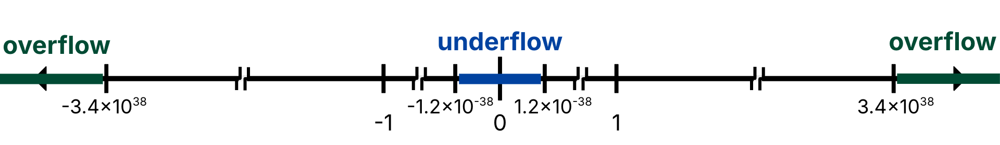
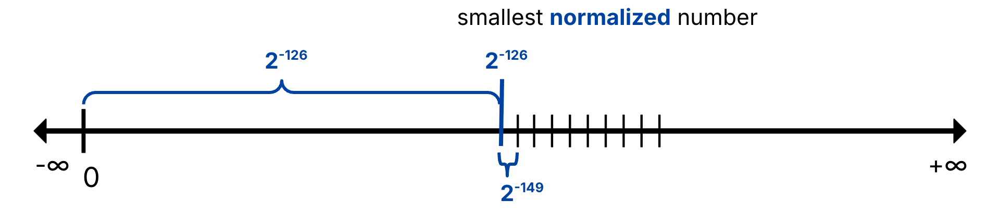

# Floating Point

> [L08 Floating Point | CS61C Course Notes](https://notes.cs61c.org/content/floating-point/)

<div class="responsive-video-container">
    <iframe src="https://player.bilibili.com/player.html?isOutside=true&aid=1806497713&bvid=BV17b42177VG&cid=1621699865&p=6&autoplay=0" 
    scrolling="no" 
    border="0" 
    frameborder="no" 
    framespacing="0" 
    allowfullscreen="true"> 
    </iframe>
</div>

!!! abstract "Learning Outcomes"
    - Understand the limits of a “fixed point” representation of numbers with fractional components.

    - Compute range and step size for integer and fixed-point representations.

    - Identify limitations of fixed-point representations.

    - Understand how the normalized number representation in the IEEE 754 single-precision floating point standard is inspired by scientific notation.

    - Identify how the [IEEE 754](../408/浮点数表示与运算.md#IEEE-754标准) single-precision floating point format uses three fields:

        - The sign bit represents sign

        - The exponent field represents the exponent value.

        - The significand field represents the fractional part of the mantissa value.

    - For [normalized numbers](#Normalized-Numbers):

        - The exponent field represents the exponent value as a bias-encoded number

        - The mantissa always has an implicit, leading one.
    
    - Understand how the IEEE 754 standard represents zero, infinity, and NaNs

    - Understand what overflow or underflow mean with floating point numbers

    - Understand how denormalized numbers implement “gradual” underflow

    - Convert denormalized numbers into their decimal counterpart

## Fixed Point

To represent numbers with fractional parts in 32 bits (e.g. `4.25`, `5.17`), start with a strawman: *Fixed Point* ([定点数](../408/数制与编码.md#定点数的编码表示)) — the binary point’s position is **fixed**.

### Metrics: Range and Step Size

Two metrics for any number system:

| Metric | Meaning |
|--------|---------|
| **Range** | Smallest / largest representable value |
| **Step size** | Spacing between consecutive representable values (precision) |

For integer systems, step size is always 1:

| System | # bits | Min | Max | Step |
|--------|--------|-----|-----|------|
| Unsigned | 32 | $0$ | $2^{32}-1$ | 1 |
| Two’s complement | 32 | $-2^{31}$ | $2^{31}-1$ | 1 |

<!-- `#` means `number of` -->

With fractions, infinitely many reals lie between consecutive values, so **step size becomes a key measure of precision**.

### Binary Point

Left of a decimal point: $10^0, 10^1, \ldots$; right: $10^{-1}, 10^{-2}, \ldots$.  
A **binary point** works the same way: left $2^0, 2^1, \ldots$; right $2^{-1}, 2^{-2}, \ldots$.

Fixed point = a fixed-width bit string with a **pre-agreed** binary-point position.

Example: 6-bit unsigned fixed point, binary point 4 bits from the right (2 integer bits + 4 fractional bits):

```text
  1 0 . 1 0 1 0
  ↑ ↑   ↑ ↑ ↑ ↑
  2¹ 2⁰  2⁻¹ … 2⁻⁴
```

$2.625$ encodes as `101010`:

$$
1\cdot 2^1 + 0\cdot 2^0 + 1\cdot 2^{-1} + 0\cdot 2^{-2} + 1\cdot 2^{-3} + 0\cdot 2^{-4}
= 2 + 0.5 + 0.125 = 2.625
$$

#### Range & Step Size

| | Value |
|--|-------|
| Min | `000000` → $0$ |
| Max | `111111` → $4 - 2^{-4} = 3.9375$ |
| Step size | LSB = $2^{-4} = 1/16$ |

### Arithmetic

- **Addition**: align binary points, then reuse an integer adder (e.g. $1.5 + 0.5 = 2$).
- **Multiplication**: must **shift** the binary point by the number of fractional digits (e.g. $1.5 \times 0.5 = 0.75$) — more awkward than addition.

### Use Cases & Limits

Fixed point is still useful when the value range is known and fast arithmetic matters (e.g. some graphics rendering).

Once the binary point is fixed, you are stuck: the 6-bit example cannot represent numbers much larger than $3.94$, nor non-zero values between $0$ and $1/16$.

Scientific apps often need all of:

- Very large: seconds in a millennium $\approx 3.16\times 10^{10}$

- Very small: Bohr radius $\approx 5.29\times 10^{-11}\,\mathrm{m}$

- Mixed integer + fraction: e.g. $2.625$

Covering all three with fixed point needs **≥ 92 bits** (~34 integer + ~58 fractional), far beyond a typical 32-bit integer width.

It means that we need a representation that can **move** the binary point with the magnitude — *Floating Point* ([浮点数](../408/浮点数表示与运算.md)), inspired by [scientific notation](https://en.wikipedia.org/wiki/Scientific_notation).

## Normalized Numbers

Floating point does **not** fix one binary-point location for all numbers. For each value, it stores *what the significant bits are* and *which power of two they sit at* — the same idea as scientific notation.

### Inspirations about Scientific Notation

Take decimal $0.1640625$. Its binary is roughly $\dots000000.001010100000\dots$: long runs of zeros, with only a short “energetic” stretch of bits (`10101`). Scientific notation keeps that energy and records the scale separately.

**Base-10 scientific notation** for the same value: $1.640625 \times 10^{-1}$.

| Term | Meaning | In the example |
|------|---------|----------------|
| **Radix** | Base | $10$ |
| **Mantissa** | Significant figures (“energy”) | $1.640625$ |
| **Exponent** | Power of the radix | $-1$ |

**Normalized form**: exactly **one non-zero digit** left of the point. For a given significant-figure budget, that form is unique (e.g. $1.0\times 10^{-9}$, not $0.1\times 10^{-8}$ or $10\times 10^{-10}$).

### Binary Normalized Form

Same idea in binary: $0.1640625 = 1.0101_{\text{two}} \times 2^{-3}$.

| Term | Binary |
|------|--------|
| Radix | $2$ |
| Mantissa | $1.0101$ |
| Exponent | $-3$ |

Two consequences for a 32-bit float design:

1. Split the bits into at least **mantissa** and **exponent** fields.

2. In binary, the only non-zero digit is `1`, so a normalized mantissa is always `1.xyz...` — the leading `1` is **redundant**.

!!! tip "Normalize by shifting"
    $0.1101_{\text{two}} \times 2^{2}$ is *not* normalized; scale to $1.101_{\text{two}} \times 2^{1}$.

### IEEE 754 Single-Precision Floating Point and Normalized Numbers

!!! abstract
    In simply, Floating Point just introduces some new fields that contains informations about *how to move the binary point with the magnitude*($\text{Exponent}$ with $\text{Bias}$) and *the significant figures of fractional part*($\text{Significand}$).

IEEE 754 single precision is C’s `float` (32 bits). [UC Berkeley’s William Kahan](https://www2.eecs.berkeley.edu/Faculty/Homepages/kahan.html) led the standard ([Turing Award, 1989](https://amturing.acm.org/award_winners/kahan_1023746.cfm)) so machines would agree on floating-point results.

Two useful notions:

| Term | Meaning |
|------|---------|
| **Precision** | How many bits represent a value |
| **Accuracy** | How close the representation is to the true number |

Layout (MSB = bit 31, LSB = bit 0):



| Field | Width | Role |
|-------|-------|------|
| `s` | 1 bit | Sign |
| `exponent` | 8 bits | Biased exponent |
| `significand` | 23 bits | Fraction of the mantissa |

Normalized numbers (when $\text{exponent} \in [1, 254]$, i.e. not all-0 / all-1) decode as:

$$
(-1)^{s} \times (1 + \text{significand}) \times 2^{\text{exponent} - \text{bias}}
$$

with $\text{bias} = 127$ for single precision.

How each field is interpreted (none of the three fields use two’s complement):

| Field | Represents | How to read (normalized) |
|-------|------------|--------------------------|
| `s` | Sign | `1` → negative; `0` → positive |
| `exponent` | [Bias-encoded](Number%20Representation.md#Bias-Encoding) exponent | True exponent $= \text{stored} - 127$ |
| `significand` | Fractional part of mantissa | Treat as $0.xx\ldots xx$ (23 bits), then add the implicit $1$ |

#### Design Principles

The three fields are shaped to **squeeze more accurate normalized values into 32 bits**, not to look like integer encodings.

!!! info "Why bias-encoded exponents (not two’s complement)?"
    Early systems needed floats to work even without a floating-point unit — e.g. **sort same-sign floats with ordinary integer compares**.

    For that, a larger `exponent` field must mean a larger magnitude. With two’s complement, negative exponents would start with `1` and look *larger* under unsigned/integer comparison. With bias:

    - smaller stored values → smaller true exponents

    - larger stored values → larger true exponents

    - same-sign float bit patterns order like unsigned integers

    For normalized numbers, stored exponents `00000001`…`11111110` map to true exponents $-126$…$+127$.

!!! info "Why store significand + implicit 1, not the full mantissa?"
    Binary normalized form always has a leading `1`. IEEE 754 **does not store** that bit; the 23-bit significand is only the bits *after* the binary point, and you reconstruct:

    $$
    \text{mantissa} = 1 + \text{significand},\quad 0 \le \text{significand} < 1
    $$

    That buys an **extra bit of precision**: 24-bit normalized mantissas using only 23 stored bits.

!!! note "Specials reserved"
    Exponent all-0 and all-1 encode zero, denormals, $\pm\infty$, NaN — covered under [Special Numbers](#Special-Numbers). The formulas above apply only to the normalized range.

### Double-Precision

C’s `double` is IEEE 754 double precision (64 bits): 1 sign + 11-bit exponent (bias $1023$) + 52-bit significand. Larger significand → better accuracy; range roughly $2.0\times 10^{-308}$ to $2.0\times 10^{308}$.

!!! tip "Handy converter"
    The web app: [IEEE-754 Floating Point Converter](https://www.h-schmidt.net/FloatConverter/IEEE754.html), for converting between decimal numbers and their IEEE 754 single-precision floating point format.

## Special Numbers

!!! abstract
    - Exponent $1$–$254$: $\text{value}=(-1)^s(1+\text{frac})\,2^{E-127}$

    - Exponent $0$, frac $=0$: $\pm 0$

    - Exponent $0$, frac $\neq 0$: $(-1)^s\cdot\text{frac}\cdot 2^{-126}$

    - Exponent $255$, frac $=0$: $\pm\infty$

    - Exponent $255$, frac $\neq 0$: NaN

Normalized floats are only part of IEEE 754. Single precision dispatches on the **biased exponent**:

| Biased exponent | Significand | Meaning |
|-----------------|-------------|---------|
| `0000 0000` (0) | all zeros | $\pm 0$ |
| `0000 0000` (0) | non-zero | **Denormalized** (denorms) |
| `0000 0001` … `1111 1110` (1–254) | anything | **Normalized** (implicit leading 1) |
| `1111 1111` (255) | all zeros | $\pm\infty$ |
| `1111 1111` (255) | non-zero | **NaN** |

These specials exist so float arithmetic can handle **overflow** / **underflow** more gracefully than integer wrap-around.

### Overflow and Underflow

Because exponents $0$ and $255$ are reserved, the **normalized** single-precision magnitude range is about:

$$
[2^{-126},\; 3.4\times 10^{38}]
\quad\text{with}\quad 2^{-126}\approx 1.2\times 10^{-38}
$$

(and the negative mirror). Extremes:

| | Pattern | Value |
|--|---------|-------|
| Largest finite | `s` `1111 1110` `111…1` | $(2-2^{-23})\times 2^{127}\approx 3.4\times 10^{38}$ |
| Smallest normalized | `s` `0000 0001` `000…0` | $1.0\times 2^{-126}=2^{-126}$ |

With fractions, both ends matter:

| | Meaning |
|--|---------|
| *Overflow* (**上溢**) | Magnitude too *large* to represent |
| *Underflow* (**下溢**) | Magnitude too *small* to represent |



IEEE 754’s response: overflow → $\pm\infty$ / NaN; underflow → approach zero via **denorms** (gradual underflow), not an immediate jump to zero.

!!! question "Why don’t integers experience underflow?"
    In the IEEE 754 normalized floating point representation, *underflow refers to the gap between the two disjoint ranges of representable numbers*.

    With integer representations, we can represent all valid numbers (i.e., integers) within a given range `[INT_MIN, INT_MAX]` because integer representations have the same step size of “1”. There is therefore no “gap” in representation within this representable range.

### Zero

Like sign-magnitude, there are **two zeros** (useful for directed limits and $\pm\infty$):

| Value | `s` | exponent | significand |
|-------|-----|----------|--------------|
| $+0$ | `0` | `0000 0000` | `000…0` |
| $-0$ | `1` | `0000 0000` | `000…0` |

Zero is **not** normalized — there is no leading `1` in $0.0$. Hardware treats biased exponent `00000000` as “no implicit 1”; if the significand is also zero → $\pm 0$; if non-zero → denorms.

### Infinity

| Value | `s` | exponent | significand |
|-------|-----|----------|--------------|
| $+\infty$ | `0` | `1111 1111` | `000…0` |
| $-\infty$ | `1` | `1111 1111` | `000…0` |

Infinity is kept distinct from other errors. Example: dividing by $\pm 0$ yields $\pm\infty$, so comparisons like $x/0 > y$ stay meaningful.

### Not a Number (`NaN`)

Invalid ops (e.g. $\sqrt{-4}$, $0/0$) should **bubble up** rather than crash or wrap like integer overflow.

| `s` | exponent | significand |
|-----|----------|--------------|
| either | `1111 1111` | **non-zero** |

!!! warning "NaNs contaminate"
    Once a result is NaN, almost every ordinary operation on it yields NaN again — the error **spreads** through the computation instead of turning into a silent wrong number:

    $$
    \mathrm{op}(\mathrm{NaN}, x) = \mathrm{NaN}
    $$

    ```python
    >>> import math
    >>> x = math.sqrt(-1)   # nan
    >>> y = x + 3           # nan
    >>> z = y * 10          # nan
    >>> w = z / z           # nan  (not 1!)
    >>> math.sin(x)         # nan
    ```

    Contrast with infinity / other specials:

    | Expression | Result | Why |
    |------------|--------|-----|
    | `1.0 / 0.0` | `+inf` | Overflow direction is clear |
    | `0.0 / 0.0` | `nan` | Indeterminate form |
    | `inf - inf` | `nan` | $\infty - \infty$ is indeterminate |
    | `nan + 100` | `nan` | Already contaminated — cannot “wash” it clean |

    Unlike integer overflow (which **wraps** and may look like a plausible wrong answer), NaN **marks** the failure and keeps marking it, so you can check once at the end of a pipeline (`math.isnan(result)`).

    Some hardware encodes diagnostics in the NaN $\text{significand}$ (a payload, *which can be used to identify the type of NaN*); portable code should treat that as optional and only rely on “is NaN?”.

### Denormalized Numbers

#### Gap around zero

Overflow → $\infty$ feels natural (one step past the largest finite). Underflow → jump straight to $0$ is harsher: between $0$ and the smallest normalized $2^{-126}$ there is a large **gap**, while neighboring normalized values near that scale differ by only $2^{-149}$:

$$
(1+2^{-23})\times 2^{-126} - 2^{-126} = 2^{-149}
$$



The implicit leading `1` forces that jump: you cannot represent values with mantissa $< 1$ at exponent $-126$ in the *normalized* encoding.

#### Gradual underflow

Denorms fill that gap so underflow loses precision gradually instead of snapping to zero:

$$
(-1)^{s} \times (\text{significand}) \times 2^{-126}
$$

| Field | Denorm interpretation |
|-------|------------------------|
| `s` | Sign (`1` negative) |
| `exponent` | Must be `0000 0000`; **true** scale is fixed at $2^{-126}$ (same as smallest normalized exponent $1-127$) — **do not** treat this as bias-decoded $-127$ |
| `significand` | $0.xx\ldots xx$ only — **no** implicit leading $1$ |

That choice keeps step size $2^{-149}$ uniform from the denorm range through the smallest normalized floats → **gradual underflow**.

## Floating Point Operations

### Addition

Float addition is harder than integer addition: you cannot add significands until the exponents match.

Typical pipeline:

1. **Denormalize** (shift) so both operands share the same exponent

2. **Add** (or subtract, if signs differ) the significands

3. Keep that matched exponent

4. **Renormalize** the sum (may bump the exponent), then round into the significand field

Because floats only *approximate* reals — and step size grows with magnitude — addition is **not always associative**.

!!! example
    - $x = -1.5\times 10^{38}, \quad y = 1.5\times 10^{38}, \quad z = 1.0$

    $$
    \begin{align}
    x + (y + z)
      &= -1.5\times 10^{38} + (1.5\times 10^{38} + 1.0) \\
      &= -1.5\times 10^{38} + 1.5\times 10^{38} \\
      &= 0.0
    \end{align}
    $$

    $$
    \begin{align}
    (x + y) + z
      &= (-1.5\times 10^{38} + 1.5\times 10^{38}) + 1.0 \\
      &= 0.0 + 1.0 \\
      &= 1.0
    \end{align}
    $$

    $1.5\times 10^{38}$ is so large that $1.5\times 10^{38}+1.0$ rounds back to $1.5\times 10^{38}$ — the `1.0` vanishes when added first to the large magnitude.

### Rounding Modes

Hardware keeps a few **extra bits** of precision during arithmetic, then rounds into the stored significand. Four common modes:

| Mode | Behavior | Examples |
|------|----------|----------|
| Toward $+\infty$ | Always round “up” | $2.001\to 3$, $-2.001\to -2$ |
| Toward $-\infty$ | Always round “down” | $1.999\to 1$, $-1.999\to -2$ |
| Truncate | Drop extra bits (toward $0$) | — |
| **Unbiased** (default) | Nearest; ties → **even** | $2.4\to 2$, $2.6\to 3$, $2.5\to 2$, $3.5\to 4$ |

Unbiased / round-to-nearest-even is the usual default: on a exact halfway case, round so the result’s LSB is even. Over many ties, ups and downs cancel → less systematic bias.

### Casting and Converting

Rounding also bites when converting between C types:

- **`int` → `float`**: not every integer is exact in `float` (only 23 + 1 = 24 bits of significand precision). e.g. $2^{24}+1$ snaps to the nearest even float.

- **`float` → `int`**: C **truncates** toward zero — `(int)1.5` becomes `1`.

Round-trips are therefore not identity. These need **not** always print `"true"`:

```c
/* Code A: large ints may not survive float */
int i = /* ... */;
if (i == (int)((float) i)) {
    printf("true\n");
}

/* Code B: fractional floats lose the fraction */
float f = /* ... */;
if (f == (float)((int) f)) {
    printf("true\n");
}
```

## Odds and Ends

### Precision vs. Accuracy

| Term | Meaning |
|------|---------|
| **Precision** | How many bits represent a value |
| **Accuracy** | How close the representation is to the true number |

High precision **allows** high accuracy but does not guarantee it.

Example: `float pi = 3.14;` still uses the full significand (precise encoding), but $3.14$ is a poor approximation of $\pi$ (inaccurate). All fixed-width formats remain imperfect for some values.

### Specific Formats

Beyond `float` / `double`, IEEE 754 also defines:

| Format | Width | Exponent | Significand | Notes |
|--------|-------|----------|-------------|-------|
| Half (`binary16`) | 16 | 5 | 10 | Compact |
| Single (`binary32`) | 32 | 8 | 23 | C `float` |
| Double (`binary64`) | 64 | 11 | 52 | C `double` |
| Quad (`binary128`) | 128 | 15 | 112 | Huge range / precision |
| Octuple (`binary256`) | 256 | 19 | 237 | Rare |

Domain accelerators often pick different tradeoffs. e.g. Google TPU **bfloat16**: 16 bits with **8** exponent + **7** significand — same *range* class as `float32`, less fraction precision. That favors ML training (gradients vanishing toward zero) over digit-level accuracy.

Other formats: Nvidia **TensorFloat-32 (tf32)**, plus many `int4` / `int8` / `fp16` mixes on TPUs / Tensor Cores.

!!! info "Different domain accelerators support various integer and floating-point formats"
    | Accelerator | int4 | int8 | int16 | fp16 | bf16 | fp32 | tf32 |
    |-------------|:----:|:----:|:-----:|:----:|:----:|:----:|:----:|
    | [Google TPU v1](https://thechipletter.substack.com/p/googles-first-tpu-architecture) | | ✓ | | | | | |
    | Google TPU [v2](https://docs.cloud.google.com/tpu/docs/v2) / [v3](https://docs.cloud.google.com/tpu/docs/v3) | | | | | ✓ | | |
    | [Nvidia Volta TensorCore](https://www.nvidia.com/en-us/data-center/volta-gpu-architecture/) | | ✓ | | ✓ | | ✓ | |
    | [Nvidia Ampere TensorCore](https://www.nvidia.com/en-us/data-center/ampere-architecture/) | ✓ | ✓ | ✓ | ✓ | ✓ | ✓ | ✓ |
    | [Nvidia DLA](https://developer.nvidia.com/deep-learning-accelerator) | | ✓ | ✓ | ✓ | | | |
    | [Intel AMX](https://en.wikipedia.org/wiki/Advanced_Matrix_Extensions) | | ✓ | | | ✓ | | |
    | [Amazon AWS Inferentia](https://aws.amazon.com/ai/machine-learning/inferentia/) | | ✓ | | ✓ | ✓ | | |
    | [Qualcomm Hexagon](https://en.wikipedia.org/wiki/Qualcomm_Hexagon) | | ✓ | | | | | |
    | [Huawei Da Vinci](https://forum.huawei.com/enterprise/intl/en/thread/ascend-ai-computing-engine-da-vinci-architecture/667245938260983808?blogId=667245938260983808) | | ✓ | | ✓ | | | |
    | MediaTek APU 3.0 | | ✓ | ✓ | ✓ | | | |
    | Samsung / Tesla NPU | | ✓ | | | | | |

    - **bf16** ([bfloat16](https://en.wikipedia.org/wiki/Bfloat16_floating-point_format)): 8 exp + 7 sig — fp32-like *range*, fewer fraction bits

    - **tf32** ([TensorFloat-32](https://blogs.nvidia.com/blog/tensorfloat-32-precision-format/)): Nvidia format used inside Tensor Cores

!!! tip "Further reading"
    Variable-width ideas such as [Unum](https://en.wikipedia.org/wiki/Unum_(number_format)) use flexible exponent / significand field widths, plus a “u-bit” marking whether a value is exact or an interval between unums — interesting research direction, not IEEE 754 mainstream.
