# Number Representation

> [L02 Number Representation | CS 61C Course Notes](https://notes.cs61c.org/content/number-rep/)

    <iframe src="https://player.bilibili.com/player.html?isOutside=true&aid=1806497713&bvid=BV17b42177VG&cid=1621699328&p=2&autoplay=0"
    scrolling="no" 
    border="0" 
    frameborder="no" 
    framespacing="0" 
    allowfullscreen="true"> 
    </iframe>

!!! abstract "Learning Outcomes"
    - Know the terms: bits, bytes, bitstrings

    - Compute how many bits you need to represent $k$ items.

    - Translate between binary, decimal, and hexadecimal number representations

    - Use hexadecimal as shorthand for binary

    - Know when each representation is useful

    - Understand tradeoffs between integer representations:

        - (unsigned) integers

        - (signed) Sign-Magnitude

        - (signed) Ones’ Complement

        - Bias Encoding

    - Identify when and why integer overflow occurs

    - Perform simple binary operations like addition

## Introduction

### Digital Data

- *Analog data*(**模拟数据**): values are *continuous* and can take on any value within a range.

- *Digital data*(**数字数据**): values are *discrete* and can take on only a finite number of values.

Conver analog data to digital data:

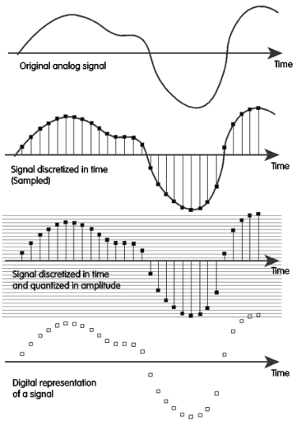

1. *Sample* (**采样**): We **ask the signal at every time step**: “What’s your value?” This usually occurs at a **regular interval**.

    For example, for music on CDs, that’s 44,100 times a second we’re asking it what its height is.

2. *Quantize* (**量化**): Because the height might come out at some fractional number, we need to **divide it up in its amplitude using a “yardstick.”**
   
    We divide it up into a 16-bit number, which is $2^16 = 65536$ possible tick marks. Then, the sample “snaps” to the closest tick mark.

### Bits, Bytes and Nibbles

- *Bits* (**位**): A binary digit, the smallest unit of digital data. Only takes on the two *discrete* values (usually 0 and 1).

- *Bytes* (**字节**): A *bitstring* of 8 bits. A byte can represent $2^8 = 256$ things.

- *Nibbles* (**半字节**): A *bitstring* of 4 bits. A nibble can represent $2^4 = 16$ things. This is equivalent to one hexadecimal digit.

### Bits can represent anything

The big idea: *Bits can represent anything*.

- Logical Values: Commonly, 0 means false and 1 means true.

- Characters: 

    - [ASCII](https://en.wikipedia.org/wiki/ASCII): an expanded 8-bit representation that can represent uppercase, lowercase, and punctuation as used in standard American English.

    - [Unicode](https://home.unicode.org/): represents all the world’s symbols and languages, including emojis. There are [8-bit](https://en.wikipedia.org/wiki/UTF-8), [16-bit](https://en.wikipedia.org/wiki/UTF-16), and [32-bit](https://en.wikipedia.org/wiki/UTF-32) versions of Unicode.

- Colors: HTML color codes are 24-bit (3-byte) representations.

- And so on...

Anything you can itemize, you can digitize. With $N$ bits, you can represent at most $2^N$ things. Put another way, you can represent $k$ things in at minimum $N$ bits, where $N = \lceil \log_2 k \rceil$.

!!! tip "How many bits do you need to represent $\pi$?"
    We use bits to represent **sets of things**, not just a single thing. All answers are possible, depending on how many things beyond $\pi$ you are looking to represent.

    To use 1 bit, consider representing the two things:

    - $\pi$

    - not $\pi$

## Binary, Decimal, Hex

> [数制与编码 - 进制计数制及其相互转换](../408/数制与编码.md#进制计数制及其相互转换)

## Integer Representations

How can we use $N$ bits to represent a set of integers? There are many systems, and not all of them can represent $2^N$ unique integers with $N$ bits. We focus on two kinds:

- *Signed integers* (**有符号整数**): positive integers, negative integers, and zero.

- *Unsigned integers* (**无符号整数**): non-negative integers (i.e. zero and positive).

### N-bit Unsigned Integer Representation

The simplest scheme: **just treat the bitstring as a plain base-2 number and convert**. With $N$ bits we can represent $2^N$ unsigned integers.

- `0b0...0` ($N$ zeros) represents $0$.

- `0b1...1` ($N$ ones) represents $2^N - 1$ (the largest value — *not* $2^N$, because we start counting from $0$).

- Everything else: assume the bitstring is the base-2 representation of a number, and convert.

So the representable range is $[0,\ 2^N - 1]$.

!!! info "Unsigned integers in C"
    C supports this representation. Built-in types like `unsigned int` are ambiguous because the standard doesn't fix the **width** of an `int`. The header `inttypes.h` provides fixed-width typedefs — `uint8_t`, `uint16_t`, `uint32_t`, etc. — to specify 8-bit, 16-bit, 32-bit unsigned integers explicitly.

### Integer Overflow

> *Integer overflow* (**整数溢出**): the arithmetic result falls **outside** the representable range of integers.

Hardware only has a *finite* bit width. If the true result of an operation ($+$, $-$, $\times$, $\div$, …) cannot be accurately stored in those $N$ bits, we say integer overflow occurred — the "binary odometer" wraps around.

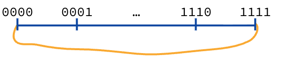

For **4-bit unsigned** integers (range $0$–$15$):

- *Positive overflow*: $15$ (`0b1111`) $+ 1$ wraps to $0$ (`0b0000`).

- *Negative overflow*: $0$ (`0b0000`) $- 1$ wraps to $15$ (`0b1111`).

!!! warning "There is no such thing as integer underflow"
    People often call negative overflow "underflow," but **underflow** is a different concept that appears later when representing fractions / floating point.

!!! example "Why $10 + 7$ can overflow in 4 bits"
    - $10$ = `1010`, $7$ = `0111` → true sum $17$ = `10001` needs **5** bits.
    - In 4-bit unsigned arithmetic the leading `1` is truncated, leaving `0001`. So the machine reports $10 + 7 = 1$.

### Sign-Magnitude

How do we represent *both* positive and negative numbers (and zero) with the same $N$ bits?

There's no free lunch: to get negatives, you must give up some of the positive range you used to have.

*Sign-Magnitude* (**符号-绝对值 / 原码**) is the most "human" signed scheme:

- Leftmost bit = **sign bit**: `0` positive, `1` negative.
- Remaining bits = **magnitude** (unsigned binary absolute value).

**4-bit Sign-Magnitude** example:

- Positive: $1$ (`0b0001`) … $7$ (`0b0111`)

- Negative: $-1$ (`0b1001`) … $-7$ (`0b1111`)

- **Two zeros**: $+0$ (`0b0000`) and $-0$ (`0b1000`)

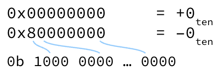

Two problems:

1. **Two representations of zero** — every "compare with zero" must check two patterns.

2. **Odometer goes the wrong way** — incrementing bits does *not* always mean $+1$ on the number line: you climb $0 \to 7$, then suddenly hit another $0$, then $-1 \to -7$.

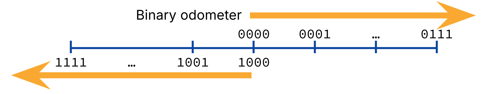

Addition also becomes conditional: same-sign → add magnitudes; different-sign → subtract magnitudes. That makes hardware more complicated.

Sign-Magnitude is mainly a straw-man for general-purpose integer ALU design, though decoupling sign from magnitude can still be useful in domains like signal processing.

### Ones' Complement

> To represent a negative number, **complement** (flip) every bit of its positive representation.

"Complement" means `0` ↔ `1`. Equivalently: to change sign, **flip all bits**.

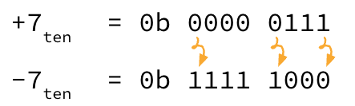

Example — $-7$ in **8-bit** Ones' Complement (**反码**):

1. $+7$ = `0000 0111`

2. Flip all bits → `1111 1000` = $-7$

Improvement over Sign-Magnitude: in most places, ticking the binary odometer now corresponds to integer $+1$. Arithmetic addition can often just be ordinary binary addition, regardless of operand signs (e.g. $5 + (-5)$ = `0101` + `1010` = `1111` = $-0$).

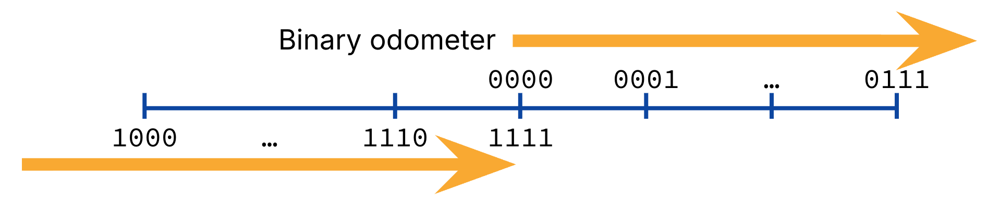

Properties of $N$-bit Ones' Complement:

- Leftmost bit is still effectively the **sign bit** (`0` → non-negative, `1` → negative).

- Positive numbers: $2^{N-1} - 1$

- Negative numbers: $2^{N-1} - 1$

- Still **two zeros** ($+0$ = all `0`s, $-0$ = all `1`s)

Historically used for a while, then largely abandoned for [Two's Complement](https://notes.cs61c.org/content/number-rep/twos-complement/).

### Bias Encoding

*Bias Encoding* (**偏置编码 / 移码**):

- Keep a fixed **bias**.

- **Interpret** stored bits: read as unsigned integer, then **add** the bias.

- **Encode** an integer: **subtract** the bias, then store as unsigned.

Imagine an electrical signal oscillating between $0$ and $31$ volts — bias encoding is like grabbing that graph and sliding it down so it wiggles around zero.

To get (nearly) as many negatives as positives, a common bias for $N$ bits is $-(2^{N-1} - 1)$.

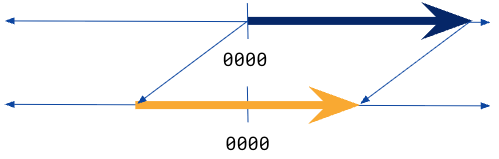

**Example**: $N = 5$, bias $= -(2^{4} - 1) = -15$. All zeros then map to the most negative value.

For $N = 4$ with bias $-7$, the odometer "just does the right thing": values increase monotonically through zero with nothing strange happening.

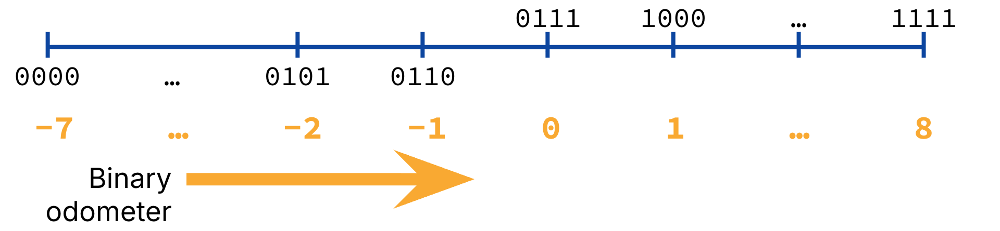

Bias encoding is especially useful when you want bit patterns to compare / sort like unsigned integers while still representing a shifted signed range — you'll see it again for floating-point **exponents**.

## Two's Complement

*Two's Complement* (**补码**) fixes the last big problem of Ones' Complement: **two zeros**. The idea is simple — **shift the negative mappings left by one**, so negative numbers no longer overlap with positive ones at zero.

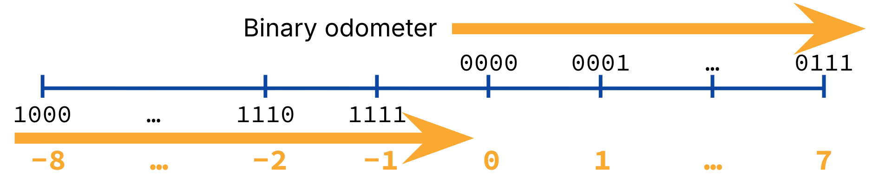

Key properties of $N$-bit Two's Complement:

- `0b0000` is still $0$ — and now there is **only one zero**.

- Positive numbers are the same as Ones' Complement.

- Negative numbers are shifted: e.g. `0b1111` now maps to $-1$ (not $-0$). This gives us **one extra negative number**.

- Incrementing the binary odometer still corresponds to integer $+1$.

- The leftmost bit is still the **sign bit** (`0` → non-negative, `1` → negative).

> In Two's Complement, a bit pattern of all ones is $-1$.

For $N$ bits:

- Zero: **1**

- Positive: $2^{N-1} - 1$

- Negative: $2^{N-1}$

### Arithmetic and Conversion

Hardware for Two's Complement is now simple:

> **Addition is exactly the same as with unsigned integers.**

$+5$ = `0b0101`, $-5$ = `0b1011`. Adding them should give $0$ = `0b0000`:

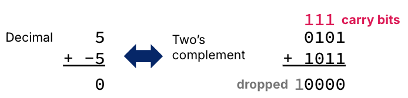

Work right-to-left: `1+1=0` carry `1` → `1+0+1=0` carry `1` → `1+1+0=0` carry `1` → `1+0+1=0` carry `1` → leading `1` is **truncated** in 4-bit representation. Result: `0000` = $0$. ✓

### Formal Definition

The value of an $n$-digit Two's Complement number is:

$$
- 2^{n-1} d_{n-1} + \sum_{i=0}^{n-2} 2^i d_i
$$

Positive and negative numbers use the **same formula**. The sign comes from multiplying the highest bit by $(-2^{N-1})$.

!!! example "$-5$ and $+5$ in 4-bit Two's Complement"
    $$
    \begin{align}
    \texttt{0b1011} &= (1 \times -2^3) + (0 \times 2^2) + (1 \times 2^1) + (1 \times 2^0) = -8 + 2 + 1 = -5 \\
    \texttt{0b0101} &= (0 \times -2^3) + (1 \times 2^2) + (0 \times 2^1) + (1 \times 2^0) = 4 + 1 = 5
    \end{align}
    $$

### Flip Sign

To convert between positive and negative (& vice versa):

1. **Complement** all bits (flip `0` ↔ `1`)

2. **Add 1**

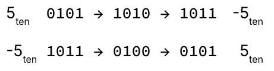

The "number wheel" below shows where integer overflow occurs — notice the jump from $+7$ (`0111`) to $-8$ (`1000`):

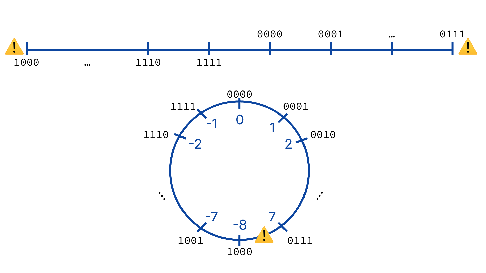

That top-level term ($-2^{N-1}$, e.g. $-8$ for 4 bits) pulls all negative numbers down by **one**, eliminating the overlap at zero.

### Two's Complement in C

Two's Complement is the [C23 standard](https://cppreference.com/c/23) representation for signed integers. As before, built-in `int` does not fix bit width — use `stdint.h` typedefs like `int8_t`, `int16_t`, `int32_t`, etc.
