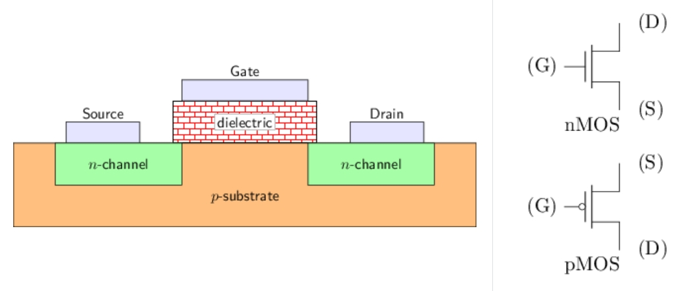
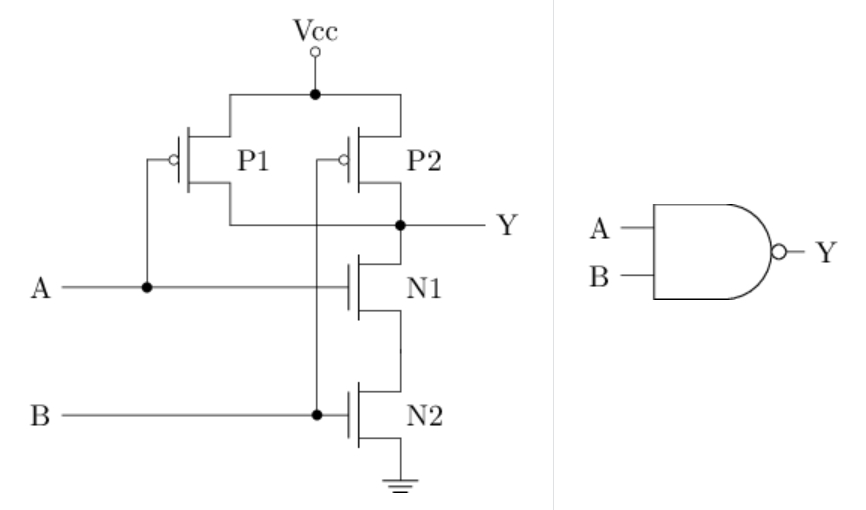

# 数字逻辑电路基础

> [F3 数字逻辑电路基础 | 一生一芯 v24.07 学习讲义](https://ysyx.oscc.cc/docs/2407/f/3.html)

!!! abstract
    - 如何表示：数字信号`0`和`1`在数字电路中的物理含义

    - 如何处理：门电路和组合逻辑电路的工作原理
    
    - 如何存储：时序逻辑电路的工作原理

## MOS管与CMOS门电路

### MOS管

数字电路里的`0`和`1`，最终都要落到物理上的高低电压。实现这一点的核心元件是**金属-氧化物-半导体场效应晶体管**（*Metal-Oxide-Semiconductor Field-Effect Transistor*，MOSFET），简称**MOS管**。

MOS管可以看成由电压控制的开关：用栅极电压决定源极与漏极之间是否导通。它有三个端子：

| 端子 | 英文 | 作用 |
|:-:|:-:|:-:|
| 栅极 | Gate（`G`） | 控制端，加压决定开/关 |
| 源极 | Source（`S`） | 电流的一端 |
| 漏极 | Drain（`D`） | 电流的另一端 |

!!! tip "和墙上电灯开关的对比"
    普通开关靠人手拨动；MOS管靠**栅极电压**自动拨动——`G`上电压够了就“合上”，不够就“断开”。

典型结构如图所示，其开关行为可概括为：

- 当栅源电压 $V_{GS}$ 大于阈值电压 $V_{TH}$ 时，MOS管**导通**，漏极电流 $I_D$ 流通（开关合上）
- 当 $V_{GS}$ 小于 $V_{TH}$ 时，MOS管**截止**，$I_D \approx 0$（开关断开）

其中，$V_{GS}$ 是栅极相对源极的电压差，$V_{TH}$ 是刚好能使沟道形成的临界电压（阈值）。

    <iframe src="//player.bilibili.com/player.html?isOutside=true&aid=973498145&bvid=BV1344y167qm&cid=349677226&p=1&autoplay=0"
    scrolling="no" 
    border="0" 
    frameborder="no" 
    framespacing="0" 
    allowfullscreen="true"> 
    </iframe>

!!! info "导通原理简述"
    以nMOS为例, 衬底是掺了少量3价杂质的**P型硅**，上面有两个掺了5价杂质的**N区**，分别引出源极和漏极；栅极与衬底之间隔着一层二氧化硅绝缘层。

    默认时，源极N区的自由电子过不了中间的P区，源漏不导通。当 `G` 上电压足够大时，绝缘层下方形成电场，把电子吸引到栅极下方，电子在绝缘层下聚集成一条**导电沟道**，把两个N区连起来，源漏导通。

### nMOS和pMOS

按沟道中载流子类型，MOS管分为两种，行为互补：

| | nMOS（N型） | pMOS（P型） |
|:-:|:-:|:-:|
| 载流子 | 电子（带负电） | 空穴（等效正电） |
| 导通条件 | $V_{GS}$ 足够**高** | $V_{GS}$ 足够**低**（常用负阈值） |
| 数字电路中的角色 | 擅长把输出**拉低**到地（拉低能力强） | 擅长把输出**拉高**到电源（拉高能力强） |
| 电路符号习惯 | 无圆圈 | 栅极侧常带圆圈 |

!!! tip
    - **nMOS**：Gate 为高 → 导通 → 像“低电平开关”

    - **pMOS**：Gate 为低 → 导通 → 像“高电平开关”

两者单用各有短板（例如只用 nMOS 很难把输出完整拉到电源电压，会有阈值跌落），所以数字电路里常**成对使用**：

### CMOS门电路

#### CMOS概述

由于 nMOS 和 pMOS 具有互补特性，数字电路里常将两者联合使用，称为 **CMOS**（*Complementary Metal-Oxide-Semiconductor*，互补金属氧化物半导体）技术。

以如下最简单的 CMOS 电路为例（左图是晶体管接法，中/右图是开关模型）：

电路结构：

- 上方是 **pMOS**（栅极带圆圈），源极接电源 $V_{CC}$，漏极接到输出 `Y`

- 下方是 **nMOS**，漏极接到 `Y`，源极接地

- 输入 `A` 同时接到两个管子的栅极

工作方式：

| 输入 `A` | pMOS（上） | nMOS（下） | 输出 `Y` 接向 | 结果 |
|:-:|:-:|:-:|:-:|:-:|
| 高电平（`1`） | 截止（开关断开） | 导通（开关合上） | 地 | 低电平（`0`） |
| 低电平（`0`） | 导通（开关合上） | 截止（开关断开） | $V_{CC}$ | 高电平（`1`） |

!!! tip
    - 中图：`A = 1` 时，下管把 `Y` 接地 → `Y = 0`

    - 右图：`A = 0` 时，上管把 `Y` 拉到电源 → `Y = 1`

CMOS 把 n/p 管的开关特性，转换成了输出端电压的高低。把物理上的**高电压**定义为逻辑 `1`（高电平），**低电压**定义为逻辑 `0`（低电平），就得到了数字电路中信号的两种基本状态。

再看一眼行为：`A` 为 `1` 时 `Y` 为 `0`，`A` 为 `0` 时 `Y` 为 `1`——这正是逻辑上的**非运算**。

#### CMOS非门

上面在概述中提到的这个电路就是最基础的 CMOS 门：**非门**，也称反相器（*Inverter*）。

- A 点为高电平 `1` 时，pMOS **截止**，nMOS **导通**，Y 点接地 → 低电平 `0`

- A 点为低电平 `0` 时，pMOS **导通**，nMOS **截止**，Y 点接电源 → 高电平 `1`

#### CMOS与非门

结构要点：

- 上方两个 pMOS（P1、P2）**并联**：任一导通即可把 `Y` 拉到电源

- 下方两个 nMOS（N1、N2）**串联**：两者都导通才能把 `Y` 拉到地

- P1 / N1 由 `A` 控制，P2 / N2 由 `B` 控制

| A | B | P1 | P2 | N1 | N2 | Y |
|:-:|:-:|:-:|:-:|:-:|:-:|:-:|
| 0 | 0 | 导通 | 导通 | 截止 | 截止 | 1 |
| 0 | 1 | 导通 | 截止 | 截止 | 导通 | 1 |
| 1 | 0 | 截止 | 导通 | 导通 | 截止 | 1 |
| 1 | 1 | 截止 | 截止 | 导通 | 导通 | 0 |

仅当 `A = B = 1` 时输出为 `0`，否则为 `1`，即逻辑与非：$Y = \overline{A \cdot B}$。

