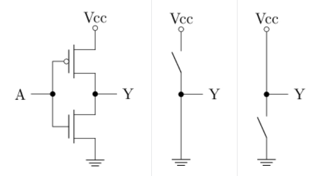
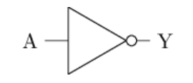
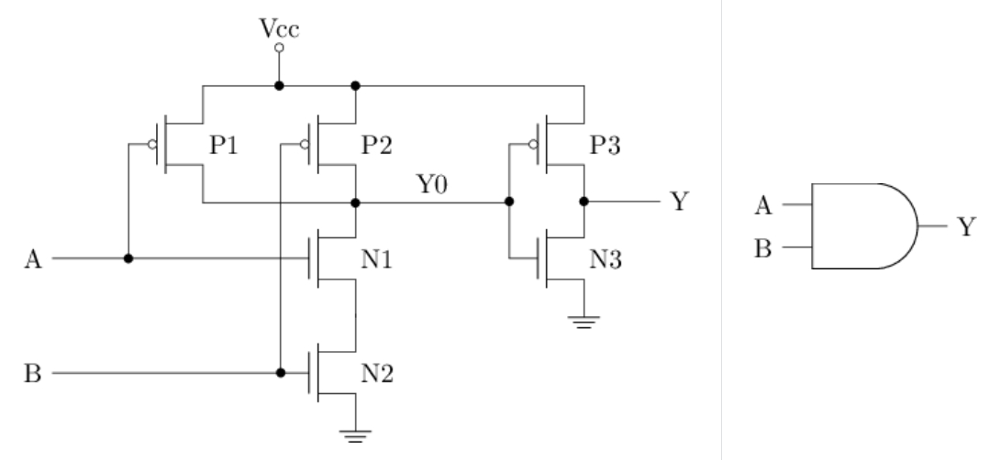
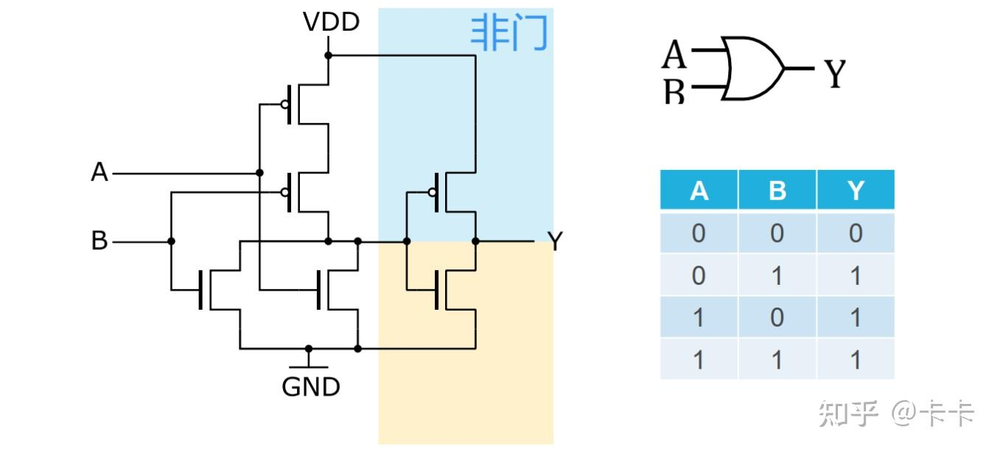
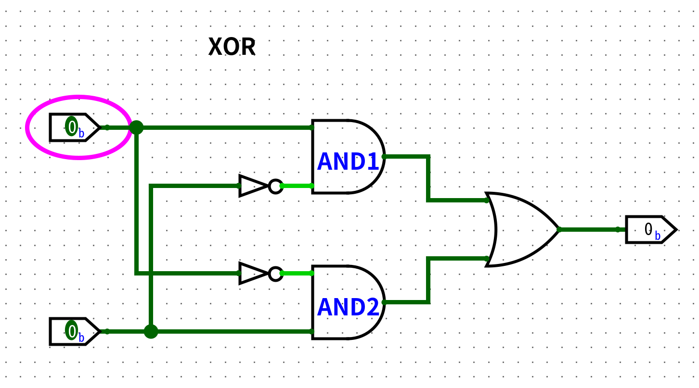
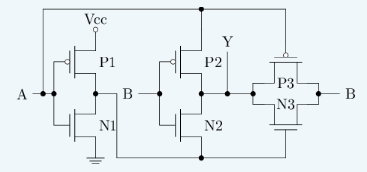

# 晶体管与门电路

> [F3 数字逻辑电路基础 | 一生一芯 v24.07 学习讲义](https://ysyx.oscc.cc/docs/2407/f/3.html)

!!! abstract "数字电路针对信息的处理"
    - 如何表示：数字信号`0`和`1`在数字电路中的物理含义

    - 如何处理：门电路和组合逻辑电路的工作原理
    
    - 如何存储：时序逻辑电路的工作原理

## MOS管

数字电路里的`0`和`1`，最终都要落到物理上的高低电压。实现这一点的核心元件是**金属-氧化物-半导体场效应晶体管**（*Metal-Oxide-Semiconductor Field-Effect Transistor*，MOSFET），简称**MOS管**。

MOS管可以看成由电压控制的开关：用栅极电压决定源极与漏极之间是否导通。它有三个端子：

| 端子 | 英文 | 作用 |
|:-:|:-:|:-:|
| 栅极 | Gate（`G`） | 控制端，加压决定开/关 |
| 源极 | Source（`S`） | 电流的一端 |
| 漏极 | Drain（`D`） | 电流的另一端 |

!!! tip "和墙上电灯开关的对比"
    普通开关靠人手拨动；MOS管靠**栅极电压**自动拨动——`G`上电压够了就“合上”，不够就“断开”。

典型结构如图所示，其开关行为可概括为：

- 当栅源电压 $V_{GS}$ 大于阈值电压 $V_{TH}$ 时，MOS管**导通**，漏极电流 $I_D$ 流通（开关合上）
- 当 $V_{GS}$ 小于 $V_{TH}$ 时，MOS管**截止**，$I_D \approx 0$（开关断开）

其中，$V_{GS}$ 是栅极相对源极的电压差，$V_{TH}$ 是刚好能使沟道形成的临界电压（阈值）。

    <iframe src="//player.bilibili.com/player.html?isOutside=true&aid=973498145&bvid=BV1344y167qm&cid=349677226&p=1&autoplay=0"
    scrolling="no" 
    border="0" 
    frameborder="no" 
    framespacing="0" 
    allowfullscreen="true"> 
    </iframe>

!!! info "导通原理简述"
    以nMOS为例, 衬底是掺了少量3价杂质的**P型硅**，上面有两个掺了5价杂质的**N区**，分别引出源极和漏极；栅极与衬底之间隔着一层二氧化硅绝缘层。

    默认时，源极N区的自由电子过不了中间的P区，源漏不导通。当 `G` 上电压足够大时，绝缘层下方形成电场，把电子吸引到栅极下方，电子在绝缘层下聚集成一条**导电沟道**，把两个N区连起来，源漏导通。

## nMOS和pMOS

按沟道中载流子类型，MOS管分为两种，行为互补：

| | nMOS（N型） | pMOS（P型） |
|:-:|:-:|:-:|
| 载流子 | 电子（带负电） | 空穴（等效正电） |
| 导通条件 | $V_{GS}$ 足够**高** | $V_{GS}$ 足够**低**（常用负阈值） |
| 数字电路中的角色 | 擅长把输出**拉低**到地（拉低能力强） | 擅长把输出**拉高**到电源（拉高能力强） |
| 电路符号习惯 | 无圆圈 | 栅极侧常带圆圈 |

!!! tip
    - **nMOS**：Gate 为高 → 导通 → 像“低电平开关”

    - **pMOS**：Gate 为低 → 导通 → 像“高电平开关”

两者单用各有短板（例如只用 nMOS 很难把输出完整拉到电源电压，会有阈值跌落），所以数字电路里常**成对使用**：

## CMOS门电路

> [CMOS逻辑门的电路图实现 | 知乎@卡卡](https://zhuanlan.zhihu.com/p/1891500398981920494)

### CMOS概述

由于 nMOS 和 pMOS 具有互补特性，数字电路里常将两者联合使用，称为 **CMOS**（*Complementary Metal-Oxide-Semiconductor*，互补金属氧化物半导体）技术。

以如下最简单的 CMOS 电路为例（左图是晶体管接法，中/右图是开关模型）：

电路结构：

- 上方是 **pMOS**（栅极带圆圈），源极接电源 $V_{CC}$，漏极接到输出 `Y`

- 下方是 **nMOS**，漏极接到 `Y`，源极接地

- 输入 `A` 同时接到两个管子的栅极

工作方式：

| 输入 `A` | pMOS（上） | nMOS（下） | 输出 `Y` 接向 | 结果 |
|:-:|:-:|:-:|:-:|:-:|
| 高电平（`1`） | 截止（开关断开） | 导通（开关合上） | 地 | 低电平（`0`） |
| 低电平（`0`） | 导通（开关合上） | 截止（开关断开） | $V_{CC}$ | 高电平（`1`） |

!!! tip
    - 中图：`A = 1` 时，下管把 `Y` 接地 → `Y = 0`

    - 右图：`A = 0` 时，上管把 `Y` 拉到电源 → `Y = 1`

CMOS 把 n/p 管的开关特性，转换成了输出端电压的高低。把物理上的**高电压**定义为逻辑 `1`（高电平），**低电压**定义为逻辑 `0`（低电平），就得到了数字电路中信号的两种基本状态。

再看一眼行为：`A` 为 `1` 时 `Y` 为 `0`，`A` 为 `0` 时 `Y` 为 `1`——这正是逻辑上的**非运算**。

### CMOS非门

上面在概述中提到的这个电路就是最基础的 CMOS 门：**非门**，也称反相器（*Inverter*）。

- A 点为高电平 `1` 时，pMOS **截止**，nMOS **导通**，Y 点接地 → 低电平 `0`

- A 点为低电平 `0` 时，pMOS **导通**，nMOS **截止**，Y 点接电源 → 高电平 `1`

### CMOS与非门

结构要点：

- 上方两个 pMOS（P1、P2）**并联**：任一导通即可把 `Y` 拉到电源

- 下方两个 nMOS（N1、N2）**串联**：两者都导通才能把 `Y` 拉到地

- P1 / N1 由 `A` 控制，P2 / N2 由 `B` 控制

| A | B | P1 | P2 | N1 | N2 | Y |
|:-:|:-:|:-:|:-:|:-:|:-:|:-:|
| 0 | 0 | 导通 | 导通 | 截止 | 截止 | 1 |
| 0 | 1 | 导通 | 截止 | 截止 | 导通 | 1 |
| 1 | 0 | 截止 | 导通 | 导通 | 截止 | 1 |
| 1 | 1 | 截止 | 截止 | 导通 | 导通 | 0 |

仅当 `A = B = 1` 时输出为 `0`，否则为 `1`，即逻辑与非：$Y = \overline{A \cdot B}$。

### CMOS与门

与门不单独另做一套上拉/下拉网络，而是：**与非门 → 非门**。

- 左半：与上节相同的两输入与非门，中间节点记为 `Y0`，$Y0 = \overline{A \cdot B}$

- 右半：由 P3、N3 组成的反相器，对 `Y0` 取反得到最终输出 `Y`

在门电路逻辑符号中，输出端的小圆圈表示取反；与非门去掉这个圆圈，就是与门。

| A | B | P1 | P2 | N1 | N2 | Y0 | P3 | N3 | Y |
|:-:|:-:|:-:|:-:|:-:|:-:|:-:|:-:|:-:|:-:|
| 0 | 0 | 导通 | 导通 | 截止 | 截止 | 1 | 截止 | 导通 | 0 |
| 0 | 1 | 导通 | 截止 | 截止 | 导通 | 1 | 截止 | 导通 | 0 |
| 1 | 0 | 截止 | 导通 | 导通 | 截止 | 1 | 截止 | 导通 | 0 |
| 1 | 1 | 截止 | 截止 | 导通 | 导通 | 0 | 导通 | 截止 | 1 |

仅当 `A = B = 1` 时 `Y = 1`，即逻辑与：$Y = A \cdot B = \overline{\overline{A \cdot B}}$。共用 **6** 个晶体管（与非 4 个 + 反相 2 个）。

### CMOS或门

或门同样不单独做一套天然上拉/下拉，而是：**或非门 → 非门**（与「与非 → 非 = 与」对称）。

结构要点：

- 左半为两输入**或非门**，中间节点记为 `Y0`

    - 上方两个 pMOS（P1、P2）**串联**：两者都导通才能把 `Y0` 拉到电源

    - 下方两个 nMOS（N1、N2）**并联**：任一导通即可把 `Y0` 拉到地

    - P1 / N1 由 `A` 控制，P2 / N2 由 `B` 控制 → $Y0 = \overline{A + B}$

- 右半（图中彩色标注「非门」）：P3、N3 组成反相器，对 `Y0` 取反得到最终输出 `Y`

对照与非门：与非是「上并下串」，或非是「上串下并」——拉取/拉低的串并联关系刚好对偶。

| A | B | P1 | P2 | N1 | N2 | Y0 | P3 | N3 | Y |
|:-:|:-:|:-:|:-:|:-:|:-:|:-:|:-:|:-:|:-:|
| 0 | 0 | 导通 | 导通 | 截止 | 截止 | 1 | 截止 | 导通 | 0 |
| 0 | 1 | 导通 | 截止 | 截止 | 导通 | 0 | 导通 | 截止 | 1 |
| 1 | 0 | 截止 | 导通 | 导通 | 截止 | 0 | 导通 | 截止 | 1 |
| 1 | 1 | 截止 | 截止 | 导通 | 导通 | 0 | 导通 | 截止 | 1 |

仅当 `A = B = 0` 时 `Y = 0`，其余为 `1`，即逻辑或：$Y = A + B = \overline{\overline{A + B}}$。共用 **6** 个晶体管（或非 4 个 + 反相 2 个）。

!!! tip
    CMOS 天然擅长**取反类**门（非、与非、或非）；不取反的与门、或门通常多串一级非门。逻辑符号里去掉输出端小圆圈，就把或非变回或。

### CMOS异或门

> [异或门 | 维基百科](https://zh.wikipedia.org/zh-cn/%E5%BC%82%E6%88%96%E9%97%A8)

异或门的实现方式有很多种，可以基于[传输门](https://zh.wikipedia.org/wiki/%E4%BC%A0%E8%BE%93%E9%97%A8)，也可以基于其他门电路组合实现。

- 最简单的是基于与门和或门的实现：

    

- 异或门的一种*全定制电路*（**6** 个晶体管）：

    

    电路可拆成三块：

    | 模块 | 管子 | 作用 |
    |:-:|:-:|:-:|
    | 左侧反相器 | P1、N1 | 对 `A` 取反，得到中间节点 $\overline{A}$ |
    | 中间受控通路 | P2、N2 | 栅极都接 `B`：`B=0` 时 P2 导通，把 `A` 传到 `Y`；`B=1` 时 N2 导通，把 $\overline{A}$ 传到 `Y` |
    | 右侧传输门 | P3、N3 | 并联构成[传输门](https://zh.wikipedia.org/wiki/%E4%BC%A0%E8%BE%93%E9%97%A8)：`A=0`（$\overline{A}=1$）时导通，把 `B` 传到 `Y`；`A=1` 时关断 |

    用开关视角逐组看输出（异或：$Y = A \oplus B$）：

    | A | B | 传输门 P3/N3 | P2 / N2 | 传到 `Y` 的值 | Y |
    |:-:|:-:|:-:|:-:|:-:|:-:|
    | 0 | 0 | 导通，传 `B` | P2 导通，传 `A` | `0` | 0 |
    | 0 | 1 | 导通，传 `B` | N2 导通，传 $\overline{A}$ | `1` | 1 |
    | 1 | 0 | 关断 | P2 导通，传 `A` | `1` | 1 |
    | 1 | 1 | 关断 | N2 导通，传 $\overline{A}$ | `0` | 0 |

    真值表即为异或。直觉上：

    - `A = 0`：右侧传输门打开，`Y` 跟着 `B` 走 → $Y = B$

    - `A = 1`：传输门关上，中间通路让输出跟随与 $\overline{B}$ 等效的电平（经 `A` / $\overline{A}$）→ $Y = \overline{B}$

    合起来就是「相同为 `0`、不同为 `1`」。

    !!! info "全定制电路"
        **全定制**（*full-custom*）指在**晶体管层次**手工设计连线与尺寸，而不是先摆「与门/或门」这类现成逻辑块。

        | | 全定制 | 半定制 |
        |:-:|:-:|:-:|
        | 设计对象 | 每个 MOS 的接法、尺寸 | 预先做好的与门、触发器等**标准单元** |
        | 优点 | 管子少、面积小；可冲主频、降功耗 | 可复用、易规模化、开发快 |
        | 缺点 | 难、周期长；上亿管全靠手画不现实 | 不如全定制「抠」到极致 |
        | 类比 | 为某个零件量体裁衣 | 用积木块搭整栋楼 |

        如上面的异或门，使用全定制电路只要 6 个晶体管，而使用标准单元则需要 14 个晶体管。越少的晶体管往往意味着更少的占用面积、更低的功耗和更高的频率，但是设计难度也越大。

        现代处理器动辄上亿晶体管，全采用全定制不现实，在设计时大部分模块走**标准单元半定制**；只有关键路径（时钟、关键 ALU、异或等高频小块）才值得全定制。另一类半定制是门阵列（如 FPGA）。
