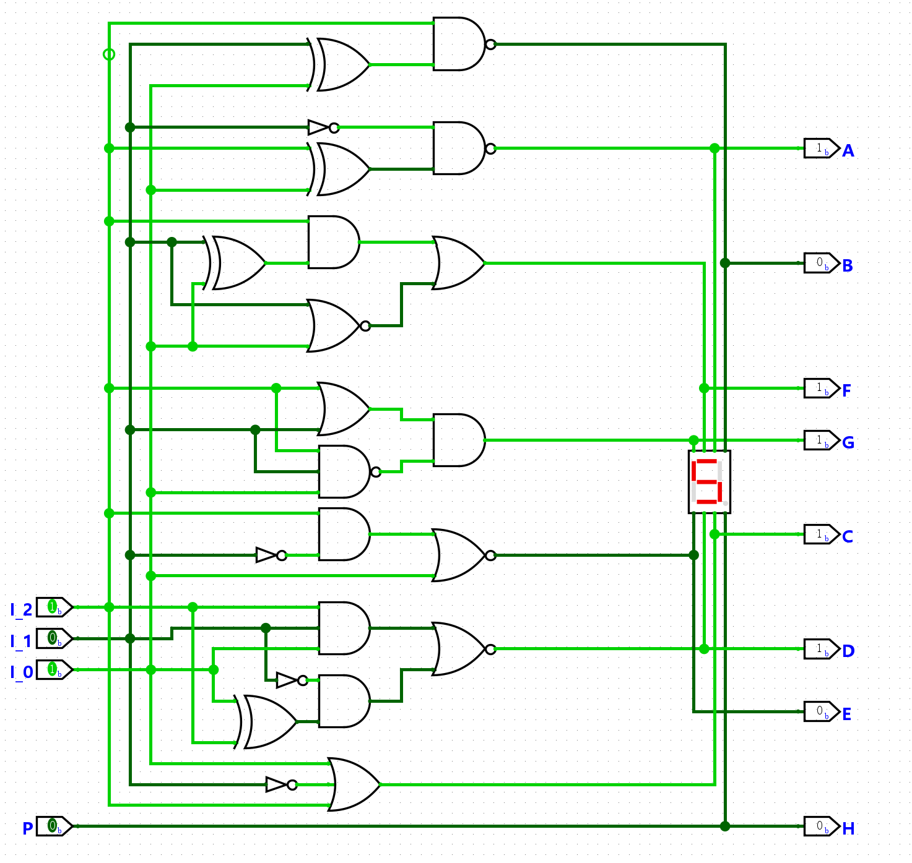

# 组合逻辑电路

> [F3 数字逻辑电路基础 | 一生一芯 v24.07 学习讲义](https://ysyx.oscc.cc/docs/2407/f/3.html)

## 译码器

**译码器**（*decoder*）把 $n$ 位二进制输入翻译成最多 $2^n$ 路输出信号。

### n选1译码器

最常见的一类译码器是 **n 选 1 译码器**（*1-of-n decoder*）：把输入看成无符号整数 $i$，只让**第 $i$ 路输出为 `1`，其余为 `0`**。

这种「恰好一路为 `1`」的编码叫**独热码**（*one-hot*）。

!!! example
    译码器输出的是一组**选择线**，不是直接写出十进制字形。例如输入 `10`₂ 时令 $Y_2=1$，是在「选中第 2 路」，数值上对应十进制 2，但电路层面仍是二进制电压。显示数字要靠后面的七段管译码等模块。

#### 2-4 译码器

2 位输入 $A_1 A_0$，4 位输出 $Y_3 Y_2 Y_1 Y_0$。行为：输入值 $i$ 时 $Y_i = 1$，其余为 `0`。


图中 Logisim 当前状态：$A_1=A_0=0$，因此只有最上方的与门满足条件，$Y_0=1$（绿线为高电平）。

**真值表：**

| $A_1$ | $A_0$ | | $Y_3$ | $Y_2$ | $Y_1$ | $Y_0$ |
|:-:|:-:|:-:|:-:|:-:|:-:|:-:|
| 0 | 0 | | 0 | 0 | 0 | 1 |
| 0 | 1 | | 0 | 0 | 1 | 0 |
| 1 | 0 | | 0 | 1 | 0 | 0 |
| 1 | 1 | | 1 | 0 | 0 | 0 |

**逻辑表达式**（与真值表、上图连线一致）：

$$
\begin{aligned}
Y_0 &= \overline{A_1}\,\overline{A_0} \\
Y_1 &= \overline{A_1}\,A_0 \\
Y_2 &= A_1\,\overline{A_0} \\
Y_3 &= A_1\,A_0
\end{aligned}
$$

**电路结构：**

- 两个非门：产生 $\overline{A_1}$、$\overline{A_0}$

- 四个 2 输入与门：每种输入组合对应一路输出

!!! tip "和地址的关系"
    计算机里 n 选 1 译码器常用于寻址：输入是**地址**，输出是各存储单元 / 设备上的**片选信号**——地址对应的那一根拉高，其余保持低。

#### 译码器的级联扩展

> [Cascading of Decoders](https://www.tutorialspoint.com/article/cascading-of-decoders)

在logisim中，可使用子电路功能将一个电路模块进行封装以提升复用性。

将上面的 2-4 译码器封装为一个子电路，命名为 `decoder_24`。利用译码器的**可级联特性**，我们可以将两个 `decoder_24` 级联成一个 3-8 译码器：


注意这里与上面实现的 2-4 译码器略有不同，添加了一个使能输入 `EN`：


每个与门多接一路 `EN`，于是

$$
\begin{aligned}
Y_0 &= EN\cdot\overline{A_1}\,\overline{A_0} \\
Y_1 &= EN\cdot\overline{A_1}\,A_0 \\
Y_2 &= EN\cdot A_1\,\overline{A_0} \\
Y_3 &= EN\cdot A_1\,A_0
\end{aligned}
$$

- `EN = 0`：四路输出全为 `0`，整片子电路相当于关掉

- `EN = 1`：行为与无使能的 2-4 完全相同

级联时用最高位 $A_2$ 当片选：一片接 $EN = A_2$（负责 $Y_4\!\sim\!Y_7$），另一片接 $EN = \overline{A_2}$（负责 $Y_0\!\sim\!Y_3$）；$A_1 A_0$ 并联接到两片。同一时刻只有一片被打开，输出才仍是独热的 3-8 译码。

!!! tip "级联的推广"
    以此类推：用 **两片带使能的 $(n-1)\to 2^{n-1}$ 译码器** 可拼成 $n\to 2^n$ 译码器（数量正好 $\frac{2^n}{2^{n-1}}=2$）。

    - 低 $n-1$ 位 $A_{n-2}\ldots A_0$：**并联**接到两片

    - 最高位 $A_{n-1}$ 作片选：下片 `EN` 接 $\overline{A_{n-1}}$（输出 $Y_0\!\sim\!Y_{2^{n-1}-1}$），上片 `EN` 接 $A_{n-1}$（输出 $Y_{2^{n-1}}\!\sim\!Y_{2^n-1}$）

    - 若子模块本身已有总使能 `EN`，则两片实际为 $EN·¬A_{n-1}$ 与 $EN·A_{n-1}$

    模块复用时不必再改内部每个与门——使能是子电路的管脚；只有拆到门级时，才表现为每路 $Y_i = EN\cdot m_i$。如此递归下去，可一直拆到 2-4。

### 转码器

#### 七段数码管译码器

> [通过门电路实现三位 LED 译码器 | 果冻的猿宇宙](https://spcp.xiaogd.net/gate/led-decoder-by-gate.html)

前面的 n 选 1 译码器输出的是**独热码**（选中哪一路）。**七段数码管译码器**（*7-segment LED decoder*）则不同：它把二进制数**转码**成「字形」，这时输出不再是「第 $i$ 路为 1」，而是同时驱动多根段选线，拼出人眼可读的数字。因此它属于**转码器**，而不是独热译码器。

七段数码管由 7 根 LED 段组成，习惯记为 $A\!\sim\!G$（有的资料用小写 $a\!\sim\!g$）：

```
    A
  F   B
    G
  E   C
    D   H
```

这里采用 **3 位输入** $I_2 I_1 I_0$ 表示无符号整数 $0\!\sim\!7$，共 8 种字形；每位输出 `1` = 点亮该段（共阴极习惯）。

##### 数学原理

本质上是设计一个布尔函数。

设计入口只有一张真值表：对每个数字，规定 $A\!\sim\!G$ 哪些段该亮。输入记 $I_2 I_1 I_0$（下表与常见 0–7 字形一致）：

| 十进制 | $I_2$ | $I_1$ | $I_0$ | | $A$ | $B$ | $C$ | $D$ | $E$ | $F$ | $G$ |
|:-:|:-:|:-:|:-:|:-:|:-:|:-:|:-:|:-:|:-:|:-:|:-:|
| 0 | 0 | 0 | 0 | | 1 | 1 | 1 | 1 | 1 | 1 | 0 |
| 1 | 0 | 0 | 1 | | 0 | 1 | 1 | 0 | 0 | 0 | 0 |
| 2 | 0 | 1 | 0 | | 1 | 1 | 0 | 1 | 1 | 0 | 1 |
| 3 | 0 | 1 | 1 | | 1 | 1 | 1 | 1 | 0 | 0 | 1 |
| 4 | 1 | 0 | 0 | | 0 | 1 | 1 | 0 | 0 | 1 | 1 |
| 5 | 1 | 0 | 1 | | 1 | 0 | 1 | 1 | 0 | 1 | 1 |
| 6 | 1 | 1 | 0 | | 1 | 0 | 1 | 1 | 1 | 1 | 1 |
| 7 | 1 | 1 | 1 | | 1 | 1 | 1 | 0 | 0 | 0 | 0 |

每一段都是输入的一个布尔函数。例如「$A=1$ 的最小项」对应数字 $\{0,2,3,5,6,7\}$，可写成积之和（SOP）；若某段为 `0` 的行更少，也可以先写 $\overline{A}$ 再整体取反（往往门更少）。

化简后的一组常用实现：

$$
\begin{aligned}
A &= \overline{\overline{I_1}\,(I_2 \oplus I_0)} \\
B &= \overline{I_2\,(I_1 \oplus I_0)} \\
C &= \overline{\overline{I_2}\,I_1\,\overline{I_0}} = I_2 + \overline{I_1} + I_0 \\
D &= \overline{\overline{I_1}\,(I_2 \oplus I_0) + I_2 I_1 I_0} \\
E &= \overline{I_0 + I_2\,\overline{I_1}} \\
F &= \overline{I_1}\,\overline{I_0} + I_2\,(I_1 \oplus I_0) \\
G &= (I_2 \oplus I_1) + I_2\,\overline{I_0} \\
H &= P
\end{aligned}
$$

!!! tip "设计套路（以 $A$、$E$ 为例）"
    **$A$ 段**：表中仅数字 1、4 为 `0`，先写

    $$
    \overline{A} = \overline{I_2}\,\overline{I_1}\,I_0 + I_2\,\overline{I_1}\,\overline{I_0}
    $$

    再取反并用德摩根 / 分配律化到异或：

    $$
    A = \overline{\overline{I_1}\,(I_2 \oplus I_0)}
    $$

    用到 1 个异或门 + 1 个非门 + 1 个与非门。

    **$E$ 段**：仅在 $0,2,6$ 为 `1`，化简得

    $$
    E = \overline{I_0 + I_2\,\overline{I_1}}
    $$

    即「与门 + 或非门」（外加复用 $\overline{I_1}$）。

    其余各段同一流程：列最小项 → 代数或卡诺图化简 → 映射到与/或/非/异或等门。门越多越难维护，所以后面常把整块封装成子电路。

##### 门电路实现



图中 Logisim 当前状态：

| 引脚 | 电平 | 含义 |
|:--|:--:|:--|
| $I_2 I_1 I_0$ | `1 0 1` | 二进制 $101_2 = 5$ |
| $P$ | `0` | 小数点关闭 |
| $A B C D E F G$ | `1 0 1 1 0 1 1` | 与上表「数字 5」一行一致 |
| $H$ | `0` | $H=P$，小数点灭 |

亮段为 $A,C,D,F,G$（上、右下、下、左上、中），拼成字形 **5**；暗段为 $B,E$（右上、左下）。绿线 = 高电平，与输出列一一对应。

结构上可以这么读图：

- 左侧 $I_2,I_1,I_0$ 经非门、异或门抽出公共子表达式（如 $I_1\oplus I_0$、$I_2\oplus I_0$），供多段共享

- 中部按段用与 / 与非 / 或 / 或非 拼出上面的布尔式

- 右侧 $A\!\sim\!G$ 接到七段显示器；$P$ 直通 $H$，不参与数字译码

!!! example "和 n 选 1 的对比"
    输入同为 `101` 时：3-8 译码器只拉高 $Y_5$；七段译码器则同时拉高 $A,C,D,F,G$ 五根线。前者回答「选谁」，后者回答「怎么画成 5」。

#### 四位输入的七段数码管译码器

三位输入最多覆盖 $0\!\sim\!7$。单个数码管还能较清楚地显示部分字母，因此可以扩成 **4 位输入** $I_3 I_2 I_1 I_0$，按十六进制显示 $0\!\sim\!9$ 与 $A\!\sim\!F$（对应十进制 10–15）。

##### 数学原理

方法与三位时完全相同：**先定字形真值表，再为每一段求 4 变量布尔函数并化简**。扩展时不必推倒重来，可把三位结果当成「低半区」，用最高位 $I_3$ 做分片。

1. 输入空间扩展

    | | $I_3$ | $I_2 I_1 I_0$ | 显示 |
    |:--|:--:|:--:|:--|
    | 低半区（复用三位表） | 0 | $000\!\sim\!111$ | $0\!\sim\!7$ |
    | 高半区（新定字形） | 1 | $000\!\sim\!111$ | $8,9,A,b,C,d,E,F$ |

    也即：每一位段输出都可写成

    $$
    S(I_3,I_2,I_1,I_0)
    = \overline{I_3}\cdot S_{\mathrm{L}}(I_2,I_1,I_0)
    + I_3\cdot S_{\mathrm{H}}(I_2,I_1,I_0)
    $$

    其中 $S_{\mathrm{L}}$ 就是上一节三位译码器已经得到的那段函数；$S_{\mathrm{H}}$ 是「把 $I_2 I_1 I_0$ 当成 0–7、但字形按 8–F 来画」的新函数。电路上相当于：两套三位逻辑，再用 $I_3 / \overline{I_3}$ 做二选一（或化简后揉进同一张卡诺图）。

2. 真值表扩展

    $0\!\sim\!7$ 各行与三位表相同（$I_3=0$）。下面只列出高半区一种常见共阴极字形（`1` = 亮；$b,d$ 用小写以免与 `8`、`0` 混淆）：

    | 字符 | $I_3$ | $I_2$ | $I_1$ | $I_0$ | | $A$ | $B$ | $C$ | $D$ | $E$ | $F$ | $G$ |
    |:-:|:-:|:-:|:-:|:-:|:-:|:-:|:-:|:-:|:-:|:-:|:-:|:-:|
    | 8 | 1 | 0 | 0 | 0 | | 1 | 1 | 1 | 1 | 1 | 1 | 1 |
    | 9 | 1 | 0 | 0 | 1 | | 1 | 1 | 1 | 1 | 0 | 1 | 1 |
    | A | 1 | 0 | 1 | 0 | | 1 | 1 | 1 | 0 | 1 | 1 | 1 |
    | b | 1 | 0 | 1 | 1 | | 0 | 0 | 1 | 1 | 1 | 1 | 1 |
    | C | 1 | 1 | 0 | 0 | | 1 | 0 | 0 | 1 | 1 | 1 | 0 |
    | d | 1 | 1 | 0 | 1 | | 0 | 1 | 1 | 1 | 1 | 0 | 1 |
    | E | 1 | 1 | 1 | 0 | | 1 | 0 | 0 | 1 | 1 | 1 | 1 |
    | F | 1 | 1 | 1 | 1 | | 1 | 0 | 0 | 0 | 1 | 1 | 1 |

3. 按段化简（以 $A$ 为例）

    三位时已有

    $$
    A_{\mathrm{L}} = \overline{\overline{I_1}\,(I_2 \oplus I_0)}
    \quad\Leftrightarrow\quad
    \overline{A_{\mathrm{L}}} = \overline{I_1}\,(I_2 \oplus I_0)
    $$

    （仅在数字 1、4 为 0）。高半区里 $A$ 为 0 的是 `b`（`1011`）、`d`（`1101`），写成 $I_2 I_1 I_0$ 的函数：

    $$
    \overline{A_{\mathrm{H}}} = I_0\,(I_2 \oplus I_1)
    \quad\Rightarrow\quad
    A_{\mathrm{H}} = \overline{I_0\,(I_2 \oplus I_1)}
    $$

    代入分片公式：

    $$
    A = \overline{I_3}\,A_{\mathrm{L}} + I_3\,A_{\mathrm{H}}
    $$

    若直接对四变量的 $\overline{A}$ 做 SOP（零点：`0001,0100,1011,1101`），可收成一项和式再取反：

    $$
    \overline{A}
    = \overline{I_3}\,\overline{I_1}\,(I_2 \oplus I_0)
    + I_3\,I_0\,(I_2 \oplus I_1)
    \quad\Rightarrow\quad
    A = \overline{\overline{I_3}\,\overline{I_1}\,(I_2 \oplus I_0) + I_3\,I_0\,(I_2 \oplus I_1)}
    $$

    第一项正是三位结果乘上 $\overline{I_3}$，第二项是高半区新约束——**扩展 = 旧式保留 + 新最小项并入后再化简**。其余 $B\!\sim\!G$ 同一套。

!!! info "十六进制 vs BCD"
    - **十六进制（上表）**：16 行全有定义，得到驱动 `0`–`F` 的完整转码器。

    - **BCD（只显示 0–9）**：输入 `1010`–`1111` 视为**无关项**（don't care）。化简时可把这些格任意当成 0/1，往往比强制显示 `A`–`F` 更省门；非法 BCD 时字形不保证。

!!! tip "和三位电路的关系"
    不能在旧电路上「再接一根线」就变成四位——$S_{\mathrm{L}}$ 的每一项都会被 $I_3$ 改写。要么按上式用 $\overline{I_3}/I_3$ 切换两套三位逻辑，要么直接对 4 变量重新化简（门数通常更少）。小数点仍可 $H=P$，与位数无关。

##### 门电路实现
