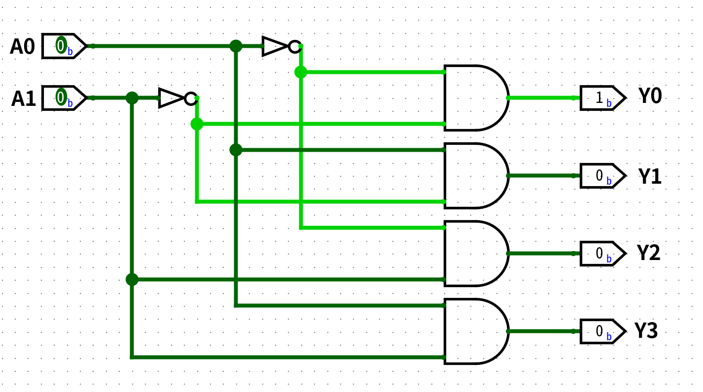
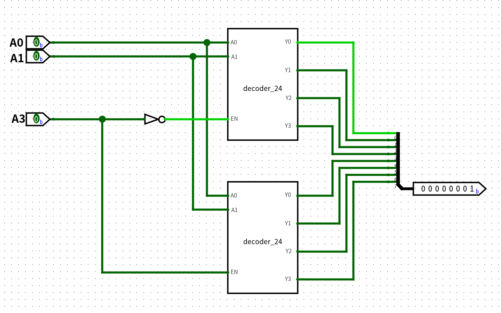
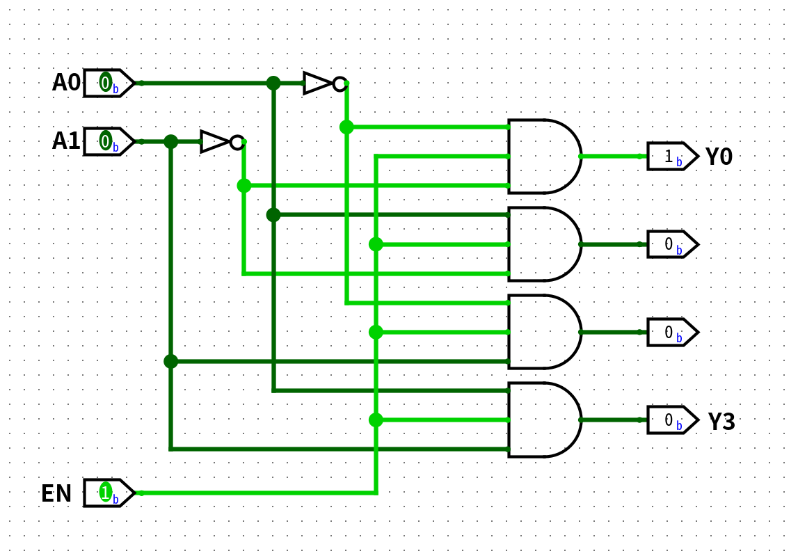

# 组合逻辑电路

> [F3 数字逻辑电路基础 | 一生一芯 v24.07 学习讲义](https://ysyx.oscc.cc/docs/2407/f/3.html)

## 译码器

**译码器**（*decoder*）把 $n$ 位二进制输入翻译成最多 $2^n$ 路输出信号。

### n选1译码器

最常见的一类译码器是 **n 选 1 译码器**（*1-of-n decoder*）：把输入看成无符号整数 $i$，只让**第 $i$ 路输出为 `1`，其余为 `0`**。

这种「恰好一路为 `1`」的编码叫**独热码**（*one-hot*）。

!!! example
    译码器输出的是一组**选择线**，不是直接写出十进制字形。例如输入 `10`₂ 时令 $Y_2=1$，是在「选中第 2 路」，数值上对应十进制 2，但电路层面仍是二进制电压。显示数字要靠后面的七段管译码等模块。

#### 2-4 译码器

2 位输入 $A_1 A_0$，4 位输出 $Y_3 Y_2 Y_1 Y_0$。行为：输入值 $i$ 时 $Y_i = 1$，其余为 `0`。

图中 Logisim 当前状态：$A_1=A_0=0$，因此只有最上方的与门满足条件，$Y_0=1$（绿线为高电平）。

**真值表：**

| $A_1$ | $A_0$ | | $Y_3$ | $Y_2$ | $Y_1$ | $Y_0$ |
|:-:|:-:|:-:|:-:|:-:|:-:|:-:|
| 0 | 0 | | 0 | 0 | 0 | 1 |
| 0 | 1 | | 0 | 0 | 1 | 0 |
| 1 | 0 | | 0 | 1 | 0 | 0 |
| 1 | 1 | | 1 | 0 | 0 | 0 |

**逻辑表达式**（与真值表、上图连线一致）：

$$
\begin{aligned}
Y_0 &= \overline{A_1}\,\overline{A_0} \\
Y_1 &= \overline{A_1}\,A_0 \\
Y_2 &= A_1\,\overline{A_0} \\
Y_3 &= A_1\,A_0
\end{aligned}
$$

**电路结构：**

- 两个非门：产生 $\overline{A_1}$、$\overline{A_0}$

- 四个 2 输入与门：每种输入组合对应一路输出

!!! tip "和地址的关系"
    计算机里 n 选 1 译码器常用于寻址：输入是**地址**，输出是各存储单元 / 设备上的**片选信号**——地址对应的那一根拉高，其余保持低。

#### 译码器的级联扩展

> [Cascading of Decoders](https://www.tutorialspoint.com/article/cascading-of-decoders)

在logisim中，可使用子电路功能将一个电路模块进行封装以提升复用性。

将上面的 2-4 译码器封装为一个子电路，命名为 `decoder_24`。利用译码器的**可级联特性**，我们可以将两个 `decoder_24` 级联成一个 3-8 译码器：

注意这里与上面实现的 2-4 译码器略有不同，添加了一个使能输入 `EN`：

每个与门多接一路 `EN`，于是

$$
\begin{aligned}
Y_0 &= EN\cdot\overline{A_1}\,\overline{A_0} \\
Y_1 &= EN\cdot\overline{A_1}\,A_0 \\
Y_2 &= EN\cdot A_1\,\overline{A_0} \\
Y_3 &= EN\cdot A_1\,A_0
\end{aligned}
$$

- `EN = 0`：四路输出全为 `0`，整片子电路相当于关掉

- `EN = 1`：行为与无使能的 2-4 完全相同

级联时用最高位 $A_2$ 当片选：一片接 $EN = A_2$（负责 $Y_4\!\sim\!Y_7$），另一片接 $EN = \overline{A_2}$（负责 $Y_0\!\sim\!Y_3$）；$A_1 A_0$ 并联接到两片。同一时刻只有一片被打开，输出才仍是独热的 3-8 译码。

!!! tip "级联的推广"
    以此类推：用 **两片带使能的 $(n-1)\to 2^{n-1}$ 译码器** 可拼成 $n\to 2^n$ 译码器（数量正好 $\frac{2^n}{2^{n-1}}=2$）。

    - 低 $n-1$ 位 $A_{n-2}\ldots A_0$：**并联**接到两片

    - 最高位 $A_{n-1}$ 作片选：下片 `EN` 接 $\overline{A_{n-1}}$（输出 $Y_0\!\sim\!Y_{2^{n-1}-1}$），上片 `EN` 接 $A_{n-1}$（输出 $Y_{2^{n-1}}\!\sim\!Y_{2^n-1}$）

    - 若子模块本身已有总使能 `EN`，则两片实际为 $EN·¬A_{n-1}$ 与 $EN·A_{n-1}$

    模块复用时不必再改内部每个与门——使能是子电路的管脚；只有拆到门级时，才表现为每路 $Y_i = EN\cdot m_i$。如此递归下去，可一直拆到 2-4。

### 转码器
