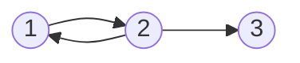
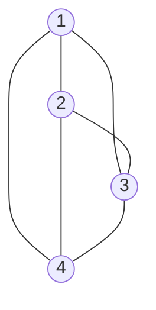
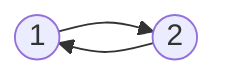
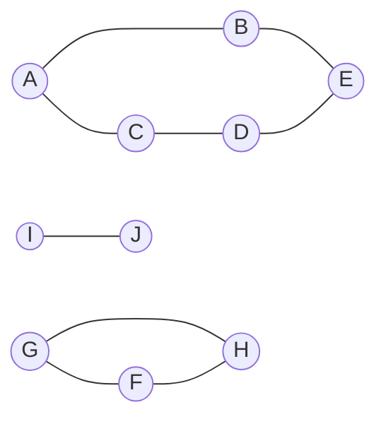
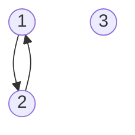
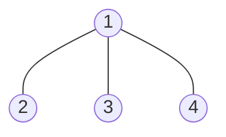

# 图的基本概念

## 图的定义

图 $G$ 由顶点集 $V$ 和边集 $E$ 组成，记为 $G = (V, E)$。其中：

- 顶点集 $V$ 是非空有穷集，记为 $V(G)$，其元素称为顶点。

- 边集 $E$ 是顶点偶对的有穷集合，记为 $E(G)$，其元素称为边。

若 $V = \{v_1, v_2, \ldots, v_n\}$，则用 $|V|$ 表示图 $G$ 的顶点数，也称图 $G$ 的阶；$E = \{(u, v)\ |\ u, v \in V\}$，$|E|$ 表示图 $G$ 的边数。

图的顶点集和边集都为空时，该图称为**空图**。

!!! warning "注意"
    线性表可以是空表、树可以是空树，但**图不可以是空图**。也就是说，图中不能一个顶点都没有，即顶点集 $V$ 一定非空；**但边集 $E$ 可以为空**，此时图中只有顶点而没有边。

## 图的类型与基本术语

### 有向图和无向图

#### 有向图

若边集 $E$ 是**有向边**（也称弧）的有限集合，则图 $G$ 为**有向图**。

弧是顶点的**有序对**，记为 $<v, w>$，其中 $v$ 称为**弧尾**，$w$ 称为**弧头**，$<v, w>$ 称为从 $v$ 到 $w$ 的弧，也称 $v$ 邻接到 $w$ 或 $w$ 从 $v$ 可达。

有如下有向图 $G_1$:

则其可以表示为如下形式:

$$
G_1 = (V_1, E_1)
$$

$$
V_1 = \{1, 2, 3\}
$$

$$
E_1 = \{\langle 1, 2 \rangle, \langle 2, 1 \rangle, \langle 2, 3 \rangle\}
$$

#### 无向图

结合有向图的定义，不难理解无向图的定义。

若边集 $E$ 是**无向边**（也称边）的有限集合，则图 $G$ 为**无向图**。

边是顶点的**无序对**，记为 $(v, w)$ 或 $(w, v)$。可以称 $v$ 和 $w$ 互为邻接点。边 $(v, w)$ 依附于顶点 $v$ 和 $w$，或者说边 $(v, w)$ 和顶点 $v$ 和 $w$ 相关联。

有如下无向图 $G_2$:

则其可以表示为如下形式:

$$
G_2 = (V_2, E_2)
$$

$$
V_2 = \{1, 2, 3, 4\}
$$

$$
E_2 = \{(1, 2), (1, 3), (1, 4), (2, 3), (2, 4), (3, 4)\}
$$

#### 顶点的度、入度和出度

在无向图中，一个顶点 $v$ 的度是指依附于该顶点的边的条数，记为 $TD(v)$。

在上面无向图的例子中，每个顶点的度都为 $3$。

**无向图全部顶点的度数之和等于边数的两倍（$TD(G) = 2|E|$）**，因为每条边都与两个顶点关联。

在有向图中，一个顶点 $v$ 的度分为入度和出度，入度是以 $v$ 为终点的有向边的条数，记为 $ID(v)$；出度是以 $v$ 为起点的有向边的条数，记为 $OD(v)$。顶点 $v$ 的度等于其入度和出度之和，即 $TD(v) = ID(v) + OD(v)$。

在上面有向图的例子中，顶点 $2$ 出度为 $2$，入度为 $1$，度为 $3$。

**有向图全部顶点的入度之和等于出度之和**，且**等于边数**，即 $ID(G) = OD(G) = |E|$，这是因为每条有向边都有一个起点和终点。

### 简单图和多重图

一个图 $G$ 若满足:

1. 不存在重复边

2. 不存在顶点到自身的边

则称该图为**简单图**。

上面的有向图 $G_1$ 和无向图 $G_2$ 都是简单图。

**多重图**与简单图的定义是相对的。

### 完全图

对于**无向图**，$|E|$ 的取值范围为 $0$ 到 $n(n-1)/2$，有 $n(n-1)/2$ 条边的无向图称为**完全图**，**完全图中任意两个顶点之间都存在边**。

上面的无向图 $G_2$ 就是一个完全图。

对于**有向图**，$|E|$ 的取值范围为 $0$ 到 $n(n-1)$，有 $n(n-1)$ 条边的有向图称为**有向完全图**，**完全图中任意两个顶点之间都存在两条方向相反的弧**。

### 路径、路径长度和回路

#### 基本定义

顶点 $v_p$ 到顶点 $v_q$ 之间的一条**路径**是指顶点序列 $v_p, v_{i_1}, v_{i_2}, \ldots, v_{i_m}, v_q$。关联的边也可理解为路径的构成要素。

路径上边的数目称为**路径长度**。

如果路径上第一个顶点和最后一个顶点相同，则称该路径为**回路**或**环**。

若一个图有 $n$ 个顶点，且有大于 $n - 1$ 条边，则该图必有环。

#### 简单路径、简单回路

路径序列中，除了第一个顶点和最后一个顶点之外，其他顶点不重复出现的路径称为**简单路径**。

同理，除了第一个顶点和最后一个顶点之外，其他顶点不重复出现的回路称为**简单回路**。

### 距离

从顶点 $u$ 出发到顶点 $v$ 的最短路径长度称为 $u$ 到 $v$ 的**距离**，记为 $d(u, v)$。若 $u$ 到 $v$ 之间**不存在路径**，则记该距离为**无穷**: $d(u, v) = \infty$。

若 $u$ 到 $v$ 的边[带权](图的基本概念.md#边的权网和带权路径长度)值 $w(u, v)$，则 $u$ 到 $v$ 的距离为 $w(u, v)$。

### 子图

设有图 $G = (V, E)$ 和 $G^{'} = (V^{'}, E^{'})$，若 $V^{'} \subseteq V$ 且 $E^{'} \subseteq E$，则称 $G^{'}$ 是 $G$ 的**子图**。

如下面的图 $G_3$ 就是上面有向图 $G_1$ 的一个子图:

若有满足 $V(G^{'}) = V(G)$ 的子图 $G^{'}$，则称该子图 $G^{'}$ 为 $G$ 的**生成子图**。

!!! warning "注意"
    并非 $V$ 和 $E$ 的任何子集都可以构成 $G$ 的子图，因为这样的子集**可能不是图**，即 $E$ 的子集中的某些边关联的顶点可能不在这个 $V$ 的子集中。

### 图的连通性

#### 连通、连通图和连通分量

在**无向图**中，若从顶点 $v$ 到顶点 $w$ 有路径存在，则称 $v$ 和 $w$ 是**连通的**；若图 $G$ 中任意两个顶点都是连通的，则称 $G$ 为**连通图**，否则称 $G$ 为**非连通图**。

若 $G$ 是非连通图，则**非连通图的极大连通子图**称为 $G$ 的**连通分量**，**非连通图的每一个连通分量都是一个连通图**。

上面的无向图 $G_4$ 是一个非连通图，其中不难发现其具有三个部分，即三个连通分量。在图中，各个连通分量的相对位置可以是任意的，无关连通性。

- 假设一个图是非连通图，且具有 $n$ 个顶点，若边数小于 $n - 1$，则此图必为非连通图。

- 非连通情况下边最多的情况: 由 $n - 1$ 个顶点构成一个完全图，此时再加入一个顶点则变成非连通图。

#### 强连通图、强连通分量

在**有向图**中，若有一对顶点 $v$ 和 $w$，且从 $v$ 到 $w$ 和从 $w$ 到 $v$ 之间都有路径，则称 $v$ 和 $w$ 是**强连通的**；若图中任意一对顶点都是强连通的，则称该图为**强连通图**。

有向图中的**极大强连通子图**称为有向图的**强连通分量**。

以上面的有向图 $G_1$ 为例，其具有两个强连通分量:

- 对于一个具有 $n$ 个顶点的有向图，若其为强连通图，则至少有 $n$ 条边（形成环路）。

#### 生成树、生成森林

连通图的生成树是包含图中全部顶点的一个**极小连通子图**。若图 $G$ 的顶点数为 $n$，则它的生成树含有 $n - 1$ 条边。

!!! note "极小连通子图与极大连通子图"
    - **极小连通子图**: 既要保持子图连通又要使得边数最少的子图

    - **极大连通子图**: 要求满足子图必须连通的前提下尽可能包含多的顶点和边

下图是上面无向图 $G_2$ 的一个生成树:

- 对于极小连通子树而言，需要包含所有图中所有顶点，且保证边数最少，**只有生成树满足这个极小条件**。

- 对于生成树而言，若砍去一条边，则该图必定成为非连通图；若加上一条边，则必定构成一个环。

- 在**非连通图**中，连通分量的生成树构成了非连通图的**生成森林**。

### 边的权、网和带权路径长度

设有图 $G = (V, E)$，其中 $E$ 中每条边 $e$ 都对应一个权值 $w(e)$，则称图 $G$ 为**带权图**，也称**网**。

路径上各边权值之和称为该路径的**带权路径长度**。

### 稠密图和稀疏图

顾名思义，边数少的图称为**稀疏图**，边数多的图称为**稠密图**。“稀疏”与“稠密”是模糊且相对的，没有一个明确的界限。

一般来说，当图 $G$ 满足 $|E| < |V| \log_2 |V|$ 时，可将图 $G$ 视为稀疏图；反之亦然。

### 有向树

一个顶点的入度为 $0$、其余顶点的入度均为 $1$ 的有向图称为**有向树**。
