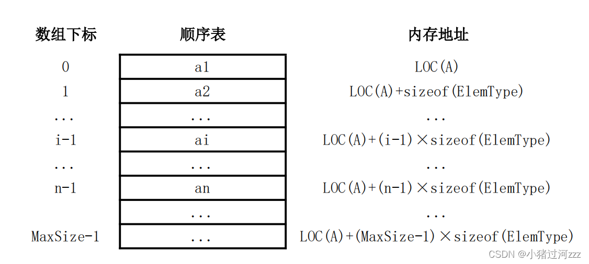

# 线性表的顺序表示

>[顺序表](../DataStructure/LinearList/顺序表.md)

## 顺序表的定义



- 静态分配

    ```c
    #define MAXSIZE 100
    typedef int ElemType;
    typedef struct {
        ElemType data[MAXSIZE]; // 顺序表的元素
        int length; // 顺序表的长度
    } SqList; // 顺序表的类型定义
    ```

- 动态分配

    ```c
    #define INIT_SIZE 100
    typedef int ElemType;
    typedef struct {
        ElemType *data; // 动态分配数组的指针
        int length; // 当前长度
        int MaxSize; // 最大容量
    } SqList; // 顺序表的类型定义

    int main() {
        SqList L;
        // 初始动态分配语句
        L.data = (ElemType *)malloc(INIT_SIZE * sizeof(ElemType));
    }
    ```

    ```cpp
    // C++
    L.data = new ElemType[INIT_SIZE];
    ```

### 优缺点

>[顺序表的优缺点 | 顺序表](../DataStructure/LinearList/顺序表.md#顺序表的优缺点)

## 顺序表上基本操作的实现

### 初始化

- 静态分配的顺序表初始化:

    在这种分配模式下，数组空间在初始化时就已确定。

    ```c
    void InitList(SqList &L) {
        L.length = 0;   // 初始化长度为0
    }
    ```

- 动态分配的顺序表初始化:

    在初始化时先分配一个预定义的数组空间，并将长度置0；`MaxSize` 指示顺序表当前分配的存储容量，当存储空间不足时就进行再分配。

    ```c
    void InitList(SqList &L) {
        L.data = (ElemType *)malloc(INIT_SIZE * sizeof(ElemType));
        L.length = 0;   // 初始化长度为0
        L.MaxSize = INIT_SIZE;   // 初始化最大容量
    }
    ```

### 插入

在顺序表`L`的第`i`个位置插入新的元素`e`。

```c
bool ListInsert(SqList &L, int i, ElemType e) {
    if (i < 1 || i > L.length + 1) {    // 判断i的范围是否有效
        return false;
    }
    if (L.length >= L.MaxSize) {        // 当前存储空间已满，不能插入
        return false;
    }
    for (int j = L.length; j >= i; j--) {   // 将第i个元素及之后的元素后移
        L.data[j] = L.data[j - 1];
    }
    L.data[i - 1] = e;   // 在第i个位置插入新元素
    L.length++;   // 表长加1
    return true;
}
```

顺序表插入的算法时间复杂度推导如下:

- 最好情况: 在表尾插入 $(i = n + 1)$，元素后移语句将不执行，时间复杂度为 $O(1)$

- 最坏情况: 在表头插入 $(i = 1)$，元素后移语句将执行 $n$ 次，时间复杂度为 $O(n)$

- 平均情况: 假设在表中任一位置插入的概率相同，即 $p_i = \frac{1}{n + 1}$，则元素后移语句的平均执行次数为:

    $$
    \frac{1}{n + 1} \sum_{i = 1}^{n + 1} (n - i + 1) = \frac{1}{n + 1} \sum_{j = 1}^{n} j = \frac{1}{n + 1} \cdot \frac{n(n + 1)}{2} = \frac{n}{2}
    $$

    因此，平均时间复杂度为 $O(n)$

### 删除

在顺序表`L`中删除第`i`个位置的元素，用引用变量`e`返回被删除元素的值。

```c
bool ListDelete(SqList &L, int i, ElemType &e) {
    if (i < 1 || i > L.length) {    // 判断i的范围是否有效
        return false;
    }
    e = L.data[i - 1];   // 将被删除元素赋值给e
    for (int j = i; j < L.length; j++) {   // 将第i个元素后的元素前移
        L.data[j - 1] = L.data[j];
    }
    L.length--;   // 表长减1
    return true;
}
```

顺序表删除的算法时间复杂度推导如下:

- 最好情况: 在表尾删除 $(i = n)$，元素前移语句将不执行，时间复杂度为 $O(1)$

- 最坏情况: 在表头删除 $(i = 1)$，需移动除表头元素外的所有元素，时间复杂度为 $O(n)$

- 平均情况: 假设在表中任一位置删除的概率相同，即 $p_i = \frac{1}{n}$，则元素前移语句的平均执行次数为:

    $$
    \sum_{i=1}^{n} \frac{1}{n}(n - i) = \frac{1}{n} \sum_{j=1}^{n - 1} j = \frac{1}{n} \cdot \frac{(n - 1)n}{2} = \frac{n - 1}{2}
    $$

    因此，平均时间复杂度为 $O(n)$

### 按值查找

在顺序表`L`中查找第一个值为`e`的元素，并返回其位序。

```c
int LocateElem(SqList L, ElemType e) {
    for (int i = 0; i < L.length; i++) {
        if (L.data[i] == e) {
            return i + 1;
        }
    }
    return 0;
}
```

顺序表按值查找的算法时间复杂度推导如下:

- 最好情况: 查找的元素在表头，仅需比较一次，时间复杂度为 $O(1)$

- 最坏情况: 查找的元素在表尾或不存在，需要比较 $n$ 次，时间复杂度为 $O(n)$

- 平均情况: 假设在表中任一位置查找的概率相同，即 $p_i = \frac{1}{n}$，则查找语句的平均执行次数为:

    $$
    \sum_{i = 1}^{n} \frac{1}{n} i = \frac{1}{n} \sum_{j = 1}^{n} j = \frac{1}{n} \cdot \frac{n(n + 1)}{2} = \frac{n + 1}{2}
    $$

    因此，平均时间复杂度为 $O(n)$
