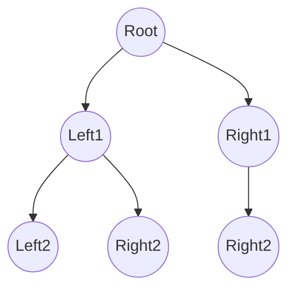

# 二叉树

> [二叉树 | Hello算法](https://www.hello-algo.com/chapter_tree/binary_tree/)
>
> [Binary Tree Data Structure | GeeksForGeeks](https://www.geeksforgeeks.org/dsa/binary-tree-data-structure/)

## 定义

**二叉树（*binary tree*）**是一种非线性数据结构，代表“祖先”与“后代”之间的派生关系，体现了“一分为二”的[分治逻辑](../../ComplexityAnalysis/算法时间复杂度.md#对数阶)。

二叉树以根节点为起点**一分为二**向下延伸。由于每个节点要么没有（只有数据域），要么有且只有两个子节点，可以用**左、右节点**分别表示这个两个子节点:


*图片来源: [二叉树 | Hello算法](https://www.hello-algo.com/chapter_tree/binary_tree/)*

=== "Python"
    ```py
    class BinaryTreeNode:
        """二叉树节点类
        
        Attribute:
            data (Any): 节点数据域
            left ('BinaryTreeNode'): 子节点左节点引用
            right ('BinaryTreeNode'): 子节点右节点引用
        """
        def __init__(self, data: Any):
            self.data = data
            self.left: 'BinaryTreeNode' | None = None
            self.right: 'BinaryTreeNode' | None = None
    ```
=== "C++"
    ```cpp
    struct BinaryTreeNode {
        std::vector<int> data;  // 节点值
        BinaryTreeNode *left;  // 左子节点
        BinaryTreeNode *right;  // 右子节点
        // 初始化方法
        BinaryTreeNode() : data({}), left(nullptr), right(nullptr) {}
        BinaryTreeNode(std::vector<int> data) : data(data), left(nullptr), right(nullptr) {}
        BinaryTreeNode(std::vector<int> data, BinaryTreeNode *left, BinaryTreeNode *right) : data(data), left(left), right(right) {}
    };
    ```

但在些特殊情况下，二叉树会**退化为线性结构**，即[单链表](../LinearList/单链表.md)，此时二叉树的性质将不再成立，这个我们后面再讨论。

## 常用操作

### 初始化



以上面的树为例分为两步，首先初始化各个节点，然后再构建各个节点之间的引用关系:

=== "Python"
    ```py
    # 初始化空根节点
    root = None
    root = BinaryTreeNode(None)

    # 初始化节点
    root = BinaryTreeNode(data)
    level_1_left = BinaryTreeNode(data)
    level_1_right = BinaryTreeNode(data)
    left_left = BinaryTreeNode(data)
    left_right = BinaryTreeNode(data)
    right_right = BinaryTreeNode(data)

    # 构建节点引用关系
    root.left = level_1_left
    root.right = level_1_right
    level_1_left.left = left_left
    level_1_left.right = left_right
    level_1_right.right = right_right
    ```
=== "C++"
    ```cpp
    int main() {
        // 初始化空根节点
        root = nullptr
        root = new BinaryTreeNode(nullptr)

        // 初始化节点
        BinaryTreeNode* root = new BinaryTreeNode(data)
        BinaryTreeNode* level_1_left = new BinaryTreeNode(data)
        BinaryTreeNode* level_1_right = new BinaryTreeNode(data)
        BinaryTreeNode* left_left = new BinaryTreeNode(data)
        BinaryTreeNode* left_right = new BinaryTreeNode(data)
        BinaryTreeNode* right_right = new BinaryTreeNode(data)

        // 构建节点引用关系
        root->left = level_1_left
        root->right = level_1_right
        level_1_left->left = left_left
        level_1_left->right = left_right
        level_1_right->right = right_right

        return 0;
    }
    ```
