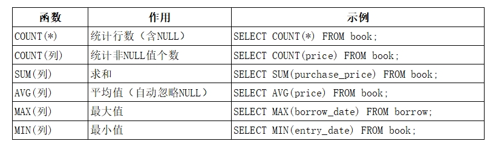
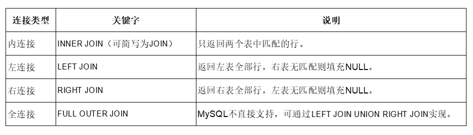

# SQL操作要点

## 登录数据库管理系统

这里用的是MySQL。

```bash
mysql -u root -p
```

成功登录后可通过 `show databases;` 查看当前所有数据库。

## 建库与删库

### 建库

```sql
create database testDB charset utf8mb4 collate utf8mb4_general_ci;
```

`charset` 用于指定字符集，`collate` 指定排序规则，这里是 `utf8mb4_general_ci`，表示使用 `utf8mb4` 字符集，排序规则为 `general_ci`。

!!! info "字符集与排序方式"
    **字符集**（*Character Set*）字符集是数据库中允许存储哪些字符以及如何将字符转换为二进制数据的一套规则。它决定了你能在表中写入什么文字（比如英文、中文、日文、emoji 等）。`utf8mb4` 是 MySQL 推荐的字符集，支持几乎所有语言字符和 emoji 表情（每个字符最多 4 字节），是 UTF-8 的完整实现。
    
    **排序方式**（Collation / 排序规则）指同一字符集下，比较和排序字符的具体规则。它决定了执行 ORDER BY、GROUP BY、=、> 等操作时，字符如何比较大小、是否区分大小写、是否区分重音等。utf8mb4_general_ci：通用规则，不区分大小写（'A' = 'a'），排序速度较快，适合大多数中文/英文场景。你是一个DBA，现在正在设计“大学生选课系统”。创建数据库时，要求既能存储中文和生僻汉字，又能存储emoji表情，且排序时不区分大小写。

### 删库

```sql
drop database testDB;
```

DROP DATABASE是一个DDL（数据定义语言）操作，它不可回滚，也没有事务保护。一旦执行，数据会立即被永久移除，不进入回收站。如果没有备份，数据将几乎无法恢复。因此，在生产环境中，执行此命令需要极高的权限和极其谨慎的确认，稍有不慎就会导致“删库跑路”的灾难性后果。

## 建表

- 建表 ``Student`

    ```sql
    create table if not exists `Student` (
      `id` int not null auto_increment comment '学生编号（自增主键）',
      `name` varchar(50) not null comment '学生姓名',
      `student_no` varchar(20) not null comment '学号',
      `sex` enum('男', '女') default null comment '性别',
      primary key (`id`)
    ) engine=innodb default charset=utf8mb4 collate=utf8mb4_general_ci comment='学生表';
    ```

    - `id` 所在行中，`auto_increment` 表示该列自增，每次插入新行时，该列的值会自动加1；同时，后面的 `primary key` 表示该列为主键。

    - `not_null` 表示为某列添加**非空约束**。

    - `comment '...'` 表示为该列添加注释。

    - `engine=innodb` 表示显式指定存储引擎为 InnoDB，这是 MySQL 默认的存储引擎，也是最常用的存储引擎。

- 建表 `Course`

    ```sql
    create table if not exists `Course` (
      `course_id` int not null auto_increment comment '课程ID，自增主键',
      `course_name` varchar(100) not null comment '课程名称',
      `credit` tinyint unsigned not null comment '学分（整数）',
      primary key (`course_id`)
    ) engine=innodb default charset=utf8mb4 collate=utf8mb4_general_ci comment='课程表';
    ```

- 建表 `Enrollment`

    ```sql
    create table if not exists `Enrollment` (
      `enroll_id` int not null auto_increment comment '选课ID（自增主键）',
      `student_no` varchar(20) not null comment '学号',
      `course_id` int not null comment '课程ID',
      `grade` decimal(5,2) default null comment '成绩',
      primary key (`enroll_id`),
      key `idx_student_no` (`student_no`),
      key `idx_course_id` (`course_id`),
      constraint `fk_enrollment_student` foreign key (`student_no`) references `Student` (`student_no`) on delete restrict on update cascade,
      constraint `fk_enrollment_course` foreign key (`course_id`) references `Course` (`course_id`) on delete restrict on update cascade
    ) engine=innodb default charset=utf8mb4 collate=utf8mb4_general_ci comment='选课表';
    ```

    - `enroll_id` 所在行中，`auto_increment` 表示该列自增；`primary key` 表示该列为主键。

    - `grade` 使用 `decimal(5,2)` 存储成绩，最多两位小数；`default null` 表示未录入成绩时可为空。

    - `key` 为列建立索引，加快按学号或课程 ID 查询。

    - `foreign key ... references` 建立外键，关联 `Student` 与 `Course` 表；`on delete restrict` 表示有关联记录时不可删除，`on update cascade` 表示主表 ID 更新时同步更新。

    !!! warning
        直接运行这个建表代码会出现如下错误：

        ```bash
        ERROR 6125 (HY000): Failed to add the foreign key constraint. Missing unique key for constraint 'fk_enrollment_student' in the referenced table 'student'
        ```
        
        这是因为在父表 `Student` 中，被外键引用的列 `student_no` 缺少索引。

        MySQL 要求被引用的列（即父表中被 FOREIGN KEY 引用的列）必须拥有一个索引（可以是 PRIMARY KEY、UNIQUE KEY 或普通 KEY），否则无法创建外键约束。

        可先使用以下命令为 `student_no` 列添加索引再运行建表代码：

        ```sql
        alter table `Student` 
        add unique index `sid_index`(`student_no`) using btree;
        ```

## 查询

假设有表：

- `book.sql`

    ```sql
    SET NAMES utf8mb4;
    SET FOREIGN_KEY_CHECKS = 0;

    -- ----------------------------
    -- Table structure for book
    -- ----------------------------
    DROP TABLE IF EXISTS `book`;
    CREATE TABLE `book`  (
      `book_id` int NOT NULL AUTO_INCREMENT COMMENT '图书编号（唯一标识）',
      `book_name` varchar(200) CHARACTER SET utf8mb4 COLLATE utf8mb4_0900_ai_ci NOT NULL COMMENT '书名',
      `isbn` varchar(20) CHARACTER SET utf8mb4 COLLATE utf8mb4_0900_ai_ci NOT NULL COMMENT 'ISBN号（国际标准书号）',
      `author` varchar(100) CHARACTER SET utf8mb4 COLLATE utf8mb4_0900_ai_ci NOT NULL COMMENT '作者',
      `summary` text CHARACTER SET utf8mb4 COLLATE utf8mb4_0900_ai_ci NULL COMMENT '简介',
      `publisher_id` int NULL DEFAULT NULL COMMENT '出版社编号（外键）',
      `state` tinyint(1) NOT NULL DEFAULT 0 COMMENT '状态：0-在馆，1-已借出',
      `shelf_location` varchar(50) CHARACTER SET utf8mb4 COLLATE utf8mb4_0900_ai_ci NULL DEFAULT NULL COMMENT '书架位置（馆藏位置标识）',
      `price` decimal(10, 2) NULL DEFAULT NULL COMMENT '定价（单位：元）',
      `purchase_price` decimal(10, 2) NOT NULL DEFAULT 0.00 COMMENT '购入价（单位：元）',
      `storage_location` varchar(50) CHARACTER SET utf8mb4 COLLATE utf8mb4_0900_ai_ci NULL DEFAULT NULL COMMENT '存储位置（如密集书库、备用库等）',
      `publish_date` date NULL DEFAULT NULL COMMENT '出版日期',
      `entry_date` date NOT NULL COMMENT '入库日期',
      PRIMARY KEY (`book_id`) USING BTREE,
      INDEX `idx_book_name`(`book_name`) USING BTREE,
      INDEX `idx_author`(`author`) USING BTREE,
      INDEX `fk_book_publisher`(`publisher_id`) USING BTREE,
      CONSTRAINT `fk_book_publisher` FOREIGN KEY (`publisher_id`) REFERENCES `publisher` (`publisher_id`) ON DELETE RESTRICT ON UPDATE CASCADE
    ) ENGINE = InnoDB CHARACTER SET = utf8mb4 COLLATE = utf8mb4_0900_ai_ci COMMENT = '图书信息表' ROW_FORMAT = Dynamic;

    -- ----------------------------
    -- Records of book
    -- ----------------------------
    .....
    ```

- `borrow.sql`

    ```sql
    SET NAMES utf8mb4;
    SET FOREIGN_KEY_CHECKS = 0;

    -- ----------------------------
    -- Table structure for borrow
    -- ----------------------------
    DROP TABLE IF EXISTS `borrow`;
    CREATE TABLE `borrow`  (
      `borrow_id` int NOT NULL AUTO_INCREMENT COMMENT '借阅编号（主键）',
      `book_id` int NOT NULL COMMENT '图书编号（外键）',
      `reader_id` varchar(20) CHARACTER SET utf8mb4 COLLATE utf8mb4_0900_ai_ci NOT NULL COMMENT '借书证号（外键）',
      `borrow_date` date NOT NULL COMMENT '借出日期',
      `due_date` date NOT NULL COMMENT '应还书日期',
      `actual_return_date` date NULL DEFAULT NULL COMMENT '实际归还日期（NULL表示未还）',
      PRIMARY KEY (`borrow_id`) USING BTREE,
      INDEX `reader_id`(`reader_id`) USING BTREE,
      INDEX `idx_borrow_date`(`borrow_date`) USING BTREE,
      INDEX `idx_overdue`(`due_date`, `actual_return_date`) USING BTREE,
      INDEX `idx_book_reader`(`book_id`, `reader_id`) USING BTREE,
      CONSTRAINT `borrow_ibfk_1` FOREIGN KEY (`book_id`) REFERENCES `book` (`book_id`) ON DELETE RESTRICT ON UPDATE CASCADE,
      CONSTRAINT `borrow_ibfk_2` FOREIGN KEY (`reader_id`) REFERENCES `reader` (`reader_id`) ON DELETE RESTRICT ON UPDATE CASCADE
    ) ENGINE = InnoDB CHARACTER SET = utf8mb4 COLLATE = utf8mb4_0900_ai_ci COMMENT = '借阅信息表' ROW_FORMAT = Dynamic;

    -- ----------------------------
    -- Records of borrow
    -- ----------------------------
    .....
    ```

- `reader.sql`

    ```sql
    SET NAMES utf8mb4;
    SET FOREIGN_KEY_CHECKS = 0;

    -- ----------------------------
    -- Table structure for reader
    -- ----------------------------
    DROP TABLE IF EXISTS `reader`;
    CREATE TABLE `reader`  (
      `reader_id` varchar(20) CHARACTER SET utf8mb4 COLLATE utf8mb4_0900_ai_ci NOT NULL COMMENT '借书证号（主键）',
      `name` varchar(20) CHARACTER SET utf8mb4 COLLATE utf8mb4_0900_ai_ci NOT NULL COMMENT '姓名',
      `gender` char(1) CHARACTER SET utf8mb4 COLLATE utf8mb4_0900_ai_ci NULL DEFAULT NULL COMMENT '性别：M-男，F-女',
      `phone` varchar(15) CHARACTER SET utf8mb4 COLLATE utf8mb4_0900_ai_ci NULL DEFAULT NULL COMMENT '电话号码',
      `id_card` varchar(18) CHARACTER SET utf8mb4 COLLATE utf8mb4_0900_ai_ci NOT NULL COMMENT '身份证号（唯一）',
      `card_level` varchar(10) CHARACTER SET utf8mb4 COLLATE utf8mb4_0900_ai_ci NULL DEFAULT '普通' COMMENT '借书证等级（如普通、高级、VIP）',
      `card_date` date NOT NULL COMMENT '办卡日期',
      `card_status` tinyint(1) NOT NULL DEFAULT 0 COMMENT '借书卡状态：0-正常，1-禁用',
      `max_borrow_limit` int NOT NULL DEFAULT 5 COMMENT '最大可借总数（根据等级设定）',
      PRIMARY KEY (`reader_id`) USING BTREE,
      UNIQUE INDEX `id_card`(`id_card`) USING BTREE,
      UNIQUE INDEX `idx_id_card`(`id_card`) USING BTREE,
      INDEX `idx_phone`(`phone`) USING BTREE
    ) ENGINE = InnoDB CHARACTER SET = utf8mb4 COLLATE = utf8mb4_0900_ai_ci COMMENT = '读者信息表' ROW_FORMAT = Dynamic;

    -- ----------------------------
    -- Records of reader
    -- ----------------------------
    .....
    ```

### 简单按列查询

比如想要查询所有图书的图书编号和书名：

```sql
select book_id, book_name from book;
```

### 指定显示顺序

在上面例子的基础上要求*升序*排列查询结果：

```sql
select book_id, book_name from book order by book_id asc;
```

即使用字段 `order by` 显式指定排列顺序。

默认就是升序，若希望降序，则使用 `order by book_id desc`。

### 条件查询

#### `where` 字段

若希望查询当前在馆（state = 0）的图书，显示：书名、作者、书架位置，并按“入库日期”从新到旧排序，那么就需要先得到“当前在馆”的图书，并显示对应的列，最后降序：

```sql
select book_name, author, shelf_location from book where state = 0 order by entry_date desc;
```

#### 组合条件

在图书馆借阅系统中，需要定期检查哪些读者存在逾期未还的图书，以便进行催还或罚款处理。

若逾期未还定义为：当前日期（`CURDATE()`）已经超过了应还日期（`due_date`），并且该借阅记录尚未归还（`actual_return_date` 为 `NULL`）。现在希望从 [`borrow`](#查询) 表中筛选出所有逾期未还的完整借阅记录，并按逾期天数从大到小排序。其中，逾期天数的计算方法为 `DATEDIFF(CURDATE(), due_date)`。则可以使用以下代码：

```sql
select * from borrow
where due_date < curdate() and actual_return_date is null
order by datediff(curdate(), due_date) desc;
```

- `where due_date < curdate()` 筛选应还日期早于今天的记录，即已逾期。

- `and actual_return_date is null` 进一步限定尚未归还（实际归还日期为空）。

- `order by datediff(curdate(), due_date) desc` 按逾期天数降序排列，逾期最久的排在最前。

- `curdate()` 返回当前日期；`datediff(日期1, 日期2)` 计算两日期相差的天数。

#### 其他常用字段

- `limit`：限制查询结果的行数。`limit 50` 表示只返回前50行；`limit 10, 20` 表示从第11行开始返回20行。

- `offset`：跳过前几行。`offset 10` 表示跳过前10行。

- `offset` 和 `limit` 一起使用，可以实现分页查询。`limit 10 offset 20` 表示从第21行开始返回10行。

- `interval` 运算符：用于计算日期或时间间隔。`interval 1 day` 表示1天、`interval 1 hour` 表示1小时，以此类推。比如 `date_sub(curdate(), interval 1 day)` 表示当前1天前的日期。

- 聚合函数

    

- 连接查询

    

- `like`：模糊匹配。`like '%张%'` 表示匹配包含“张”的任意字符串；`like '张%'` 表示匹配以“张”开头的任意字符串；`like '%张'` 表示匹配以“张”结尾的任意字符串。

- `_` 通配符：匹配单个任意字符。`like '张_'` 表示匹配以“张”开头，后面跟着一个任意字符的任意字符串。

### 参数化查询

参数化查询（Parameterized Query）是一种将 SQL 语句中的可变数据（如用户输入）用占位符代替，然后在执行时通过参数传递实际值的编程方式。这种方式可以防止恶意输入改变 SQL 语句的结构，从而有效避免 SQL 注入攻击。

## 插入数据

### 插入单行数据

```sql
insert into `book` (`book_name`, `author`, `publisher_id`, `state`, `shelf_location`, `price`, `purchase_price`, `storage_location`, `publish_date`, `entry_date`)
values ('MySQL教程', '张三', 1, 0, 'A1-101', 50.00, 40.00, '密集书库', '2026-01-01', '2026-01-01');
```

### 插入多行数据

```sql
insert into `book` (`book_name`, `author`, `publisher_id`, `state`, `shelf_location`, `price`, `purchase_price`, `storage_location`, `publish_date`, `entry_date`)
values ('MySQL教程', '张三', 1, 0, 'A1-101', 50.00, 40.00, '密集书库', '2026-01-01', '2026-01-01'),
('MySQL教程', '张三', 1, 0, 'A1-101', 50.00, 40.00, '密集书库', '2026-01-01', '2026-01-01'),
.....
('MySQL教程', '张三', 1, 0, 'A1-101', 50.00, 40.00, '密集书库', '2026-01-01', '2026-01-01');
```

## `explain`语句

`EXPLAIN` 用于查看 MySQL **如何执行**一条查询，包括是否走索引、预计扫描多少行等，是分析查询效率的常用手段。

### 对比示例

假设有以下建表代码：

- `book_info.sql`

    ```sql
    CREATE TABLE book_info (
      auto_id INT PRIMARY KEY AUTO_INCREMENT COMMENT '自增主键',
      id VARCHAR(10) NOT NULL COMMENT '图书业务ID',
      sn VARCHAR(13) COMMENT '序列号',
      isbn VARCHAR(13) COMMENT '国际标准书号',
      name VARCHAR(100) NOT NULL COMMENT '书名',
      price DECIMAL(10,2) COMMENT '价格',
      author VARCHAR(100) COMMENT '作者',
      cate_text VARCHAR(50) COMMENT '分类文本',
      market_price DECIMAL(10,2) COMMENT '市场价',
      has_stock TINYINT COMMENT '是否有库存（0/1）',
      cate_id INT COMMENT '分类ID',        
      cate_name VARCHAR(50) COMMENT '分类名称'
    ) ENGINE=InnoDB DEFAULT CHARSET=utf8mb4 COMMENT='图书信息表';
    ```

- book_info2.sql

    ```sql
    CREATE TABLE book_info2 LIKE book_info;
    INSERT INTO book_info2 SELECT * FROM book_info;

    CREATE INDEX idx_name ON book_info(name);
    CREATE INDEX idx_author ON book_info(author);
    ```

分别运行这两段代码，得到两个表 `book_info` 和 `book_info2`（在表一的基础上创建并添加索引）。

`book_info` 在 `name` 列上建有索引，而 `book_info2` 没有：

```sql
explain select * from book_info where name = '纳兰容若词传';
explain select * from book_info2 where name = '纳兰容若词传';
```

两条语句的查询条件相同，但执行计划可能差异很大。

### 结果字段说明

| 字段 | 含义 |
| --- | --- |
| `type` | 访问类型，反映扫描方式。`ref` 表示通过索引查找；`ALL` 表示全表扫描 |
| `possible_keys` | 可能用到的索引 |
| `key` | 实际使用的索引；为 `NULL` 表示未使用索引 |
| `rows` | 预计扫描的行数。有索引时通常很小，全表扫描时接近表总行数 |
| `filtered` | 按 `WHERE` 条件过滤后，预计剩余行数占扫描行数的百分比，最大为 100 |
| `Extra` | 额外信息，如出现 `Using where` 表示在存储引擎返回结果后还需用条件进一步过滤 |

### 对比结论

- **`book_info`（有索引）**：`type` 通常为 `ref`，`key` 显示实际索引名，`rows` 较小。

- **`book_info2`（无索引）**：`type` 为 `ALL`，`key` 为 `NULL`，`rows` 接近全表行数。

索引能显著减少扫描行数，查询越快。编写或优化 `WHERE` 条件时，可用 `EXPLAIN` 检查是否真正使用了预期索引。

## 视图

视图是一个虚拟表，其数据来源于基表，本身不存储实际数据。使用视图可以隐藏基表中的敏感字段，例如对普通用户屏蔽身份证号、手机号等。通过视图可以简化复杂查询，例如将多表连接、聚合计算封装成视图，用户只需查询视图即可。

可通过以下sql语句创建视图：

```sql
create [or replace] view view_name [(column_list)]
as select_statement
[with [cascaded | local] check option];
```

- `or replace`：如果视图已存在，则替换它。

- `column_list`：为视图列指定别名（可选）。

- `select_statement`：定义视图数据的 SELECT 语句，决定视图包含哪些列、来自哪些表及筛选条件。

- `with [cascaded | local] check option`：对可更新视图，确保修改符合视图条件。

!!! example
    比如现在希望为普通读者实现受限图书查询功能，创建一个视图 `v_book_for_reader`，只允许读者看到书籍id、书名、作者、书架位置和书本是否借出。确保读者无法查看出版社、价格等敏感字段。则可以使用以下代码：

    ```sql
    create view v_book_for_reader as
    select book_id, book_name, author, shelf_location, state
    from book
    where state = 0;
    ```

### `case`表达式

管理员需要查看借阅记录，并直接显示“是否逾期”。

现在有以下sql代码：

```sql
create view v_borrow_overdue as
select 
  borrow_id,
  book_id,
  reader_id,
  borrow_date,
  due_date,
  actual_return_date,
  case 
    when actual_return_date is null and due_date < curdate() then '逾期'
    when actual_return_date is null then '借出中'
    else '已还'
    end as status
from borrow
```

针对这种组合条件，就可以使用`case`表达式来实现。

!!! tip
    视图中的计算列（如 CASE 表达式）不会占用物理存储空间，因为它们是计算出来的，而不是存储在数据库中的。但由于计算是实时进行的，因此在数据量较大时，可能会影响查询性能；同时，表达式可能会阻碍索引使用，导致扫描更多的行。

### 结合`join`使用

若现在有如下需求：

图书馆管理员需要查看每一笔借阅记录的详细信息，包括：

- 借阅编号（borrow_id）

- 书名（book_name）

- 读者姓名（name）

- 借书日期（borrow_date）

- 应还日期（due_date）

- 实际归还日期（actual_return_date）

这些信息分别存储在三张表中：

- 借阅记录在 borrow 表（包含 book_id, reader_id 外键）

- 图书名称在 book 表

- 读者姓名在 reader 表

那么就可以使用 `join` 将三张表连接起来：

```sql
create view v_borrow_detail as
select
  b.borrow_id,
  bk.book_name,
  r.name as reader_name,
  b.borrow_date,
  b.due_date,
  b.actual_return_date
from borrow b
join book bk
  on b.book_id = bk.book_id
join reader r
  on b.reader_id = r.reader_id;
```

- `create view v_borrow_detail as` 创建视图，将多表连接封装为虚拟表。

- `from borrow b` 以借阅表为主表；`join book bk` 和 `join reader r` 分别通过 `book_id`、`reader_id` 关联图书表与读者表。

- `select` 列出所需字段，其中 `r.name AS reader_name` 为读者姓名取别名，避免列名冲突。

- 创建后可直接 `select * from v_borrow_detail` 查询借阅明细，无需每次手写 `join`。

!!! tip "查询优化"
    当数据量达到百万级时，每次查询该视图的速度都很慢，可以通过在 borrow 表的 book_id 和 reader_id 上分别创建普通索引，并确保 book 表和 reader 表的主键索引已存在。

### 数据脱敏

数据脱敏是视图的一个重要应用场景。

根据《个人信息保护法》要求，管理员查询读者列表时，不应看到完整的身份证号和手机号，只需看到部分信息以便核对即可。因此需要通过视图对敏感字段进行脱敏处理。因此，可以使用以下代码对 `reader` 表进行脱敏处理：

```sql
create view v_reader_safe as
select 
  reader_id,
  name,
  concat(left(phone, 3), '****', right(phone, 4)) AS phone_masked,
  concat(left(id_card, 6), '****', right(id_card, 2)) AS id_card_masked,
  card_level,
  card_status
from reader;
```

- `create view v_reader_safe as` 创建脱敏视图，对外只暴露处理后的读者信息。

- `left(phone, 3)` 取手机号前 3 位，`right(phone, 4)` 取后 4 位；`concat(..., '****', ...)` 将中间替换为星号，如 `138****5678`。

- `id_card_masked` 同理，保留身份证前 6 位与后 2 位，中间用 `****` 遮盖。

- `reader_id`、`name`、`card_level`、`card_status` 等非敏感字段原样显示。

!!! tip "视图脱敏 vs. 应用层脱敏"
    - 视图脱敏在数据库层使用函数处理敏感字段，数据访问控制更强、一致性更好，但是输出是“掩码后的结果”，因此通用性受限，且可能影响查询与索引。

    - 应用层脱敏则通过应用程序从数据库查出完整数据后，在代码中对字段进行隐藏处理。

    当系统需要多客户端/多服务复用同一种安全展示规则、且希望把“敏感字段的保护”前移到数据库层以降低人为疏漏风险时，则视图脱敏最合适。

### 视图的性能风险

- 多表 JOIN 的重复开销：每次查询视图都会重新执行所有连接操作。例如 v_borrow_detail 涉及 borrow、book、reader 三表连接，即使只查一条记录，也可能需要扫描大量行才能完成连接。

- 聚合计算的实时重算：若视图中包含 GROUP BY、COUNT、SUM 等聚合，每次查询都会全量重新聚合。在高并发场景下，这会急剧消耗 CPU 和 I/O 资源。

- 嵌套视图的展开爆炸：视图嵌套视图时，MySQL 会逐层展开，可能生成包含大量派生表的复杂执行计划，导致索引失效、中间结果集膨胀。

- 无法利用缓存：视图查询结果不被缓存（除非使用应用层或查询缓存，但 MySQL 8.0 已移除查询缓存），相同查询的重复执行无法受益于中间结果复用。
