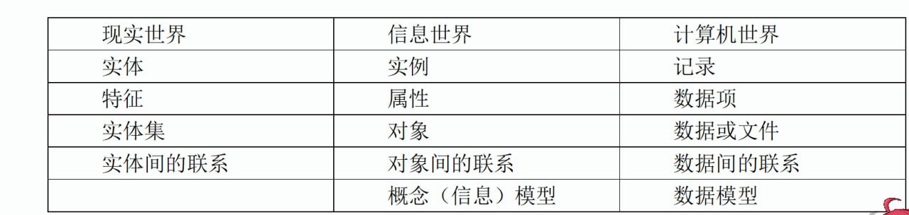
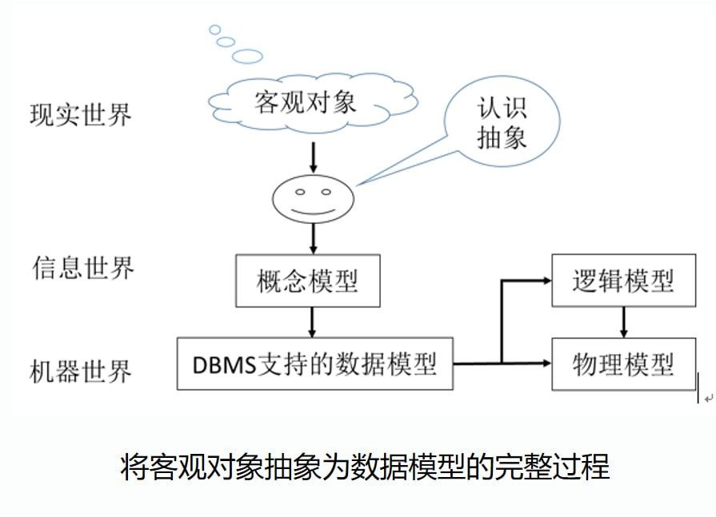

# 信息的三种世界及描述

将现实世界以计算机能理解和表现的形式反映到数据库中，通常分为分为三个阶段，称之为三种世界：

- 现实世界

- 信息世界

- 计算机世界（数据世界）

- 现实世界的事物及联系，通过需求分析转换成为信息世界的概念模型（数据库设计人员）

- 然后再把概念模型转换为计算机上某个DBMS所支持的逻辑模型（数据库设计人员和数据库设计工具DBMS）

- 最后逻辑模型再转换为最底层的物理模型，从而进行最终实现（DBMS）

