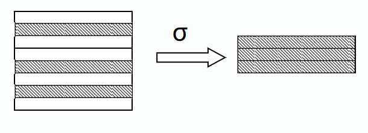
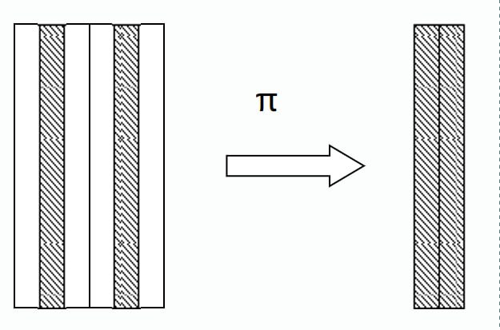
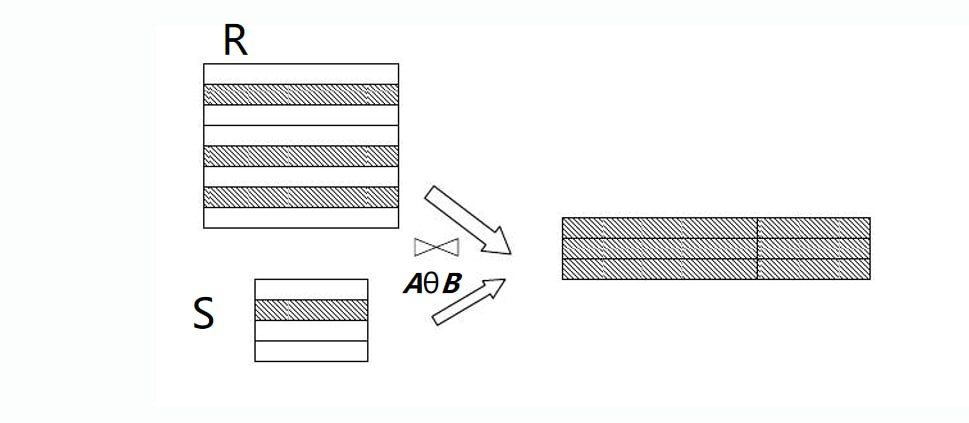
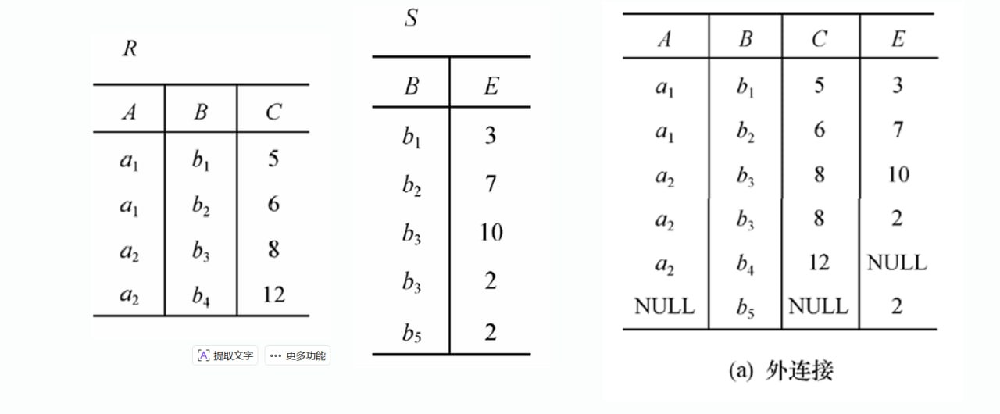
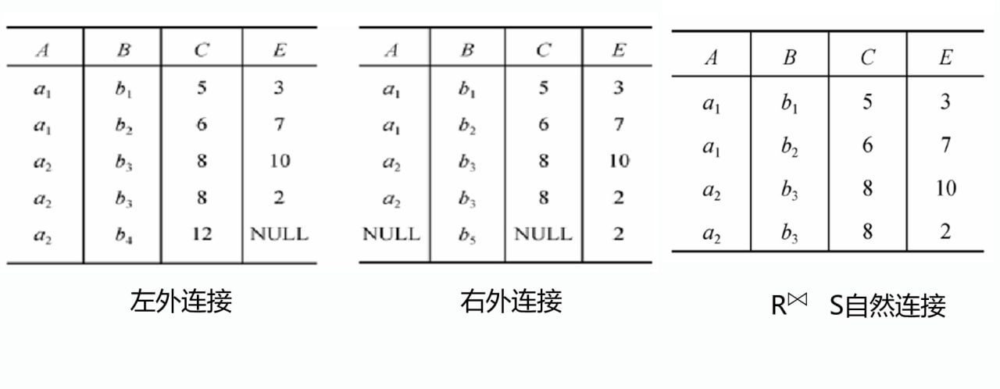
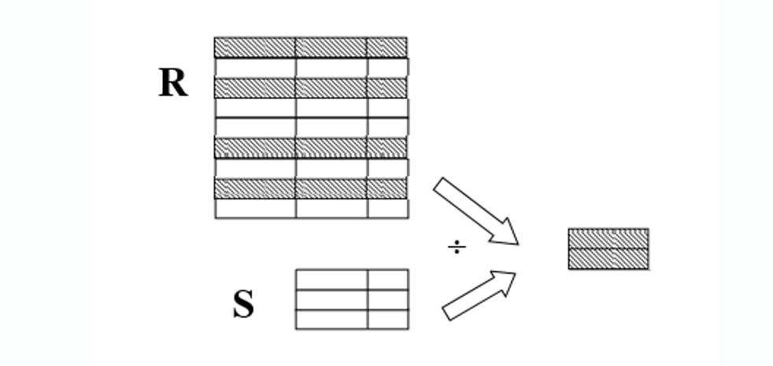
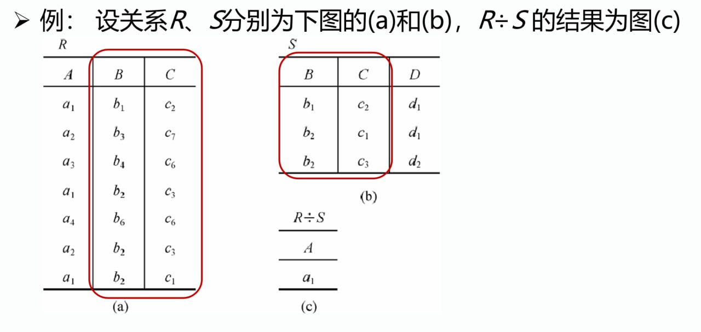
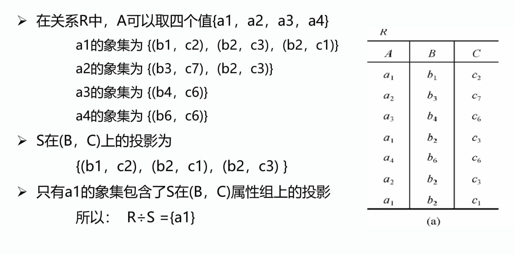
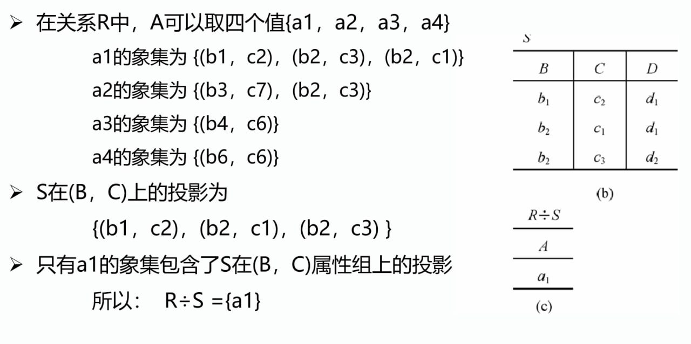

*
# 关系代数及演算

## 关系代数概述

- 运算的三要素：运算对象、运算符、运算结果

- 关系代数的**运算对象**是*关系*，**运算结果**亦为*关系*

- 关系代数中使用的运算符包括四类：**集合运算符**、**专门的关系运算符**、**比较运算符**、**逻辑运算符**

- 关系代数的运算按照运算符的不同可分为：

    - **传统的集合运算**：将关系视为元组的集合，其运算是从关系的“水平”方向，即**行**的角度进行的。

    - **专门的关系运算**：不仅涉及行，还涉及列。

### 关系代数运算符

- 集合运算符

    - 差（Difference）：$R - S$

    - 并（Union）：$R \cup S$

    - 交（Intersection）：$R \cap S$

    - 广义笛卡尔积（Extended Cartesian Product）：$R \times S$

- 专门的关系运算符

    - 选择（Select）：$\sigma_F(R)$

    - 投影（Project）：$\pi_A(R)$

    - 连接（Join）：$R \bowtie S$

    - 除（Divide）：$R \div S$

- 比较运算符

    - 等于（Equal）：$R = S$

    - 不等于（Not Equal）：$R \neq S$

    - 大于（Greater Than）：$R > S$

    - 小于（Less Than）：$R < S$

    - 大于等于（Greater Than or Equal）：$R \geqslant S$

    - 小于等于（Less Than or Equal）：$R \leqslant S$

- 逻辑运算符

    - 与（And）：$R \wedge S$

    - 或（Or）：$R \vee S$

    - 非（Not）：$\neg R$

## 传统的集合运算

> [集合 & 数学符号与逻辑命题 - 集合](../Math/DiscreteMath/集合%20&%20数学符号与逻辑命题.md#集合)

- 传统的集合运算是*二[目（目或度）](关系的数学定义.md#基本概念)运算*。

- $R$ 为 $n$ 目关系，$S$ 为 $m$ 目关系，$t_r \in R$，$t_s \in S$，$t_r \frown t_s$ 称为元组的连接，是一个 $n + m$ 列的元组，前 $n$ 个分量为 $R$ 中的一个 $n$ 元组，后 $m$ 个分量为 $S$ 中的一个 $m$ 元组。

- 设关系 $R$ 和关系 $S$ 具有相同的目 $n$ 即两个关系都具有 $n$ 个属性），且相应的属性取自同一个域，则可以定义并、差、交、广义笛卡尔积运算。

### 并

### 差

### 交

### 广义笛卡尔积

## 专门的关系运算

- 设关系模式为 $R(A_1, A_2, \cdots, A_n)$，它的关系设为 $R$，$t \in R$（$t$ 是 $R$ 中的元组），$t[A_i]$ 表示元组 $t$ 在第 $i$ 个属性上的一个分量。

- 若 $A = \{A_{i1}, A_{i2}, \cdots, A_{ik}\}$，其中 $A_{ij}$ 是 $R$ 的属性，是 $A_1, A_2, \cdots, A_n$ 中的一部分，则 $A$ 是 $R$ 的**属性列或域列**。

- **象集**（*Image Set*）：给定一个关系 $R$（$X,Z$ 为属性组）和 $x$ 上的一个值 $d$，则 $x$ 在 $R$ 中的象集 $Z_x$ 为 $R$ 中属性组 $Z$ 上值为 $d$ 的诸元组在 $U$ 上构成的集合。

### 选择

**选择**（*Select*）又称为**限制**（*Restriction*），它是在关系 $R$ 中选择满足给定条件的元组，记作：

$$
\sigma_F(R) = \{t | t \in R \wedge F(t)\}
$$

- 其中 $F$ 是选择条件，是元组上的逻辑表达式，取逻辑值“真”或“假”。

- $F$ 的表示形式为 $A_i \theta v$ 或 $A_i \theta A_j$，其中 $A_i$ 是属性，$\theta$ 是[比较运算符](#关系代数运算符)，$v$ 是常量，$A_i$ 和 $A_j$ 是属性。

!!! example
    | Sno | Sname | Ssex | Sage | Sdept |
    |:---:|:-----:|:----:|:----:|:-----:|
    | 108 | 李勇  | 男   | 20   | CS    |
    | 109 | 刘晨  | 女   | 19   | CS    |
    | 110 | 王敏  | 女   | 18   | MA    |
    | 111 | 张立  | 男   | 19   | IS    |
    | 112 | 刘辉  | 男   | 20   | IS    |
    | 113 | 王丽  | 女   | 19   | MA    |
    | 114 | 李强  | 男   | 20   | CS    |
    | 115 | 张三  | 男   | 20   | IS    |

    查询计算机科学系的学生，$\sigma_{Sdept = 'CS'}(R) = \{t | t \in R \wedge t[Sdept] = 'CS'\}$，结果为：

    | Sno | Sname | Ssex | Sage | Sdept |
    |:---:|:-----:|:----:|:----:|:-----:|
    | 108 | 李勇  | 男   | 20   | CS    |
    | 109 | 刘晨  | 女   | 19   | CS    |
    | 114 | 李强  | 男   | 20   | CS    |

### 投影

关系 $R$ 上的**投影**（*Project*）是从 $R$ 中选择若干属性列组成新的关系，记作：

$$
\pi_A(R) = \{t[A] | t \in R\}
$$

其中 $A$ 为 $R$ 中的字段名（属性列）。

- 投影操作主要是从**列的角度**进行运算

- 投影之后不仅取消了原关系中的某些列，而且可能取消某些元组（避免重复行）

!!! example
    | Sno | Sname | Ssex | Sage | Sdept |
    |:---:|:-----:|:----:|:----:|:-----:|
    | 108 | 李勇  | 男   | 20   | CS    |
    | 109 | 刘晨  | 女   | 19   | CS    |
    | 110 | 王敏  | 女   | 18   | MA    |
    | 111 | 张立  | 男   | 19   | IS    |
    | 112 | 刘辉  | 男   | 20   | IS    |
    | 113 | 王丽  | 女   | 19   | MA    |
    | 114 | 李强  | 男   | 20   | CS    |
    | 115 | 张三  | 男   | 20   | IS    |

    查询学生的学号与姓名，$\pi_{Sno, Sname}(R) = \{t[Sno, Sname] | t \in R\}$，结果为：

    | Sno | Sname |
    |:---:|:-----:|
    | 108 | 李勇  |
    | 109 | 刘晨  |
    | 110 | 王敏  |
    | 111 | 张立  |
    | 112 | 刘辉  |
    | 113 | 王丽  |
    | 114 | 李强  |
    | 115 | 张三  |

### 连接

**连接**（*Join*）也称为**θ连接**（*θ Join*），它是从两个关系的[广义笛卡尔积](#广义笛卡尔积)中选取属性间满足一定条件的元组，记作：

$$
\begin{aligned}
R \bowtie_{A \theta B} S = \{t_r \frown t_s | t_r \in R \wedge t_s \in S \wedge t_r[A] \theta t_s[B]\}
\end{aligned}
$$

其中 $A$ 和 $B$ 分别是关系 $R$ 和 $S$ 中度数相等且可比的属性列，$\theta$ 是[比较运算符](#关系代数运算符)。

#### 等值连接

等值连接是连接的一种特殊情况，其中 $\theta$ 为等于号（$=$），记作：

$$
R \bowtie_{A = B} S = \{t_r \frown t_s | t_r \in R \wedge t_s \in S \wedge t_r[A] = t_s[B]\}
$$

!!! example
    关系 $R$：

    | A | B | C |
    |:---:|:---:|:---:|
    | $a_1$   | $b_4$   | $5$   |
    | $a_1$   | $b_3$   | $7$   |
    | $a_3$   | $b_2$   | $8$   |
    | $a_2$   | $b_1$   | $10$   |

    关系 $S$：

    | B | D |
    |:---:|:---:|
    | $b_5$   | $12$   |
    | $b_4$   | $3$   |
    | $b_3$   | $20$   |
    | $b_2$   | $15$   |
    | $b_1$   | $9$   |

    - 等值连接 $R \bowtie_{C = D} S$：

        | A | R.B | C | S.B | D |
        |:---:|:---:|:---:|:---:|:---:|
        | $a_1$ | $b_4$ | $5$ | $b_4$ | $3$ |
        | $a_1$ | $b_3$ | $7$ | $b_3$ | $20$ |
        | $a_2$ | $b_2$ | $8$ | $b_2$ | $15$ |
        | $a_2$ | $b_1$ | $10$ | $b_1$ | $9$ |

#### 自然连接

自然连接是一种特殊的等值连接，它要求关系 $R$ 和 $S$ 中进行比较的分量必须是相同的属性组，且在结果中把重复的字段去掉。

若 $R$ 和 $S$ 具有相同的属性组 $B$，则自然连接可以记作：

$$
R \bowtie S = \{t_r \frown t_s | t_r \in R \wedge t_s \in S \wedge t_r[A] \theta t_s[B]\}
$$

!!! example
    关系 $R$：

    | A | B | C |
    |:---:|:---:|:---:|
    | $a_1$   | $b_4$   | $5$   |
    | $a_1$   | $b_3$   | $7$   |
    | $a_3$   | $b_2$   | $8$   |
    | $a_2$   | $b_1$   | $10$   |

    关系 $S$：

    | B | D |
    |:---:|:---:|
    | $b_5$   | $12$   |
    | $b_4$   | $3$   |
    | $b_3$   | $20$   |
    | $b_2$   | $15$   |
    | $b_1$   | $9$   |

    - 自然连接 $R \bowtie S$：

        | A | B | C | D |
        |:---:|:---:|:---:|:---:|
        | $a_1$ | $b_4$ | $5$ | $3$ |
        | $a_1$ | $b_3$ | $7$ | $20$ |
        | $a_2$ | $b_2$ | $8$ | $15$ |
        | $a_2$ | $b_1$ | $10$ | $9$ |

!!! note "悬浮元组"
    两个关系R和S在做自然连接时，关系R中某些元组有可能在S中不存在公共属性上值相等的元组，从而造成R中这些元组在操作时被舍弃了，这些被舍弃的元组成为悬浮元组。

#### 一般连接

一般连接操作是从行的角度进行运算，相比较[自然连接](#自然连接)，一般连接不要求关系 $R$ 和 $S$ 中进行比较的分量必须是相同的属性组，且在结果中不把重复的字段去掉，因此后者是同时从行和列的角度进行运算。

!!! example
    关系 $R$：

    | A | B | C |
    |:---:|:---:|:---:|
    | $a_1$   | $b_4$   | $5$   |
    | $a_1$   | $b_3$   | $7$   |
    | $a_3$   | $b_2$   | $8$   |
    | $a_2$   | $b_1$   | $10$   |

    关系 $S$：

    | B | D |
    |:---:|:---:|
    | $b_5$   | $12$   |
    | $b_4$   | $3$   |
    | $b_3$   | $20$   |
    | $b_2$   | $15$   |
    | $b_1$   | $9$   |

    - 一般连接 $R \bowtie S$ - $C > D$：

        | A | R.B | C | S.B | D | 
        |:---:|:---:|:---:|:---:|:---:|
        | $a_1$ | $b_4$ | $5$ | $b_4$ | $3$ |
        | $a_1$ | $b_3$ | $7$ | $b_4$ | $3$ |
        | $a_2$ | $b_2$ | $8$ | $b_4$ | $3$ |
        | $a_2$ | $b_1$ | $10$ | $b_4$ | $3$ |
        | $a_2$ | $b_1$ | $10$ | $b_1$ | $9$ |

#### 外连接

- **外连接**（*Outer Join*）：如果把舍弃的元组也保存在结果关系中，而在其他属性上填空值(Null)，这种连接就叫做外连接。

    

    

- **左外连接**（*Left Outer Join*）：如果只把左边关系R中要舍弃的元组保留就叫做左外连接。

- **右外连接**（*Right Outer Join*）：如果只把右边关系S中要舍弃的元组保留就叫做右外连接。

### 除运算

给定关系 $R(X, Y)$ 和 $S(Y, Z)$，其中 $X, Y, Z$ 为属性组。$R$ 中的 $Y$ 与 $S$ 中的 $Y$ 可以有不同的字段名，但必须出自相同的域集。$R$ 与 $S$ 的除运算得到一个新的关系 $P(X)$，$P$ 是 $R$ 中满足下列条件的元组在 $X$ 字段名上的投影：**元组在 $X$ 上分量值 $x$ 的象集 $Y_x$ 包含 $S$ 在 $Y$ 上投影的集合**。

$$
R \div S = \{t_r[X] | t_r \in R \wedge \pi_{Y}(S) \subseteq Y_x\}
$$

其中 $Y_x$ 是 $x$ 在 $R$ 中的[象集](#专门的关系运算)，$x = t_r[X]$。

- 除法运算常用于求解“查询...全部的/所有的...”这样具有“全称量词”的查询问题。

- 除操作同时从行和列的角度进行运算。

#### 关系除法运算的实现

1. 将被除关系的属性分为**象集属性**和**结果属性**：与除关系相同的属性属于象集属性，不相同的属性属于结果属性。

2. 在除关系中，对与被除关系相同的属性（象集属性）进行投影，得到除目标数据集。

3. 将被除关系分组，原则是**结果属性值**一样的元组分为一组。

4. 逐一考察每个组，如果它的象集属性值中包括除目标数据集，则对应的结果属性值应属于该除法运算结果集。

!!! example
    

    

    

### 课本定义 vs 真实数据库

关系代数里常说「先笛卡尔积再按条件选」（便于定义 $\theta$ 连接）。**真正执行时**，优化器几乎不会真的先做出巨大中间结果，而是尽量 **先过滤、再连接**，并用索引等加速——否则数据稍大就会内存/磁盘爆掉。
