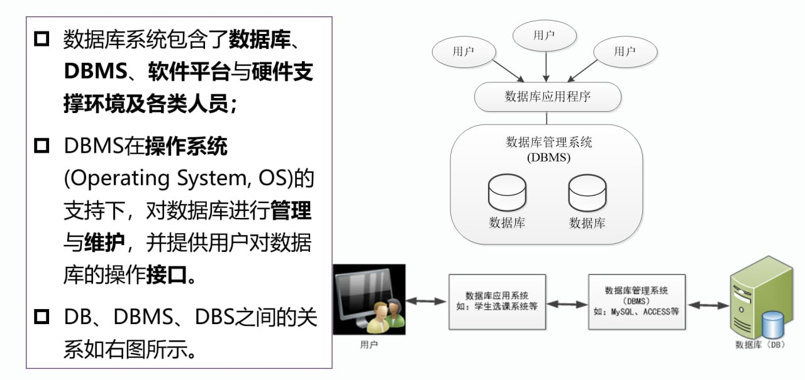

# 数据库系统的基本概念

## 数据与信息

### 基本定义

- **数据**

    - 描述事物的**符号记录**，也是数据库中存储、用户操纵的基本对象

    - 数据不仅是数值，也可以是文字、图像、声音等非数值信息

    - 数据是信息的**符号表示**

- **数据库**（*Database*）: 指以一定方式存储在一起（**有组织**的），能为多个用户**共享**，具有**尽可能小的冗余度**，且与应用程序相互独立的**数据集合**。引入数据库技术的目的是**为了高效管理及共享大量信息**。

- **信息**

    - 信息是有**一定含义的，经过加工处理的，对决策有价值的数据**

    - 信息是对现实世界中存在的客观实体、现象、联系进行描述的有**特定语义的数据**

!!! info "数据 vs 信息"
    信息与数据的关系可以归纳为：数据是信息的载体，信息是数据的内涵。即数据是信息的符号表示，而信息通过数据描述，又是数据语义的解释。

### 数据的特征

1. 数据具有“型”和“值”两个不同的概念，前者指数据的结构，后者指数据的具体取值。

2. 数据（的值）有**定性表示**和**定量表示**两种不同的表示方式。

3. 数据受**数据类型**和**取值范围**的约束。前者是针对不同应用场合设计的数据约束，数据类型不同，则其表示形式、存储方式及处理方式也不同。

4. 数据具有**载体**（纸、硬盘）和多种表示形式。

### 数据处理和数据管理

数据处理和数据管理是相互联系的，数据管理中各种操作都是数据处理业务必不可少的基本环节，数据管理技术的好坏，直接影响到数据处理的效率。

#### 数据处理

- 又称为信息处理，是指对各种形式的数据进行收集、存储、传播和加工直至产生新信息输出的全过程。

- 进行数据处理的目的有两个:

    - 一是借助计算机科学地保存和管理大量复杂的数据，以方便而充分地利用这些宝贵的信息资源。

    - 二是从大量已知的表示某些信息的原始数据出发，抽取、导出对人们有价值的、新的信息。

#### 数据管理

是数据处理的中心问题，是指数据的收集、整理、组织、存储、查询、维护和传送等各种操作，也是数据处理的基本环节，是数据处理必有的共性部分。

## 数据库

**数据库**（*DataBase*，DB）是按照**一定结构组织**并**长期存储**在计算机内的、**可共享**的**大量数据**的集合，具有**永久存储、有组织和可共享**三个基本特点。

### 数据库的特点

- 数据库中的数据是**按照一定的结构**——数据模型来进行组织的，即**数据间有一定的联系以及数据有语义解释**。数据与对数据的解释是密不可分的。

- 数据库的存储介质通常是硬盘，其他介质包括：光盘、U盘等。**可大量地、长期地存储及高效地使用**。

- 数据库中的数据能为众多用户所**共享**，能方便地为不同的**应用**服务。

- 数据库是一个**有机的数据集成体**，它由多种应用的数据集成而来，故具有**较少的冗余**、较高的**数据独立性**。

    !!! info "数据独立性"
        数据和程序间的互不依赖性

- 数据库由**用户数据库**和**系统数据库**（即数据字典，对数据库结构的描述）两大部分组成。

    !!! info "数据字典"
        数据字典是关于系统数据的数据库，通过它能有效控制和管理数据库

## 数据库管理系统

**数据库管理系统**（*Database Management System*, DBMS），是安装在操作系统之上，是一个管理、控制数据库中各种数据库对象的系统软件。是数据库系统的一个重要组成部分。

- 数据库用户无法直接通过操作系统获取数据库文件中的具体内容

- 数据库管理系统通过调用操作系统的服务，为数据库用户提供服务

- 设置DBMS的目标是让用户能够更方便、更有效、更可靠地建立数据库和使用数据库中的信息资源。

### DBMS的主要作用

数据库管理系统（DBMS）主要作用是在数据库建立、运行和维护时对数据库进行统一的管理控制和提供数据服务。从以下三个方面理解:

- 从操作系统角度。DBMS是使用者，它建立在操作系统的基础之上，需要操作系统提供底层服务，如创建进程、读写磁盘文件、CPU和内存管理等。

- 从数据库角度。DBMS是管理者，是数据库系统的核心，是为数据库的建立、使用和维护而配置的系统软件，负责对数据库进行统一的管理和控制。

- 从用户角度。DBMS是工具或桥梁，是位于操作系统与用户之间的一层数据管理软件。用户发出的或应用程序中的各种操作数据库的命令，都要通过它来执行。

产业化的DBMS称为数据库产品，常用的数据库产品有Oracle、MySQL、SQL Server、DB2等。

### DBMS的功能

- **数据定义功能**: 提供**数据定义语言**（*Data Definition Language*, DDL），用户通过它可以方便地对数据库中的数据对象进行定义，比如数据库表结构的定义。

- **数据操纵功能**: 提供**数据操纵语言**（*Data Manipulation Language*，DML），用户可以使用DML操纵以数据以实现对数据库的基本操作，如查询、插入、删除和修改等。

- **数据库的运行管理**

- **数据库的建立和维护**

## 数据库系统

- 指计算机引入数据库后的系统

- 能够有组织地、动态地存储大量的数据，提供数据处理和数据共享机制

- 一般由硬件系统、软件系统、数据库和人员组成

由于数据库的建立、使用和维护等工作只能靠一个DBMS是不够的，还需要专门的专业人员协助完成

简单理解: DBS = 计算机系统（硬件、软件平台、人）+ DBMS + DB

## DB、DBMS、DBS之间的关系与区别

- 数据库强调的是相互关联的数据

- 数据库管理系统强调的是管理数据库的系统软件

- 数据库系统强调的是基于数据库技术的计算机系统

## 信息系统
