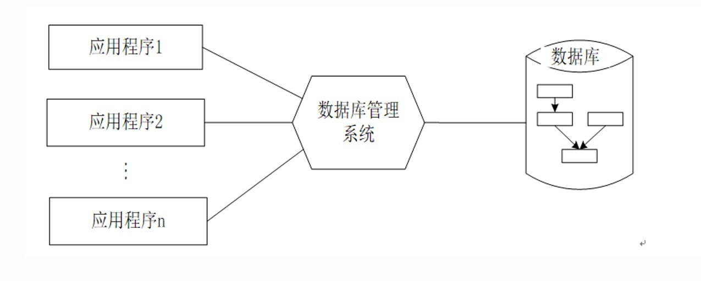

# 数据库系统的特点与组成

## 数据库系统的特点

与人工管理和文件系统相比，数据库系统的特点：

- 数据**结构化**: 不仅描述数据本身，还描述数据之间的联系

- 数据的**共享性高**，**冗余度低**且**易扩充**

- 数据**独立性高**: 物理独立性和逻辑独立性

- 数据由**DBMS统一管理和控制**

### DBMS提供的数据控制功能

- 数据的安全性（Security）保护

    保护数据，以防止不合法的使用造成的数据的泄密和破坏。

- 数据的完整性（Integrity）检查

    保证数据的正确性、有效性和相容性。

- 并发（Concurrency）控制

    对多用户的并发操作加以控制和协调，防止相互干扰而得到错误的结果

- 数据库恢复（Recovery）

    将数据库从错误状态恢复到某一已知的正确状态

### 数据库管理阶段应用程序与数据之间的关系

### 数据库的完整定义

- 数据库是**长期存储**在计算机内**有组织**的大量的**共享**的数据集合。它可以供各种用户共享，具有最小的冗余度和较高的数据独立性。

- DBMS在数据库建立、运用和维护时对数据库进行统一控制，以保证数据的完整性（数据的正确性、有效性和相容性）、安全性，并在多用户同时使用数据库时进行并发控制，在发生故障后对系统进行恢复。

- 数据库系统的出现，使信息系统从以加工数据的程序为中心转向以共享的数据库为中心的新阶段。

- 这样既便于数据的集中管理，又有利于应用程序的研制和维护，从而提高了数据的利用率和相容性，提高了决策的可靠性。

## 数据库系统的组成

数据库系统一般由**数据库**、**数据库管理系统**（及其开发工具）、**应用系统**、**数据库管理员**和**用户**构成。

### 数据库系统对硬件的要求

- 要有**足够大的内存**，存放操作系统、DBMS的核心模块、数据缓冲区和应用程序。

- 有足够大的磁盘等直接存取设备存放数据库，有足够的磁带（或微机软盘）作**数据备份**。

- 要求系统有**较高的通道能力**，以提高**数据传送率**。

### 数据库系统中的软件

- **DBMS**: DBMS是为数据库的建立、使用和维护配置的软件。

- 支持DBMS运行的**操作系统**。

- 具有与数据库接口的高级语言（如C++、Python、JAVA、PHP等）及其编译系统，便于开发应用程序。 

- 以DBMS为核心的应用开发工具: Navicat、IntelliJ IDEA (Java) + DataGrip 插件等。

- 为特定应用环境开发的数据库应用系统（**DBAS**）：淘宝、微博等。

### 数据库系统中的人员

- 数据库管理员（DataBase Administrator，DBA）

- 系统分析员和数据库设计人员

- 应用程序员

- 用户（最终用户）
