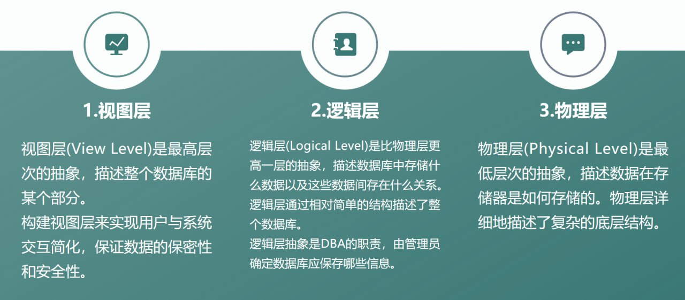
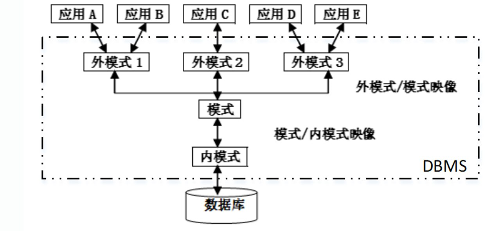
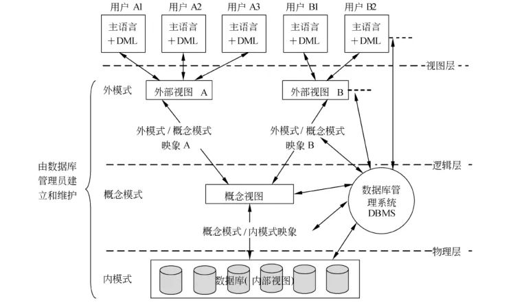
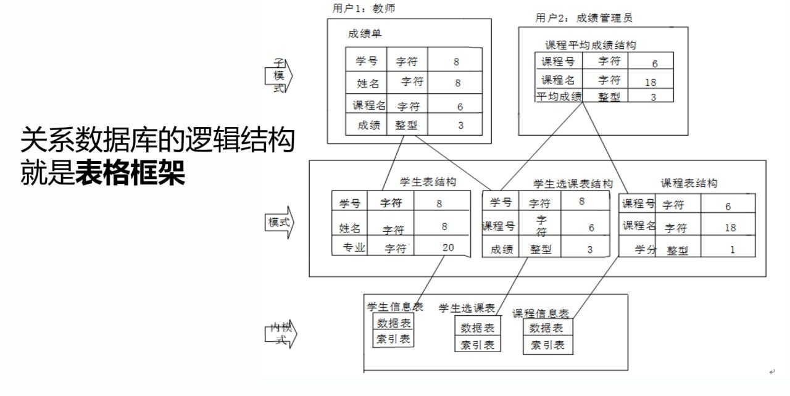
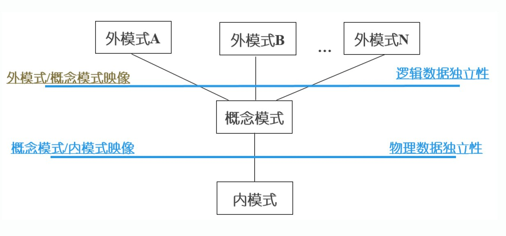

# 数据库系统结构

## 数据抽象

在数据库领域，数据抽象是指通过**不同层次**的抽象来**隐藏数据存储和管理的复杂性**，让用户能够以**更简单**、**更直观**的方式与数据交互。

数据抽象主要体现在视图层、逻辑层和物理层三个层面，从而实现对数据的分层管理和使用:

## 三级模式结构

从数据库管理系统角度来看，数据库系统内部的体系结构通常采用**三级模式结构**，即由**外模式**、**模式**和**内模式**组成。

### 模式

模式（也称概念模式或逻辑模式）是数据库中**全体数据**的**逻辑结构特征**的描述，是所有用户的**公用数据库结构**。

- 描述了现实世界中的实体及其性质与联系

- 具体定义了记录型、数据项、访问控制、保密定义、完整性（正确性和可靠性约束）以及记录型之间的各种联系

!!! tip
    - 一个数据库只有一个模式

    - 模式与具体应用程序无关，它只是装配数据的一个框架

    - 模式用语言描述和定义，需定义数据的逻辑结构、数据有关的安全性等

### 外模式

外模式（也称子模式或**用户模式**）是数据库用户所见和使用的**局部数据**的逻辑结构和特征的描述，是用户所用的数据库结构。

外模式是**模式的子集**，它主要描述**用户**视图的各记录的组成、相互联系、数据项的特征等。

- 一个数据库可以有**多个**子模式，每个用户至少使用一个子模式

- 同一个用户可使用不同的子模式，而每个子模式可为多个不同的用户所用

- 模式是对全体用户数据及其关系的综合与抽象，子模式是根据所需对模式的抽取

### 内模式

内模式（也称存储模式）是数据**物理结构**和**存储方法**的描述。它是整个数据库的最低层结构的表示。

内模式定义的是存储记录的类型、存储域的表示、存储记录的物理顺序、索引和存取路径等数据的存储组织。

- 一个数据库只有一个内模式，内模式对用户透明

- 一个数据库由多种文件组成，如用户数据文件、索引文件及系统文件等

- 内模式设计直接影响数据库的性能
 
### 数据独立性与二级映像功能

三层模式结构的一个主要目的是为了保证数据的独立性。对较低层的修改不会对较高层造成影响。

数据独立性是指**数据**与**程序**间的**互不依赖性**，一般分为**物理独立性**与**逻辑独立性**:

- 物理独立性是指数据库**物理结构**的改变不影响**逻辑结构**及**应用程序**。即数据的存储结构的改变，如存储设备的更换、存储数据的位移、存取方式的改变等都不影响数据库的逻辑结构，从而不会引起应用程序的变化，这就是数据的物理独立性。

- 逻辑独立性是指数据库**逻辑结构**的改变不影响**应用程序**。即数据库总体逻辑结构的改变，如修改数据结构定义、增加新的数据类型、改变数据间联系等，不需要相应修改应用程序，这就是数据的逻辑独立性。

为实现数据独立性，数据库系统在三级模式之间提供了两级映像: **外模式／概念模式映像**和**概念模式／内模式映像**。

**映像是一种对应规则，它指出了映像双方是如何进行转换的**。

三级模式结构和它们之间的两层映像，保证了数据库系统的数据能够具有较高的**逻辑独立性**和**物理独立性**。

有效地实现三级模式之间的转换是DBMS的职能。

!!! tip "模式与数据库概念的区别"
        - 模式是数据库结构的定义和描述，只是建立一个数据库的框架，它本身不涉及具体的数据

        - 数据库是按照模式的框架装入数据而建成的，它是模式的一个“实例”。数据库中的数据是经常变化的，而模式一般是不变或很少变化的

#### 子模式/模式映像

子模式／模式映像是指由**模式生成子模式**的规则。它定义了各个子模式和模式之间的对应关系。

!!! tip
    - 模式 / 内模式映像是唯一的（单个数据库只有一个模式和一个内模式）

#### 模式/内模式映像

模式／内模式映像是说明模式在物理设备中的**存储结构**。它定义了模式和内模式之间的对应关系。

!!! tip
    - 子模式 / 模式映像可以有多个（一个数据库可以有多个子模式）

#### 三级模式结构与两层映像的优点

- 保证数据的独立性。

- 方便用户使用，简化用户接口。

- 保证数据库安全性的一个有力措施。

- 有利于数据的共享性。

- 有利于从宏观上通俗地理解数据库系统的内部结构。

## 结构数据库系统体系结构

数据库系统常见的运行与应用结构有:

- 客户/服务器结构

- 浏览器/服务器结构

### 客户/服务器结构 （C/S）结构

- 软件系统体系结构

- **“功能分布”**原则

### 浏览器/服务器结构  (B/S)结构

Web兴起后的一种网络结构模式

最大的优点就是可以在任何地方进行操作而不用安装任何专门的软件
