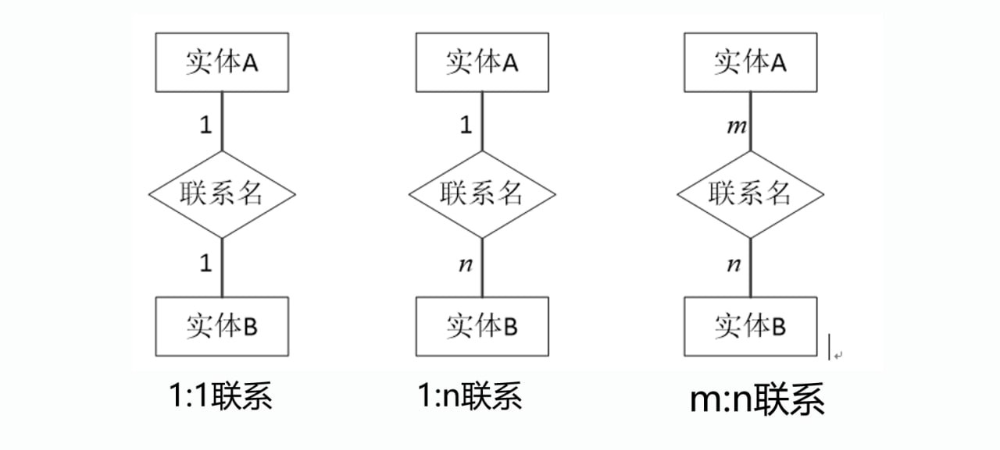

# 概念模型

## 概念模型的作用

概念模型用于信息世界的建模，是现实世界到信息世界的第一层抽象。

- 是数据库设计人员进行数据库设计的有力工具

- 是数据库设计人员和用户之间进行交流的语言:

    - 概念模型一方面应该具有较强的语义表达能力，能够方便、直接地表达应用中的各种语义知识

    - 另一方面它还应该简单、清晰、易于用户理解

## 基本概念

### 实体

**实体**（*Entity*）是现实世界中可以相互区别的客观存在的事物。

实体可以是具体的人、物或事件，也可以是抽象的概念或联系。

- **实体型**（*Entity Type*）: 用实体名及其属性名集合来抽象和刻画同类实体称为实体型。比如：学生（学号、年龄）。

- **实体集**（*Entity Set*）: 某个实体型下的所有具体实体组成的集合。比如：全班50个学生（包括张三、李四、王五等）的整体，就是“学生”实体集。

### 属性

**属性**（*Attribute*）是实体的某一特征或性质。

一个实体可由若干属性刻画。

### 码

**码**（*Key*）是实体的唯一标识。例如学生信息表中的学号。

### 域

**域**（*Domain*）是属性的取值范围。例如，性别的域为`{男, 女}`。

### 联系

主要指**实体内部的联系**和**实体间的联系**。

- 实体内部的联系通常是指组成实体的各属性之间的联系。

- 实体之间的联系通常是指实体型之间的联系，比如：1对1、1对多、多对多。

## E-R模型

E-R模型（Entity-Relationship Model）是概念模型的表示方法。

E-R模型由**实体**、**属性**和**联系**三个要素组成。

### E-R模型三要素

#### 实体

实体是现实世界中可以相互区别的客观存在的事物。

- 实体可以是具体的人、物或事件，也可以是抽象的概念或联系。

- 在E-R模型中，实体用矩形表示，矩形框内写实体名。

- E-R图中的实体用于表示现实世界具有相同属性描述的事物的集合，它不是某一个具体事物，而是某一种类别所有事物的统称。

- 每个实体由实体名唯一标记。

- 每个实体对应于数据库中的一张数据库表，每个实体的具体取值对应于数据库表中的一条记录。

#### 属性

用于表示实体的某种特征或者表示实体间关系的特征

- 用一个实体通常包含多个属性，每个属性由属性名唯一标记，画在椭圆内 。

- E-R图中实体的属性对应于数据库表的字段。

- 在E-R图中，属性是一个**不可再分**的最小单元。

- 如果属性能够再分，则可以考虑将该属性进行细分，或者可以考虑将该属性“升格”为另一个实体。

#### 联系

数据之间的关联集合，是客观存在的应用语义链。

- **实体内部的联系**通常是指组成实体的各属性之间的联系。

- **实体之间的联系**通常是指不同实体集之间的联系。

- 在E-R图中联系用菱形表示，框内写上联系名，并用连线将联系框与它所关联的实体连接起来。

- 基数: 表示一个实体到另一个实体之间关联的数目。

- 从基数的角度将关系分为: 一对一(1:1)、一对多（1:n）、多对多(m:n)关系。

    

### E-R模型设计原则与设计步骤

#### 设计原则

- **避免数据冗余**: 属性应该存在于且只存在于某一个地方(实体或者关联)。

- **避免“表中套表”**: 实体是一个单独的个体,不能存在于另一个实体中成为其属性。

- 同一个实体在同一个E-R图内仅出现一次。

#### 设计步骤

1. 划分和确定**实体**

2. 划分和确定**联系**

3. 确定**属性**

    作为属性的“事物”与实体间的联系，必须是“一对多”的联系，作为属性的“事物”不能再有需要描述的性质或与其他事物具有联系。

4. 画出E-R模型。重复过程1~3，以找出所有实体集、关系集、属性和属值集，然后绘制E-R图。设计E-R分图，即用户视图的设计，在此基础上综合各E-R分图，形成E-R总图。

5. 优化E-R模型。利用数据流程图，对E-R总图进行优化，消除数据实体间冗余的联系及属性，形成基本的E-R模型。
