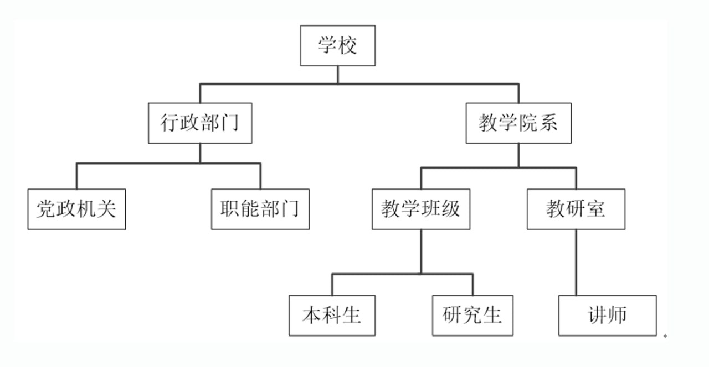
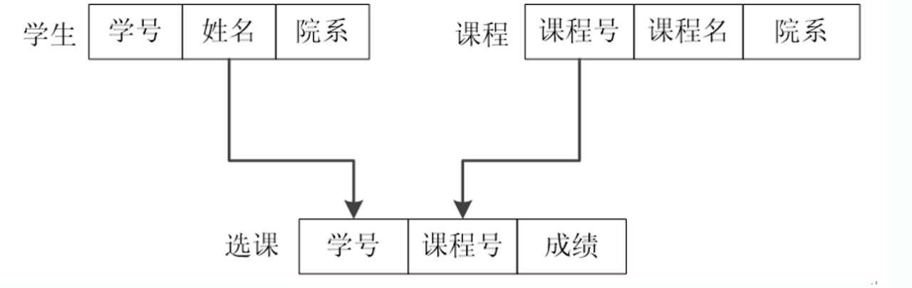
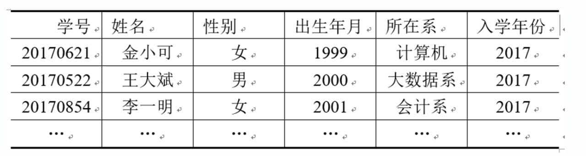

# 逻辑模型

数据模型是按其数据结构而命名的，根本区别在于数据之间联系的表示方式不同，即数据记录之间的联系方式不同。

常见的逻辑模型有**层次模型**（基于树结构）、**网状模型**（基于有向图结构）、**关系模型**（基于二维表格结构）。

## 层次模型

层次数据模型是数据库系统中最早出现的数据模型，它用树形结构表示各类实体以及实体间的联系。

层次模型对父子实体集间具有一对多的层次关系的描述非常自然、直观、容易理解。

- 在层次模型中具有一定的存取路径，需按路径查看给定记录的值

- 层次模型比较适合于表示数据记录类型之间的一对多联系，而对于多对多的联系难以直接表示，需进行转换，将其分解成若干个一对多联系

- 优缺点

    - 数据结构较简单；查询效率高

    - 提供良好的完整性支持

    - 不易表示多对多的联系

    - 数据操作限制多、独立性较差

## 网状模型

网状模型是一个图结构，它是由字段（属性）、记录类型（实体型）和系(set)等对象组成的网状结构的模型，是一个不加任何条件的有向图。

网状模型是用图结构来表示各类实体集以及实体集间的系。

网状模型与层次模型的根本区别在于其允许一个子结点有多个父结点；在两个结点之间可以有多种联系

同样，网状模型对于多对多的联系难以直接表示，需进行转换，将其分解成若干个一对多联系

- 优缺点

    - 较为直接地描述现实世界

    - 存取效率较高

    - 结构较复杂、不易使用

    - 数据独立性较差

## 关系模型

关系就是一张二维表，它由行和列组成。关系模型将数据模型组织成表格的形式，这种表格在数学上称为关系。表中存放数据。在关系模型中实体以及实体之间的联系都用关系也就是二维表来表示。是最重要也是应用最广泛的一种基本模型。

- 有坚实的理论基础

- 结构简单、易用

- 数据独立性及安全性

- 查询效率较低

## 面向对象模型

面向对象模型采用面向对象的观点来描述现实世界中的事物（对象）的逻辑结构和对象间的联系等的数据模型。

!!! info "对象"
    是对现实世界中的事物的高度抽象，每个对象是状态和行为的封装。

    - 对象的状态是属性的集合

    - 行为是在该对象上操作方法的集合

面向对象模型不仅可以处理各种复杂多样的数据结构，而且具有数据和行为相结合的特点

- 优点

    - 适合处理各种各样的数据类型

    - 面向对象程序设计与数据库技术相结合

    - 提高开发效率

    - 改善数据访问

- 缺点

    - 没有准确的定义

    - 维护困难

    - 不适合所有的应用
