# 二元关系

!!! abstract
    - [有序对](#有序对)与[笛卡尔积](#笛卡尔积) 

    - [二元关系](#二元关系的定义和表示)（包括空关系，恒等关系，全域关系等）及其表示（[关系矩阵](#关系矩阵)，[关系图](#关系图)）

    - 关系的五种[性质](#关系的性质)（自反性，反自反性，对称性，反对称性，传递性）

    - 二元关系的[幂运算](#关系的幂运算)

    - 关系的三种[闭包](#关系的闭包)（自反闭包，对称闭包，传递闭包） 

    - [等价关系](#等价关系)和[划分](#划分)（包括[等价类](#等价类)，[商集](#商集)，[划分块](#划分)等） 

    - [偏序关系](#偏序关系)（包括[哈斯图](#哈斯图)，[最大元，最小元，极大元，极小元](#偏序集的特殊元素)，[上界，下界，最小上界，最大下界](#上下界)等）

    掌握：有序对及卡氏积的概念及卡氏积的性质 

    掌握：二元关系，A到B的二元关系，A上的二元关系，关系的定义域和值域，关系的逆，关系的合成，关系在集合上的限制，集合在关系下的象等概念，掌握关系的定义域、值域、逆、合成、限制、象等的主要性质  

    掌握：关系矩阵与关系图的概念及求法 

    掌握：集合A上的二元关系的主要性质（自反性，反自反性，对称性，反对称性，传递性）的定义及判别法，对某些关系证明它们有或没有中的性质

    掌握：A上二元关系的n次幂的定义及主要性质 

    掌握A上二元关系的自反闭包、对称闭包、传递闭包的定义及求法 

    掌握：等价关系、等价类、商集、划分、等概念，以及等价关系与划分之间的对应 

    掌握：偏序关系、偏序集、哈斯图、最大元、最小元、极大元、极小元、上界、下界、上确界、下确界等概念

二元关系是离散数学中的一个重要概念，它描述了两个集合之间的元素之间的关系。

二元关系是函数与图论的基础理论。

## 有序对与笛卡尔积

### 有序对

由两个元素 $x$ 和 $y$（允许 $x=y$）按一定顺序排列成的二元组叫做一个**有序对**（*ordered pair*）或**序偶**，记作 $\langle x,y \rangle$，其中 $x$ 是它的第一元素，$y$ 是它的第二元素。

#### 有序对的基本性质

- $x \neq y$时，$\langle x, y \rangle \neq \langle y, x \rangle$ 

    !!! tip
        - 有序对中的元素是有序的

        - [集合](集合.md)中的元素是无序的

- $<x, y> = <u,v> \iff (x = u) \land (y = v)$

### 笛卡尔积

设 $A$，$B$ 为集合,用 $A$ 中元素为第一元素，$B$ 中元素为第二元素构成有序对。所有这样的有序对组成的集合叫做 $A$ 和 $B$ 的[笛卡儿积](../集合%20&%20数学符号与逻辑命题.md#笛卡尔积)（*Cartesian product*），记作 $A \times B$。

笛卡儿积的符号化表示为：

$$
A \times B = \{\langle x,y \rangle \mid x \in A \land y \in B\}
$$

#### 笛卡尔积的运算性质

1. 对任意集合A，根据定义有

    $$
	  A \times \varnothing = \varnothing, \varnothing \times A = \varnothing
    $$

2. 一般的说，笛卡儿积运算**不满足交换律**，即

    $$
	  A \times B \neq B \times A \quad (当 A \neq \varnothing \land B \neq \varnothing \land A \neq B 时)
    $$

3. 笛卡儿积运算**不满足结合律**，即

    $$
	  (A \times B) \times C \neq A \times (B \times C) \quad (当 A \neq \varnothing \land B \neq \varnothing \land C \neq \varnothing 时)
    $$

4. 笛卡儿积运算对并和交运算**满足分配律**，即

    $$
	  A \times (B \cup C) = (A \times B) \cup (A \times C)
    $$

    $$
	  (B \cup C) \times A = (B \times A) \cup (C \times A)
    $$

    $$
	  A \times (B \cap C) = (A \times B) \cap (A \times C)
    $$

    $$
	  (B \cap C) \times A = (B \times A) \cap (C \times A)
    $$

5. $A \subseteq C \land B \subseteq D \Rightarrow A \times B \subseteq C \times D$

#### n阶笛卡尔积

设 $A_1, A_2, ..., A_n$ 为 $n$ 个集合（$n \geq 2$），则 $A_1 \times A_2 \times ... \times A_n$ 叫做 $A_1, A_2, ..., A_n$ 的 $n$ 阶笛卡尔积，记作 $A_1 \times A_2 \times ... \times A_n$。其中：

$$
A_1 \times A_2 \times ... \times A_n = \{\langle x_1, x_2, ..., x_n \rangle \mid x_1 \in A_1, x_2 \in A_2, ..., x_n \in A_n\}
$$

当 $A_1 = A_2 = ... = A_n = A$ 时，它们的 $n$ 阶笛卡尔积可简记作 $A^n$。

!!! example
    设 $A = \{a, b\}$，则

    $$
    A^3 = A \times A \times A = \{\langle a, a, a \rangle, \langle a, a, b \rangle, \langle a, b, a \rangle, \langle a, b, b \rangle, \langle b, a, a \rangle, \langle b, a, b \rangle, \langle b, b, a \rangle, \langle b, b, b \rangle\}
    $$

## 二元关系的定义和表示

如果一个集合满足以下条件**之一**：

1. 集合非空，且它的元素都是有序对

2. 集合是空集

则称该集合为一个**二元关系**，记作 $R$。二元关系也可简称为**关系**。

对于二元关系 $R$，如果 $\langle x,y \rangle \in R$，可记作 $xRy$；如果 $\langle x,y \rangle \notin R$，则记作 $x\not{R}y$。

!!! example
    设 $R_1 = \{\langle 1,2 \rangle, \langle a,b \rangle\}$，$R_2 = \{\langle 1,2 \rangle, a,b\}$。

    则 $R_1$ 是二元关系，$R_2$ 不是二元关系，只是一个集合，除非将 $a$ 和 $b$ 定义为有序对。

    根据上面的记法可以写 $1R_12$，$aR_1b$，$a\not{R_1}c$ 等。

### 集合到集合的二元关系

设 $A$，$B$ 为集合，$A \times B$ 的任何子集所定义的二元关系叫做从 $A$ 到 $B$ 的二元关系；特别当 $A = B$ 时，则叫做 $A$ 上的二元关系。

!!! example
    $A = \{0,1\}$，$B = \{1,2,3\}$，那么 

    $$
	  R_1 = \{\langle 0,2 \rangle\}, R_2 = A \times B, R_3 = \varnothing, R_4 = \{\langle 0,1 \rangle\}
    $$

    等都是从 $A$ 到 $B$ 的二元关系，而 $R_3$ 和 $R_4$ 同时也是 $A$ 上的二元关系。

!!! note
    **集合 $A$ 上的二元关系的数目依赖于 $A$ 中的元素数**。

    如果 $|A| = n$，那么 $|A \times A| = n^2$， $A \times A$ 的子集就有 $2^{n^2}$ 个。

    每一个子集代表一个 $A$ 上的二元关系，所以 $A$ 上有 $2^{n^2}$ 个不同的二元关系。

    例如 $|A| = 3$，则 $A$ 上有 $2^{3^2} = 2^9 = 512$ 个不同的二元关系。

### 常用的关系

对任意集合A，定义：

- 全域关系：$E_A = \{\langle x,y \rangle \mid x \in A \land y \in A\} = A \times A$ 

- 恒等关系：$I_A = \{\langle x,x \rangle \mid x \in A\}$

- 空关系：$\varnothing$

- 小于或等于关系：$L_A = \{\langle x,y \rangle \mid x,y \in A \land x \leq y\}，其中 A \subseteq R$。

- 整除关系：$D_B = \{\langle x,y \rangle \mid x,y \in B \land x | y\}，其中 B \subseteq Z^*$，$Z^*$ 是非零整数集

- 包含关系：$R \subseteq = \{\langle x,y \rangle \mid x,y \in A \land x \subseteq y\}$，其中 A 是集合族。

!!! example
    1. 设 $A = \{1,2\}$，则

        $$
        E_A = \{\langle 1,1 \rangle, \langle 1,2 \rangle, \langle 2,1 \rangle, \langle 2,2 \rangle\}
        $$

        $$
        I_A = \{\langle 1,1 \rangle, \langle 2,2 \rangle\}
        $$

    2. 设 $A = \{1,2,3\}$，$B = \{a,b\}$，则 

        $$
        L_A = \{\langle 1,1 \rangle, \langle 1,2 \rangle, \langle 1,3 \rangle, \langle 2,2 \rangle, \langle 2,3 \rangle, \langle 3,3 \rangle\}
        $$

        $$
        D_B = \{\langle 1,1 \rangle, \langle 1,2 \rangle, \langle 1,3 \rangle, \langle 2,2 \rangle, \langle 3,3 \rangle\}
        $$

    3. 令 $A = P(B) = \{\varnothing, \{a\}, \{b\}, \{a,b\}\}$，则 $A$ 上的包含关系是 

        $$
        R \subseteq = \{\langle \varnothing, \varnothing \rangle, \langle \varnothing, \{a\} \rangle, \langle \varnothing, \{b\} \rangle, \langle \varnothing, \{a,b\} \rangle, \langle \{a\}, \{a\} \rangle, \langle \{a\}, \{a,b\} \rangle, \langle \{b\}, \{b\} \rangle, \langle \{b\}, \{a,b\} \rangle, \langle \{a,b\}, \{a,b\} \rangle\}
        $$

### 关系的表示方法

关系一般有三种表示方法：

- 集合表达式

- 关系矩阵

- 关系图

关系矩阵和关系图可以表示有穷集合上的关系。

!!! example "关系矩阵和关系图的实例"
    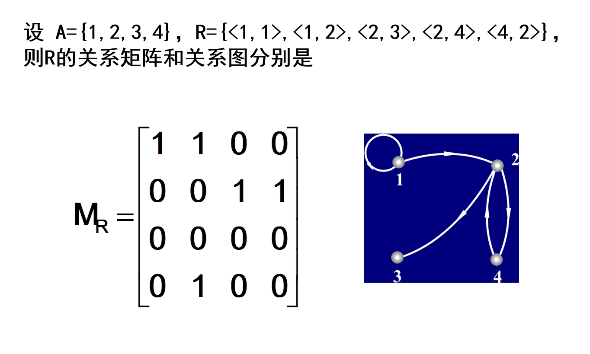

    其实对[数据结构的相关内容（邻接矩阵）](../../../DataStructure/408/图的存储及基本操作.md#邻接矩阵)有了解的话，会发现这二者的思想其实是高度重合的，包括下面的[关系图](#关系图)也是如此。

#### 关系矩阵

设 $A = \{x_1, x_2, \cdots, x_n\}$，$R$ 是 $A$ 上的二元关系，令

$$
r_{ij} = \begin{cases}
  1 & \text{if } x_i R x_j \\
  0 & \text{if } x_i \not{R} x_j
\end{cases}
$$

则 $R$ 的关系矩阵为：

$$
M_R = \begin{bmatrix}
  r_{11} & r_{12} & \cdots & r_{1n} \\
  r_{21} & r_{22} & \cdots & r_{2n} \\
  \vdots & \vdots & \ddots & \vdots \\
  r_{n1} & r_{n2} & \cdots & r_{nn}
\end{bmatrix}
$$

#### 关系图

设 $A = \{x_1, x_2, \cdots, x_n\}$，$R$ 是 $A$ 上的关系。令[图](../../../DataStructure/408/图的基本概念.md) $G = \langle V,E \rangle$，其中顶点集合 $V = A$，边集为 $E$。对于 $\forall x_i, x_j \in V$，满足 

$$
\langle x_i,x_j \rangle \in E \iff x_i R x_j
$$

称图G为R的关系图，记作 $G_R$。

## 关系的运算

### 关系的定义域、值域和域

设 $R$ 是二元关系，则：

1. $R$ 中所有有序对的第一元素构成的集合称为 $R$ 的定义域(domain)，记为 $dom R$。形式化表示为：		

    $$
    dom R ＝ \{x \mid \exists y (\langle x,y \rangle \in R)\}
    $$

2. $R$ 中所有有序对的第二元素构成的集合称为 $R$ 的值域(range) ，记作 $ran R$。形式化表示为：	

    $$
    ran R＝\{y \mid \exists x (\langle x,y \rangle \in R)\}
    $$

3. $R$ 的定义域和值域的并集称为 $R$ 的域(field)，记作 $fld R$。形式化表示为：	

    $$
    fld R＝dom R \cup ran R
    $$

!!! example
    求 $R = \{\langle 1,2 \rangle, \langle 1,3 \rangle, \langle 2,4 \rangle, \langle 4,3 \rangle\}$ 的定义域、值域和域。

    $$
    dom R = \{1,2,4\}
    $$

    $$
    ran R = \{2,3,4\}
    $$

    $$
    fld R = \{1,2,3,4\}
    $$

!!! example "图解法表示二元关系"
    首先用两个封闭的曲线表示 $R$ 的定义域（或集合 $A$）和值域（或集合 $B$），如果 [$xRy$](#二元关系的定义和表示)，则从 $x$ 出发，沿着有向边（箭头）到达 $y$。

    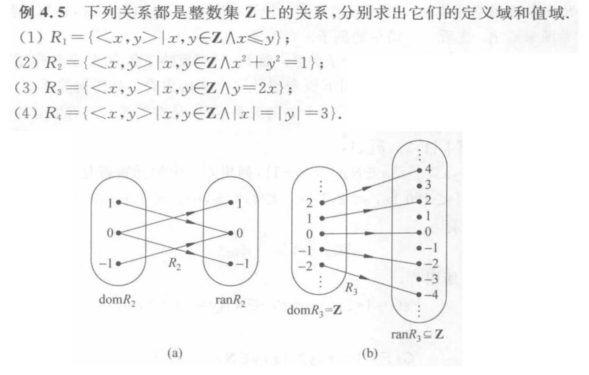

### 关系的逆、合成、限制和像

1. 设 $F$ 为二元关系，$F$ 的逆关系，简称 $F$ 的逆(inverse)，记作 $F^{-1}$，其中

    $$
    F^{-1} = \{\langle x,y \rangle \mid yFx\}
    $$

2. 设 $F$，$G$ 为二元关系，$F$ 与 $G$ 的合成(composite)记作 $F \circ G$ (左复合)，其中

    $$
    F \circ G = \{\langle x,y \rangle \mid \exists z (xGz \land zFy)\}
    $$

3. $F$ 在 $A$ 上的限制(restriction)记作 $F\upharpoonright A$，其中

    $$
    F\upharpoonright A = \{\langle x,y \rangle \mid xFy \land x \in A\}
    $$

4. $A$ 在 $F$ 下的像(image)记作 $F\lbrack A\rbrack$，其中

    $$
    F\lbrack A\rbrack = ran(F\upharpoonright A)
    $$

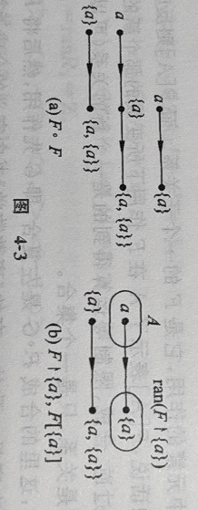

!!! example
    1. 设 $F = \{\langle 3,3 \rangle, \langle 6,2 \rangle\}$，$G = \{\langle 2,3 \rangle\}$，则

        $$
		F^{-1} = \{\langle 3,3 \rangle, \langle 2,6 \rangle\}
        $$

        $$
		F \circ G = \{\langle 2,3 \rangle\}
        $$

        $$
        G \circ F = \{\langle 6,3 \rangle\}
        $$

    2. 设 $R = \{\langle 1,2 \rangle, \langle 1,3 \rangle, \langle 2,2 \rangle, \langle 2,4 \rangle, \langle 3,2 \rangle\}$，则

        $$
        R\upharpoonright \{1\} = \{\langle 1,2 \rangle, \langle 1,3 \rangle\}, \quad R\upharpoonright \varnothing = \varnothing, \quad R\upharpoonright \{2,3\} = \{\langle 2,2 \rangle, \langle 2,4 \rangle, \langle 3,2 \rangle\}
        $$

        $$
        R\lbrack \{1\}\rbrack = \{2,3\}, \quad R\lbrack \varnothing \rbrack = \varnothing, \quad R\lbrack \{3\}\rbrack = \{2\}
        $$

!!! note
    - $R$ 在 $A$ 上的限制 $R\upharpoonright A$ 是 $R$ 的子关系。

    - $A$ 在 $R$ 下的像 $R\lbrack A\rbrack$ 是 $ran R$ 的子集。

### 关系与集合

关系是集合，集合运算对于关系也是适用的。 

规定：

- 关系运算中逆运算优先于其它运算

- 所有的关系运算都优先于集合运算

- 优先权的运算以括号决定运算顺序

### 关系运算的部分定理

1. 设 $F$，$G$，$H$ 是任意的关系，则有

    $$
    (F^{-1})^{-1} = F
    $$

    $$
    dom F^{-1} = ran F, \quad ran F^{-1} = dom F
    $$

    $$
    (F \circ G) \circ H = F \circ (G \circ H)
    $$

    $$
    (F \circ G)^{-1} = G^{-1} \circ F^{-1}
    $$

2. 设 $F$，$G$，$H$ 是任意的关系，则有

    $$
    (F \circ G)^{-1} = G^{-1} \circ F^{-1}
    $$

    $$
    F \circ (G \cup H) = F \circ G \cup F \circ H
    $$

    $$
    (G \cup H) \circ F = G \circ F \cup H \circ F
    $$

    $$
    F \circ (G \cap H) \subseteq F \circ G \cap F \circ H
    $$

    - 推论：
        
        基于数学归纳法不难证明定理2的结论对于有限多个关系的并和交也是成立的，即有

        $$
        R \circ (R_1 \cup R_2 \cup \cdots \cup R_n) = R \circ R_1 \cup R \circ R_2 \cup \cdots \cup R \circ R_n
        $$

        $$
        (R_1 \cup R_2 \cup \cdots \cup R_n) \circ R = R_1 \circ R \cup R_2 \circ R \cup \cdots \cup R_n \circ R
        $$

        $$
        R \circ (R_1 \cap R_2 \cap \cdots \cap R_n) \subseteq R \circ R_1 \cap R \circ R_2 \cap \cdots \cap R \circ R_n
        $$

        $$
        (R_1 \cap R_2 \cap \cdots \cap R_n) \circ R \subseteq R_1 \circ R \cap R_2 \circ R \cap \cdots \cap R_n \circ R
        $$

### 关系的幂运算

设 $R$ 为 $A$ 上的关系，$n$ 为自然数，则 $R$ 的 $n$ 次幂定义为：

$$
R^0 = \{\langle x,x \rangle \mid x \in A\} = I_A
$$

$$
R^0 = \{\langle x,x \rangle \mid x \in A\} = I_A
$$

$$
R^{n+1} = R^n \circ R
$$

!!! note
    对于 $A$ 上的任何关系 $R_1$ 和 $R_2$ 都有

    $$
    R_1^0 = R_2^0 = I_A
    $$

    即：$A$ 上任何关系的0次幂都相等，都等于 $A$ 上的恒等关系 $I_A$。

    对于 $A$ 上的任何关系 $R$ 都有

    $$
    R_1 = R = R_0 \circ R = I_A \circ R = R
    $$

!!! example
    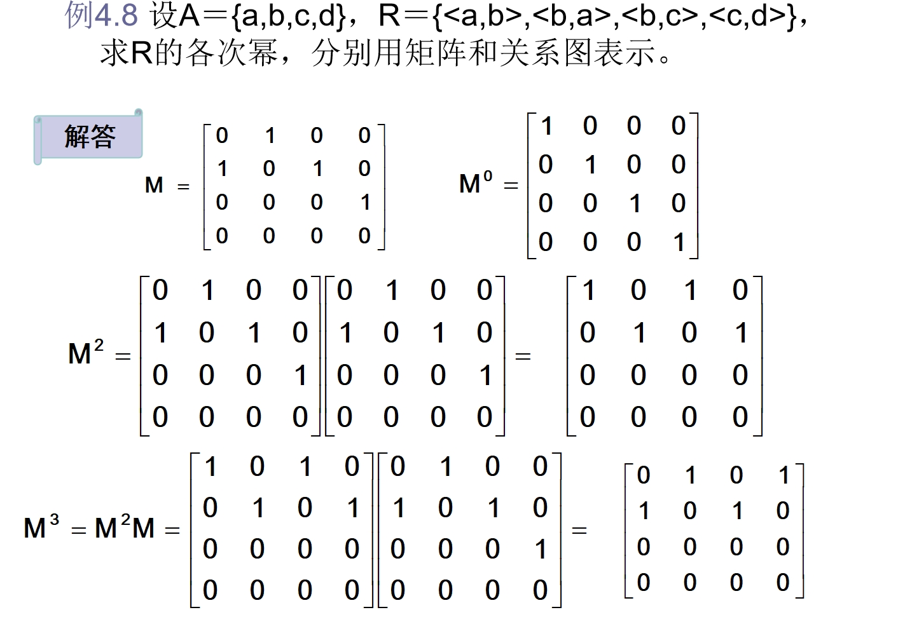

    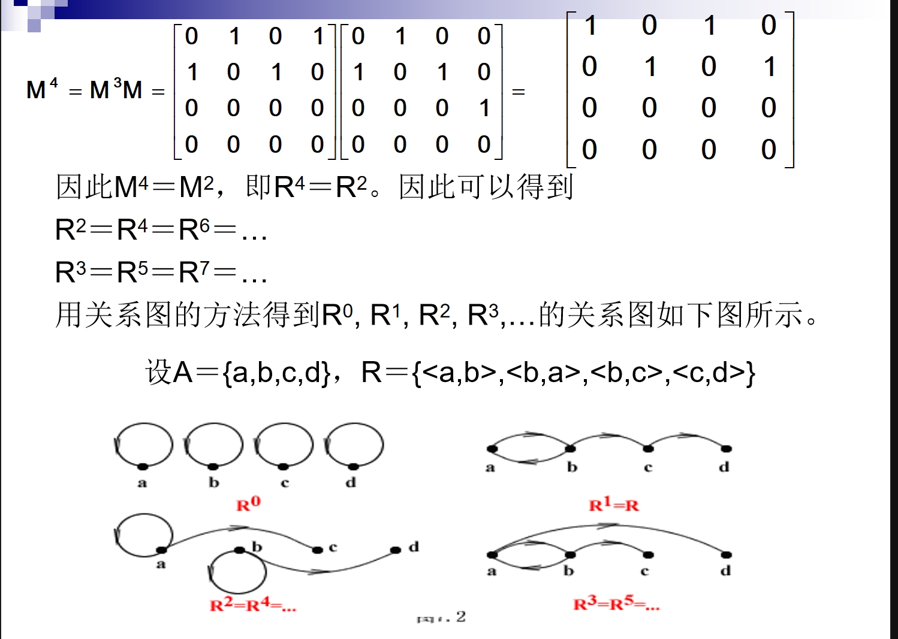

#### 幂运算的性质

- 设 $A$ 为 $n$ 元集，$R$ 是 $A$ 上的关系，则存在自然数 $s$ 和 $t$，使得 $R^s = R^t$。

    !!! note
        该定理说明有穷集上只有有穷多个不同的二元关系。当 $t$ 足够大时，$R^t$ 必与某个 $R^s$($s<t$) 相等（如上面例子中的 $R^4 = R^2$）。

- 设 $R$ 是 $A$ 上的关系，$m,n \in \mathbb{N}$，则

    1. $R^m \circ R^n = R^{m+n}$

    2. $(R^m)^n = R^{mn}$

## 关系的性质

### 关系的自反性和反自反性

设 $R$ 为 $A$ 上的关系，

- 若 $\forall x (x \in A \rightarrow \langle x,x \rangle \in R)$，则称 $R$ 在 $A$ 上是**自反**（*reflexivity*）的。

- 若 $\forall x (x \in A \rightarrow \langle x,x \rangle \notin R)$，则称 $R$ 在 $A$ 上是**反自反**（*irreflexivity*）的。

!!! info
    全域关系 $E_A$，恒等关系 $I_A$，小于等于关系 $L_A$，整除关系 $D_A$ 都是为 $A$ 上的自反关系。

    包含关系 $R$ 是给定集合族 $A$ 上的自反关系。

    小于关系和真包含关系都是给定集合或集合族上的反自反关系。

!!! example
    设 $A = \{1,2,3\}$，$R_1$，$R_2$，$R_3$ 是 $A$ 上的关系，其中 $R_1 = \{\langle 1,1 \rangle, \langle 2,2 \rangle\}$, $R_2 = \{\langle 1,1 \rangle, \langle 2,2 \rangle, \langle 3,3 \rangle, \langle 1,2 \rangle\}$, $R_3 = \{\langle 1,3 \rangle\}$，说明 $R_1$，$R_2$ 和 $R_3$ 是否为 $A$ 上的自反关系和反自反关系。

    - $R_1$ 既不是自反的也不是反自反的，

    - $R_2$ 是自反的，

    - $R_3$ 是反自反的。

### 关系的对称性和反对称性

设 $R$ 为 $A$ 上的关系，

- 若 $\forall x \forall y (x,y \in A \land \langle x,y \rangle \in R \rightarrow \langle y,x \rangle \in R)$，则称 $R$ 为 $A$ 上**对称**（*symmetry*）的关系。

- 若 $\forall x \forall y (x,y \in A \land \langle x,y \rangle \in R \land \langle y,x \rangle \in R \rightarrow x = y)$，则称 $R$ 为 $A$ 上的**反对称**（*antisymmetry*）关系。 

!!! info
    $A$ 上的全域关系 $E_A$，恒等关系 $I_A$ 和空关系都是 $A$ 上的对称关系。

    恒等关系 $I_A$ 和空关系也是 $A$ 上的反对称关系。

    但全域关系 $E_A$ 一般不是 $A$ 上的反对称关系，除非 $A$ 为单元集或空集。

!!! example
    设 $A = \{1,2,3\}$，$R_1$，$R_2$，$R_3$ 和 $R_4$ 都是 $A$ 上的关系，其中 $R_1＝\{\langle 1,1 \rangle, \langle 2,2 \rangle\}$, $R_2＝\{\langle 1,1 \rangle, \langle 1,2 \rangle, \langle 2,1 \rangle\}$, $R_3＝\{\langle 1,2 \rangle, \langle 1,3 \rangle\}$, $R_4＝\{\langle 1,2 \rangle, \langle 2,1 \rangle, \langle 1,3 \rangle\}$，说明 $R_1$，$R_2$，$R_3$ 和 $R_4$ 是否为 $A$ 上的对称关系和反对称关系。

    - $R_1$ 既是对称也是反对称的。

    - $R_2$ 是对称的但不是反对称的。

    - $R_3$ 是反对称的但不是对称的。

    - $R_4$ 既不是对称的也不是反对称的。

### 关系的传递性

设 $R$ 为 $A$ 上的关系，若

$$
\forall x \forall y \forall z (x,y,z \in A \land \langle x,y \rangle \in R \land \langle y,z \rangle \in R \rightarrow \langle x,z \rangle \in R)
$$

则称 $R$ 是 $A$ 上的**传递**（*transitivity*）关系。

!!! info
    $A$ 上的全域关系 $E_A$，恒等关系 $I_A$ 和空关系都是 $A$ 上的传递关系。

    小于等于关系，整除关系和包含关系也是相应集合上的传递关系。

    小于关系和真包含关系仍旧是相应集合上的传递关系。

!!! example
    设 $A = \{1,2,3\}$，$R_1$，$R_2$，$R_3$ 是 $A$ 上的关系，其中 $R_1＝\{\langle 1,1 \rangle, \langle 2,2 \rangle\}$, $R_2＝\{\langle 1,2 \rangle, \langle 2,3 \rangle\}$, $R_3＝\{\langle 1,3 \rangle\}$，说明 $R_1$，$R_2$ 和 $R_3$ 是否为 $A$ 上的传递关系。

    - $R_1$ 和 $R_3$ 是 $A$ 上的传递关系，

    - $R_2$ 不是 $A$ 上的传递关系。

### 关系性质的特点

|  | 自反性 | 反自反性 | 对称性 | 反对称性 | 传递性 |
|:---:|:---:|:---:|:---:|:---:|:---:|
| 集合表达式 | $I_A \subseteq R$ | $R \cap I_A = \varnothing$ | $R = R^{-1}$ | $R \cap R^{-1} \subseteq I_A$ | $R \circ R \subseteq R$ |
| 关系矩阵 | 主对角线元素全是 $1$ | 主对角线元素全是 $0$ | 矩阵是对称矩阵 | 若 $r_{ij}=1$，且 $i \neq j$，则 $r_{ji}=0$ | 对 $M^2$ 中 $1$ 所在位置，$M$ 中相应的位置都是 $1$ |
| 关系图 | 每个顶点都有环 | 每个顶点都没有环 | 如果两个顶点之间有边，一定是一对方向相反的边（无单边） | 如果两点之间有边，一定是一条有向边（无双向边） | 如果顶点 $x_i$ 到 $x_j$ 有边，$x_j$ 到 $x_k$ 有边，则从 $x_i$ 到 $x_k$ 也有边 |

!!! example
    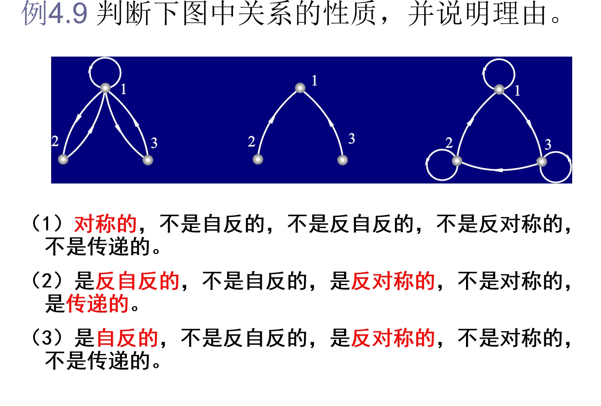

    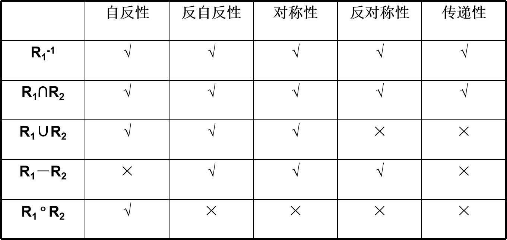

## 关系的闭包

### 闭包的定义

设 $R$ 是非空集合 $A$ 上的关系，$R$ 的自反（对称或传递）闭包是 $A$ 上的关系 $R'$，使得 $R'$ 满足以下条件：

- $R'$ 是自反的（对称的或传递的）

- $R \subseteq R'$

- 对 $A$ 上任何包含 $R$ 的自反（对称或传递）关系 $R''$ 有 $R' \subseteq R''$。

一般将 $R$ 的自反闭包记作 $r(R)$，对称闭包记作 $s(R)$，传递闭包记作 $t(R)$。

!!! example
    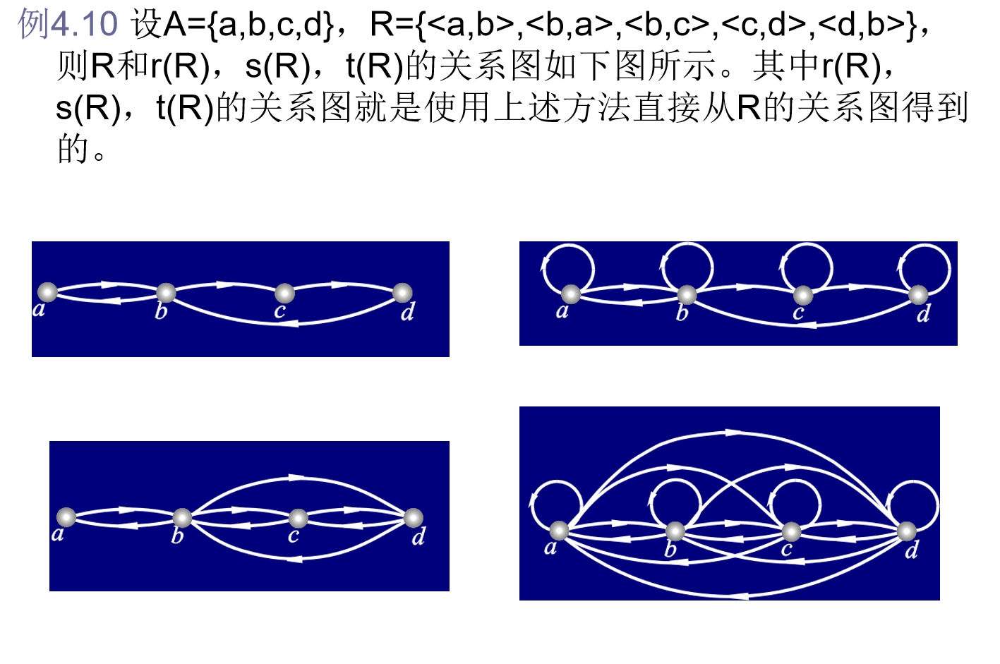

### 闭包的构造方法

设 $R$ 为非空集合 $A$ 上的关系，则有：

1. $r(R) = R \cup R^0$

2. $s(R) = R \cup R^{-1}$

3. $t(R) = R \cup R^2 \cup R^3 \cup \cdots$ 

!!! success "证明思路"
    - 1.和2.：证明右边的集合满足闭包定义的三个条件。

    - 3.：采用集合相等的证明方法。

        - 证明左边包含右边，即 $t(R)$ 包含每个 $R^n$。

        - 证明右边包含左边，即 $R \cup R^2 \cup \cdots$ 具有传递的性质。
<!-- 
!!! example "证明"
    - $r(R) = R \cup R^0$

        由 $I_A = R^0 \subseteq R \cup R^0$，可知 $R \cup R^0$ 是自反的，

        $R \subseteq R \cup R^0$。

        设 $R''$ 是 $A$ 上包含 $R$ 的自反关系，
        则有 $R \subseteq R''$ 和 $I_A \subseteq R''$。

        任取 $\langle x,y \rangle$，必有

        $$
        \begin{align}
           \langle x,y \rangle \in R \cup R^0 & \iff \langle x,y \rangle \in R \cup I_A \\
           & \Rightarrow \langle x,y \rangle \in R'' \cup R'' = R''
        \end{align}
        $$

        所以 $R \cup R^0 \subseteq R''$。

        综上所述，$r(R) = R \cup R^0$。
    
    - $s(R) = R \cup R^{-1}$

    - $t(R) = R \cup R^2 \cup R^3 \cup \cdots$
-->

!!! tip "推论"
    设 $R$ 为有穷集 $A$ 上的关系，则存在正整数 $r$ 使得

    $$
    t(R)=R \cup R^2 \cup \cdots \cup R^r
    $$

    !!! example
        求整数集合 $Z$ 上的关系 $R = \{\langle a,b \rangle \mid a<b\}$ 的自反闭包和对称闭包。

        $$
        r(R) = R \cup R^0 = \{\langle a,b \rangle \mid a<b\} \cup \{\langle a,b \rangle \mid a=b\} = \{\langle a,b \rangle \mid a≤b\}
        $$

        $$
        s(R) = R \cup R^{-1} = \{\langle a,b \rangle \mid a<b\} \cup \{\langle b,a \rangle \mid b<a\} = \{\langle a,b \rangle \mid a \neq b\}
        $$

#### 通过关系图求闭包

设关系 $R$，$r(R)$，$s(R)$，$t(R)$ 的关系图分别记为 $G$，$G_r$，$G_s$，$G_t$，则 $G_r$，$G_s$，$G_t$ 的顶点集与 $G$ 的顶点集相等。

除了 $G$ 的边以外，以下述方法添加新的边：

1. 考察 $G$ 的每个顶点，如果没有环就加上一个环。最终得到 $G_r$。

2. 考察 $G$ 的每一条边，如果有一条 $x_i$ 到 $x_j$ 的单向边，$i \neq j$，则在 $G$ 中加一条边 $x_j$ 到 $x_i$ 的反方向边。最终得到 $G_s$。

3. 考察 $G$ 的每个顶点 $x_i$，找出从 $x_i$ 出发的所有2步，3步，…，$n$ 步长的路径（$n$ 为 $G$ 中的顶点数）。

	设路径的终点为 $x_{j_1}, x_{j_2}, \ldots, x_{j_k}$。如果没有从 $x_i$ 到 $x_{j_k}$ 的边，就加上这条边。当检查完所有的顶点后就得到图 $G_t$。

!!! example
    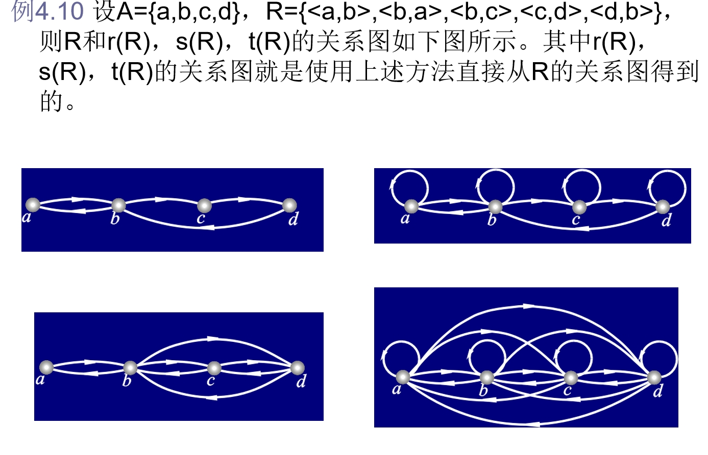

#### 通过关系矩阵求闭包

设关系 $R$，$r(R)$，$s(R)$，$t(R)$ 的关系矩阵分别为 $M$，$M_r$，$M_s$ 和 $M_t$，则：

- 对角线上的值都改为 $1$：$M_r = M + E$			

- 若 $a_{ij} = 1$，则令 $a_{ji} = 1$：$M_s = M + M'$

- 沃舍尔算法：$M_t = M + M^2 + M^3 + \cdots$（沃舍尔算法是一种求传递闭包的算法）

    !!! info "Warshall算法"
        输入：$M$（$R$ 的关系矩阵）

        输出：$M_t$（$t(R)$ 的关系矩阵）

        ```python
        M_T ← M
        for k ← 1 to n do
        	for i ← 1 to n do
        		for j ← 1 to n do
        			M_T[i,j]←M_T[i,j]+M_T[i,k]*M_T[k,j]
        ```

        注意：算法中矩阵加法和乘法中的元素相加都使用逻辑加。

其中 $E$ 是和 $M$ 同阶的单位矩阵，$M'$ 是 $M$ 的转置矩阵。

注意在上述等式中矩阵的元素相加时使用逻辑加。

## 等价关系和偏序关系

### 等价关系

设 $R$ 为非空集合 $A$ 上的关系。如果 $R$ 是自反的、对称的和传递的，则称 $R$ 为 $A$ 上的**等价关系**（*equivalent relation*）。设 $R$ 是一个等价关系，若 $\langle x,y \rangle \in R$，称 $x$ 等价于 $y$，记做 $x \sim y$。

!!! info
 	1. 平面上三角形集合中，三角形的相似关系是等价关系。

    2. 人群中的同性关系是等价关系。

    3. 朋友关系与同学关系不是等价关系，可能不是传递的！

!!! example
    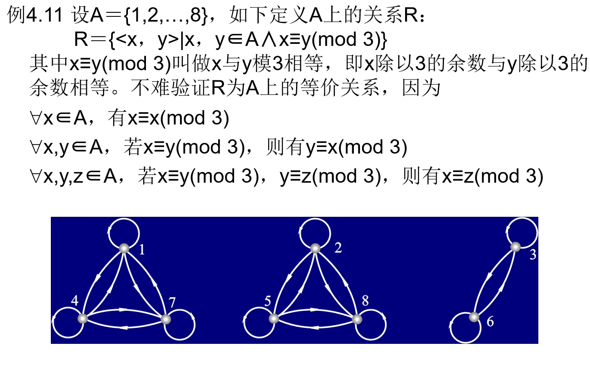

#### 等价类

设 $R$ 为非空集合 $A$ 上的等价关系，$\forall x \in A$，令 

$$
\left[x\right]_R = \{y \mid y \in A \land xRy\}
$$

称 $\left[x\right]_R$ 为 $x$ 关于 $R$ 的等价类，简称为 $x$ 的等价类，简记为 $\left[x\right]$。

**x 的等价类是 A 中所有与 x 等价的元素构成的集合**。

##### 等价类的性质

设 $R$ 是非空集合 $A$ 上的等价关系，则

1. $\forall x \in A$，$\left[x\right]$ 是 A 的非空子集。

2. $\forall x,y \in A$，如果 $xRy$，则 $\left[x\right] = \left[y\right]$。

3. $\forall x,y \in A$，如果 $\langle x,y \rangle \notin R$，则 $\left[x\right]$ 与 $\left[y\right]$ 不交。

4. $\bigcup_{x \in A} \left[x\right] = A$。

#### 商集

设 $R$ 是非空集合 $A$ 上的等价关系，以 $R$ 的所有等价类作为元素的集合称为 $A$ 关于 $R$ 的**商集**（*quotient set*），记作 $A/R$。

$$
A/R = \{\left[x\right] \mid x \in A\}
$$

!!! example
    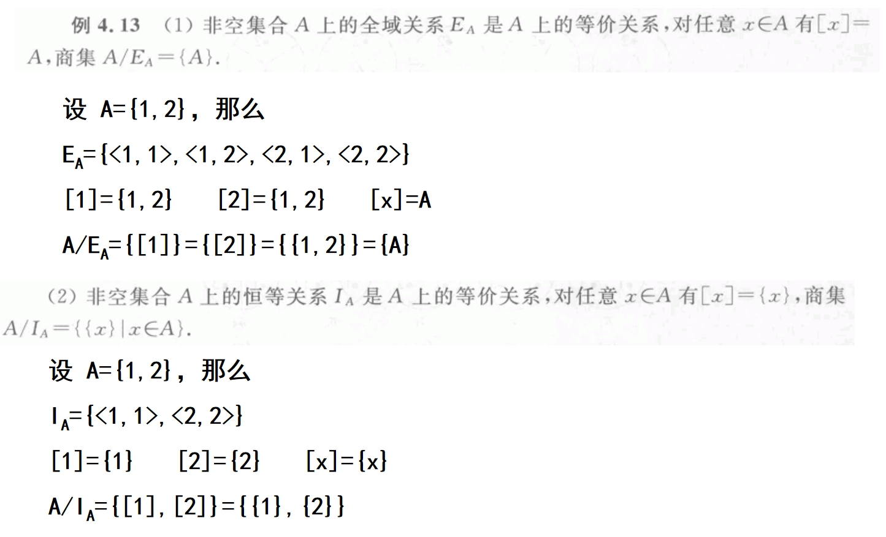

#### 划分

设 $R$ 是非空集合 $A$ 上的等价关系，$A$ 的子集族 $\mathcal{P}$ 满足：

1. $\forall X \in \mathcal{P}$，$X \neq \varnothing$。

2. $\forall X,Y \in \mathcal{P}$，如果 $X \neq Y$，则 $X \cap Y = \varnothing$。

3. $\bigcup_{X \in \mathcal{P}} X = A$。

则称 $\mathcal{P}$ 为 $A$ 的一个**划分**（*partition*）。

!!! abstract
    设集合 $\pi$ 是 $A$ 的非空子集的集合，若这些非空子集两两不相交，且它们的并等于 $A$，则称 $\pi$ 是集合 $A$ 的划分。

!!! example
    设 $A = \{a,b,c,d\}$，给定 $\pi_1, \pi_2, \pi_3, \pi_4, \pi_5, \pi_6$，如下：

    - $\pi_1 = \{\{a,b,c\},\{d\}\}$

    - $\pi_2 = \{\{a,b\},\{c\},\{d\}\}$

    - $\pi_3 = \{\{a\},\{a,b,c,d\}\}$

    - $\pi_4 = \{\{a,b\},\{c\}\}$

    - $\pi_5 = \{\varnothing,\{a,b\},\{c,d\}\}$

    - $\pi_6 = \{\{a,\{a\}\},\{b,c,d\}\}$

	$\pi_1$ 和 $\pi_2$ 是 $A$ 的划分，其它都不是 $A$ 的划分。

	因为 $\pi_3$ 中的子集 $\{a\}$ 和 $\{a,b,c,d\}$ 有交，$\bigcup \pi_4 \neq A$，$\pi_5$ 中含有空集，而 $\pi_6$ 根本不是 $A$ 的子集族。

!!! tip "商集和划分"
    - 商集就是 $A$ 的一个划分，并且不同的商集将对应于不同的划分。

    - 反之，任给 $A$ 的一个划分 $\pi$，如下定义 $A$ 上的关系 $R$：

		$$
        R = \{\langle x,y \rangle \mid x,y \in A \land x \text{ 与 } y \text{ 在 } \pi \text{ 的同一划分块中}\}
        $$

        则不难证明 $R$ 为 $A$ 上的等价关系，且该等价关系所确定的商集就是 $\pi$。

    - 由此可见，$A$ 上的等价关系与 $A$ 的划分是一一对应的。

!!! example
    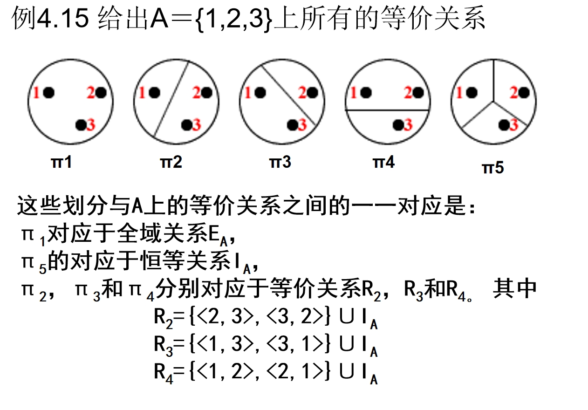

### 偏序关系

设 $R$ 为非空集合 $A$ 上的关系。如果 $R$ 是自反的、反对称的和传递的，则称 $R$ 为 $A$ 上的**偏序关系**（*partial order relation*）。设 $R$ 是一个偏序关系，若 $\langle x,y \rangle \in R$，称 $x$ 小于或等于 $y$，记做 $x \leq y$。

!!! warning
    这里的“小于或等于”不是指数的大小，而是在偏序关系中的顺序性。$x$“小于或等于”$y$的含义是：依照这个序，$x$ 排在 $y$ 的前边或者 $x$ 就是 $y$ 。根据不同偏序的定义，对序有着不同的解释。

!!! info "其他常用关系"
    - 小于或等于关系：$L_A = \{\langle x,y \rangle \mid x,y \in A \land x \leq y\}$，其中 $A \subseteq R$。

    - 整除关系：$D_B = \{\langle x,y \rangle \mid x,y \in B \land x | y\}$，其中 $B \subseteq Z^*$，$Z^*$ 是非零整数集。

    - 包含关系：$R \subseteq = \{\langle x,y \rangle \mid x,y \in A \land x \subseteq y\}$，其中 $A$ 是集合族。
    
    !!! example
        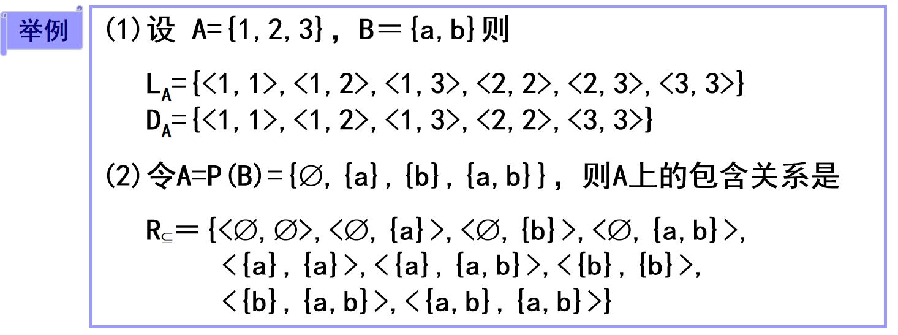

#### 偏序集

设 $R$ 是非空集合 $A$ 上的偏序关系，则称集合 $A$ 以 $R$ 为偏序关系构成的偏序集，记作 $\langle A,R \rangle$。

!!! example
    - 整数集 $\mathbb{Z}$ 上的小于或等于关系 $\leq$ 构成的偏序集为 $\langle \mathbb{Z},\leq \rangle$。

    - 集合 $A$ 的幂集 $P(A)$ 上的包含关系 $\subseteq$ 构成的偏序集为 $\langle P(A),\subseteq \rangle$。

##### 偏序集的特殊元素

设 $\langle A, \leq \rangle$ 是偏序集，$B \subseteq A$，$y \in B$，如果

- $\forall x(x\in B \rightarrow x \leq y)$，则称 $y$ 为 $B$ 的**最大元**（*maximum*）。

- $\forall x(x\in B \rightarrow y \leq x)$，则称 $y$ 为 $B$ 的**最小元**（*minimum*）。

- $\exists x(x\in B \wedge x < y)$，则称 $y$ 为 $B$ 的**极小元**（*minimal*）。

- $\exists x(x\in B \wedge y < x)$，则称 $y$ 为 $B$ 的**极大元**（*maximal*）。

!!! example
    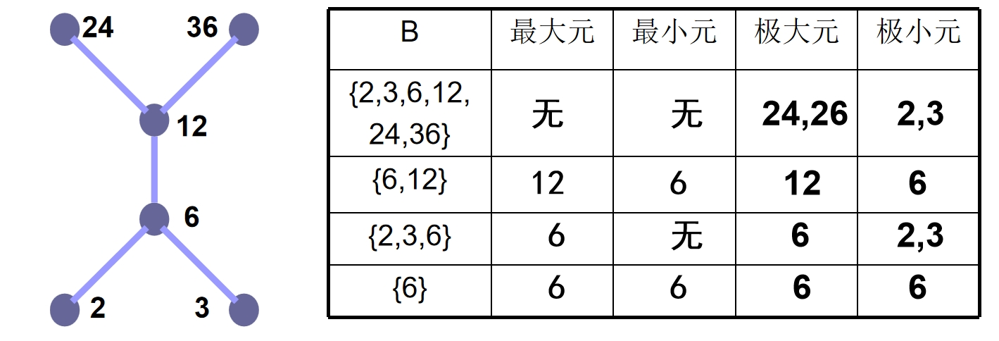

###### 特殊元素的性质

- 最小元是 $B$ 中最小的元素，它与 $B$ 中其它元素都可比。

- 极小元不一定与 $B$ 中元素可比，只要没有比它小的元素，它就是极小元。

- 对于有穷集 $B$，极小元一定存在，但最小元不一定存在。最小元如果存在，一定是唯一的。

- 极小元可能有多个，但不同的极小元之间是不可比的（无关系）。

- 如果 $B$ 中只有一个极小元，则它一定是 $B$ 的最小元。

- [哈斯图](#哈斯图)中，集合 $B$ 的极小元是 $B$ 中各元素中的最底层。

#### 可比

设 $R$ 为非空集合 $A$ 上的偏序关系，定义

$$
\forall x, y \in A, x \leq y \wedge y \leq x \iff x \text{ 与 } y \text{ 可比 }
$$

在具有偏序关系的集合 $A$ 中任取两个元素 $x$ 和 $y$，可能有下述几种情况发生：

- $x < y$（或 $y < x$），$x = y$，$x$ 与 $y$ 不是可比的。

    其中 $x < y$ 读作 $x$“小于”$y$。这里所说的“小于”是指在偏序中 $x$ 排在 $y$ 的前边。

!!! example
    $A = \{1,2,3\}$，≤是 $A$ 上的整除关系，则有

    $$
    D_A = \{\langle 1,1 \rangle, \langle 1,2 \rangle, \langle 1,3 \rangle, \langle 2,2 \rangle, \langle 3,3 \rangle\}
    $$

    - $1 = 1$，$1 < 2$，$1 < 3$，$2 = 2$，$3 = 3$，$1$ 和 $1,2,3$ 都是可比的

    - $2$ 和 $3$ 不可比

#### 覆盖

设 $\langle A, \leq \rangle$ 是偏序集，$x, y \in A$，如果 $x \leq y$ 且不存在 $z \in A$ 使得 $x < z < y$，则称 $y$ 覆盖 $x$。

!!! example
    $A = \{1,2,4,6\}$ 上的整除关系

    $$
    D_A = \{\langle 1,1 \rangle, \langle 1,2 \rangle, \langle 1,4 \rangle, \langle 1,6 \rangle, \langle 2,2 \rangle, \langle 2,4 \rangle, \langle 2,6 \rangle, \langle 4,4 \rangle, \langle 6,6 \rangle\}
    $$

    - $2$ 覆盖 $1$，$4$ 和 $6$ 都覆盖 $2$。

    - $4$ 不覆盖 $1$，因为有 $1 < 2 < 4$。

    - $6$ 也不覆盖 $4$，因为 $4 < 6$ 不成立。

#### 全序关系

设 $R$ 为非空集合 $A$ 上的偏序关系，如果 $\forall x, y \in A$，$x$ 和 $y$ 都是可比的，则称 $R$ 为 $A$ 上的**全序关系**（*total order relation*）或**线序关系**。

!!! example
    - 数集上的小于或等于关系是全序关系，因为任何两个数总是可比大小的。

	- 整除关系一般来说不是全序关系，如集合 $\{1,2,3\}$ 上的整除关系就不是全序关系，因为 $2$ 和 $3$ 不可比。

#### 哈斯图

利用偏序关系的自反性、反对称性和传递性所得到的偏序集合图，称为**哈斯图**（*Hasse diagram*）。

画偏序集 $\langle A, \leq \rangle$ 的哈斯图的方法：

1. 用小圆圈代表元素。

2. $\forall x,y \in A$，若 $x < y$，则将 $x$ 画在 $y$ 的下方。

3. 对于 $A$ 中的两个不同元素 $x$ 和 $y$，如果 $y$ 覆盖 $x$，就用一条线段连接 $x$ 和 $y$。

#### 上下界

设 $\langle A, \leq \rangle$ 是偏序集，$B \subseteq A$，$y \in A$：

- 若 $\forall x(x\in B \rightarrow x \leq y)$，则称 $y$ 为 $B$ 的**上界**（*upper bound*）。

- 若 $\forall x(x\in B \rightarrow y \leq x)$，则称 $y$ 为 $B$ 的**下界**（*lower bound*）。

- 令 $C = \{y \mid y \text{ 为 } B \text{ 的上界}\}$，则称 $C$ 的最小元为 $B$ 的最小上界或上确界。

- 令 $D = \{y \mid y \text{ 为 } B \text{ 的下界}\}$，则称 $D$ 的最大元为 $B$ 的最大下界或下确界。

!!! example
    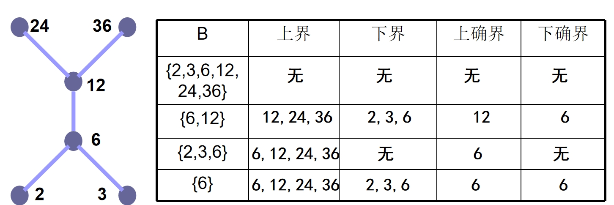

##### 上下界的性质

- $B$ 的[最小元](#偏序集的特殊元素)一定是 $B$ 的下界，同时也是 $B$ 的最大下界。

- $B$ 的[最大元](#偏序集的特殊元素)一定是 $B$ 的上界，同时也是 $B$ 的最小上界。

- $B$ 的下界不一定是 $B$ 的最小元，因为它可能不是 $B$ 中的元素。

- $B$ 的上界也不一定是 $B$ 的最大元。

- $B$ 的上界、下界、最小上界、最大下界都可能不存在。如果存在，最小上界与最大下界是唯一的。
