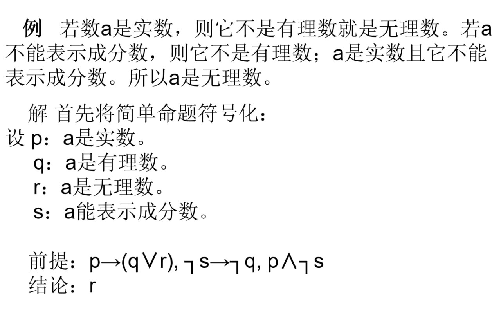
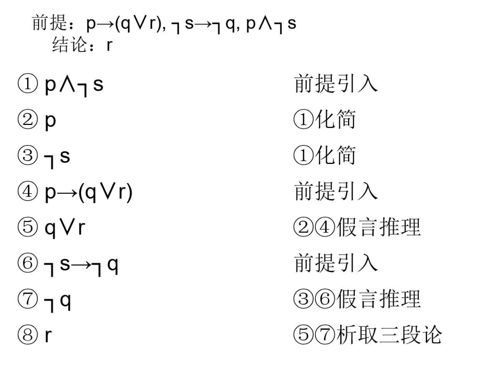
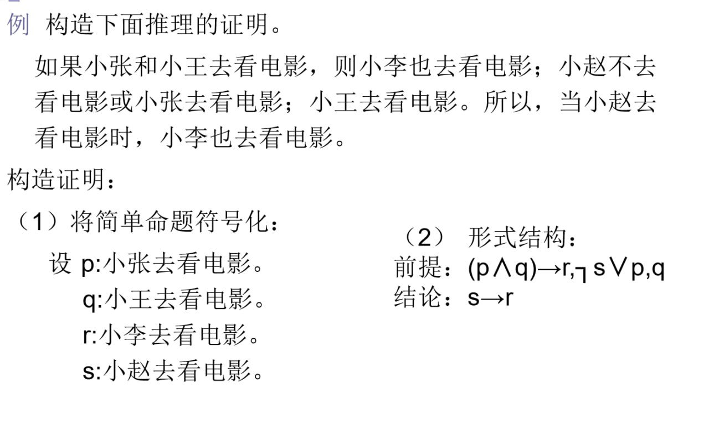
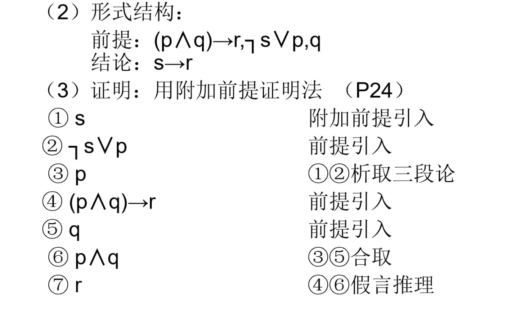
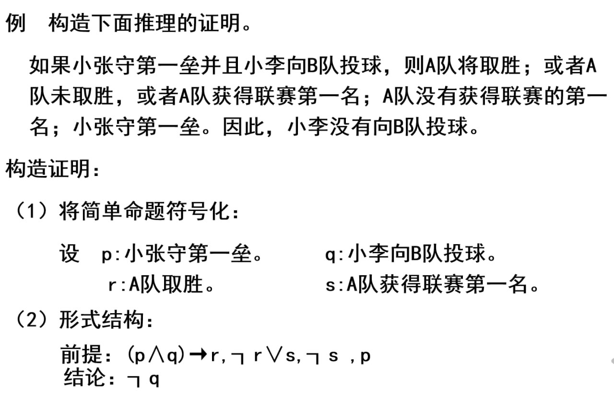
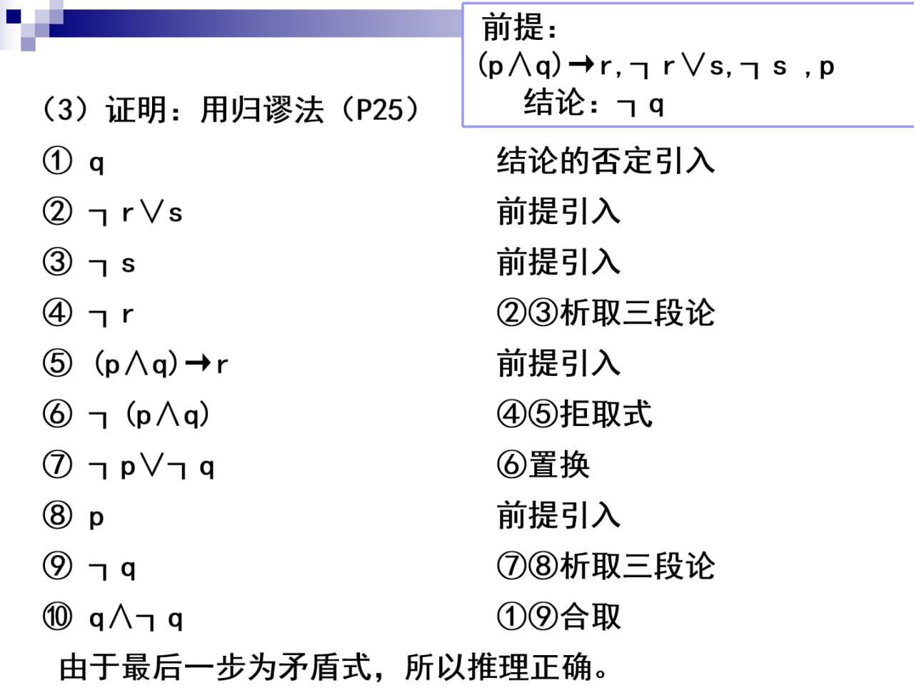

# 推理理论

设 $A$ 和 $B$ 是两个命题公式，当且仅当 $A \rightarrow B$ 是重言式时，称从 $A$ 可推出 $B$ 或 $B$ 是前提 $A$ 的有效结论，记作 $A \vdash B$ 或 $A \Rightarrow B$。

- 命题公式 $A_1, A_2, \cdots, A_k$ 推出 $B$ 的推理理论正确当且仅当 $A_1 \wedge A_2 \wedge \cdots \wedge A_k \rightarrow B$ 为重言式。

- $\Rightarrow$ 表示蕴涵式为[重言式](命题逻辑的基本概念.md#重言式矛盾式)

## 推理的形式结构

- 形式一：设 $\Gamma = \{A_1, A_2, \cdots, A_k\}$，$\Gamma \vdash B$

    表示命题公式 $B$ 可以从命题公式集合 $\Gamma$ 中推导出来，即 $B$ 是 $\Gamma$ 的逻辑结论。

- 形式二：$A_1 \wedge A_2 \wedge \cdots \wedge A_k \Rightarrow B$

- 形式三：

    - 前提: $A_1, A_2, \cdots, A_k$

    - 结论: $B$

## 重要推理定律

- **附加律**：$A \Rightarrow (A \vee B)$

- **化简律**：$(A \wedge B) \Rightarrow A$

- **假言推理**：$((A \rightarrow B) \wedge A) \Rightarrow B$

- **拒取式**：$((A \rightarrow B) \wedge \neg B) \Rightarrow \neg A$

- **析取三段论**：$((A \vee B) \wedge \neg A) \Rightarrow B$

- **假言三段论**：$((A \rightarrow B) \wedge (B \rightarrow C)) \Rightarrow (A \rightarrow C)$

- 等价三段式：$((A \leftrightarrow B) \wedge (B \leftrightarrow C)) \Rightarrow (A \leftrightarrow C)$

- 构造性二难：$((A \rightarrow B) \wedge (C \rightarrow D) \wedge (A \vee C)) \Rightarrow (B \vee D)$

- 破坏性二难附加律：$((A \rightarrow B) \vee (C \rightarrow D) \wedge (\neg B \vee \neg D)) \Rightarrow (\neg A \vee \neg C)$

## 自然推理系统

- 判断推理是否正确的三种方法：真值表法、等值演算法和主析取范式法。

- 当推理中包含的命题变项较多时，上述三种方法演算量太大。

- 对于由前提 $A_1, A_2, \cdots, A_k$ 推出 $B$ 的正确推理应该给出严谨的证明。

### 推理规则

1. 前提引入规则：在证明的任何步骤上都可以引入前提。

2. 结论引入规则：在证明的任何步骤上所得到的结论都可以作为后继证明的前提。

3. 置换规则：在证明的任何步骤上，命题公式中的子公式都可以用与之等值的公式置换，得到公式序列中的又一个公式。

### 证明系统

1. 直接证明法

    直接证明法是指直接从前提出发，通过推理规则，得到结论。

    

    

2. 附加前提法

    附加前提法是指在推理过程中，引入一个附加前提，使得推理过程更加清晰。

    

    

3. 反证法（归谬法）

    反证法是指通过证明结论的否定，来证明结论的正确性。

    

    

!!! example
    

      <iframe src="https://player.bilibili.com/player.html?isOutside=true&aid=113712665010072&bvid=BV1jTCNYdEoV&p=4&t=360&autoplay=0"
      scrolling="no" 
      border="0" 
      frameborder="no" 
      framespacing="0" 
      allowfullscreen="true"> 
      </iframe>
    

    - 带自然语言的题目

        1. 构造原子命题（自然语言符号化）

        2. 构造推理的形式结构（前提、结论）

        3. 证明
    
    - 在需要证明的结论出现 $A \rightarrow B$ 的形式时（蕴含式），一般就需要用到[附加前提法](https://www.bilibili.com/video/BV1jTCNYdEoV/?p=4&share_source=copy_web&vd_source=dd419e82eb3456a01e4d011feff47d3d&t=810)
