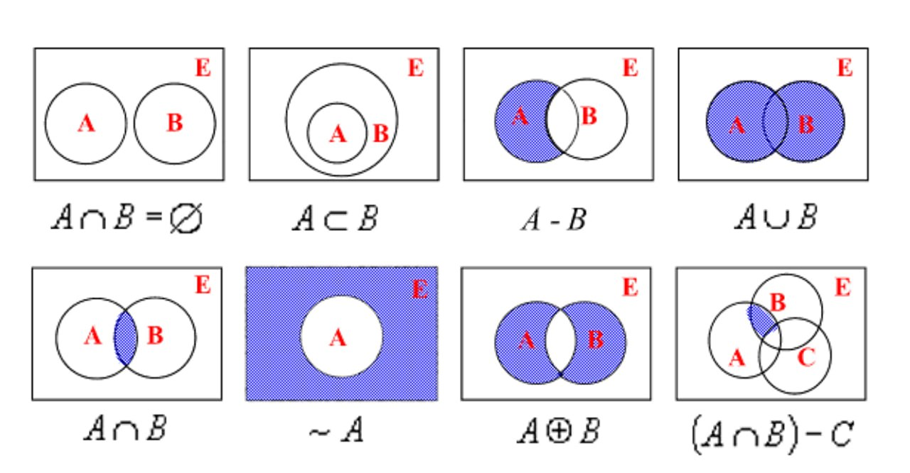
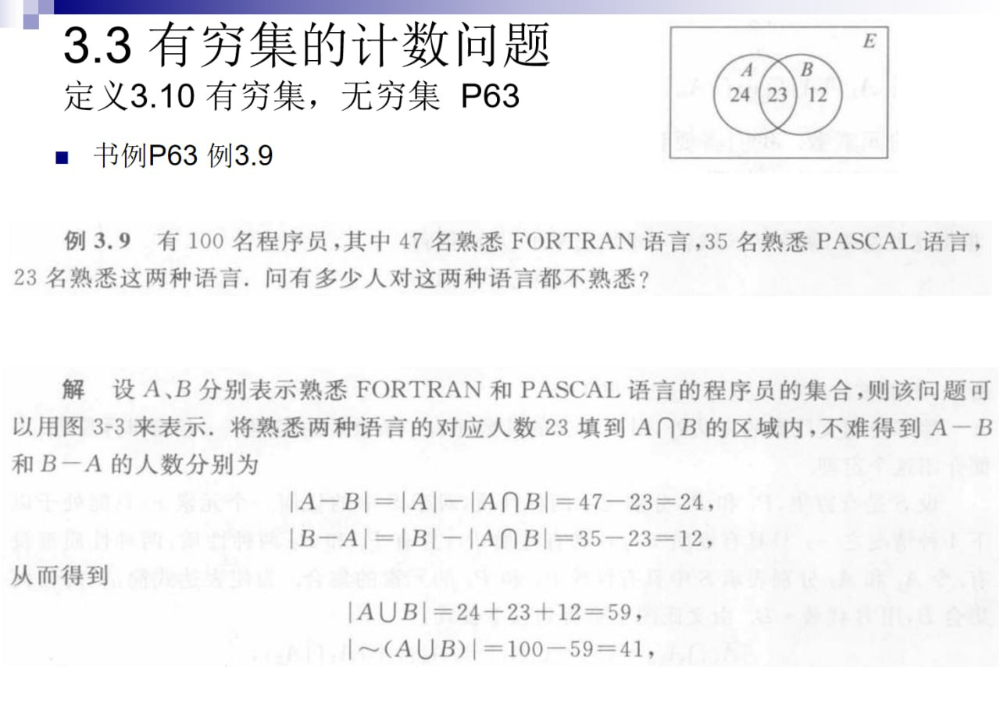
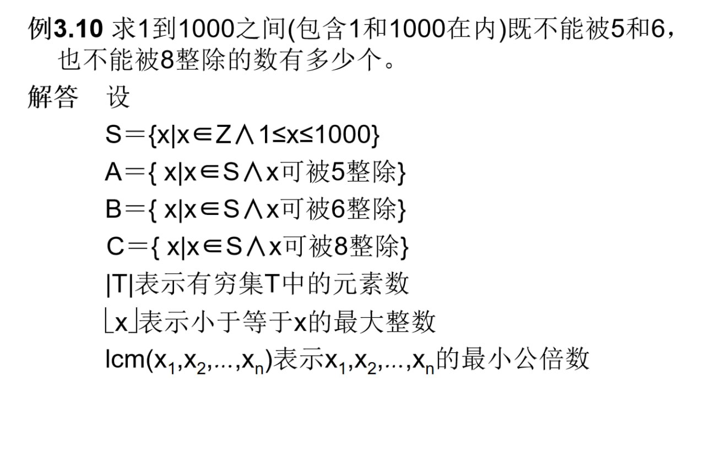
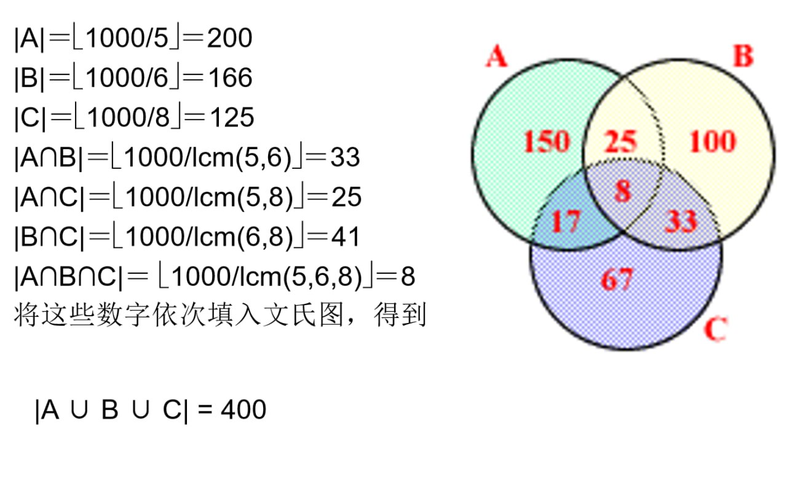
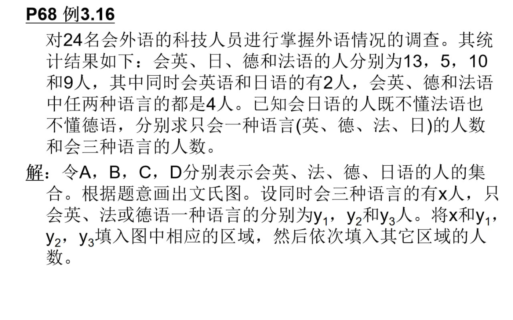
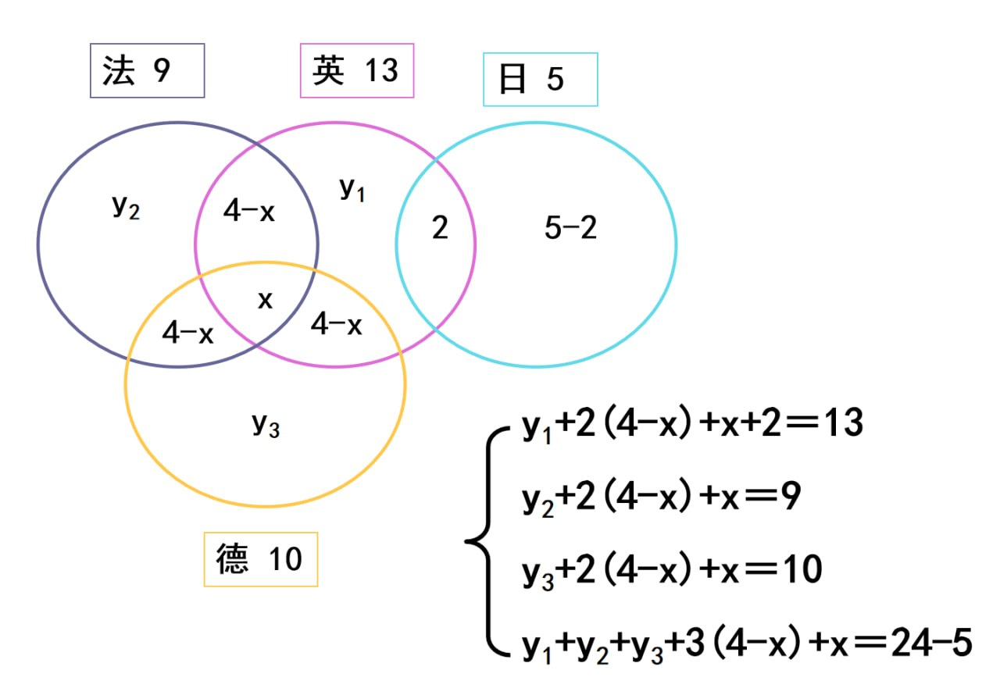
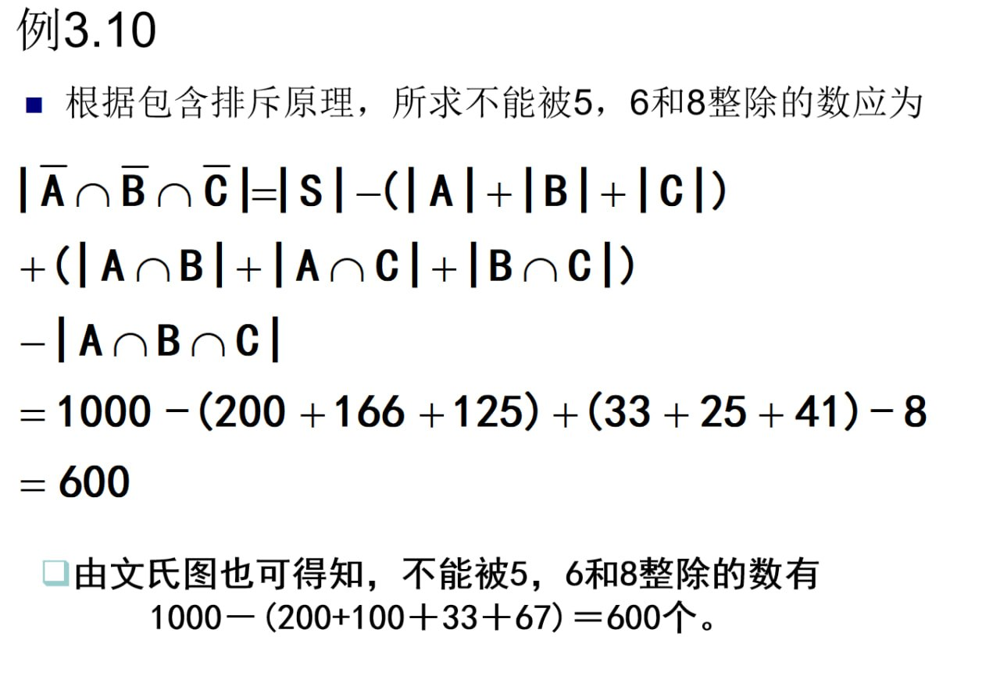

# 集合

> [集合 & 数学符号与逻辑命题](../集合%20&%20数学符号与逻辑命题.md#集合)

!!! abstract
    | 角度 | 解释 |
    |:-----:|:----------------:|
    | **What** | 由一些「可确定、可分辨」的对象组成的整体；对象叫**元素**。 |
    | **Why** | 后续几乎所有内容都会反复用到「属于/不属于」「包含/被包含」「并交差补」。 |
    | **How** | 会两种表示法（列举/谓词），分清 \(x\in A\) 与 \(B\subseteq A\)，熟练并交差补与文氏图。 |

---

## 基本概念

### 元素

在集合中，元素排列**互异且无序**。

- **互异**：元素不重复（$\{1,1,2\}=\{1,2\}$）。

- **无序**：顺序不重要（$\{1,2,3\}=\{3,1,2\}$）。

### 隶属

元素与集合的关系是「属于 / 不属于」，例如：$x$ 属于 $A$，记作

$$
x\in A
$$

$x$ 不属于 $A$，记作

$$
x\notin A
$$

集合本身也可以作为元素出现，例如 $\{a\}\in \{a,\{a\}\}$。

### 子集

- **子集**：$B\subseteq A\iff \forall x(x\in B\rightarrow x\in A)$。

- **真子集**：$B\subset A\iff (B\subseteq A)\land(B\neq A)$。

### 相等

$$
A=B\iff (A\subseteq B)\land(B\subseteq A)
$$

### 空集

- **定义**：不含任何元素的集合，记作 $\varnothing$。

    $$
    \varnothing = \{x\mid x\neq x\} = \{x \mid P(x) \wedge \neg P(x)\}
    $$

- **关键性质**：$\varnothing\subseteq A$ 对任意 $A$ 都成立，即**空集是任意集合的子集**。

!!! warning
    $$
    \varnothing \neq \{\varnothing\}\quad \text{但} \quad \varnothing\in\{\varnothing\}
    $$

### n元集

含有 $n$ 个元素的集合简称 n元集，它的含有 $m$ ($m\leq n$) 个元素的子集叫做它的 $m$ 元子集。

### 幂集

- **定义**：$P(A)=\{x \mid x\subseteq A\}$。  

- 若 $A$ 是 $n$ 元集，其 $0$元集有 $C_n^0$ 个，$1$ 元集有 $C_n^1$ 个，$2$ 元集有 $C_n^2$ 个，...，$n$ 元集有 $C_n^n$ 个，则子集总数为 $\sum_{i=0}^n C_n^i = 2^n$，即 $|P(A)|=2^n$。

- $x \subseteq A \iff x \in P(A)$

!!! example
    $A=\{1,2,3\}\Rightarrow |P(A)|=8, P(A)=\{\varnothing, \{1\}, \{2\}, \{3\}, \{1,2\}, \{1,3\}, \{2,3\}, \{1,2,3\}\}$

---

## 集合的表示方法

- **列元素法**（roster）：$A=\{a,b,c\}$，元素少/可列完。  

- **谓词表示法**（predicate）：$B=\{x\mid x\in\mathbb{R}\land x^2-1=0\}=\{-1,1\}$，元素多或无限。  

常见数集：

- $\mathbb{N}$：自然数集

- $\mathbb{Z}$：整数集

- $\mathbb{Q}$：有理数集

- $\mathbb{R}$：实数集

- $\mathbb{C}$：复数集

---

## 集合的运算

### 基本运算

设 $A,B$ 为集合：

- **并集**：$A\cup B=\{x\mid x\in A\lor x\in B\}$

- **交集**：$A\cap B=\{x\mid x\in A\land x\in B\}$

- **差集**：$A-B=\{x\mid x\in A\land x\notin B\}$

若 $A\cap B=\varnothing$，称 $A,B$ **不相交**。

### 广义并与广义交

$$
\bigcup_{i=1}^n A_i =\{x\mid x\in A_1\lor\cdots\lor x\in A_n\} = A_1\cup A_2\cup \cdots \cup A_n
$$

$$
\bigcap_{i=1}^n A_i=\{x\mid x\in A_1\land\cdots\land x\in A_n\} = A_1\cap A_2\cap \cdots \cap A_n
$$

### 绝对补集

$$
\overline{A} = U-A = \{x \mid x \in U \land x \notin A\}
$$

$U$ 为全集，因此：

$$
\overline{A} = \{x \mid x \notin A\}
$$

!!! example
    $A=\{a,b,c\}, U=\{a,b,c,d,e,f,g\}$，则 $\overline{A}=\{d,e,f,g\}$。

### 对称差

$$
A\oplus B=(A-B)\cup(B-A)=(A\cup B)-(A\cap B)
$$

!!! example
    $A=\{a,b,c\}, B=\{b,c,d\}$，则 $A\oplus B=\{a,d\}$。

---

## 文氏图

- 集合之间的关系和运算可以用文氏图给予形象的描述。

    

- 文氏图的构造方法如下：

    - 画一个大矩形表示全集E（有时为简单起见可将全集省略）；

    - 在矩形内画一些圆（或任何其它的适当的闭曲线），用圆的内部表示集合；

    - 不同的圆代表不同的集合。如果没有关于集合不交的说明，任何两个圆彼此相交。

    - 图中阴影的区域表示新组成的集合。

    - 可以用实心点代表集合中的元素。

## 集合恒等式

- **幂等律**：$A\cup A=A$，$A\cap A=A$

- **交换律**：$A\cup B=B\cup A$，$A\cap B=B\cap A$

- **结合律**：$(A\cup B)\cup C=A\cup(B\cup C)$，$(A\cap B)\cap C=A\cap(B\cap C)$

- **分配律**：$A\cup(B\cap C)=(A\cup B)\cap(A\cup C)$，$A\cap(B\cup C)=(A\cap B)\cup(A\cap C)$

- **同一律**：$A\cup\varnothing=A$，$A\cap U=A$

- **零律**：$A\cup U=U$，$A\cap\varnothing=\varnothing$

- **排中律**：$A\cup\overline{A}=U$，$A\cap\overline{A}=\varnothing$

- **矛盾律**：$A\cap\neg A=\varnothing$

- **吸收律**：$A\cup(A\cap B)=A$，$A\cap(A\cup B)=A$

- **德摩根律**：$\overline{B\cup C}=\overline{B}\cap\overline{C}$，$\overline{B\cap C}=\overline{B}\cup\overline{C}$

- **双重否定**：$\overline{\overline{A}}=A$

!!! tip "一个非常实用的转换（把差集转成交集）"
    $$
    A-B=A\cap\overline{B}
    $$

### 集合运算的部分性质

1. $A \cap B \subseteq A$，$A \cap B \subseteq B$

2. $A \subseteq A \cup B$，$B \subseteq A \cup B$

3. $A - B \subseteq A$

4. $A - B = A \cap \overline{B}$

5. $A \cup B = B \iff A \subseteq B \iff A \cap B = A \iff A - B = \varnothing$

6. $A \oplus B = B \oplus A$

7. $(A \oplus B) \oplus C = A \oplus (B \oplus C)$

8. $A \oplus \varnothing = A$，$A \oplus A = \varnothing$

9. $A \oplus B = A \oplus C \iff B = C$

---

## 有穷集计数

- 使用文氏图可以很方便地解决有穷集的计数问题。

- 首先根据已知条件把对应的文氏图画出来。

    - 一般地说，每一条性质决定一个集合。

    - 有多少条性质，就有多少个集合。

    - 如果没有特殊说明，任何两个集合都画成相交的。

- 然后将已知集合的元素数填入表示该集合的区域内。

    - 通常从n个集合的交集填起，

    - 根据计算的结果将数字逐步填入所有的空白区域。

    - 如果交集的数字是未知的，可以设为x。

根据题目中的条件，列出一次方程或方程组，就可以求得所需要的结果。

!!! example
    
    
    
    
    

### 包含-排斥原理

有穷集计数问题也可以通过**包含-排斥原理**来解决。

设 $S$ 为有穷集，$P_1,P_2,\ldots,P_m$ 是 $m$ 个性质。S中的任何元素 $x$ 或者具有性质 $P_i$，或者不具有性质 $P_i$ ($i=1,2,\ldots,m$)，两种情况必居其一。令 $A_i$ 表示 $S$ 中具有性质 $P_i$ 的元素构成的子集，则 $S$ 中不具有性质 $P_1,P_2,\ldots,P_m$ 的元素为：

$$
\begin{align}
|\overline{A_1} \cap \overline{A_2} \cap \cdots \cap \overline{A_m}| = |S| &- \sum_{i=1}^m |A_i| \\
&+ \sum_{1\leq i<j\leq m} |A_i\cap A_j| \\
&- \sum_{1\leq i<j<k\leq m} |A_i\cap A_j\cap A_k| \\
&+ \cdots \\
&+ (-1)^m |A_1\cap A_2\cap \cdots \cap A_m|
\end{align}
$$

$S$ 中**至少具有一条**性质的元素数为：

$$
\begin{align}
  |A_1\cup A_2\cup \cdots \cup A_m| = \sum_{i=1}^m |A_i| & - \sum_{1\leq i<j\leq m} |A_i\cap A_j| \\
  & + \sum_{1\leq i<j<k\leq m} |A_i\cap A_j\cap A_k| \\
  & - \cdots \\
  & + (-1)^m |A_1\cap A_2\cap \cdots \cap A_m|
\end{align}
$$

!!! example
    
    

---
