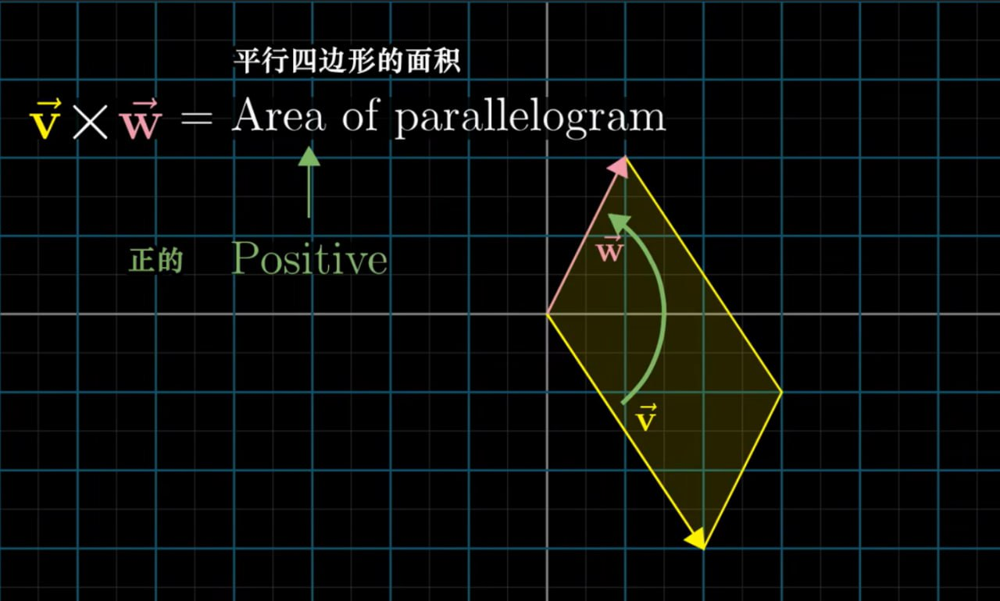

# 叉积

## 叉积的标准定义

    <iframe src="https://player.bilibili.com/player.html?isOutside=true&aid=6731067&bvid=BV1ys411472E&p=11&autoplay=0" 
    scrolling="no" 
    border="0" 
    frameborder="no" 
    framespacing="0" 
    allowfullscreen="true"> 
    </iframe>

### 叉积的数值计算

结合数值与向量的几何意义，可以将叉积看作是**平行四边形**的**有向面积**:

结果的正负性取决于向量 $\overrightarrow{v}$ 和 $\overrightarrow{w}$ 的相对位置是否满足右手定则。

计算方面，涉及平行四边形的面积，这就可以联系到[行列式的几何意义](线性代数的本质-行列式.md#行列式的几何意义)，因此就可以通过行列式计算向量的叉积:

设 $\overrightarrow{v} = \begin{bmatrix}
  v_1 \\
  v_2 \\
  v_3
\end{bmatrix}$, $\overrightarrow{w} = \begin{bmatrix}
  w_1 \\
  w_2 \\
  w_3
\end{bmatrix}$，则有

$$
\overrightarrow{v} \times \overrightarrow{w} = \begin{vmatrix}
  i & v_1 & w_1 \\
  j & v_2 & w_2 \\
  k & v_3 & w_3
\end{vmatrix} = i(v_2w_3 - v_3w_2) - j(v_1w_3 - v_3w_1) + k(v_1w_2 - v_2w_1)
$$

!!! tip
    部分资料将向量写作行向量的形式，但这并不影响结果，因为行列式转置后值不变。

### 标准定义
 
严格意义上，上面的说法并不能很好地定义叉积。真正的叉积是**通过两个三维向量生成一个新的三维向量**。

这个向量的长度等于原两个向量所构成的平行四边形的面积，方向垂直于平行四边形所在的平面，且满足右手定则。

$$
\overrightarrow{p} = \overrightarrow{v} \times \overrightarrow{w} \quad |\overrightarrow{p}| = |\overrightarrow{v}| |\overrightarrow{w}| \sin \theta
$$
