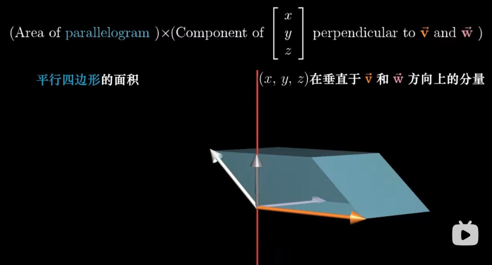

# 叉积

## 叉积的标准定义

    <iframe src="https://player.bilibili.com/player.html?isOutside=true&aid=6731067&bvid=BV1ys411472E&p=11&autoplay=0" 
    scrolling="no" 
    border="0" 
    frameborder="no" 
    framespacing="0" 
    allowfullscreen="true"> 
    </iframe>

### 叉积的数值计算

结合数值与向量的几何意义，可以将叉积看作是**平行四边形**的**有向面积**:

结果的正负性取决于向量 $\overrightarrow{v}$ 和 $\overrightarrow{w}$ 的相对位置是否满足右手定则。

计算方面，涉及平行四边形的面积，这就可以联系到[行列式的几何意义](线性代数的本质-行列式.md#行列式的几何意义)，因此就可以通过行列式计算向量的叉积:

设 $\overrightarrow{v} = \begin{bmatrix}
  v_1 \\
  v_2
\end{bmatrix}$ 和 $\overrightarrow{w} = \begin{bmatrix}
  w_1 \\
  w_2
\end{bmatrix}$，则有

$$
\overrightarrow{v} \times \overrightarrow{w} = \begin{vmatrix}
  v_1 & w_1 \\
  v_2 & w_2 \\
\end{vmatrix}
$$

!!! tip
    部分资料将向量写作行向量的形式，但这并不影响结果，因为行列式转置后值不变。

### 标准定义
 
严格意义上，上面的说法并不能很好地定义叉积。真正的叉积是**通过两个三维向量生成一个新的三维向量**。

这个向量的长度等于原两个向量所构成的平行四边形的面积，方向垂直于平行四边形所在的平面，且满足右手定则。

$$
\overrightarrow{p} = \overrightarrow{v} \times \overrightarrow{w} \quad ||\overrightarrow{p}|| = ||\overrightarrow{v}|| ||\overrightarrow{w}|| \sin \theta
$$

## 线性变换视角下的叉积

    <iframe src="https://player.bilibili.com/player.html?isOutside=true&aid=6731067&bvid=BV1ys411472E&p=12&autoplay=0" 
    scrolling="no" 
    border="0" 
    frameborder="no" 
    framespacing="0" 
    allowfullscreen="true"> 
    </iframe>

深入理解这部分内容，需要基于对[对偶性](线性代数的本质-点积与对偶性.md)的理解。

1. 根据 $\overrightarrow{v}$ 和 $\overrightarrow{w}$ 定义一个三维到一维的线性变换

2. 找到这个线性变换的对偶向量

3. 证明这个对偶向量就是 $\overrightarrow{v} \times \overrightarrow{w}$

### 计算角度

考虑三维向量空间中两个向量的叉积:

设 $\overrightarrow{v} = \begin{bmatrix}
  v_1 \\
  v_2 \\
  v_3
\end{bmatrix}$, $\overrightarrow{w} = \begin{bmatrix}
  w_1 \\
  w_2 \\
  w_3
\end{bmatrix}$，则有

$$
\overrightarrow{v} \times \overrightarrow{w} = \begin{vmatrix}
  i & v_1 & w_1 \\
  j & v_2 & w_2 \\
  k & v_3 & w_3
\end{vmatrix} = i(v_2w_3 - v_3w_2) + j(v_1w_3 - v_3w_1) + k(v_1w_2 - v_2w_1)
$$

基于对偶性，理解以下变换与计算过程:

$$
f(\begin{bmatrix}
  x \\
  y \\
  z
\end{bmatrix}) = \begin{vmatrix}
  x & v_1 & w_1 \\
  y & v_2 & w_2 \\
  z & v_3 & w_3
\end{vmatrix} \Rightarrow \begin{bmatrix}
  p_1 & p_2 & p_3
\end{bmatrix} \begin{bmatrix}
  x \\
  y \\
  z \\
\end{bmatrix} \begin{vmatrix}
  x & v_1 & w_1 \\
  y & v_2 & w_2 \\
  z & v_3 & w_3
\end{vmatrix} \Rightarrow \begin{bmatrix}
  p_1 \\
  p_2 \\
  p_3 \\
\end{bmatrix} \cdot \begin{bmatrix}
  x \\
  y \\
  z \\
\end{bmatrix} = \begin{vmatrix}
  p_1 & v_1 & w_1 \\
  p_2 & v_2 & w_2 \\
  p_3 & v_3 & w_3
\end{vmatrix}
$$

因此有:

$$
\begin{align}
  p_1 \cdot x + p_2 \cdot y + p_3 \cdot z =\ &x(v_2w_3 - v_3w_2) + \\
  &y(v_1w_3 - v_3w_1) + \\
  &z(v_1w_2 - v_2w_1)
\end{align}
$$

这时就不难得出:

$$
\begin{cases}
  p_1 = v_2w_3 - v_3w_2 \\
  p_2 = v_3w_1 - v_1w_3 \\
  p_3 = v_1w_2 - v_2w_1 \\
\end{cases}
$$

### 几何角度

    <iframe src="https://player.bilibili.com/player.html?isOutside=true&aid=6731067&bvid=BV1ys411472E&p=12&t=565&autoplay=0" 
    scrolling="no" 
    border="0" 
    frameborder="no" 
    framespacing="0" 
    allowfullscreen="true"> 
    </iframe>

**将向量 $\overrightarrow{p}$ 和某个三维向量 $\begin{bmatrix}
  x \\
  y \\
  z
\end{bmatrix}$ 点乘后，所得结果为一个由 $\begin{bmatrix}
  x \\
  y \\
  z
\end{bmatrix}$ 和 $\overrightarrow{v}$ 与 $\overrightarrow{w}$ 所确定的平行六面体的有向体积**。

也就是说，在上面的[计算角度](#计算角度)提到的线性函数 $f(\begin{bmatrix}
  x \\
  y \\
  z
\end{bmatrix})$ 的作用就是将其输入向量 $\begin{bmatrix}
  x \\
  y \\
  z
\end{bmatrix}$ 投影到垂直于 $\overrightarrow{v}$ 和 $\overrightarrow{w}$ 的直线上，然后与 $\overrightarrow{v}$ 和 $\overrightarrow{w}$ 所张成的平行四边形的面积相乘。

数值的正负依然能够通过右手定则快速理解。
