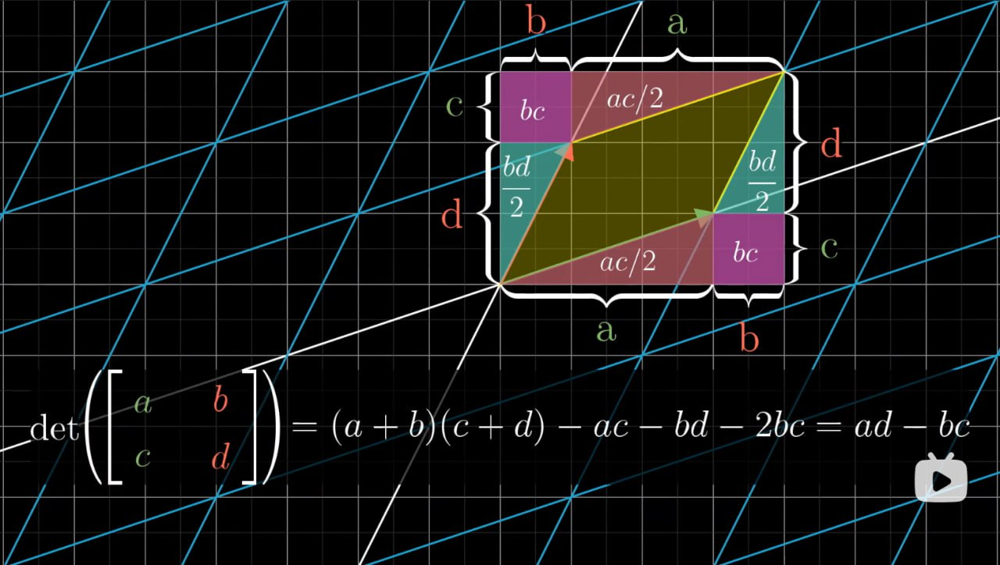

# 行列式

    <iframe src="https://player.bilibili.com/player.html?isOutside=true&aid=6731067&bvid=BV1ys411472E&p=7&autoplay=0" 
    scrolling="no" 
    border="0" 
    frameborder="no" 
    framespacing="0" 
    allowfullscreen="true"> 
    </iframe>

## 行列式的几何意义

[线性变换](线性代数的本质-矩阵与线性变换.md#什么是线性变换)在几何上的表现为空间的拉伸或挤压，**二（三）阶行列式的本质是一个线性变换对单位面积（体积）的缩放比例**。

!!! tip
    - 当行列式的值为负数时，表示线性变换改变了向量空间的定向（从右手系变为左手系），但其绝对值仍然表示线性变换对单位面积的缩放比例。

        

            <iframe src="https://player.bilibili.com/player.html?isOutside=true&aid=6731067&bvid=BV1ys411472E&p=7&t=232&autoplay=0" 
            scrolling="no" 
            border="0" 
            frameborder="no" 
            framespacing="0" 
            allowfullscreen="true"> 
            </iframe>
        

    - 当行列式的值为 $0$ 时，表示线性变换将空间压缩到更低维的空间，例如将二维空间压缩成一条直线甚至是一个点。

        

            <iframe src="https://player.bilibili.com/player.html?isOutside=true&aid=6731067&bvid=BV1ys411472E&p=7&t=187&autoplay=0" 
            scrolling="no" 
            border="0" 
            frameborder="no" 
            framespacing="0" 
            allowfullscreen="true"> 
            </iframe>
        

## 二阶行列式计算过程的几何直观

    <iframe src="https://player.bilibili.com/player.html?isOutside=true&aid=6731067&bvid=BV1ys411472E&p=7&t=460&autoplay=0" 
    scrolling="no" 
    border="0" 
    frameborder="no" 
    framespacing="0" 
    allowfullscreen="true"> 
    </iframe>

假设有一个二阶行列式 $det(\begin{bmatrix}
    a & b \\
    c & d
\end{bmatrix})$

- $a$ 表示在 $x$ 轴上的缩放比例

- $d$ 表示在 $y$ 轴上的缩放比例

- 当 $b$ 和 $c$ 均不等于 $0$ 时，$bc$ 项则指示由两个基向量构成的平行四边形在对角线方向上拉伸或压缩了多少。

