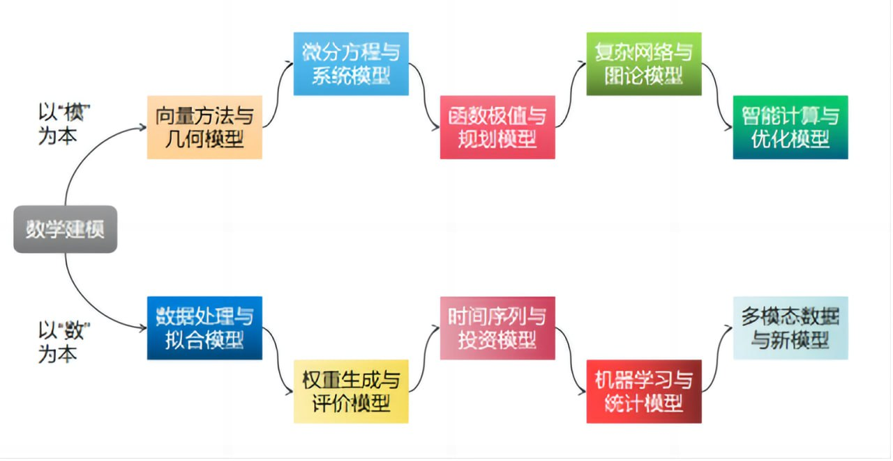

# 数学建模相关资源

## 一、数学建模相关学习网站

### 1.1 系统教程与慕课

| 资源 | 说明 | 链接/备注 |
|------|------|-----------|
| **Datawhale 数学建模教程** | 开源系统教程，含解析几何、微分方程、规划、图论、进化计算、数据处理、评价、时间序列、机器学习等 | [intro-mathmodel](https://datawhalechina.github.io/intro-mathmodel/) |
| **中国计量大学 · 数学建模** | 中国大学MOOC，含数学规划、统计回归、微分方程、时间序列、图论及 MATLAB/Lingo/SPSS | [中国大学MOOC](https://www.icourse163.org/course/ZGJL-1463200165) |
| **清华大学数学建模慕课** | 约 21 节，从绪论到七类模型（初等、优化、微分方程、代数、离散、概率、博弈） | 中国大学生在线、慕课平台可搜「清华大学 数学建模」 |
| **数学建模（个人站）** | 入门向资源汇总与解读 | [mathmodeling.ouxinyu.cn](http://mathmodeling.ouxinyu.cn/) |

### 1.2 入门建议

- **建模五步**：问题定义 → 模型假设 → 模型构建 → 求解分析 → 验证优化  

- **基础模型**：线性规划、回归分析、动态规划等；工具以 **Python** 或 **MATLAB** 为主。  

- **组队**：数学推导 + 编程/数据分析 + 论文撰写，专业互补。

---

## 二、数学建模国赛优秀论文

### 2.1 官方与权威渠道

| 渠道 | 说明 |
|------|------|
| **全国大学生数学建模竞赛官网** | 赛题发布、评奖结果、论文格式规范；[www.mcm.edu.cn](https://www.mcm.edu.cn/) |
| **中国大学生在线 · 论文展示** | 教育部平台，2012—2025 年国赛论文展示；[论文展示](https://dxs.moe.gov.cn/zx/hd/sxjm/sxjmlw/qkt_sxjm_lw_lwzs.shtml) |
| **中国知网** | 竞赛合作平台，报名、提交及历年优秀论文检索 |
| **高等教育出版社** | 冠名赞助方，赛题与配套资源 |

### 2.2 校内与社区资源

- **中国矿业大学**：校内优秀论文汇总 [51mcm.cumt.edu.cn](https://51mcm.cumt.edu.cn/c9/49/c14066a444745/page.htm)  

- **CSDN / 博客**：可搜「国赛 数学建模 优秀论文」「CUMCM 历年赛题」等，有历年赛题与论文整理（注意版权与时效性）。

### 2.3 近年国赛赛题概览（便于找对应论文）

- **2024**：板凳龙闹元宵、生产决策、农作物种植策略、反潜航空深弹、交通流量管控  

- **2023**：定日镜场优化、多波束测线、蔬菜自动定价、圈养湖羊、黄河水沙分析  

- **2022**：波浪能、无人机编队定位、古代玻璃制品鉴别、卫星通信、物料生产安排  

- **2021**：FAST 反射面调节、乙醇偶合制备、原材料订购运输、连铸切割优化、中药材鉴别  

> 国赛自 1992 年起每年一届，为「高校学科竞赛排行榜」赛事之一。查论文时以官网和「中国大学生在线」为准。

---

## 三、国赛备战计划（大二 · 零基础 · 7～30 天）

面向**大二、零基础**，按「最短 7 天冲刺」与「约 30 天系统备战」两条线整理；可按实际可用天数裁剪或合并。

### 3.1 7 天冲刺（时间紧时用）

| 天数 | 内容 |
|------|------|
| **Day 1** | 组队与分工（建模 + 编程 + 写作）；熟悉三类题型：**优化类、预测类、评价类**；建立「题目—模型」对应感 |
| **Day 2** | 精讲 2～3 个必学模型；选一道往年国赛题做**题目分析 + 模型选择**（不要求做完整） |
| **Day 3** | 编程实战：Python/Matlab 读数据、简单求解、**结果可视化**；原则：先「有结果、能解释」再追求复杂算法 |
| **Day 4** | 论文结构：问题重述 → 模型假设 → 模型建立与求解 → 结果分析；LaTeX 公式 + 图表规范 |
| **Day 5–7** | 选一道完整题做**限时模拟**；模型检验、结果优化、论文修改与定稿练习 |

### 3.2 约 30 天系统备战

| 阶段 | 时间 | 内容 |
|------|------|------|
| **组队与选题** | 第 1～2 周 | 组队（可请高数/建模老师推荐）；确定主攻 A/B/C 中一类（**大二零基础更建议 C 题**：数据/统计类，易上手、「言之有理」即可） |
| **模型学习** | 第 2～3 周 | **微分方程**（A 题常见）、**优化**（B 题：线性规划、遗传/蚁群等）、**评价**（C 题：AHP、熵权法、TOPSIS、主成分分析）；每类至少会 1～2 个模型 |
| **工具与代码库** | 贯穿 2～3 周 | 熟练一种语言（Python 或 Matlab）；整理常用算法代码、绘图模板，避免赛时从零写 |
| **模拟与论文** | 第 3～4 周 | 严格按赛时 3 天做 1～2 次模拟；精读 2～3 篇往年**国一/国二论文**，模仿结构与表述 |
| **赛前** | 最后几天 | 检查论文模板、排版、参考文献格式；保证休息与作息 |

### 3.3 大二零基础特别注意

- **选题**：优先考虑 **C 题**（数据分析/统计/评价），对数学要求相对友好，无唯一标准答案。  

- **分工**：队长统筹；三人角色清晰，避免有人闲置。  

- **资料**：可备《数学建模算法与应用》《数学模型》（姜启源、谢金星）及《数学建模案例选集》；赛前准备好论文模板与代码库。  

- **一句话**：编程手影响能否冲国奖，论文手影响能否稳拿奖；两者都要重视。

---

## 四、推荐教材与阅读

- **《数学模型》**（姜启源、谢金星、叶俊，高教社，有多版）—— 入门主教材。  

- **《数学建模案例选集》**（姜启源、谢金星）—— 案例补充。  

- **《数学建模算法与应用》**—— 算法与实现。  

以上链接与时间节点以撰写时信息为准，使用前可到官网（[www.mcm.edu.cn](https://www.mcm.edu.cn/)）与[中国大学生在线](https://dxs.moe.gov.cn/zx/hd/sxjm/sxjmlw/qkt_sxjm_lw_lwzs.shtml)核对最新赛程与论文展示。
