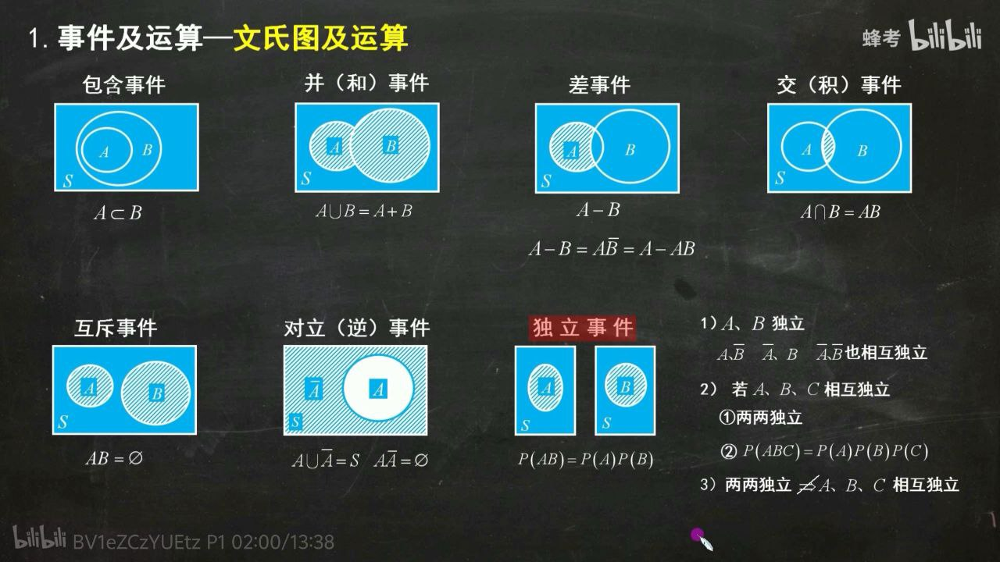

# 事件的运算及概率

## 事件及运算

### 文氏图

### 计算常用公式

- 德摩根律

    $$
    \overline{A \cup B} = \overline{A} \cap \overline{B}
    $$

    $$
    \overline{A \cap B} = \overline{A} \cup \overline{B}
    $$

- 加法公式

    $$
    P(A \cup B) = P(A) + P(B) - P(AB)
    $$

    $$
    P(A_1 \cup A_2 \cup \cdots \cup A_n) = \sum_{i=1}^n P(A_i) - \sum_{1 \leq i < j \leq n} P(A_i A_j) + \sum_{1 \leq i < j < k \leq n} P(A_i A_j A_k) - \cdots + (-1)^{n+1} P(A_1 A_2 \cdots A_n)
    $$

- 减法公式

    $$
    P(A - B) = P(A \overline{B}) = P(A) - P(AB)
    $$

- 对立事件

    $$
    P(\overline{A}) = 1 - P(A)
    $$

- 独立事件

    $$
    P(AB) = P(A)P(B)
    $$

## 古典概型

概率论发展初期的研究对象。

古典概型具有两个特点: **样本空间有限**和**基本事件等可能**。

## 几何概型

几何概型与古典概型类似，也属于**等可能概型**。

不同之处在于: 几何概型的样本空间是**连续**的，而古典概型的样本空间是**离散**的。

基于几何概型样本空间连续的特点，其样本空间通常可以通过长度、面积、体积、甚至是其他广义体积等几何度量来描述，因此称其为**几何**概型。

!!! example "咖啡馆问题"
    - [几何概型 - 我是8位的 | 博客园](https://www.cnblogs.com/bigmonkey/p/8944555.html)
