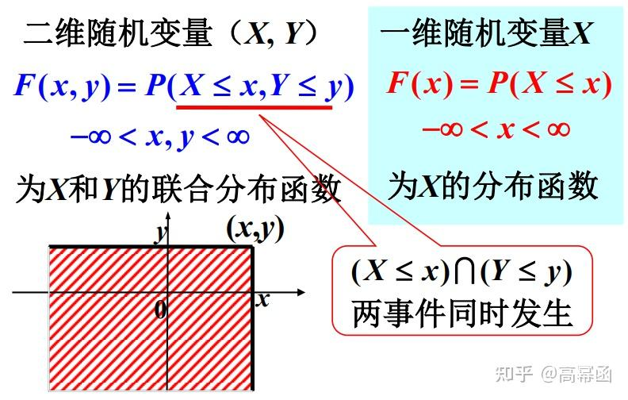
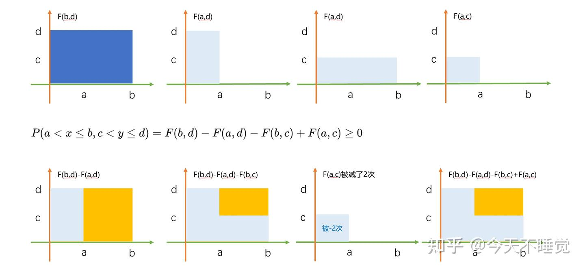

# 二维随机变量

## 二维随机变量

设 $X$ 和 $Y$ 是定义在样本空间 $S$ 上的随机变量，则称 $(X, Y)$ 为一个二维随机变量，或二维随机向量。

## 二维随机变量的分布函数

设 $(X, Y)$ 是一个二维随机变量，则称 $F(x, y) = P\{X \leqslant x, Y \leqslant y\}$ 为 $(X, Y)$ 的**分布函数**，或称为随机变量 $X$ 和 $Y$ 的**联合分布函数**。

### 分布函数的基本性质

1. $F(x, y)$ 是单调不减函数，即固定 $y$，对于任意的 $x_1 < x_2$，有 $F(x_1, y) \leqslant F(x_2, y)$；固定 $x$，对于任意的 $y_1 < y_2$，有 $F(x, y_1) \leqslant F(x, y_2)$。

    这个性质可以参考[一维随机变量的分布函数的基本性质](随机变量的分布函数.md#分布函数的基本性质)进行理解。

2. $0 \leqslant F(x, y) \leqslant 1$，且

    - 对于固定的 $y$，$F(-\infty, y) = 0$；

    - 对于固定的 $x$，$F(x, -\infty) = 0$；

    - $F(\infty, \infty) = 1, F(-\infty, -\infty) = 0$；

    这个性质同样可以参考[一维随机变量的分布函数的基本性质](随机变量的分布函数.md#分布函数的基本性质)进行理解。

3. $F(x, y)$ 是右连续函数，即对于任意的 $x$，有 $F(x, y) = F(x+0, y)$；对于任意的 $y$，有 $F(x, y) = F(x, y+0)$。

4. 对于任意 $(x_1, y_1)$，$(x_2, y_2)$，$x_1 < x_2$，$y_1 < y_2$，有：

    $$
    F(x_2, y_2) - F(x_1, y_2) - F(x_2, y_1) + F(x_1, y_1) \geqslant 0
    $$

    

    $$
    P\{x_1 < X \leqslant x_2, Y \leqslant y\} = F(x_2, y) - F(x_1, y)
    $$

    $$
    P\{X \leqslant x, y_1 < Y \leqslant y_2\} = F(x, y_2) - F(x, y_1)
    $$

    $$
    P\{x_1 < X \leqslant x_2, y_1 < Y \leqslant y_2\} = F(x_2, y_2) - F(x_1, y_2) - F(x_2, y_1) + F(x_1, y_1)
    $$

    !!! review "几何证明"
        

          <iframe src="https://player.bilibili.com/player.html?isOutside=true&aid=113110916661769&bvid=BV1JXppejE8q&p=18&t=461&autoplay=0" 
          scrolling="no" 
          border="0" 
          frameborder="no" 
          framespacing="0" 
          allowfullscreen="true"> 
          </iframe>
        

