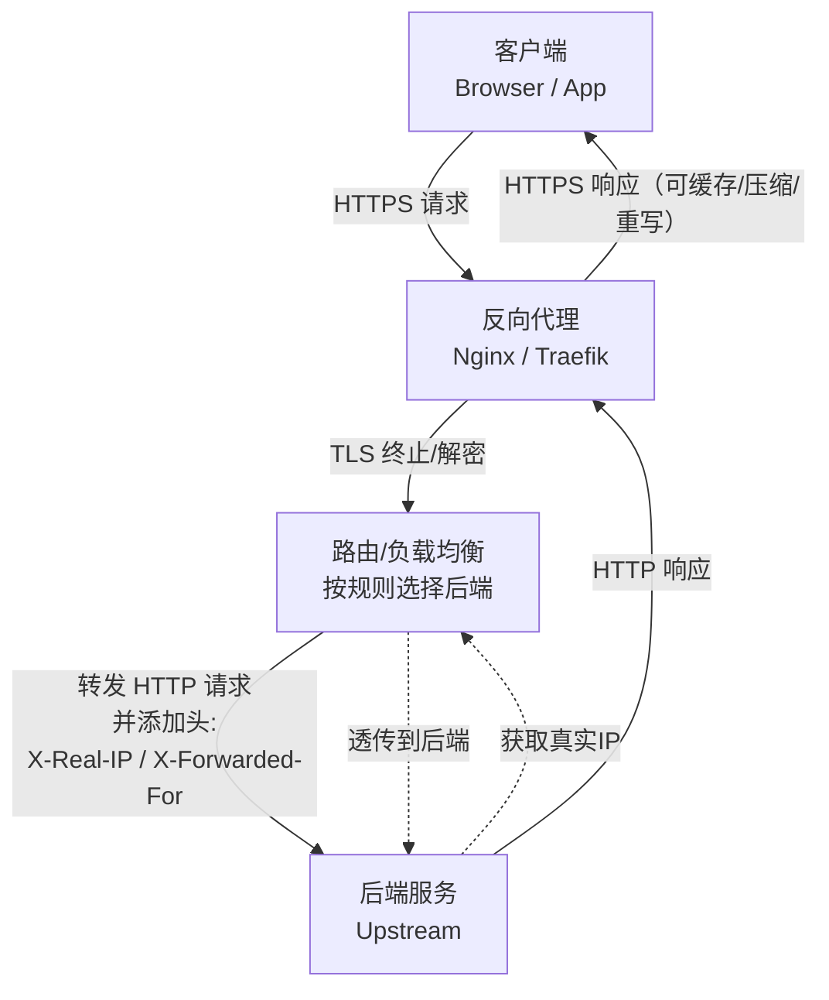

# 反向代理

## 什么是反向代理

**反向代理**（*Reverse Proxy*）是一种网络架构模式，由一台或多台代理服务器位于客户端与后端真实服务器（上游服务器）之间，负责接收客户端的所有请求，然后按照规则转发给后端服务器处理，最后将响应返回给客户端。客户端以为自己直接访问的就是目标服务器，而实际上并不知道后端服务器的真实地址和细节。

!!! example "与正向代理的对比"
    - **正向代理**（*Forward Proxy*）：代理客户端（帮用户上网），隐藏客户端身份，常用于突破访问限制、隐私保护等。服务器不知道真实的客户端是谁。

        ```mermaid
        flowchart TD
            C[客户端<br/>Browser / App] -->|发起请求<br/>HTTP 或 HTTPS| FP[正向代理<br/>Forward Proxy]
            FP -->|代表客户端访问| S[目标服务器<br/>Upstream / Internet]
            S -->|响应| FP
            FP -->|转发回客户端| C

            %% 关键点：目标服务器只看到“正向代理”的网络信息
            S -. 看见: 代理IP/来源信息 .-> FP
            FP -. 代理转发: 随后隐藏客户端IP .-> C
        ```

    - **反向代理**：代理服务器（帮后端服务），隐藏后端服务器身份。客户端不知道真实的服务器是谁。

## 反向代理怎么运作

1. 客户端发送请求到反向代理服务器（通常是公开域名或IP）。

2. 反向代理服务器接收请求，根据配置规则（如路径、主机头、负载均衡策略）决定转发给哪个后端服务器。

3. 后端服务器处理请求后，返回响应给反向代理。

4. 反向代理将响应返回给客户端（可以对响应进行修改、缓存、压缩等）。



整个过程中，反向代理可以进行SSL/TLS 终止（客户端到代理用HTTPS，代理到后端可以用HTTP，提高性能），也可以添加各种头信息（如 X-Real-IP、X-Forwarded-For）让后端知道客户端真实信息。

常见协议支持：HTTP/HTTPS（七层代理，最常见）、TCP/UDP（四层代理，如 Stream 模块）。

## 常见的反代工具

### Caddy

> [Documentation | Caddy](https://caddyserver.com/docs)

Caddy 是用 Go 语言编写的现代服务器，核心优势是自动 HTTPS 和极简配置（Caddyfile）。

其配置使用 `Caddyfile`，语法简洁、人性化，**默认开启 HTTPS（自动从 Let’s Encrypt 获取并续期证书）**，非常适合快速部署和开发者场景。配置重载也更友好（支持 API）。

- 静态web服务

    ```Caddyfile
    domain.com {
      root * /var/www/html
      file_server
    }
    ```

- 反向代理

    ```Caddyfile
    domain.com {
      reverse_proxy backend:port
    }
    ```

    如果是一些简单的反代需求，也可以直接使用单行命令直接一键部署：

    ```bash
    caddy reverse-proxy --from domain.com --to backend:port
    ```

- 负载均衡（多个上游）

    ```Caddyfile
    domain.com {
        reverse_proxy backend1:9000 backend2:9000 {
            lb_policy round_robin # 负载均衡策略
        }
    }
    ```

### Nginx

> [Beginner’s Guide | Nginx](https://nginx.org/en/docs/beginners_guide.html)

Nginx 是经典的 C 语言实现，强调性能、灵活性和细粒度控制，适合需要高性能调优、复杂路由/缓存规则、大型生产环境、已有大量 Nginx 经验的团队。

Nginx 配置基于 nginx.conf 文件，采用块状结构（`events`、`http`、`server`、`location`等），功能强大但配置相对复杂，特别适合高并发、大流量场景。

- 静态web服务

    ```nginx
    server {
        listen 80;
        server_name example.com;
        root /var/www/html;
        index index.html index.htm;

        location / {
            try_files $uri $uri/ =404;
        }
    }
    ```

- 反向代理

    ```nginx
    server {
        listen 80;
        server_name example.com;

        location / {
            proxy_pass http://backend:port;
            proxy_set_header Host $host;
            proxy_set_header X-Real-IP $remote_addr;
            proxy_set_header X-Forwarded-For $proxy_add_x_forwarded_for;
            proxy_set_header X-Forwarded-Proto $scheme;
        }
    }
    ```

- 负载均衡（Upstream模块）

    ```nginx
    upstream backend {
        server backend1.example.com weight=3;
        server backend2.example.com;
    }

    server {
        listen 80;
        location / {
            proxy_pass http://backend;
        }
    }
    ```

### Traefik

> [Traefik Proxy Documentation | Traefik](https://doc.traefik.io/traefik/)

Traefik 是新一代的反向代理/负载均衡器，强调易用性、动态配置和自动化。适合需要自动发现服务、自动配置路由、自动监控和日志收集、多云/混合云环境的团队。

Traefik 配置基于 YAML 文件，采用模块化设计（`http`、`tcp`、`tls`、`middlewares`等），功能强大但配置相对复杂，特别适合需要自动化管理、多云/混合云环境、已有 Traefik 经验的团队。
