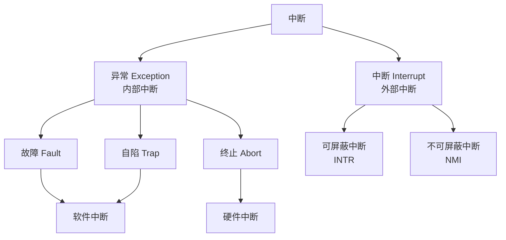
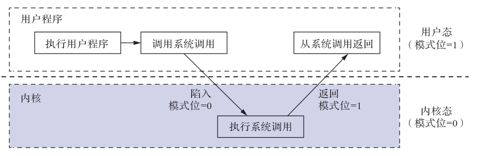

# 操作系统运行环境

## 处理机运行模式

### 内核态与用户态

- 内核态（管态、核心态）

    在此状态下，处理机可运行除*访管指令*的所有**特权指令**与**非特权指令**。

    !!! note "访管指令"
        访管指令（*Trap Instruction*）是操作系统提供给用户程序的接口，用户程序通过访管指令请求操作系统服务。访管指令是操作系统最基本的特性，是操作系统实现的关键。

        ==本质上，访管指令就是[自陷中断](#中断与异常)的一种特殊形式==。

- 用户态（目态）

    在此状态下，处理机只能运行**非特权指令**。

!!! note "特权指令与非特权指令"

    - **特权指令**: 不允许用户直接使用的指令，==必须在内核态下运行==，以下类型的指令均属于特权指令:

        - ==用于直接管理系统资源的指令==，如设置时钟、启动/关闭硬件设备、切换进程、设置中断等

        - ==系统状态修改指令==，如修改中断向量表、切换CPU的运行模式等

        - ==系统控制指令==，如停机指令、重启指令等

    - **非特权指令**: 允许用户直接使用的指令，==不能直接访问系统中的软硬件资源，仅限于访问用户的地址空间==

## 中断与异常

!!! abstract "中断类型"
    
    - **异常（内部中断）**：由CPU内部事件引起的中断
    
        - **故障（Fault）**：可恢复的异常，如缺页异常、除零异常

        - **自陷（Trap）**：程序主动触发的异常，如系统调用

        - **终止（Abort）**：不可恢复的严重错误，如硬件故障
    
    - **中断（外部中断）**：由外部设备引起的中断
    
        - **可屏蔽中断（INTR）**：可以被CPU屏蔽的中断

        - **不可屏蔽中断（NMI）**：不能被屏蔽的紧急中断

## 系统调用

==系统调用是操作系统提供给用户程序的接口，用户程序通过系统调用请求操作系统服务==。系统调用是操作系统最基本的特性，是操作系统实现的关键。

- **设备管理**: 完成设备的请求或释放，以及设备启动等功能

- **文件管理**: 完成文件的读写、创建、删除等操作

- **进程管理**: 完成进程的创建、撤销、阻塞、唤醒等操作

- **进程通信**: 完成进程之间的消息传递或信号传递，包括进程间同步、互斥、信号量等操作

- **内存管理**: 完成内存的分配、回收以及获取作业占用内存区大小和起始地址等操作

从图示不难看出，==系统调用的过程依赖于[中断机制](#中断与异常)==。
