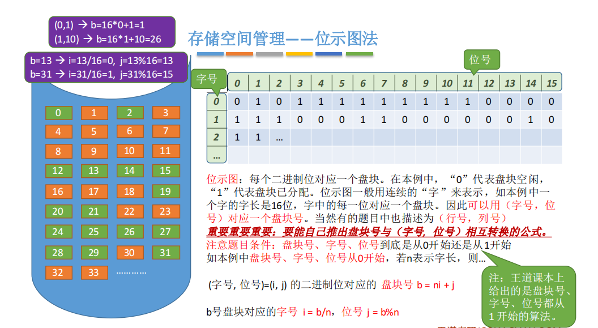
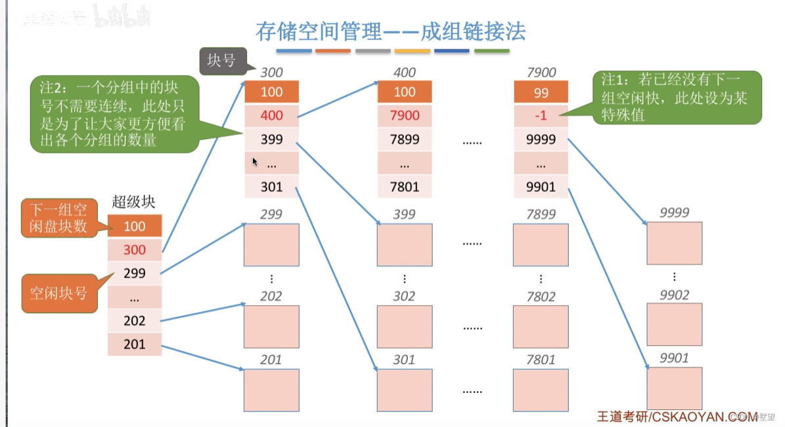
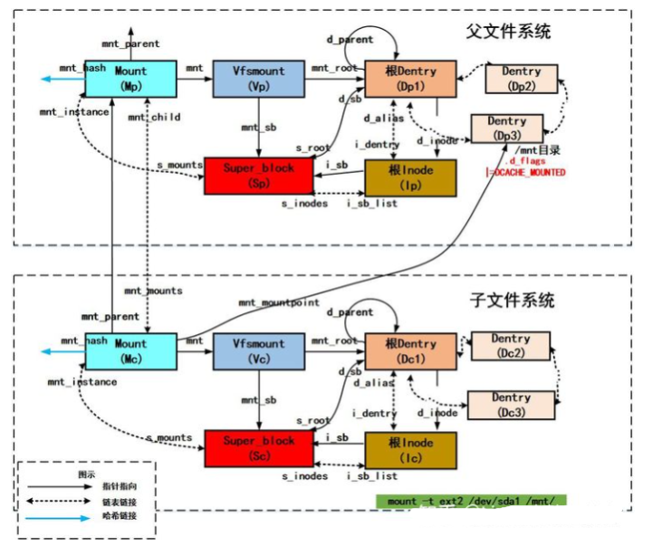

# 文件系统

## 文件系统结构

**文件系统（File System）**提供高效和便捷管理的磁盘访问，以便允许存储、定位、提取信息。

下图是一个文件系统层次结构示例图[^1]:

!!! question
    文件系统有两个设计问题:

    - 一是如何定义文件系统的用户接口。这涉及定义文件及其属性、所允许的文件操作、如何组织文件的目录结构

    - 二是如何创建算法与数据结构，以便映射逻辑文件系统到物理外存设备

现代操作系统有多种文件系统类型，因此文件系统的层次结构也不尽相同。

### I/O控制层

包括设备驱动程序和中断处理程序，在内存和磁盘系统之间传输信息。

设备驱动程序将输入的命令翻译成具体的操作指令，硬件控制器利用这些指令使I/O设备与系统交互。

### 基本文件系统

向对应的设备驱动发送通用命令，以读取和写入磁盘的物理块。

### 文件组织模块

组织文件及其逻辑块和物理块。

### 逻辑文件系统

用于管理文件系统中的元数据信息。

## 文件系统布局

### 文件系统在磁盘中的结构

多数磁盘可划分为若干个分区，每个分区中有一个独立的文件系统。下图是一个实例[^2]:

- **主引导记录（*Master Boot Record*, MBR）**: 位于磁盘的第一个扇区（0号扇区），包含引导程序，用于引导计算机。

    MBR后面是**分区表**，用于记录分区的信息，比如每个分区的起始地址和结束地址等。

    表中的第一个分区被标记为活动分区。当计算机启动时，BIOS读入并执行MBR。MBR执行的第一件事是**确定活动分区**，并读取该分区的第一个扇区（块），即**引导扇区（*Boot Sector*）**或**引导块（*Boot Block*）**。

    ??? tip "MBR vs GPT"
        MBR 可以用在 DOS 、Microsoft Windows 和 Linux 操作系统中。从 2010 年代中期开始，大多数新计算机都改用 GUID 分区表（GPT）分区方案。关于二者的对比，可参考[这篇文章](https://www.geeksforgeeks.org/operating-systems/mbr-vs-gpt-partition-in-os/)

- **引导扇区（块）**: MBR执行引导块的程序后，该程序负责启动该分区中的操作系统。

- **超级块（*Super Block*）**: 包含文件系统的元数据信息，比如文件系统的类型、大小、空闲空间等。

    在计算机启动时，或者该文件系统首次使用时，对应的超级块会被读入内存。

- **空闲块信息**: 使用[位示图](#位示图法)或指针链接的形式给出。

### 文件系统在内存中的结构

内存中的信息用于管理文件系统并通过缓存来提高性能。这些数据在[安装（挂载）文件系统](#文件系统挂载)时被加载；在文件系统操作期间被更新；卸载时被丢弃。

## 文件存储空间管理

>[文件存储空间管理-操作系统——文件存储空间管理、文件基本操作、文件共享和保护及文件系统的层次结构 | 博客园@王陵](https://www.cnblogs.com/wkfvawl/p/11871519.html)

### 空闲表法

空闲表法属于**连续分配方式**，与内存的[动态分区分配](内存管理概述.md#动态分区分配)类似，为每个文件分配一块连续的存储空间。

### 空闲链表法

空闲链表法是指将所有的的空闲盘区拉成一条空闲链，根据[链表](../../dsa/ds/linear/linked-list.md)的特性，适合**离散**管理。分为以下两类:

#### 空闲盘块链

**空闲盘块链**是指将磁盘上的所有空闲空间以**盘块**为单位拉成一条链。

#### 空闲盘区链

同理，**空闲盘区链**的操作单位就是**盘区**，每个盘区包含若干**相邻**的盘块。

### 位示图法

>[位示图法-文件存储空间管理 | 博客园@无名](https://www.cnblogs.com/culin/p/17102038.html#%E4%BD%8D%E7%A4%BA%E5%9B%BE%E6%B3%95)

**位示图**是利用二进制的位来表示磁盘中一个盘块的使用情况，磁盘上的所有盘块都有一个二进制与之对应。

- **分配**:

    1. **顺序**扫描位示图，找出一个或一组值为0的二进制位（表示空闲）

    2. 将找到的二进制位转换为对应的盘块号，然后分配给文件。设每行位数为 $n$，位的行号为 $i$，列号为 $j$，则对应的盘块号 $b$ 为:
    
        $$
        b = n(i - 1) + j
        $$

    3. 修改位示图，将分配区域置1

- **回收**:

    就是分配的逆向过程。

    1. 根据盘块号 $b$ 计算出行号 $i$ 和列号 $j$:

        - $i = (b - 1) DIV n + 1$

        - $j = (b - 1) MOD n + 1$
    
    2. 将对应的二进制位置0

### 成组链接法

链上每个节点记录1组空闲块。适合大型文件系统，分配、释放快，链本身短，占空间少。UNIX用之[^3]。

## 虚拟文件系统

>[Linux虚拟文件系统-一文讲解虚拟文件系统（Virtual File System，VFS）| 知乎@Linux内核库](https://zhuanlan.zhihu.com/p/562727883)

**虚拟文件系统（*Virtual File System*, VFS）**是操作系统中的一种软件层，它屏蔽了底层不同文件系统的差异和操作细节，向上提供了一种统一的文件系统接口，使得不同的文件系统可以透明地被使用。

### 对象类型

虚拟文件系统采用了**面向对象**的思想，抽象出一个通用的文件系统模型，定义了通用文件系统都支持的接口。

为实现虚拟文件系统，系统抽象了四种对象类型。每个对象都包含数据和函数指针，这些函数指针指向具体的文件系统实现函数:

#### 超级块对象

表示一个已安装（挂载）的特定文件系统。对应磁盘上特定扇区的文件系统超级块，用于存储已安装文件系统的元数据。

其操作方法包含一系列可在超级块对象上调用的操作函数:

- `read_inode`：从一个已挂接的文件系统上读一个特定的索引节点

- `wrie_inode`：把给定的索引节点写回到磁盘

- `put_inode`：释放索引节点

- `delete_inode`：从磁盘上删除索引节点

- `notify _inode`：当索引节点的属性发生变化时调用

- `putauper`：当VFS卸载一个给定的超级块时调用

- `write_super`：当VFS决定把超级块写回到磁盘时调用

- `statfs`：获取文件系统的统计信息

- `remount_fa`：当文件系统重新挂接时调用

- `clear_inode`：释放索引节点，同时清除任何包含相关数据的页

#### 索引节点对象

表示一个特定的文件（索引节点与文件是一一对应的关系[^4]）。

索引节点对象提供如下函数:

- `create`：为与某一目录下的目录项对象相关联的普通文件创建一个新的索引节点

- `lookup`：为对应于一个文件名的索引节点查找一个目录

- `mkdir`：为与某一目录下的目录项对象相关联的目录创建一个新的索引节点

#### 目录项对象

表示一个特定的目录项。

**目录项（*Directory Entry*, dentry）对象**是一个路径上的特定组成部分，包含指向关联索引节点的指针，还包含指向父目录和指向子目录的指针。

#### 文件对象

表示一个与进程相关的已打开文件。

文件对象和物理文件的关系类似进程和程序的关系。**文件对象仅仅是进程视角上一个已打开的文件**，它反过来指向其索引节点。

文件对象包含与该文件相关联的目录项对象，包含该文件的文件系统、文件指针等，还包含在该文件上的一系列操作函数（[文件操作](文件系统概述.md#文件操作)函数）

### Linux虚拟文件系统

>[虚拟文件系统 | 阿里云开发者社区](https://developer.aliyun.com/article/296957)
>
>[Linux虚拟文件系统VFS | freeOA](http://www.freeoa.net/osuport/storagebak/linux-vfs-intro_965.html)

## 文件系统挂载

文件在被访问前需要打开，文件系统在被进程使用前也需要安装，也称为**挂载（*mount*）**。

将设备中的文件系统挂载到某个目录后，就可以通过这个目录来访问该设备上的文件。

!!! note
    注意这里的设备指的是**逻辑上的设备**，如一个磁盘上的不同分区都可以视为不同的设备。

- Windows维护一个扩展的[两级目录结构](目录.md#两级目录)，用驱动器字母表示设备和卷

    

    卷具有常规树结构的目录，与驱动号相关联，还包含指向已安装文件系统的指针。

- UNXI使用系统的根文件系统，在系统启动时直接安装，也是内核映像所在的文件系统。

    

    除了根文件系统，所有其他文件系统都需要先挂载到**根文件系统的某个子目录**后才能被访问。

### 挂载原理

>[深入剖析Linux文件系统之文件系统挂载(一) | 知乎@Linux内核库](https://zhuanlan.zhihu.com/p/515683237)
>
>[深入剖析Linux文件系统之文件系统挂载(二) | 知乎@Linux内核库](https://zhuanlan.zhihu.com/p/515769749)

[^1]: [文件系统结构 | C++编程指南](https://chengxumiaodaren.com/docs/operate-system/file-system/#%e4%b8%80%e6%96%87%e4%bb%b6%e7%b3%bb%e7%bb%9f%e7%bb%93%e6%9e%84)

[^2]: [设计一个文件系统，需要考虑哪些因素 | 博客园@程序员cxuan](https://www.cnblogs.com/cxuanBlog/p/12517595.html)

[^3]: [成组连接法-操作系统——文件存储空间管理、文件基本操作、文件共享和保护及文件系统的层次结构 | 博客园@王陵](https://www.cnblogs.com/wkfvawl/p/11871519.html#5%E3%80%81%E6%88%90%E7%BB%84%E8%BF%9E%E6%8E%A5%E6%B3%95)

[^4]: [索引节点-文件系统概述](文件系统概述.md#索引节点)