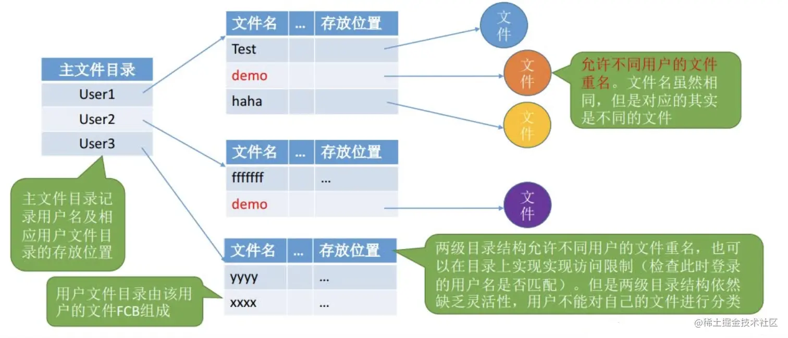
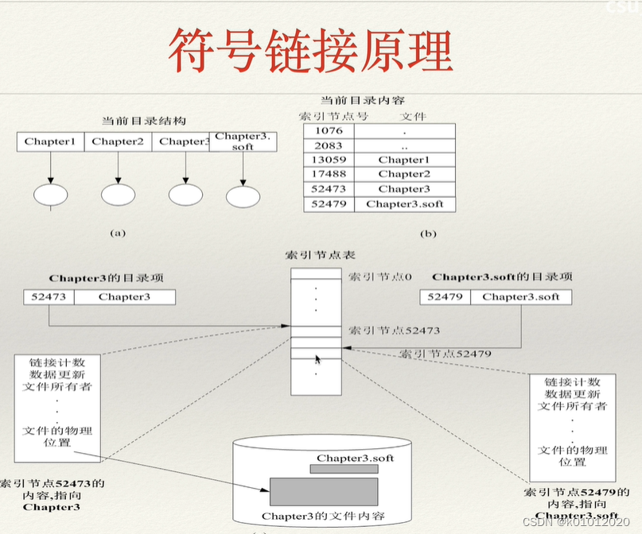

# 目录

## 基本概念

[FCB](文件系统概述.md#文件控制块)的有序集合称为**文件目录**，一个FCB就是一个文件目录项。

## 目录操作

- 搜索: 使用文件时，需要先找到文件的FCB，即找到文件目录项

- 创建文件: 创建一个新文件时，需要在目录中增加一个目录项

- 删除文件: 与创建文件同理

- 创建目录: 在树型目录结构中，用户可创建自己的用户文件目录，并可再创建子目录

- 删除目录

    - 不删除非空目录: 删除时要先删除目录下的所有文件，并递归地删除子目录

    - 可删除非空目录: 目录中的文件和子目录同时被删除

- 移动目录: 将文件或子目录在不同的父目录间移动，文件路径会随之改变

- 显示目录: 请求显示目录中的所有文件和子目录

- 修改目录: 修改目录的名称、属性等，需要改变相应的目录项

## 目录结构

>[文件目录-重学操作系统之文件管理 | 稀土掘金@蛙哇](https://juejin.cn/post/7043687172951506980#heading-9)

### 单级目录

整个系统中只建立一张目录表，每个文件占用一个目录项。

- **建立一个新文件时**，必须先检索所有目录项，以确保**文件名唯一**，然后在该目录表中增加一个目录项，将新文件的属性信息填入其中

- **访问一个文件时**，先按文件名在该目录中找到相应的FCB，经合法性检查后执行相应的[访问操作](文件系统概述.md#访问类型)

- **删除一个文件时**，先在该目录中找到相应的FCB，回收文件占用的存储空间，然后清除该目录项

单级目录实现了“按名存取”，但是文件名不能重复、查找速度慢、不便于文件共享等。这些问题导致单击目录**不适合用于多用户系统**。

### 两级目录

为克服单级目录存在的问题，可在单级目录的基础上增加一个目录表，将整个目录分为**主文件目录（Master File Directory, MFD）**和**用户文件目录（User File Directory, UFD）**两级。
，并清除该目录项

其中:

- **主文件目录项**记录用户名及相应用户文件目录所在的存储位置。

- **用户文件目录项**记录该用户所有文件的FCB。

两级目录提高了检索的速度。当一个用户欲对其文件进行访问时，只需搜索该用户对应的UFD即可，解决了不同用户文件的“重名”问题还一定程度上保证了文件的安全性（可在不同用户目录上实现**访问限制**）。

但两级目录缺乏灵活性，**无法对文件进行分类**。

### 树型目录

将两级目录再推广就形成了多级目录，也就是**树型目录**。

[Linux系统目录](https://www.cnblogs.com/jxhd1/p/6715826.html)就是典型的树型目录结构。

不止Linux，目前主流的操作系统大多都采用树型目录。

### 有向无环图目录

树型目录便于进行文件分类，但不便于进行文件共享。

为此在树型目录的基础上增加一些指向相同节点的**有向边**，使整个目录形成一个**有向无环图**，这就是**有向无环图目录**。

这种结构允许目录共享子目录或文件，同一个文件或子目录了可以出现两个或多个目录中。

每个共享节点需要设置一个**共享计数器**，用于记录有多少个共享链指向该节点。当用户意图删除一个共享节点时，只有当共享计数器为0时，才真正删除该节点，否则只删除共享链。

## 目录实现

### 线性列表

采用文件名和数据块指针的线性列表。实现简单，但查找费时。

线性列表可以是[线性表](../../DataStructureAndAlgorithm/408/线性表的顺序表示.md)或[链表](../../DataStructureAndAlgorithm/408/线性表的链式表示.md)，相关操作的时间复杂度与之相关。

### 哈希表

根据文件名得到一个值，并返回一个指向线性列表中元素的指针。

显然，这样会使得查找速度大大提高，并且可以快速插入或删除（目录项线性列表采用链表）；但需要处理哈希表最显著的缺点，即**哈希冲突**。

## 文件共享

前面提到了，基于[有向无环图目录](#有向无环图目录)，我们可以通过建立链接来实现文件的共享。

链接也分为两类: **基于索引节点的链接**和**基于符号链接的共享**

### 基于索引节点的链接

基于[文件索引节点](文件系统概述.md#索引节点)的链接也叫**硬链接**，它将文件的物理地址和属性等信息不再存放在目录项中，而是存放在索引节点里，在目录项中只设置文件名及指向相应索引节点的指针。

在索引节点中有一个**链接计数器**，也称**引用计数**，用于记录链接到本索引节点（文件）上的用户目录项数量。就是我们在介绍[有向无环图](#有向无环图目录)时提到的**共享计数器**的具体实现。

### 基于符号链接的共享

采用符号链接的共享链也叫**软链接**。使用软链接时，只有主文件才拥有指向其索引节点的指针，其他用户目录项中只有文件名及该文件的路径名。

### *Linux系统下的软硬链接

>[彻底明白Linux硬链接和软链接 | 知乎@混说Linux](https://zhuanlan.zhihu.com/p/438694636)
>
>[linux之软连接和硬连接的区别 | 腾讯云开发者社区](https://cloud.tencent.com/developer/article/1882980)

