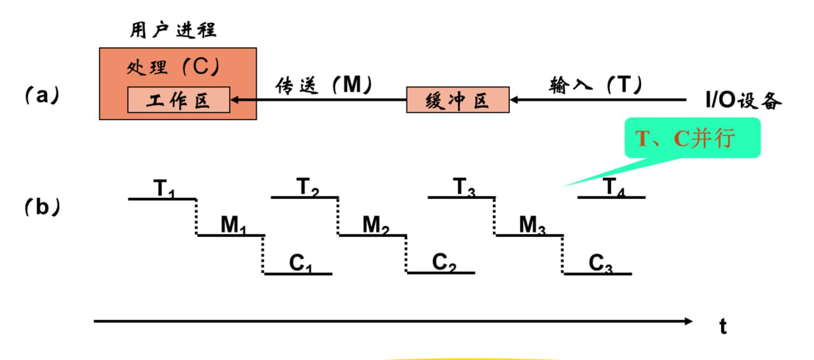
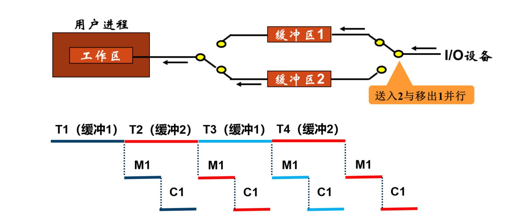
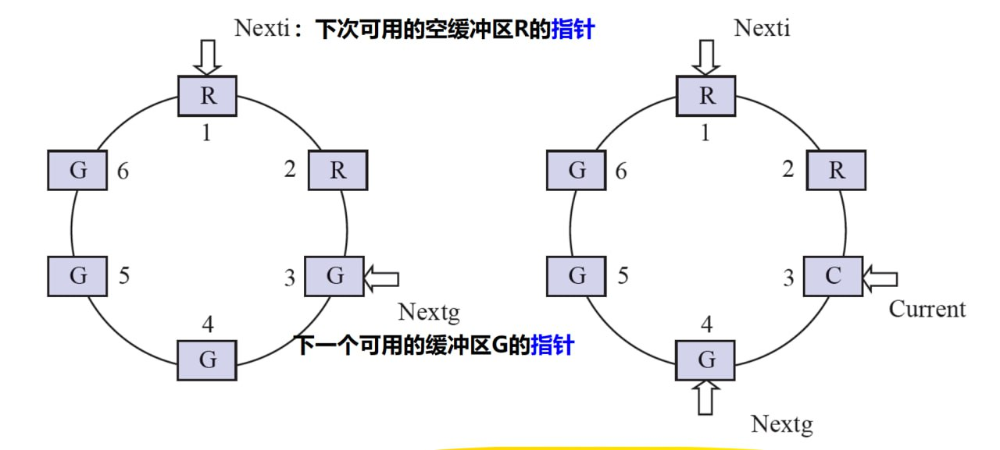

# 设备独立性软件

为了提高OS的可适应性和可扩展性，在现代OS中都无一例外地增加了与设备无关的I/O软件，以实现了设备独立性，也称设备无关性。

!!! tip "设备独立性"
    应用程序所用的设备不局限于使用某个具体的物理设备

为实现设备独立性，必须在设备驱动程序上设置一层软件，称为**设备独立性软件**，也叫**与设备无关的软件**。

设备独立性软件是I/O系统的最高层软件，其界限因操作系统和设备的不同而有所差异。比如，有时一些本应由设备独立性软件实现的功能也可能放在驱动程序中实现。总体而言，<mark>设备独立性软件包括执行所有设备公有操作的软件</mark>。

## 高速缓存与缓冲区

### 磁盘高速缓存

操作系统中使用磁盘高速缓存技术来提高磁盘的I/O速度，对高速缓存的访问要比对硬盘的访问高效得多。

需要注意的是，磁盘高速缓存技术不同于通常意义下的介于CPU与内存之间的小容量高速存储器，而是指**利用内存中的存储空间**来暂存从硬盘中读出的一系列盘块中的信息。因此，磁盘高速缓存**逻辑上属于磁盘**，**物理上是驻留在内存中的盘块**。

磁盘高速缓存在内存中分为两种形式:

- 一种是在内存中开辟一个单独的空间作为缓冲区，**大小固定**

- 另一种是将未利用的内存空间作为一个缓冲池，供请求分页系统和磁盘I/O**实时共享**

### 缓冲区

在设备管理子系统中，引入缓冲区的目的主要如下:

1. 缓和CPU与I/O设备速度不匹配的矛盾

2. 减少对CPU的中断频率，放宽对CPU中断响应时间的限制

3. 解决基本数据单元大小（数据粒度）不匹配的问题

4. 提高CPU和I/O设备之间的并行性

缓冲区的实现方法如下:

1. 采用硬件缓冲器（成本较高，非关键部位一般不使用）

2. 采用内存作为缓冲区

根据系统设置的缓冲区个数，缓冲技术可以分为如下几种:

#### 单缓冲

#### 双缓冲

#### 循环缓冲

#### 缓冲池

### 二者对比

## 设备分配与回收

### 设备分配的数据结构

### 设备分配时应考虑的因素

### 设备分配的步骤

### 逻辑设备名到物理设备名的映射

## 假脱机技术

>[Spooling in Operating System | GeeksforGeeks](https://www.geeksforgeeks.org/operating-systems/spooling-in-operating-system/)

## 设备驱动程序接口

## I/O操作举例
