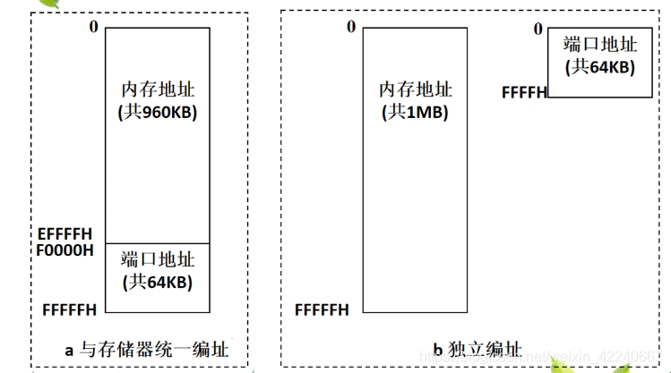
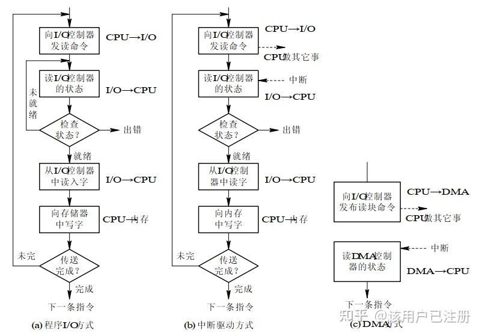
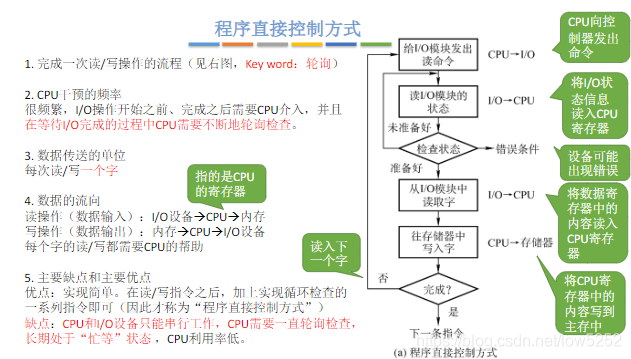
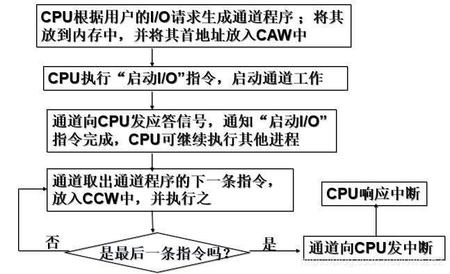

# I/O管理概述

## I/O 设备

**输入输出（*Input/Output*, I/O）**设备是操作系统设计中最凌乱最具挑战性的部分。

其包含各个领域的设备及与设备相关的应用程序，很难有一个通用的设计方案。

### 设备的分类

- 按信息交换的单位分类

    - 块设备: 信息交换以**块**为单位，如磁盘、光盘等。传输速率较高、可寻址，即可**随机读/写**。

    - 字符设备: 信息交换以**字符**为单位，如交互式终端机、打印机等。传输速率低，不可寻址，通常采用**中断I/O方式**。

- 按传输速率分类

    - 低速设备: 速率 $\leq 1\text{KB/s}$，如键盘、鼠标等。

    - 中速设备: $1\text{KB/s} \thicksim 10\text{KB/s}$，如激光打印机等。

    - 高速设备: $100\text{KB/s} \thicksim 1000\text{MB/s}$，如磁盘、光盘等。

- 按使用特性分类

    - 人机交互设备: 如键盘、鼠标等。

    - 存储设备: 如磁盘、光盘等。

    - 网络设备: 如网卡、调制解调器等。

- 按设备的共享属性分类

    - 独占设备: 同一时段只能由一个进程占用。低速设备一般是独占设备，如打印机。

    - 共享设备: 同一时段允许多个进程同时访问的设备。通过分时的方式实现共享，如磁盘。

    - 虚拟设备: 通过[SPOOLing（假脱机）技术](设备独立性缓存.md#假脱机技术)将独占设备改造为共享设备，将一个物理设备虚拟为多个逻辑设备，从而将设备同时分配给多个进程。

### I/O接口

>[IO接口 | 博客园@AH20](https://www.cnblogs.com/AH20/p/18493784)

**I/O接口**也称**设备控制器**，是CPU与I/O设备之间的桥梁，用于实现CPU与I/O设备之间的数据交换。

I/O接口收发来自CPU的I/O指令，并根据指令的内容控制I/O设备工作。使CPU能能从繁杂的设备控制事务中解脱出来，专注于其他任务。

#### 接口组成

设备控制器主要由三个部分组成:

- 设备控制器与CPU的接口: 用于实现CPU与设备控制器之间的通信。有三条信号线:

    - 数据线: 用于传输读/写信息、控制信息、设备状态信息等

    - 地址线: 用于传输要访问I/O接口中的寄存器编号

    - 控制线: 用于传输读/写控制信号

- 设备控制器与设备的接口: 用于实现设备控制器与设备之间的通信。控制器中一个或多个设备接口，每个接口都可以传输数据、控制和状态三种类型的信号。

- I/O逻辑: 用于实现对设备的控制。

#### 接口类型

- 按数据传送方式来看，I/O接口可分为**并行接口**和**串行接口**。

- 按主机访问I/O设备的控制方式来看，I/O接口可分为**程序查询接口**、**中断接口**、**DMA接口**等。

- 按功能选择的灵活性，可分为**可编程接口**（通过编程改变接口的功能）和**不可编程接口**。

### I/O端口

**I/O端口**是设备控制器中一些可以直接被CPU访问的**寄存器**，用于存储设备的状态、控制信息、数据等。

I/O端口可以分为三类:

- 数据寄存器: 用于缓存从设备送来的输入数据，或从CPU送来的将要发送到设备的输出数据

- 状态寄存器: 保存设备的执行结果或状态信息，以供CPU读取

- 控制寄存器: 由CPU写入，以便启动命令或更改设备模式

由于本质上都是寄存器，所有想要能够被CPU访问，就必须对各个I/O端口进行编址。

编址方式分为**统一编址**和**独立编址**两种:

## I/O控制方式

>[操作系统--I/O 控制方式 | 知乎@该用户已注册](https://zhuanlan.zhihu.com/p/533314954)
>
>[操作系统I/O控制方式详解 | CSDN@水无垠ZZU](https://blog.csdn.net/low5252/article/details/106503034)

### 程序直接控制

CPU对I/O设备的控制采取轮询的I/O方式，也称**程序轮询**方式。

### 中断驱动控制

**中断驱动**方式的核心思想是允许I/O设备**主动**打断CPU的运行并请求服务，从而将CPU从轮询的I/O方式中解脱出来，向设备控制器发出一条I/O指令后可以继续做其他任务。

### DMA控制

**DMA（直接存储器存取）**方式的核心思想是，在I/O设备和内存之间开辟**直接的数据交换通路**，数据交换不经过CPU，从而彻底解放CPU。

DMA方式的特点:

1. 基本传送单位是**数据块**，不再是字节

2. 所传送的数据，是从设备直接送入内存的（或反之），不经过CPU

3. 仅在传送一个或多个数据块的开始和结束时，才需要CPU干预，整块数据的传送是在DMA控制器的控制下完成的

为了实现主机和控制器之间直接交换成块的数据，DMA控制器中需要包含以下组成部分:

1. 命令/状态寄存器（CR）: 暂存从CPU发来的I/O指令或设备的状态信息

2. 内存地址寄存器（MAR）: 在输入时，它存放将数据从设备传送到内存的起始目标地址；在输出时，它存放从内存至设备的内存源地址

3. 数据寄存器（DR）: 暂存从设备送来的数据或从内存送来的数据

4. 数据计数器（DC）: 在输入时，它指出本次交换数据的总块数；在输出时，它指示剩余传送的字节数。即本次要传送的字（节）数

### 通道控制

## I/O软件层次结构

>[操作系统对设备的管理：I/O软件的结构层次 | CSDN@yannan20190313](https://blog.csdn.net/yannan20190313/article/details/132715011)

## I/O应用程序接口

### I/O接口的分类

### 阻塞I/O和非阻塞I/O
