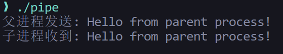
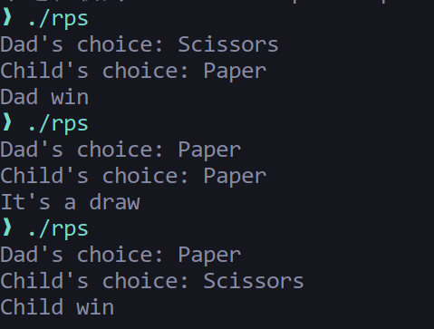

# Linux环境下的进程创建与进程通信

## 通过fork系统调用创建进程

在[Linux基础、杂项](../Tools/linux/Linux基础、杂项.md)环境下，可通过`fork()`系统调用创建新的进程：

```c
#include <unistd.h>
#include <sys/types.h>
#include <stdlib.h>
#include <stdio.h>

int main() {
    pid_t childpid = fork();
    childpid = fork();

    if (childpid == 0) {
        printf("CHILD: I am child process, the pid is %d\n", getpid());
        printf("CHILD: my parent's pid is %d\n", getppid());
        exit(0);
    }
    if (childpid > 0) {
        printf("PARENT: I am parent process, the pid is %d\n", getpid());
        printf("PARENT: My child's pid is %d\n", childpid);
        sleep(1);
        exit(0);
    }
}
```

调用 fork() 会复制当前进程，产生一个子进程。父子进程几乎完全相同（代码、数据、堆栈等），区别在于下面提到的返回值。

`fork()`调用具有三种类型的返回值:

- 如果子进程创建失败，则返回`-1`

- 若返回值为`0`，则表示当前进程是子进程

- 若返回值大于`0`，则表示当前进程是父进程，返回值为子进程的PID

!!! tip "Why and How"
    操作系统需要多进程并发执行。fork 让一个程序可以创建多个执行实例，实现并行处理、服务多客户端、或分离任务。

    调用 fork() 后，根据返回值判断是父进程还是子进程，然后分别执行不同逻辑。常见模式是父进程等待子进程完成，子进程执行具体任务。

在上面的`C`程序中:

1. **第一次fork**（`pid_t childpid = fork();`）

       - 创建第一个子进程

       - 此时有两个进程：原始父进程和第一个子进程

2. **第二次fork**（`childpid = fork();`）

       - 重要：两个进程都会执行这行代码

       - 原始父进程fork出第二个子进程

       - 第一个子进程也会fork出它的子进程

       - 最终会有4个进程！

3. **子进程处理**（第10-14行）

       - 打印自己的PID和父进程的PPID

       - 退出

4. **父进程处理**（第15-20行）

       - 打印自己的PID和子进程的PID

       - 睡眠1秒后退出

最终创建的进程树结构如下:

```
原始进程 (P1)
├── 子进程1 (C1)
│   └── 子进程1的子进程 (C1-1)
└── 子进程2 (C2)
```

输出效果如图:


## 父子进程协作作业

前面提到了为什么需要`fork()`调用——操作系统需要多进程并发执行，父子进程协作作业则是实现这一目标的一个重要方式。

以以下C程序为例:

```c
#include <unistd.h>
#include <sys/types.h>
#include <stdio.h>

int main() {
    int a[100], i, sum = 0;
    pid_t pid;
    for (i = 0; i < 100; i++) {
        a[i] = i + 1;
    }
    pid = fork();
    if (pid == 0) {
        for (i = 0; i < 50; i++) {
            sum += a[i];
        }
        printf("CHILD1: sum = %d\n", sum);
    }
    if (pid > 0) {
        for (i = 50; i < 100; i++) {
            sum += a[i];
        }
        printf("PARENT: sum = %d\n", sum);
        return 0;
    }

    return 0;
}
```

其中`main()`函数中定义了一个数组`a[100]`，通过`for`循环的方式将其中元素初始化为 $1 ~ 100$ 的自然数序列。

这个程序的要点在对数组元素的求和上，其中使用了一对父子进程来协作完成这个任务: 首先通过`fork()`调用创建一个子进程，然后父子进程分别对数组的前 $50$ 个元素和后 $50$ 个元素分别进行求和，最后将结果打印出来。

在主程序中，父子进程共享代码段，但拥有独立的数据段；每个进程的`sum`变量是独立的，互不影响。

这样，通过父子进程协作的方式，我们就实现了一种简单的并行计算模式。

!!! warning "缺点"
    该程序没有使用[进程间通信机制](408/进程的描述与控制.md#进程通信)，所以：

    - 无法将两个部分的和合并

    - 如果需要最终结果，需要使用[管道](408/进程的描述与控制.md#管道通信)、[共享内存](408/进程的描述与控制.md#共享内存)或其他[进程间通信机制](408/进程的描述与控制.md#进程通信的方式)

最终输出效果如图:


## 多进程创建与控制

```c
#include <unistd.h>
#include <sys/types.h>
#include <stdio.h>
#include <time.h>
#include <stdlib.h>

int playGame() {
    int card;
    srand(time(NULL) ^ getpid());
    card = rand() % 3 + 1;
    switch (card) {
        case 1: printf("Rock\n");
                break;
        case 2: printf("Paper\n");
                break;
        case 3: printf("Scissors\n");
                break;
        default: printf("INVALID CARD\n");
                break;
    }
    return card;
}

int main() {
    pid_t pid;
    int card, i;
    
    for (i = 1; i < 6; i++) {
        pid = fork();
        if (pid == 0) {
            playGame();
            exit(0);
        }
    }

    return 0;
}
```

该程序演示了如何创建**多个子进程**，每个子进程执行相同的任务（模拟石头剪刀布游戏）。

`playGame()`通过随机数生成器模拟了石头剪刀布游戏，并返回一个整数表示结果。

主函数中包含一个循环，通过`fork()`调用依次创建 $5$ 个子进程，每个子进程在执行`playGame()`函数后退出。

!!! warning "潜在问题"
    父进程没有使用`wait()`或`waitpid()`系统调用等待子进程结束，可能导致：

    - 子进程变成僵尸进程

    - 程序输出顺序不确定

    - 父进程可能在子进程完成前就退出

最终输出效果如图:


## 使用管道进行进程间通信

>[管道通信](408/进程的描述与控制.md#管道通信)

```c
#include <stdio.h>
#include <stdlib.h>
#include <unistd.h>
#include <string.h>
#include <sys/wait.h>

int main() {
    int pipe_fd[2];        // 管道文件描述符数组
    pid_t pid;
    char buffer[100];

    //创建管道（必须在fork之前）
    if (pipe(pipe_fd) == -1) {
        perror("创建管道失败");
        exit(EXIT_FAILURE);
    }
    pid = fork();
    if (pid < 0) {
        perror("fork失败");
        exit(EXIT_FAILURE);
    }

    if (pid == 0) {
        close(pipe_fd[1]);  // 关闭写端
        // 从管道读取数据
        int bytes_read = read(pipe_fd[0], buffer, sizeof(buffer));
        if (bytes_read > 0) {
            buffer[bytes_read] = '\0';  // 添加字符串结束符
            printf("子进程收到: %s\n", buffer);
        }
        close(pipe_fd[0]);  // 关闭读端
        exit(0);
    } else {
        close(pipe_fd[0]);  // 关闭读端 
        // 向管道写入数据
        char *message = "Hello from parent process!";
        write(pipe_fd[1], message, strlen(message));
        printf("父进程发送: %s\n", message);      
        close(pipe_fd[1]);  // 关闭写端
        wait(NULL);         // 等待子进程结束
    }

    return 0;
}
```

在上面的程序中:

- `pipe_fd[2]`是管道文件描述符数组，`pipe_fd[0]`用于读，`pipe_fd[1]`用于写

!!! warning "关键要点"

    - 管道必须在`fork()`之前创建，这样子进程才能继承文件描述符

    - 每个进程都应该关闭不需要的文件描述符端，避免资源泄漏

    - 父进程使用`wait()`确保子进程完成后再继续

最终输出效果如图:



## 综合应用

综合上面的进程创建方法与进程通信机制（管道通信），我们可以实现一个简单的小游戏模型:

```c
#include <unistd.h>
#include <sys/types.h>
#include <sys/wait.h>
#include <stdio.h>
#include <time.h>
#include <stdlib.h>
#include <string.h>

// 生成石头剪刀布的选择
int generateChoice() {
    srand(time(NULL) ^ getpid());
    return rand() % 3 + 1;
}

// 将数字转换为字符串
const char* choiceToString(int choice) {
    switch (choice) {
        case 1: return "Rock";
        case 2: return "Paper";
        case 3: return "Scissors";
        default: return "Unknown";
    }
}

// 判断游戏结果
int playGame(int dadChoice, int childChoice) {
    if (dadChoice == childChoice) {
        return 0;  // 平局
    }
    
    // Rock(1) > Scissors(3)
    // Paper(2) > Rock(1)
    // Scissors(3) > Paper(2)
    if ((dadChoice == 1 && childChoice == 3) ||
        (dadChoice == 2 && childChoice == 1) ||
        (dadChoice == 3 && childChoice == 2)) {
        return 1;  // 父进程赢
    }
    
    return -1;  // 子进程赢
}

int main() {
    int pipefd[2];
    pid_t pid;
    int dadChoice, childChoice;
    int result;
    
    // 创建管道
    if (pipe(pipefd) == -1) {
        perror("pipe");
        exit(1);
    }
    
    // 创建子进程
    pid = fork();
    
    if (pid < 0) {
        perror("fork");
        exit(1);
    }
    
    if (pid > 0) {
        // 父进程 (Dad)
        close(pipefd[0]);  // 关闭读端
        
        // 生成父进程的选择
        dadChoice = generateChoice();
        
        // 将选择写入管道
        if (write(pipefd[1], &dadChoice, sizeof(int)) == -1) {
            perror("write");
            exit(1);
        }
        
        close(pipefd[1]);  // 关闭写端
        
        // 等待子进程完成
        wait(NULL);
    } else {
        // 子进程 (Child)
        close(pipefd[1]);  // 关闭写端
        
        // 从管道读取父进程的选择
        if (read(pipefd[0], &dadChoice, sizeof(int)) == -1) {
            perror("read");
            exit(1);
        }
        
        close(pipefd[0]);  // 关闭读端
        
        // 生成子进程的选择
        childChoice = generateChoice();
        
        // 输出结果
        printf("Dad's choice: %s\n", choiceToString(dadChoice));
        printf("Child's choice: %s\n", choiceToString(childChoice));
        
        // 判断输赢
        result = playGame(dadChoice, childChoice);
        if (result == 1) {
            printf("Dad win\n");
        } else if (result == -1) {
            printf("Child win\n");
        } else {
            printf("It's a draw\n");
        }
        
        exit(0);
    }
    
    return 0;
}
```

在上面的程序中:

- `generateChoice()`与`choiceToString()`函数负责随机生成石头剪刀布的选择，并将其转换为字符串

- `playGame()`函数负责判断游戏结果

- 核心的模拟过程位于主函数:

    - 首先通过`pipe()`系统调用创建一个管道`pipefd[2]`（注意必须在`fork()`之前创建）

    - 然后通过`fork()`系统调用创建一个子进程

    - 在父进程中，首先关闭读端`pipefd[0]`，然后生成石头剪刀布的选择，并将其写入管道

    - 在子进程中，首先关闭写端`pipefd[1]`，然后从管道中读取父进程的选择，并生成石头剪刀布的选择

    - 最后，通过`playGame()`函数判断游戏结果，并输出结果

多次执行该程序以验证选项的随机性，最终输出效果如图:


