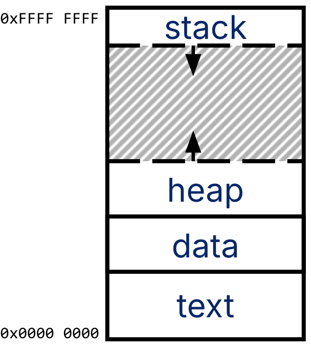
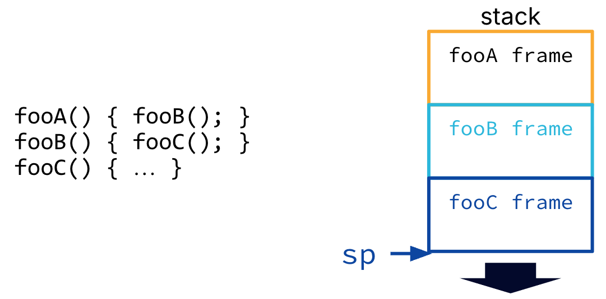
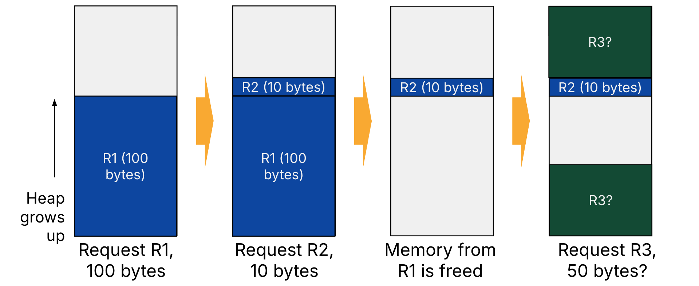
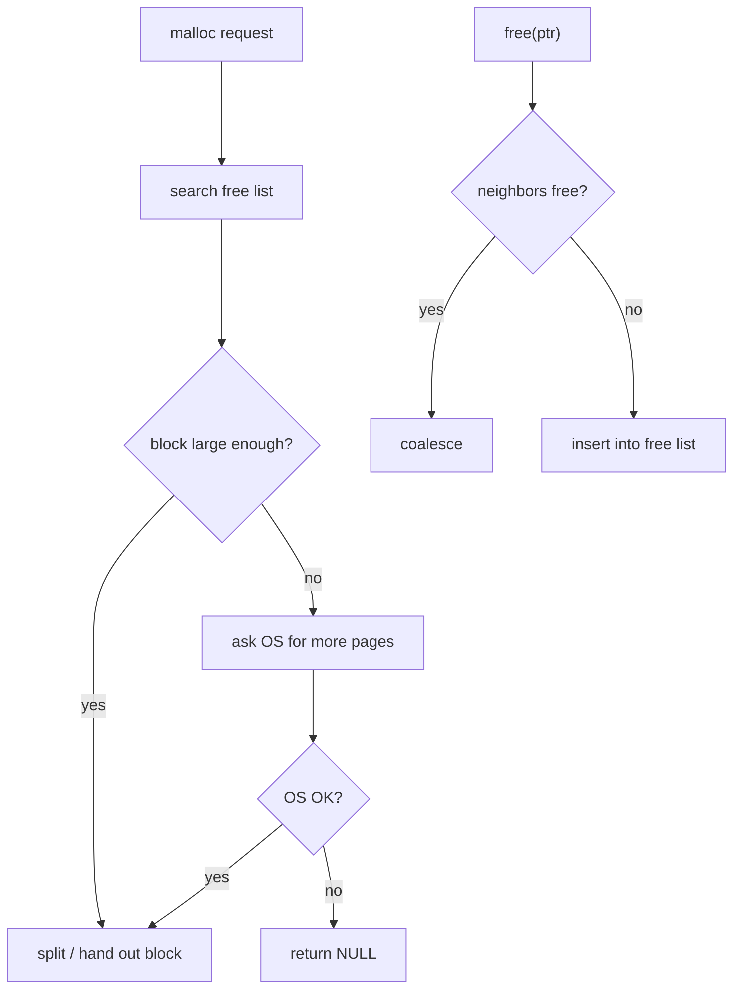

# C Memory Management

> [L05 C Memory Management | CS61C: Course Notes](https://notes.cs61c.org/content/c-memory-management/)

<div class="responsive-video-container">
    <iframe src="https://player.bilibili.com/player.html?isOutside=true&aid=1806497713&bvid=BV17b42177VG&cid=1621699590&p=5&autoplay=0" 
    scrolling="no" 
    border="0" 
    frameborder="no" 
    framespacing="0" 
    allowfullscreen="true"> 
    </iframe>
</div>

!!! abstract "Learning Outcomes"
    - Learn characteristics of the C memory layout.

    - Differentiate between storage allocation and variable declaration.

    - Know where variables are stored in C, i.e., which memory segment data is allocated in.

    - Understand how the stack pointer automatically allocates and deallocates stack frames.

    - Understand when it is safe to pass pointers into the stack between functions.

    - Contrast the heap’s dynamic memory with stack memory.

    - `free` every block allocated with `malloc`, `realloc`, or `calloc`

    - Practice reading Linux `man` pages to determine specific behavior of C `stdlib` functions.

## Memory Layout

So far we have talked about *how much* space types occupy (`sizeof`), but not *where* things live in memory.

### Memory Allocation

In C, storage can be allocated in three ways:

| Kind | Where you declare / allocate it | When | Notes |
|------|----------------------------------|------|-------|
| **Local variable** | Inside a function | Compile time | Visible only in that function’s namespace |
| **Global variable** | Outside any function | Compile time | Visible to the whole program; use sparingly |
| **Dynamic allocation** | Via library calls like `malloc` | Runtime | Size can depend on input (e.g. file length) |

- **Storage allocation** means setting aside a block of memory.  

- **Variable declaration** means allocating a block *and* giving it a name (and a type, which implies size).

Declaration always implies allocation, but allocation does not always imply a named variable (e.g. `malloc` returns an address with no name attached).

!!! warning
    Avoid overusing globals. They make accidental sharing and hard-to-track edits easy, and weaken abstraction between functions.

### Four Regions of Memory

> [内存管理概述 - 进程的内存映像](../../OperatingSystem/408/内存管理概述.md#进程的内存映像)

A C program’s address space typically has four segments:

| Segment | Contents | Management |
|---------|----------|------------|
| **Stack** | Local variables, parameters, return addresses | Automatic; grows **downward** |
| **Heap** | Dynamically allocated storage (`malloc` / `free`) | On demand; grows **upward** |
| **Data** (Static) | Global variables | Fixed size for the whole run |
| **Text** (Code) | Program instructions | Fixed size; loaded when the program starts |

Rough layout from low to high addresses:



!!! tip "Name traps"
    - The **stack** behaves like the stack data structure; the **heap** here is *not* a heap data structure—just a “heap of memory.”

    - The **data** segment means *global/static* data, not “all data.”

    - **Text** means code (often treated as read-only), like written text you don’t rewrite.

In C you must know *which segment* your data lives in, because each region is managed differently. Wrong assumptions about memory are a major source of C bugs. Later sections focus on the stack and the heap.

## Stack and Heap

### Stack

The stack starts at high addresses and grows **downward**. Each function call gets a new **stack frame** containing:

- local variables

- return address (where to resume after the function returns)

- function arguments (when not kept in CPU registers)

The **stack pointer** (`sp`) tracks the top of the current frame. Allocation is fast: push a frame by moving `sp` down; pop it by moving `sp` back up when the function returns. This is **LIFO**.



!!! warning
    When a function returns, the stack frame is popped, but the memory is **not erased**. Old values may still sit there until a later call overwrites them.

#### Passing Pointers into the Stack

It is **safe** to pass a pointer to a caller’s local variable into a callee while the caller is still active:

```c
void load_buf(char *ptr, size_t len) { /* write into ptr */ }

int main() {
    char buf[BUFLEN];
    load_buf(buf, BUFLEN);  /* OK: main's frame still exists */
}
```

It is **catastrophic** to return a pointer to a local variable:

```c
char *make_buf(size_t len) {
    char buf[len];
    return buf;  /* dangling pointer after return */
}
```

After `make_buf` returns, `buf` is deallocated. Any pointer to it becomes a **dangling reference**—later function calls may overwrite that stack memory.

Local arrays live on the stack, so their size must be known at compile time (or use a variable-length array where supported).

### Heap

The heap is a large pool of memory for **dynamic allocation** at runtime (`malloc`, `free`, `realloc`). Unlike the stack:

- sizes need not be known at compile time

- blocks are not necessarily adjacent

- the allocator decides where each block goes (fragmentation is possible)

#### `stdlib` Heap Functions

- **`malloc(size_t n)`** — allocate `n` uninitialized bytes; returns `void *`, or `NULL` on failure.

    ```c
    uint32_t *ptr = malloc(20 * sizeof(uint32_t));
    if (!ptr) { /* handle failure */ }
    ```

- **`free(void *ptr)`** — release memory previously returned by `malloc` / `realloc`. Always pair every `malloc` with a `free`.

    ```c
    free(ptr);
    ```

- **`realloc(void *ptr, size_t size)`** — resize a block; may copy data to a **new address**. Always assign the return value:

    ```c
    ptr = realloc(ptr, 40 * sizeof(uint32_t));
    ```

#### Common Heap Bugs

| Bug | What goes wrong |
|-----|-----------------|
| **Memory leak** | Forget to `free`; heap usage grows until the OS refuses more memory |
| **Use after free** | Read/write through a pointer after `free` |
| **Double free** | Call `free` twice on the same block |
| **Wrong `free`** | `free` a stack pointer, or `free(ptr + 1)` instead of the original address |
| **Stale pointer after `realloc`** | Other pointers to the old block are invalid if `realloc` moves the data |

!!! tip "Valgrind"
    Use tools like [Valgrind](https://valgrind.org/) to catch leaks, invalid `free`, and out-of-bounds writes. It is slow, but very helpful for debugging C memory bugs.

    !!! example "Debug a memory leak"
        **1. Write a program with a leak**

        ```c
        #include <stdlib.h>

        int main(void) {
            int *p = malloc(4 * sizeof(int));
            p[0] = 42;
            return 0;  /* forgot free(p) */
        }
        ```

        **2. Compile with debug symbols**

        ```bash
        gcc -g leak.c -o leak
        ```

        **3. Run under Valgrind**

        ```bash
        valgrind --leak-check=full ./leak
        ```

        **4. Read the report**

        Valgrind will point to the `malloc` line and report bytes as **definitely lost** because `free` was never called. Fix by adding `free(p);` before `return 0;`, then rerun until the summary says `All heap blocks were freed`:

        ```bash
        $ valgrind --leak-check=full ./leak
        ==54905== Memcheck, a memory error detector
        ==54905== Copyright (C) 2002-2024, and GNU GPL'd, by Julian Seward et al.
        ==54905== Using Valgrind-3.25.1 and LibVEX; rerun with -h for copyright info
        ==54905== Command: ./leak
        ==54905== 
        ==54905== 
        ==54905== HEAP SUMMARY:
        ==54905==     in use at exit: 16 bytes in 1 blocks
        ==54905==   total heap usage: 1 allocs, 0 frees, 16 bytes allocated
        ==54905== 
        ==54905== 16 bytes in 1 blocks are definitely lost in loss record 1 of 1
        ==54905==    at 0x484F8A8: malloc (vg_replace_malloc.c:446)
        ==54905==    by 0x400114A: main (in /home/virtualguard/vg101/vglab/csa/cs61c/scratch/leak)
        ==54905== 
        ==54905== LEAK SUMMARY:
        ==54905==    definitely lost: 16 bytes in 1 blocks
        ==54905==    indirectly lost: 0 bytes in 0 blocks
        ==54905==      possibly lost: 0 bytes in 0 blocks
        ==54905==    still reachable: 0 bytes in 0 blocks
        ==54905==         suppressed: 0 bytes in 0 blocks
        ==54905== 
        ==54905== For lists of detected and suppressed errors, rerun with: -s
        ==54905== ERROR SUMMARY: 1 errors from 1 contexts (suppressed: 0 from 0)
        ```

### Implementing Heap Memory

A user-space heap allocator sits on top of memory the OS already mapped into your process. These OS notes give the bigger picture:

| Topic | Why it matters for `malloc` | OS notes |
|-------|----------------------------|----------|
| **Load** | How a program is brought into memory | [装入方式](../../OperatingSystem/408/内存管理概述.md#装入方式) |
| **Heap in the address space** | Where the heap segment lives | [进程的内存映像](../../OperatingSystem/408/内存管理概述.md#进程的内存映像) |
| **Dynamic partition allocation** | OS-level strategies parallel heap block selection | [动态分区分配算法](../../OperatingSystem/408/内存管理概述.md#动态分区分配算法) |
| **Context switch** | Saving/restoring execution state when switching tasks | [进程控制块](../../OperatingSystem/408/进程的描述与控制.md#进程控制块) |
| **Virtual memory** | OS may map more virtual pages on demand when the heap grows | [虚拟内存管理](../../OperatingSystem/408/虚拟内存管理.md) |

#### Designing a Heap Allocator

The OS does not move your heap blocks around (unlike a compacting GC), but **your allocator** must:

- satisfy `malloc` / `free` requests quickly

- keep bookkeeping overhead small

- limit **fragmentation**—many small free gaps that cannot satisfy a large request

**External fragmentation**: free memory exists, but not in one contiguous block. Example: allocate 100 B (R1), then 1 B (R2); free R1. A later 50 B request (R3) may not fit in the 100 B hole if the allocator’s policy is poor.



#### K&R `malloc` / `free`

A classic teaching implementation:

**Bookkeeping:** each free block has a header with **size** and a **pointer to the next free block**, forming a **circular linked list** of free blocks.

- **`malloc`:** walk the free list for a block large enough. If none fits, request more memory from the OS (e.g. `sbrk`). If the OS cannot satisfy the request, return `NULL`.

- **`free`:** if adjacent blocks are also free, **coalesce** them into one larger block; otherwise insert the block into the free list.

Unlike stack allocation (roughly one instruction), `malloc` is a function call plus a list walk—worst case, it scans the whole list and still returns `NULL`.

#### Choosing a Free Block in `malloc`

When several free blocks are large enough, common policies are:

| Policy | Idea | Trade-off |
|--------|------|-----------|
| **Best fit** | Pick the smallest block that still fits | Tight fit, but leaves tiny “slivers” |
| **First fit** | Take the first block that fits | Fast, but fragments the front of the list |
| **Next fit** | Like first fit, but resume from the last search position | Spreads small gaps more evenly |

These mirror OS [动态分区分配算法](../../OperatingSystem/408/内存管理概述.md#动态分区分配算法) (首次适应 / 最佳适应 / 邻近适应).


