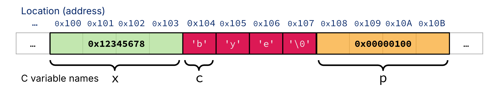
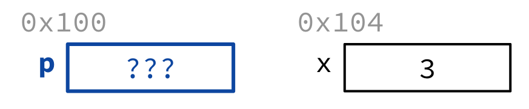
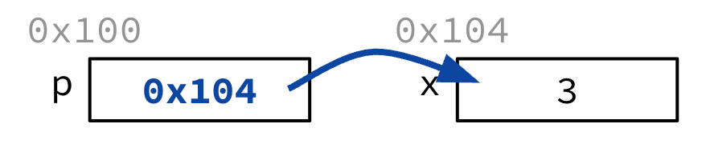
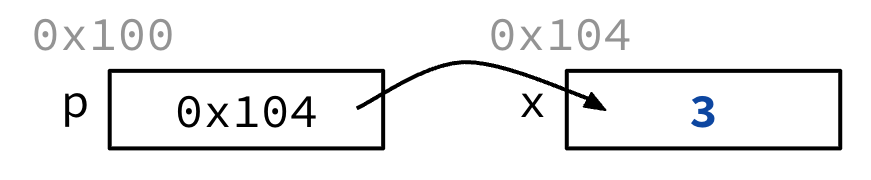
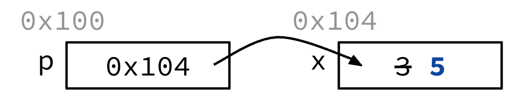

# C Pointers, Arrays, and Strings

> [L04 C Pointers, Arrays, Strings | CS61C: Course Notes](https://notes.cs61c.org/content/c-pointers-arrays-strings/)

!!! abstract "Learning Outcomes"
    - Distinguish between a memory address and a value stored in memory.

    - Get familiar with byte-addressable memory: each byte has an address, and each address refers to one byte.

    - Understand that pointers are variables that store addresses.

    - Know C pointer syntax, including struct pointer syntax.

    - Know what the `NULL` pointer is and why having a `NULL` pointer is useful.

    - Understand that because C is pass-by-value, pointers facilitate updates to values in memory when performing function calls.

## Memory, Addresses, and Pointers

### Memory Layout

For now, picture all of memory as one huge array that starts at address `0x00000000`.



A useful analogy:

- Each **cell** is a house on a very long street.

- The **house number** is the memory address.

- The **person living inside** is the byte value stored there.

In this model:

- Each cell is **one byte** wide.

- Every byte has its own address.

- A byte at some address also has a value. For example, the byte at `0x00000104` might store the ASCII character `'b'` (`0b01100010`).

Variable names usually refer to **blocks of memory**, not just a single byte. For example, an unsigned 32-bit integer `x` with value `0x12345678` occupies 4 consecutive bytes. By convention, the address of `x` is the address of its **first (lowest) byte**—say `0x00000100`.

!!! tip
    Remember the two different things:

    - **Address**: where the data lives (e.g. `0x00000100`)

    - **Value**: what is stored there (e.g. `0x12345678`)

### Pointers Store Addresses

A pointer is simply:

> A variable that contains the address of another variable.

If pointer `p` “points to” `x`, that means `p` stores the address of `x` (for example `0x00000100`), not the value of `x` itself.

Because pointers are also variables, they live somewhere in memory too—so a pointer itself also has an address.

“Following” a pointer means accessing the value it points to. This is called **dereferencing**. If we follow `p`, we get the value of `x`.

C requires pointers to be **typed**. The type tells the compiler how many bytes to read when following the pointer. For example, if `p` is a pointer to a 32-bit unsigned integer, following `p` reads 4 bytes starting at that address—not just one byte.

We will look at pointer syntax next.

## Pointers and Bugs

### Pointer Syntax

- Declare

    ```c
    int x = 3;
    int *p;
    ```

    

    - Tells compiler that variable `p` is address of an integer.

- Assign with *address operator* `&`

    ```c
    p = &x;
    ```

    

    - Tells compiler to assign *the address of `x`* to `p`.

- Dereference with `*`

    ```c
    printf("p points to %d\n", *p);
    ```

    

- Dereference and assign with `*`

    ```c
    *p = 5;
    ```

    

### Garbage Addresses and NULL Pointers

Like other local variables, declaring a pointer **does not initialize it**—it only allocates space to hold an address. Whatever leftover bits are there get treated as an address:

```c
int *ptr;
*ptr = 5;  /* dangerous: ptr holds garbage */
```

This may compile (often with warnings), but writing through a garbage address is **undefined behavior**—you might overwrite some random part of memory.

The special all-zero address is the **`NULL` pointer** (similar to Python’s `None` or Java’s `null`). Address `0x0` is reserved: reading or writing through it causes a runtime error.

Setting a pointer to `NULL` is useful as a sentinel: it means “this pointer does not point to a valid object.”

```c
if (!p) { /* p is NULL */ }
if (q)  { /* q is not NULL */ }
```

!!! tip
    Because `false` is all zeros, checking `!p` is a common way to test for `NULL`.

### Pointer Operations

#### Pointer Arithmetic

Pointers support addition and subtraction. The key idea of this is that the compiler strides by the size of the pointed-to type.

- `ptr + n` adds `n * sizeof(*ptr)` bytes to the address in `ptr`

- `ptr - n` subtracts `n * sizeof(*ptr)` bytes

```c
int *ptr;          /* assume int is 4 bytes */
ptr + 5;           /* advances by 5 * 4 = 20 bytes, not 5 */
```

You **cannot** add two pointers together, but you can subtract two pointers of the same type (the result is how many elements apart they are).

Pointer arithmetic is especially useful when walking through arrays.

#### Struct Pointers

Structs can be large, so we often pass around pointers to them.

```c
typedef struct {
  int x;
  int y;
} coord_t;

coord_t coord1;
coord_t *ptr1 = &coord1;

int h = coord1.x;   /* dot: access member of a struct value */
int k = (*ptr1).x;  /* dereference, then access member */
k = ptr1->x;        /* arrow: shorthand for (*ptr1).x */
```

- `.` accesses a member of a struct value

- `->` is shorthand for “dereference, then access a member”

Assigning one struct pointer to another copies the **address**, so both pointers refer to the same struct in memory:

```c
ptr1 = ptr2;  /* both now point to the same object */
```

#### Double Pointers

Because C is pass-by-value, a function cannot update a caller’s pointer if it only receives a copy of that pointer:

```c
void increment_ptr(uint32_t *p) {
    p = p + 1;  /* only changes the local copy */
}

uint32_t arr[] = {50, 60, 70};
uint32_t *q = arr;
increment_ptr(q);  /* q still points to 50 */
```

To change the pointer itself, pass a **pointer to a pointer** (a double pointer / handle):

```c
void increment_ptr(uint32_t **h) {
    *h = *h + 1;  /* update the caller's pointer */
}

uint32_t arr[3] = {50, 60, 70};
uint32_t *q = arr;
increment_ptr(&q);  /* now *q is 60 */
```

!!! note "Pass-by-value reminder"
    Function parameters get a **copy** of the argument. To modify a variable in the caller, pass its address and update through a pointer. To modify a pointer in the caller, pass the address of that pointer (`T **`).
