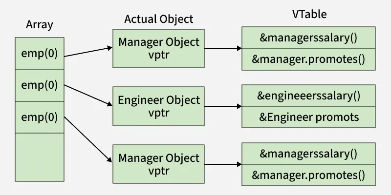

# Lambda表达式

## 定义

在Python中，`lambda`表达式**函数式编程**中起到了极大的简化作用。自C++11起，C++也引入了`lambda`表达式，增强了C++的函数式编程能力。

`lambda`表达式是一种匿名函数**对象**，可在需要在需要函数功能的地方直接定义和使用，而无需单独定义一个函数。

`lambda`表达式是**内联的**、**匿名的**函数，能够知晓于其处于相同作用域的变量。

```cpp
auto var = [capture-clause] (auto param) -> return_type { /* function_body */ }
/*                ^              ^              */
/*       outside parameters  func parameters    */
```

**e.g.**：
```cpp
int limit = 5;
auto lessThanFive = [limit] (int n) {
    return n < limit;
};

lessThanFive(6);  // False
```

## 捕获列表（`[capture-clause]`）

```cpp
[]              // captures nothing
[limit]         // captures limit by value
[&limit]        // captures limit by reference
[&limit, upper] // captures limit by reference, upper by value
[&, limit]      // captures everything except limit by reference
[&]             // captures everything by reference
[=]             // captures everything by value
```

## 应用 & 杂项

`lambda`表达式的计算成本很低，可提高程序的运行效率。

>   - 需要一个简短的函数或需要在函数中访问局部变量时，可使用`lambda`表达式
>
>   - 若需要使用更复杂的逻辑或重载功能，可使用**函数指针**

!!! note "函数指针"
    - 和其他指针共享操作接口，即可像其他指针一样进行处理

    - 可作为变量/参数在函数或模板函数中传递

    - 可像函数一样被调用

### `lambda`表达式作为谓词传递

```cpp
template<typename InputIt, typename UniPred>
int count_occurrences(InputIt begin, InputIt end, UniPred pred) {
    int count = 0;
    for (auto iter = begin; iter != end; ++iter) {
        if (pred(*iter)) { count++; }
    }
    return count;
}

int main() {
    int limit = 5;
    auto moreThanFive = [limit] (int n) {
        return n > limit;
    }

    std::vector<int> nums = {3, 5, 7, 9, 11, 13};

    count_occurrences(nums.begin(), nums.end(), moreThanFive)  // returns 4
}
```

在上面的示例中，`InputIt`是输入的迭代器类型；`UniPred`是一个一元谓词类型（**函数指针**/**函数对象**/**Lambda表达式**），用于判断元素是否满足条件。

模板函数`count_occurrences`的功能是遍历从`begin`到`end`的所有元素；对每个元素，调用`pred`谓词判断是否满足条件，如果满足条件，计数器 count 增加；最后返回计数器的值。

!!! note "谓词函数(Predicate Functions)"
    - 任何返回`bool`值的函数都属于谓词函数

    - 谓词函数可以是**一元**或**多元**的，即单参数的或多参数的

同一套「可调用对象作参数」的写法还可用于更广的[**回调/策略注入**](#回调策略注入)；谓词只是其中返回 `bool`、用于判断的那一类。

### 回调/策略注入

与「把 `lambda` 当谓词传给算法」使用**同一套机制**（可调用对象作为参数），但**意图往往更广**：由被调用方在合适时机「反过来」执行你注入的逻辑，即**控制反转** + **策略注入**。

常见角色可区分如下：

| 角色 | 典型签名 | 作用 | 示例 |
|------|----------|------|------|
| **谓词 (predicate)** | 返回 `bool`，常带参数 | 判断某条件是否成立 | `std::find_if` 的第四个参数；循环的 `should_stop` |
| **回调 (callback)** | 常为 `void`，任意参数 | 事件发生时通知调用方 | `on_click`、`on_intent` |
| **提供者 (provider)** | 返回某种值 | 需要时由调用方拉取数据 | 每帧 `VisualFrame()`、播放列表视图模型 |

项目 [`vocalplayer`](../../../../projects/vocalplayer.md) 中，有 `TuiRenderer::Run` 接口：

```cpp
void Run(const std::function<VisualFrame()>& frame_provider,
         const std::function<PlaylistViewModel()>& playlist_provider,
         const std::function<void(UiIntent)>& on_intent,
         const std::function<void(int)>& on_selection_changed,
         const std::function<bool()>& should_stop,
         UiSessionState* session_state = nullptr);
```

控制层用多个 `lambda` 注入具体逻辑（节选）：

```cpp
tui_renderer_.Run(
    [&] {
      return BuildPlaybackVisualFrame(
          audio_engine_, analyzer_, spectrum_peaks_l, spectrum_peaks_r);
    },
    [&] {
      PlaylistViewModel view_model;
      view_model.tracks = track_names;
      view_model.current_track_index = current_index;
      // ...
      return view_model;
    },
    [&](UiIntent intent) { /* 处理切歌、暂停、退出等 */ },
    [&](int next_selected_index) { selected_index.store(/* ... */); },
    [&] {
      PlaybackState state = audio_engine_.GetPlaybackState();
      return state.is_finished || switch_requested.load();
    },
    &ui_session_state);
```

对应关系：

- `frame_provider` / `playlist_provider`：**数据提供者**，不是谓词。

- `on_intent` / `on_selection_changed`：**事件回调**，不是谓词。

- `should_stop`：**谓词式用法**——无参、返回 `bool`，供 UI 循环判断何时退出（与上一节 `count_occurrences` 中的 `pred` 同类，只是无参且交给自定义 API）。

编译器会根据 `lambda` 的签名**隐式转换**为对应的 `std::function<...>`（捕获方式与调用约定需匹配）。

!!! note "与谓词传递的关系"
    - **机制相同**：都是把 `lambda`（或函数对象）当作参数传给另一模块，由对方在内部调用。

    - **不全是谓词**：一次注入里可以同时有 provider、handler、predicate 等多种角色；只有返回 `bool`、用于判断分支/循环的那类才算谓词。

    - **设计动机**：UI 层只定义「我需要什么钩子」，业务逻辑通过 `lambda` 从外层注入，避免渲染层依赖播放/切歌实现（依赖倒置）。

**捕获选择**：回调常需读写外层局部状态（引擎、原子标志、索引等），多用 `[&]` **按引用捕获**；若用 `[=]` 会复制快照，与真实控制状态脱节。只读、且生命周期安全时可用 `[=]`。

与手写 **函数对象** 等价：下面两种写法语义相同，`lambda` 只是更简洁。

```cpp
// lambda
auto frame_provider = [&]() -> VisualFrame {
  return BuildPlaybackVisualFrame(/* ... */);
};

// 等价的函数对象（见下一节 Functor）
struct FrameProvider {
  AudioEngine& engine;
  VisualFrame operator()() const { return BuildPlaybackVisualFrame(engine, /* ... */); }
};
```

### 函数对象/函子(Function Object/Functor)

在**函数式编程**中，这是一个十分重要的模块。

在C++中，函数对象和函子是同一个概念，指通过**重载了`operator()`运算符**的类实现的技术。这项技术使得该类能够创建用户自定义功能的**闭包**，其实例能够像函数一样使用，从而提供更加灵活的函数式编程方式。

!!! note "闭包(Closure)"
    函数对象的单一实例化形式，能够捕获并保持对其所在作用域中变量的引用，即使该作用域已经执行完毕。可简单理解为**一个会记住其周围环境（词法作用域）并访问其中变量的函数，即使这个函数在这个环境外调用**。

    在C++中，**闭包**通常就通过`lambda`表达式实现。


```cpp
class factor {
public:
    int operator() (int arg) const {
        return num + arg;    // parameters and function body
    }
private:
    int num;    // capture clause
};

int num = 0;
auto lambda = [&num] (int arg) {
    num += ara;
};
lambda(5);
```

- `factor`是一个函数对象，对于捕获变量`num`，由于其是`factor`的私有变量，是不可变的，故这个函数对象仅仅提供了一个**只读**的加法操作

- `lambda`表达式则通过**引用捕获**提供了一个可以修改捕获变量的操作，即对捕获变量`num`的累加。这就是一个典型的**闭包**

### `std::function<return_type(param_types)> func;`

到目前为止，我们已经讨论了`lambda`表达式、函数指针以及函数对象。

在C++中，STL提供了一个通用的函数类型`std::function<return_type(param_types)>`，称为**标准函数**。以上讨论的三个东西都可以转换为标准函数。

标准函数占用的资源会比函数指针与`lambda`表达式多，运行开销也更大。

### 虚拟函数（`virtual`）

> [Virtual Function in C++ | GeeksForGeeks](https://www.geeksforgeeks.org/virtual-function-cpp/)

`virtual` 修饰的成员函数是 C++ **运行时多态**的核心机制：通过**基类指针或引用**调用函数时，实际执行的是**对象真实类型**中的版本，而不是指针/引用静态类型上的版本。

与上一节的函数对象/`lambda`/`std::function`不同，虚函数依赖**继承层次**和**动态绑定**，更适合「同一接口、多种实现、运行时才知道具体类型」的扩展点（协议抽象、驱动、插件等）。

#### 静态绑定 vs 动态绑定

没有 `virtual` 时，成员函数调用在**编译期**就按指针/引用的**静态类型**绑定：

```cpp
class Animal {
 public:
  void Speak() { /* 基类实现 */ }
};

class Dog : public Animal {
 public:
  void Speak() { /* 狗叫 */ }
};

Dog d;
Animal* p = &d;
p->Speak();  // 调用 Animal::Speak，不是 Dog::Speak
```

加上 `virtual` 后，同一段代码会走**动态绑定**：

```cpp
class Animal {
 public:
  virtual void Speak() { /* 基类实现 */ }
};

class Dog : public Animal {
 public:
  void Speak() override { /* 狗叫 */ }
};

Dog d;
Animal* p = &d;
p->Speak();  // 调用 Dog::Speak
```

#### 实现原理（简要）

带虚函数的类通常会有**虚函数表（vtable）**和**虚表指针（vptr）**：



- 每个含虚函数的类有一张 vtable，存放各虚函数的实际入口地址。

- 每个对象在构造时把 vptr 指向对应类型的 vtable。

- 通过基类指针调用虚函数时，经 vptr 查表，在**运行时**决定调用哪个实现。

因此虚函数调用比非虚函数多一次间接跳转，通常还有轻微缓存影响；在热路径上是否使用虚函数是常见的设计权衡。

#### 纯虚函数与抽象类

`= 0` 表示**纯虚函数**，该类成为**抽象类**，不能直接实例化：

```cpp
class NetworkProtocol {
 public:
  virtual ~NetworkProtocol() = default;

  virtual int Number() const = 0;
  virtual void HandlePacket(PacketBuffer pkt) = 0;
};
```

派生类必须实现所有纯虚函数后才能实例化。抽象类用于定义**契约**：规定子类必须提供哪些能力，而不关心具体实现细节。

#### 虚析构函数

基类析构函数应为 `virtual`，否则通过基类指针 `delete` 派生对象时，可能只析构基类部分，造成资源泄漏或未定义行为：

```cpp
class LinkEndpoint {
 public:
  virtual ~LinkEndpoint() = default;
  // ...
};
```

多态基类几乎总是需要虚析构；`= default` 让编译器生成默认实现，同时保持多态析构语义。

#### 带默认实现的虚函数

虚函数可以在基类中提供**默认实现**，派生类可选择覆盖：

```cpp
class LinkEndpoint {
 public:
  virtual StackResult WritePackets(/* ... */) {
    return ErrorCode::kNotSupported;
  }

  virtual void Wait() {}  // 无异步线程的实现可为空操作
};
```

这是**接口 + 可选扩展**的常见模式：不支持的实现沿用默认行为，支持的再 `override`。

#### 相关关键字（C++11 及以后）

| 关键字 | 作用 |
|--------|------|
| `override` | 显式标记覆盖基类虚函数；写错签名会在编译期报错 |
| `final` | 禁止进一步 override（可用于类或函数） |
| `= default` | 让编译器生成默认实现（常用于虚析构） |
| `= 0` | 纯虚函数，强制派生类实现 |

推荐写法：

```cpp
class IPv4Protocol : public NetworkProtocol {
 public:
  int Number() const override;
  void HandlePacket(PacketBuffer pkt) override;
};
```

#### 哪些函数不能 / 不宜是 `virtual`？

- **构造函数**：不能是 virtual（对象尚未完成构造，vtable 未就绪）。

- **静态成员函数**：不能是 virtual（不依赖对象，无 `this`）。

- **普通成员函数**：若不需要多态，不要用 virtual（避免 vtable 开销和语义膨胀）。

- **模板成员函数**：不能是 virtual（实例化在编译期，与动态绑定冲突）。

#### 常见陷阱

- 按值传递导致对象切片（object slicing）

    ```cpp
    void Process(LinkEndpoint ep);   // 按值传递会切片，丢失派生类部分
    void Process(LinkEndpoint& ep);  // 引用可以
    void Process(LinkEndpoint* ep);  // 指针可以
    ```

- 构造/析构函数中调用虚函数

    构造/析构期间，对象的动态类型是「当前正在构造/析构的那一层」，不会调到更派生类的 `override`。这是语言规则，不是 bug。

- 忘记虚析构

    多态基类没有虚析构，是经典未定义行为来源。

#### 与函数对象 / `lambda` 的对比

| 机制 | 多态时机 | 典型场景 |
|------|----------|----------|
| 虚函数 | 运行时，经继承 + vtable | 协议栈分层、驱动、长期存在的类型层次 |
| 函数对象 / `lambda` | 编译期模板或类型擦除（`std::function`） | 算法谓词、回调注入、一次性策略 |

二者可并存：例如协议栈用虚接口定义分层边界，层内算法仍可用 `lambda` 作谓词或回调。
