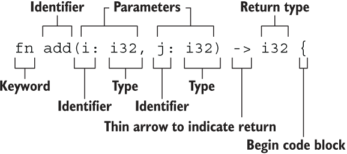

# Rust函数

Rust 函数体由一系列**语句**组成，最后由一个表达式来返回值。

```rust
fn sum_with_add_five(a: i32, b: i32) -> i32 {
    let a = a + 5; // statement
    let b = b + 5; // statement
    a + b // expression
}
```

**语句会执行一些操作但是不会返回一个值，而表达式会在求值后返回一个值。**

## 语句和表达式

对于 Rust 语言而言，这种基于语句（statement）和表达式（expression）的方式是非常重要的，要能明确的区分这两个概念。

### 语句

语句用于完成一个具体操作，但是不返回值，`let` 就是一个典型的语句。

没有返回值，意味着不能将语句赋值给其他变量，因此下面的代码是错误的：

```rust
let result = (let a = result + 5);
```

```bash
error: expected expression, found `let` statement
 --> src/main.rs:9:19
  |
9 |     let result = (let a = result + 5);
  |                   ^^^
  |
  = note: only supported directly in conditions of `if` and `while` expressions
```

### 表达式

表达式会进行求值，然后返回一个值。**表达式可以成为语句的一部分**。

!!! warning
    注意表达式不能包含分号，加上分号就变成了语句。

表达式如果不返回任何值，则隐式返回`()`（[单元类型](Rust数据类型.md#单元类型)）。

## 函数



!!! abstract
    - 函数名和变量名使用蛇形命名法(snake case)，例如 fn add_two() {}

    - 函数的位置可以随便放，Rust 不关心我们在哪里定义了函数，只要有定义即可

    - **每个函数参数以及返回值都需要标注类型**

另外，从上面对[表达式](#表达式)的定义不难看出，**函数在调用时其本质也是一个表达式**。

### 类型注解

这里特别注意在 Rust 中，每个函数参数与函数返回值都需要标注类型注解，否则编译器会报错：

```rust
fn sum(a, b: i32) {
    a + b
}
```

```bash
error: expected one of `:`, `@`, or `|`, found `,`
  --> src/main.rs:27:9
   |
27 | fn sum(a, b: i32) {
   |         ^ expected one of `:`, `@`, or `|`
   |
help: if this is a parameter name, give it a type
   |
27 | fn sum(a: TypeName, b: i32) {
   |         ++++++++++
help: if this is a type, explicitly ignore the parameter name
   |
27 | fn sum(_: a, b: i32) {
   |        ++
```

```rust
fn sum(a: TypeName, b: i32) {
    a + b
}
```

返回值同样也需要显式注明类型：

```rust
fn sum(a: i32, b: i32) {
    a + b
}
```

```bash
error[E0308]: mismatched types
  --> src/main.rs:28:5
   |
27 | fn sum(a: i32, b: i32) {
   |                       - help: try adding a return type: `-> i32`
28 |     a + b
   |     ^^^^^ expected `()`, found `i32`

For more information about this error, try `rustc --explain E0308`.
```
这里观察报错信息，可以发现在没有返回值类型注解时，编译器将默认认为这个函数返回[单元类型](Rust数据类型.md#单元类型)。

### 函数返回

#### return语句

除了函数体最后的表达式，也可以在函数体的中间插入 `return` 语句来提前返回：

```rust
fn is_prime(num: u32) -> bool {
    for n in 2..num {
        if num % n == 0 {
            return false;
        }
    }
    true
}
```

!!! tip
    这里的 `return false;` 就是一个语句，表示函数返回 `false` 值这个**操作**。

#### 特殊返回类型

##### 无返回值

这个[前面](Rust数据类型.md#单元类型)已经提到很多次了，这里辅以一些初次见到可能令人匪夷所思的例子。

返回 `()` 一般有两种情况：

- 函数没有返回值，那么返回一个 `()`

- **通过 `;` 结尾的语句返回一个 `()`**

第一种在前文已经有所讨论，第二个虽然没有直接提到，但也在[表达式](#表达式)中有所提及 `;` 对编译器判定代码性质的影响。

因此，在编写函数时，如果你希望它返回一个实值，最后一个表达式是不能以 `;` 结尾的：

```rust
fn sum(a: i32, b: i32) -> i32 {
    a + b;
}
```

```bash
error[E0308]: mismatched types
  --> src/main.rs:36:27
   |
36 | fn sum(a: i32, b: i32) -> i32 {
   |    ---                    ^^^ expected `i32`, found `()`
   |    |
   |    implicitly returns `()` as its body has no tail or `return` expression
37 |     a + b;
   |          - help: remove this semicolon to return this value

For more information about this error, try `rustc --explain E0308`.
```

##### 返回`!`类型

`!`类型是 Rust 中的一个特殊类型，表示发散函数（diverging functions）。发散函数不会返回任何值，因此可以用于表示永远不会返回的函数。

发散函数一般用于导致运行时错误或无限循环的函数：

```rust
fn dead_end() -> ! {
    panic!("You should never see this line!");
}
```

```rust
fn infinite_loop() -> ! {
    loop {
        // infinite loop
    }
}
```
