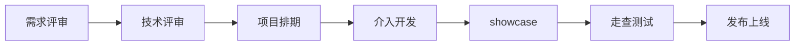

# 开发流程与开发规范

## 开发流程



### 需求评审

需求评审是开发流程的第一个环节，主要是对需求进行评审，确保需求是合理的。

- 参与人员: 项目负责人、R&D（Research & Develop, 研发工程师）、FE

- 评审事项与目标

    - 项目负责人向研发描述需求，提供UE（User Experience, 用户体验）设计图、交互设计图等

    - 研发评估需求是否合理、可行、可测试

    - 负责人填写项目跟进模板（主卡片），后续研发在开发阶段自行拆分任务并填写子卡片

!!! warning
    该环节务必了解项目**需求**细节

!!! info "需求文档参考模板"
    ```markdown
    ## 1、需求背景
    （必写）

    ## 2、业务需求与问题分析
    （概括需求）

    ### 2.1 xxx问题1

    #### 2.1.1 xxx1

    #### 2.1.2 xxx2

    ### 2.2 xxx问题2

    ## 3、产品建设目标
    （大体目标）

    ## 4、产品详细设计
    （详细目标）

    ## 5、非功能性需求设计

    ### 5.1 公有产品

    #### 5.1.1 性能

    此部分描述性能需求

    #### 5.1.2 效果

    此部分描述对于策略类产品的效果需求，包括评估方案，指标等

    #### 5.1.3 安全

    此部分描述系统安全性需求或方案，需满足安全方面的要求


    #### 5.1.4 公共组件接入

    ##### 5.1.4.1 登录、组织、权限

    此部分描述系统是否行登录认证、访问控制、权限管理

    ##### 5.1.4.2 日志

    此部分描述系统是否对接BLS日志服务平台进行统一的日志存储和查询

    ##### 5.1.4.3 订单账单

    此部分描述系统是否对接Billing系统实现客户线上购买、计费、出账的统一管理和统一的云上体验

    ## 6、附录

    此部分列出相关参考资料和说明文件
    ```

### 技术评审

技术评审是开发流程的第二个环节，主要是对根据需求评审制定的技术方案进行评审，确保技术方案是合理的、可行的、可测试的，一般在需求评审结束后1～2天、研发完成技术方案设计后进行。

- 参与人员: 项目负责人、R&D（Research & Develop, 研发工程师）、FE

- 评审事项与目标

    - 评审技术方案的可行性，是否简单可依赖

    - 技术设计方案要能清晰描述开发流程，合理的将需求拆分成功能点，防止遗漏导致交付风险

!!! info "技术方案参考模板"
    ```markdown
    ## 1、背景
    （本次更新的原因和背景）

    ## 2、名词解释
    （对文档中出现新的或不常见的名词、概念或简略语给出定义和解释）

    ## 3、设计目标

    ### 3.1、设计目标（设计目标指的是本次开发的预计目标）


    ### 3.2、性能目标
    （性能目标按具体的模块类型灵活选择，作为控制面需要考虑变更生效时间、支持的数据规模；作为数据面需要考虑性能指标如CPU、内存、响应时间等）


    ## 4、设计思路与折衷
    （这里是填写具体的技术方案）

    ## 5、模块设计

    ### 5.1、假设与其它模块联系
    （与外界其他系统/模块的联系。采用文字分条列出或采用模块结构图描述均可）

    ### 5.2、模块流程图及说明
    （ 描述模块设计架构，对3.1章节中描述的功能进行说明，对于稍复杂的流程，都应使用功能时序图的形式展现）

    ### 5.3、数据结构及说明
    （如果对数据库有变动必须要填写到这里）

    ### 5.4、内部接口定义
    （ 给出模块内调用的接口定义）

    ### 5.5、外部接口定义
    （ 后端人员给前端人员的接口定义）

    #### 5.5.1、登录接口
    （响应体）
    POST /xxx/xxx/login

    #### 5.5.2、xx查询接口
    (请求体)
    GET /xxx/xxx/getInfo4？user=

    ### 5.6、异常处理
    （ 对模块中异常情况的处理进行说明，比如输入数据不合法、内存分配失败、模块内部错误需要向外部模块返回的错误码及含义等。）

    ### 5.7、边界值说明
    （ 对模块中使用的边界值进行定义）

    ### 5.8、配置项说明
    （ 对模块涉及到的配置项进行说明）

    ### 5.9、测试考虑
    （ 说明从测试角度考虑设计方案，以及单元测试或联合测试需要考虑的关键事项。比如，测试计划、单元测试的思路、联合测试的重点、测试工具的开发和使用等。）

    ## 6、风险评估及对其它模块/系统影响（可选）

    ### 6.1、已知的或可预知的风险
    （ 在这里加上已经知道的或可能会发生的风险，包括技术、业务等方面。最好针对每个风险，列出相应的应对措施）

    ### 6.2、与其它模块/系统可能的影响
    （ 在“5.1 ”中描述了该模块与其它模块的依赖关系。在这里描述这些依赖关系可能带来的影响。包括本模块对其它模块可能造成的影响以及其它模块可能给本模块造成的影响两个方面）

    ## 7、设计评审意见
    ```

### 项目排期

研发、FE综合根据技术评审结果对每个功能点的开发时间进行预估，一般简单功能点开发周期为一天，复杂功能点的开发周期为两天～一周。部分项目要进行多模块联合调试，需要和相应负责人约定联调时间。此外，还要留下自测时间，负责人沟通走查时间，最后是给出上线时间。复杂的项目要给自己预留1～2天buffer，用于解决突发状况。

### 启动开发

研发、FE进行编码之前需要先拆分负责人填写的卡片，将大需求拆分为各个小需求，然后进行开发，每次开发变动都需要去变更卡片。负责人（或指定RD）需要配合运维同学一起参与该项目的服务器部署和运维。

每次迭代都要重新开一个[版本控制](../Tools/Git.md)中的[分支](../Tools/Git.md#多分支基础版本控制)进行开发，所有开发人员在同一个分支进行迭代开发。

### showcase

开发人员FE、RD在做完功能之后需要由负责人主持会议，内容是FE、RD展示本次功能实现的各个细节，不包含源码，仅仅功能展示，如果本次迭代涉及前后端协同开发，则需要FE、RD私下自行商量谁来展示，仅一人即可，重点展示逻辑和可行性。

### 走查测试

### 发布上线

## 开发规范
