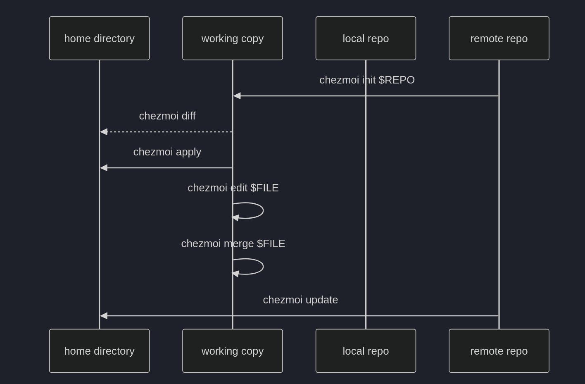

# chezmoi

chezmoi 是一个用于管理 dotfiles 的工具，基于 Git 和 Symlink，可以在多个不同的机器上安全地管理 dotfiles。

## 安装

> [Installation | chezmoi](https://www.chezmoi.io/install/)

## 基本使用

- 初始化
```bash
chezmoi init
```

这会在路径`~/.local/share/chezmoi`下创建并初始化一个git仓库。

- 添加文件

    ```bash
    chezmoi add <file>
    ```

- 编辑已添加的文件

    ```bash
    chezmoi edit <file>
    ```

    ```bash
    # 编辑并应用到本地配置
    chezmoi edit --apply <file>
    ```

- 切换到工作目录

    ```bash
    chezmoi cd
    ```

由于chezmoi基于git，因此具有与git类似的**版本控制**接口:



- 对比本地配置与工作目录（常用）

    ```bash
    chezmoi diff
    ```

- 同步状态

    ```bash
    chezmoi status
    ```

更多命令可参考[官方文档](https://www.chezmoi.io/user-guide/command-overview/)。

## 进阶使用

### 加密

在文件包含敏感信息时，chezmoi支持对文件进行加密。

>[Encryption | chezmoi](https://www.chezmoi.io/user-guide/encryption/)
