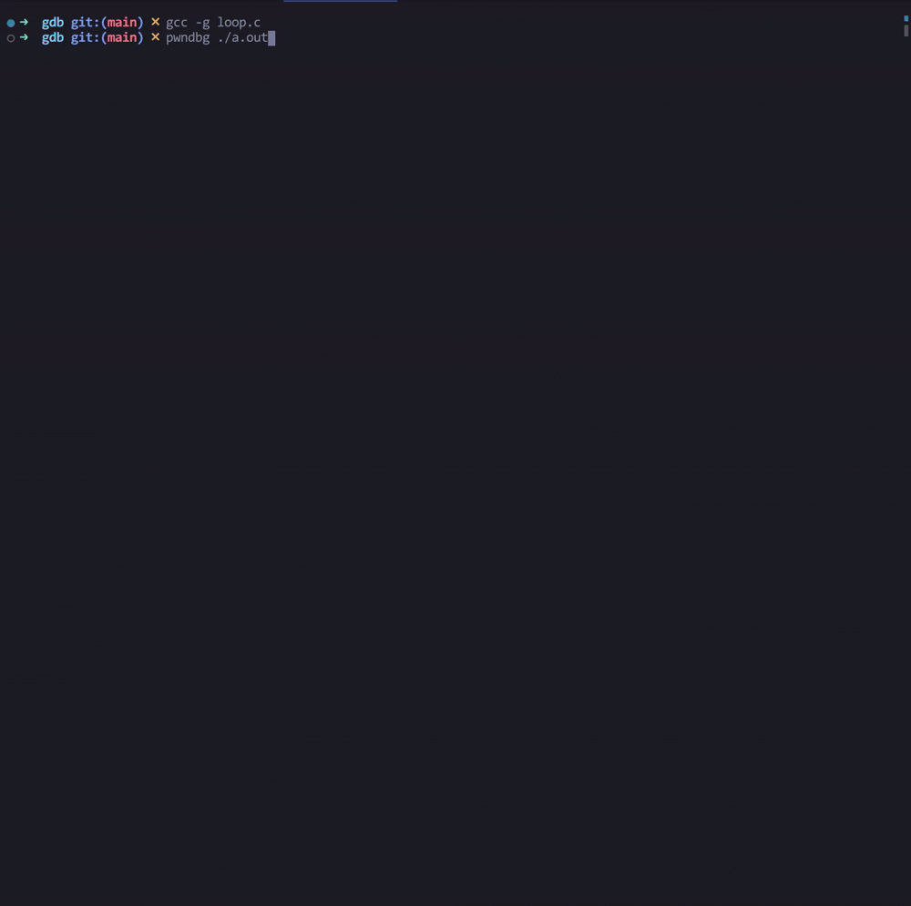
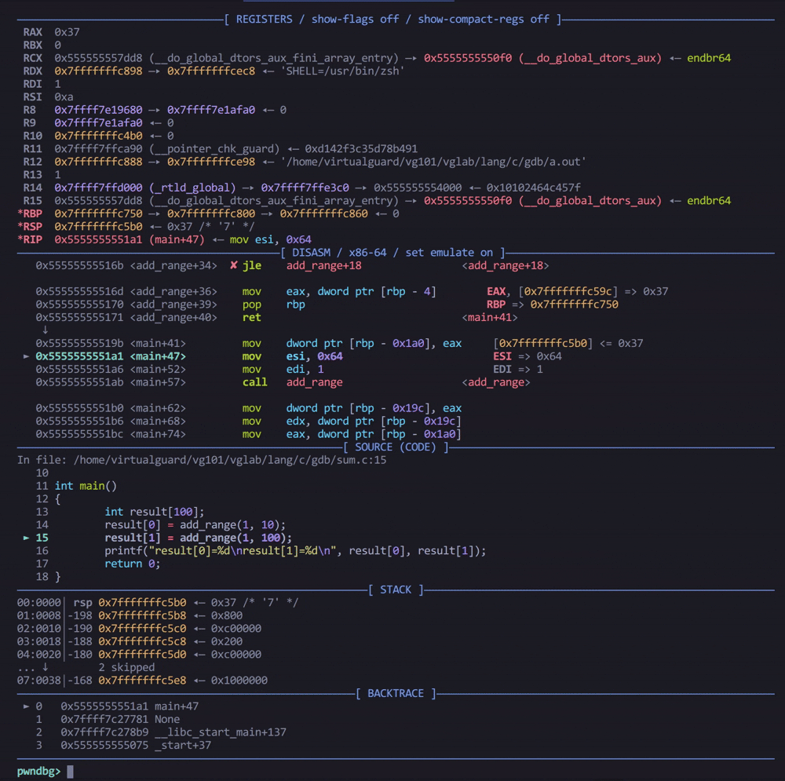
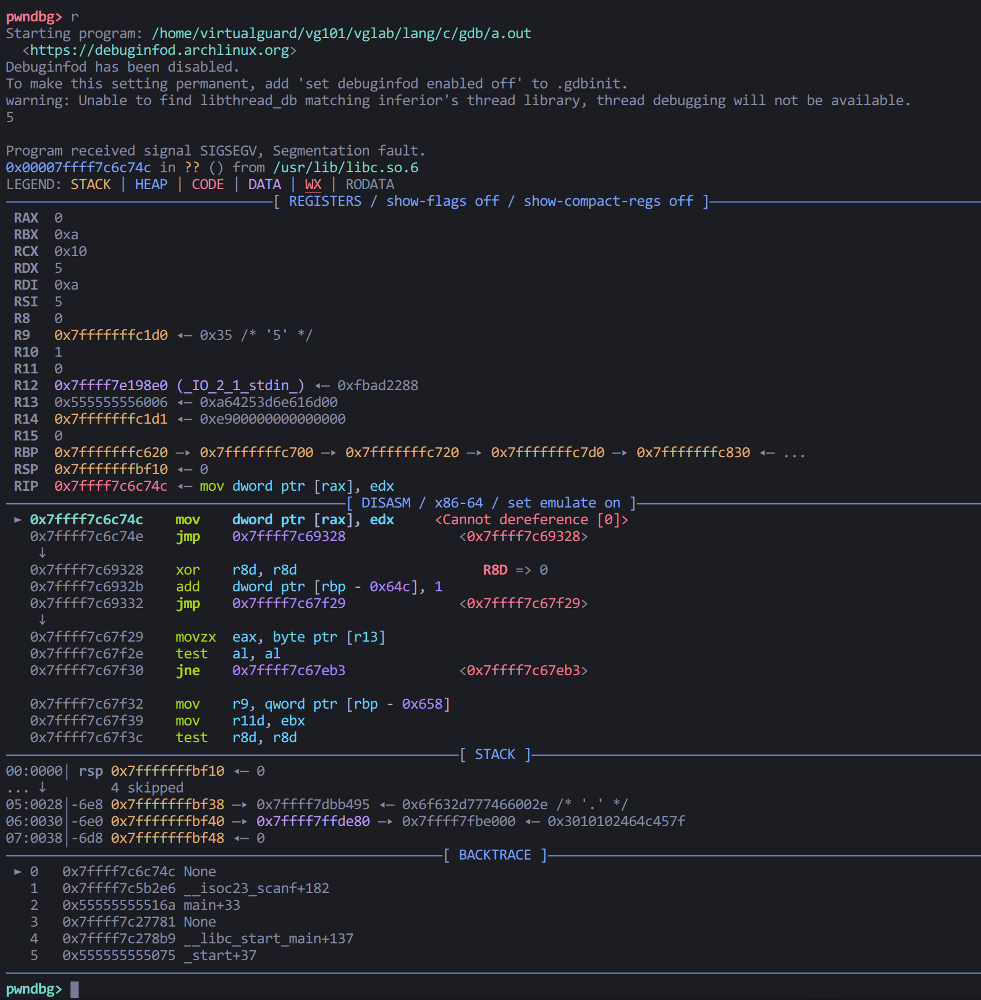

# 调试器

> [gdb | Linux C编程一站式学习](https://akaedu.github.io/book/ch10.html)
>
> [GDB Tutorial](https://nyu-cso.github.io/labs/gdb.html)
>
> [PWNDBG | Documentation](https://pwndbg.re/stable/)

**调试器**(*debugger*)用于**暂停, 观察, 再继续**一个正在运行的程序. 可以随时查看变量, 参数, 当前代码行和调用栈, 这样就可以避免依靠在源代码中到处插入调试语句.

常用手段仍是同一套循环: **观察现象 → 假设原因 → 设计一次新的观察去验证**. 工具只是让观察更精确, 不能代替分析. 滥用单步而跳过思考, 容易治标不治本, 甚至把程序改得更错.

Linux 上 C/C++ 最常见的调试器是 GNU 的 `gdb`. 手册见 [`man gdb`](linux/Man%20pages.md).

本文除了介绍 `gdb` 之外, 还额外介绍了[Pwndbg](#Pwndbg), 它是一个 `gdb` 的插件, 把寄存器, 栈, 反汇编等上下文自动铺开, 能够显著提升调试体验和效率.

## 常用命令速查

| 缩写 | 全称 | 作用 |
| --- | --- | --- |
| `r` | `run` | 从头运行 |
| `start` | | 停在 `main` 开头 |
| `c` | `continue` | 继续跑到下一停点 |
| `n` / `s` | `next` / `step` | 下一源码行 (不进 / 进入函数) |
| `ni` / `si` | `nexti` / `stepi` | 下一指令 |
| `finish` | | 跑完当前函数 |
| `b` | `break` | 断点 |
| `watch` | | 观察点 |
| `l` | `list` | 列源码 |
| `bt` | `backtrace` | 调用栈 |
| `f` | `frame` | 选栈帧 |
| `p` | `print` | 打印表达式 |
| `x` | `examine` | 查看内存 |
| `disass` | `disassemble` | 反汇编 |
| `i r` | `info registers` | 寄存器 |
| `q` | `quit` | 退出 |

## 编译与启动

源码级调试必须带调试符号, 用 `-g` 编译:

```bash
gcc -g foo.c -o foo
gdb foo
```

`-g` 往可执行文件里写入**指令与源码行的对应关系**, 并不把整个源文件嵌进去. 调试时 `gdb` 仍要找得到源文件 (通常和编译时在同一目录).

进入 `(gdb)` 提示符后:

```text
(gdb) help          # 命令分类
(gdb) help break    # 某条命令的说明
(gdb) apropos word  # 按关键词搜命令
```

命令可缩写到不歧义为止, 比如 `r` = `run`, `b` = `break`, `n` = `next`. 直接敲回车会**重复上一条命令**.

!!! tip "`start` 和 `run`"
    `start` 停在 `main` 里第一条可执行语句前, 适合从头单步. `run` (`r`) 一直跑到断点, 信号或程序结束. 程序已在跑时再 `start`/`run`, gdb 会问是否从头开始.


## 基本工作流

### 基本操作

| 命令 | 作用 |
| --- | --- |
| `n` (`next`) | 执行下一**源码行**, 遇到函数调用则整段跑完再停 |
| `s` (`step`) | 下一源码行, **进入**被调用的函数 |
| `finish` | 跑到当前函数返回, 并打印返回值 |
| `c` (`continue`) | 从当前位置继续跑, 直到下一个断点或结束 |
| `f N` (`frame`) | 切到编号 `N` 的栈帧 |
| `i locals` | 看当前栈帧的局部变量 |
| `p expr` | 求值并打印表达式, 赋值也是表达式, 所以能改变量, 甚至调用函数 |
| `set var x=0` | 修改变量, 用来验证 "如果这里是 0 还会不会错" |

### 死循环调试

以下面的死循环(以`2`为步长步进`i`, 显然永远到不了`end`)为例:

```c
int sum_even(int end)
{
  int sum = 0;
  for (int i = 0; i != end; i += 2)
    sum += i;
  return sum;
}
```

```text
(gdb) r          # 程序卡死
^C               # Ctrl-C 打断, 停在当前指令
(gdb) l foo.c:7  # list: 列出附近源码
(gdb) bt         # backtrace: 怎么走到这里的
#0  sum_even (end=11) at foo.c:7
#1  0x... in main () at foo.c:16
(gdb) p end      # print: 看变量
(gdb) p i        # i 已经大得离谱或已经触发符号数回绕
```

Pwndbg调试示例:



### 函数调用跟踪

**`backtrace`每的一行是一个栈帧, 表示一次函数调用**.

`#0` 是当前函数, `#1` 是它的调用者. 

!!! review
    可参考[C 的栈帧布局](../编程语言/c/C%20Memory%20Management.md), 回顾C语言中函数栈帧的概念.

以斐波那契递归程序为例:

```c
#include <stdio.h>

int fibonacci(int n)
{
	return n <= 1 ? n : fibonacci(n - 1) + fibonacci(n - 2);
}

int main()
{
	int n = 5;
	printf("The %dth Fibonacci number is %d\n", n, fibonacci(n));

	return 0;
}
```
若使用[Pwndbg](#Pwndbg)进行调试, 查看调用栈(留意面板上的`BACKTRACE`模块)的变化会更加直观:


`next` 适合确认调用逻辑是否正确; 怀疑被调函数时用 `step` 进入函数逐行调试; 若认为当前函数没问题, 可用 `finish` 跳出函数.

### 局部变量检查

以以下程序为例:

```c
#include <stdio.h>

int add_range(int low, int high)
{
	int i, sum;
	for (i = low; i <= high; i++)
		sum = sum + i;
	return sum;
}

int main()
{
	int result[100];
	result[0] = add_range(1, 10);
	result[1] = add_range(1, 100);
	printf("result[0]=%d\nresult[1]=%d\n", result[0], result[1]);
	return 0;
}
```

执行结果如下:

```text
result[0]=55
result[1]=5105
```

`result[1]`的结果显然有问题, 但是`result[0]`的结果却是正确的.

这时就应该优先怀疑**数据**而不是程序本身.

第二次进入时 `i locals` 会看到未初始化的 `sum` 仍残留着上次的 55:



!!! review
    这个bug的核心原因在于C语言中局部变量**不会自动清零**, 相关内容可参考[C Basics](../编程语言/c/C%20Basics.md#Variable-declaration-and-initialization).


## 断点

单步太慢时, 可通过在可疑处设断点提高调试效率. **断点加单步是日常调试的基本组合**.

```text
(gdb) b 8              # 在当前文件第 8 行
(gdb) b foo.c:8        # 指定文件
(gdb) b sum_even       # 函数入口
(gdb) b 9 if sum != 0  # 条件断点: 仅当表达式为真才停
(gdb) i b              # 查看当前设置了哪些断点(info breakpoints)
(gdb) disable 2        # 暂时关掉 2 号断点
(gdb) enable 2
(gdb) delete 2         # 删掉; 不带编号会问是否全删
(gdb) display sum      # 每次停下都自动打印 sum
(gdb) undisplay 1      # 取消编号为 1 的自动显示
```

条件断点用来跳过"前几次循环是对的, 第 N 次才坏"这类情况, 避免手敲几十次 `n`.

## 观察点与内存

断点按**代码位置**停; 观察点 (watchpoint) 按**某块内存被改写**停. 不知道是谁改了某个变量时特别有用.

```text
(gdb) watch input[5] # 设置观察点: 当input[5]被修改时, 暂停程序
(gdb) i watchpoints	 # 查看当前设置了哪些观察点
(gdb) c				 # 继续程序
```

`x` (examine) 命令用于按原始字节看内存, 不依赖变量类型:

```text
(gdb) x/7b input     # 从 input 起打印 7 个字节
(gdb) x/4xw $rsp     # 栈上 4 个 word, 十六进制 (无源码时常用)
```

格式是 `x/NFU addr`: `N` 个数, `F` 格式 (`x` 十六进制, `d` 十进制, `c` 字符, `s` 字符串, `i` 指令), `U` 单位 (`b` 字节, `h` 半字, `w` 字, `g` 8 字节).

## 段错误

程序收到 `SIGSEGV` 时, 在 gdb 里 `run` 会自动停在出事地点, 再用 `bt` 看是哪一层调用进来的.

下面有两个例子:

`scanf("%d", man)` 少写了 `&`, 把 `man` 的值当成地址去写, 崩溃点往往在 libc 的 `_IO_vfscanf` 里. `backtrace` 会显示真正的调用点在 `main` 的那一行 `scanf`:



局部数组越界当时不一定立刻 SIGSEGV, 而是把返回地址或栈上别的控制数据覆盖掉, **函数返回时** (对应函数结束的 `}`) 才崩. gdb 指到函数末尾的 `}` 时, 优先怀疑本函数里的缓冲区和指针, 而不是去盯那一行空括号.

无源码或只有二进制时, 常用:

```text
(gdb) disass          # 反汇编当前函数
(gdb) ni              # nexti: 单步一条机器指令
(gdb) info registers  # 查看寄存器
(gdb) x/16i $pc       # 从 PC 起看 16 条指令
```

## Pwndbg

[Pwndbg](https://pwndbg.re/stable/) (`/paʊnˈdiˌbʌɡ/`) 是 GDB / LLDB 的插件, 每次停下自动刷新一块 **context**: 寄存器, 反汇编, 栈, 回溯, 以及指针的多层解引用. 普通 gdb 里要反复敲 `i r`, `x/32gx $rsp`, `bt`; 有了 context, 这些信息默认就会显示在调试面板上.

它同时照顾底层开发和逆向, 兼容 `gdb` 的调试命令, 可当作"更好看的 `gdb`"使用.

### 常用命令

每次停住先看context, 再按需加命令. 输入`pwndbg`可列出全部命令, 命令速记可参考官方文档的[CHEATSHEET](https://pwndbg.re/pwndbg-cheatsheet.pdf).

| 命令 | 作用 |
| --- | --- |
| `context` | 手动刷新上下文 (停住时一般会自动打) |
| `vmmap` | 虚拟内存映射, 比 gdb 自带的 `info proc mappings` 更好搜 |
| `telescope` / `tel` | 从某地址起连续解引用, 看栈或缓冲区里藏着哪些指针 |
| `hexdump` | 可读的十六进制转储 |
| `search` | 在进程地址空间里搜字节 / 字符串 / 整数 |
| `procinfo` | 当前进程的 uid, fd 等 |

heap, GOT, ROP gadget 等命令面向逆向和漏洞分析, 相关内容可参考官方文档的[Features](https://pwndbg.re/stable/features/).
