# Relational Model & Algebra

> [Slide - #01: Relational Model & Algebra | CMU 15-445/645](https://15445.courses.cs.cmu.edu/spring2026/slides/01-relationalmodel.pdf)
>
> [Notes - #01: Relational Model & Algebra | CMU 15-445/645](https://15445.courses.cs.cmu.edu/spring2026/notes/01-relationalmodel.pdf)

## Database Background

### Database Management System (DBMS)

> [数据库管理系统 - 数据库系统的基本概念](../数据库系统的基本概念.md#数据库管理系统)

### Data Models

- A *data model*（[**数据模型**](../数据模型.md)） is a collection of concepts for describing the data in a database, which contains the rules that define the types of things that could exist and how they relate.

- A *schema*（[**模式**](../数据库系统结构.md#模式)） is a description of a particular collection of data, using a given data model. This defines the structure of database for a data model.

### Some Data Models

- *Relational*（**关系型**）-> Most DBMS use this model

- *Key-Value*（**键值型**）-> Simple Apps / Caches

- *Graph*（**图数据库型**）-> NoSQL

- *Document / JSON / XML / Object* -> NoSQL

- *Wide-Column / Column-family* -> NoSQL

- *Array (Vector, Matrix, Tensor)* -> ML / Science

- *Hierarchical*（**层次型**）

- *Network*（**网状型**）

- *Semantic*（**语义型**）

- *Entity-Relationship*（**实体关系**）

## Relational Model

> [关系模型](../关系模型.md)

Three concepts of relational model:

- *Structure*（**结构**）: The definition of relations and their contents independent of their physical representation.

- *Integrity*（**完整性**）: Ensure the database’s contents satisfy certain constraints.

- *Manipulation*（**操作**）: Declarative API for accessing and modifying a database's contents via relations (sets).

!!! tip "Data Independent"
    > [数据库系统结构](../数据库系统结构.md)

    Isolate the user/application from low-level data representation. The user only worries about high-level application logic.

    DBMS optimizes the layout according to operating environment, database contents, and workload.

    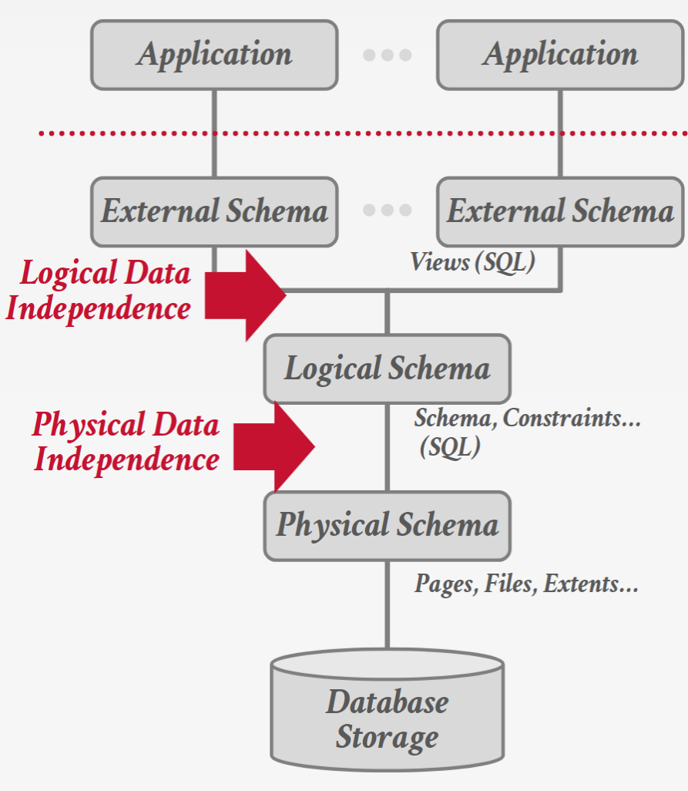

### Some basic concepts

- *Relation*（[**关系**](../关系模型.md#关系)）: Unordered sets that contain the relationship of attributes that represent entities.

    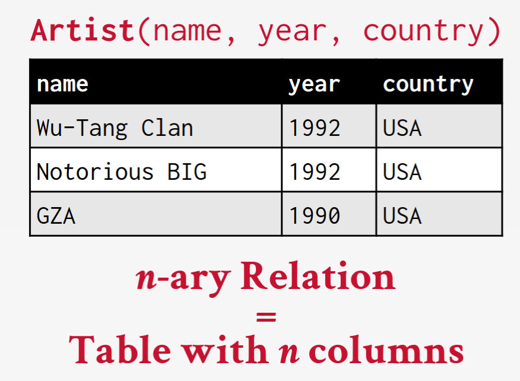

- *Tuple*（[**元组**](../关系模型.md#元组)）: Set of attribute values(aka its domain) in the relation.

    - Values are (normally) **atomic/scalar**.

    - The special value `NULL` is a member of every domain (if allowed).

- *Primary Key*（[**主码**](../关系模型.md#主码)）: The **unique identifier** for each tuple in the relation.

    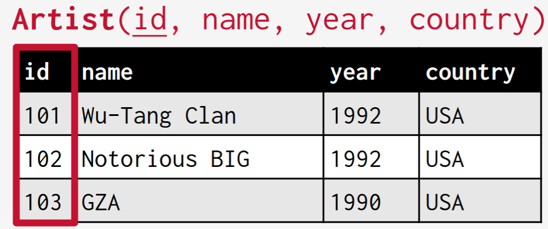

    !!! info
        Some DBMSs will automatically create an internal primary key if a table does not define one.

        DBMS can auto-generation unique primary keys via an [identity column](https://en.wikipedia.org/wiki/Identity_column):

        - IDENTITY (SQL Standard)

        - SEQUENCE (PostgreSQL / Oracle)

        - AUTO_INCREMENT (MySQL)

- *Foreign Key*（**外码**）: The identifier that specifies that an attribute from one relation maps to a tuple in another relation.

    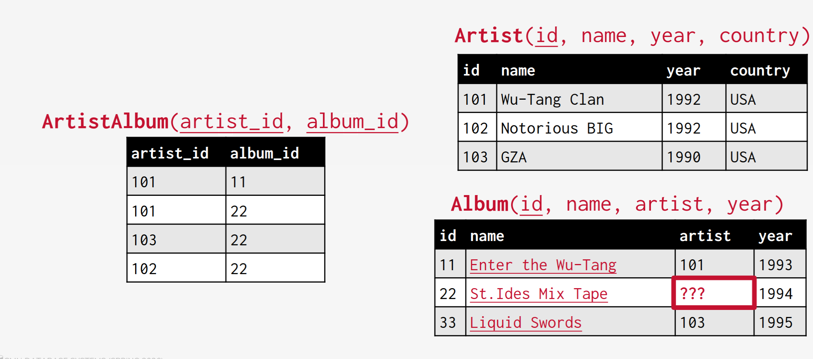

    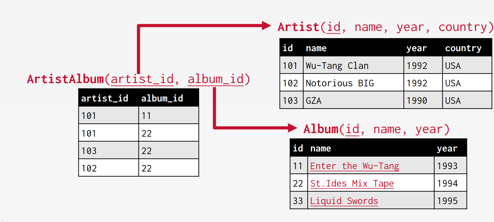

- *Constraints*（**约束**）: Rules that ensure the data in the database is accurate and consistent.

## Relational Algebra

### Data Manipulation Language (DML)

*Data Manipulation Language*（**DML**, **数据操作语言**）, which refers to the API that a DBMS exposes to applications to store and retrieve information from a database.

There are two types of DML:

- *Procedural*（**过程式**）: The query specifies the (high-level) execution strategy the DBMS should use to find the desired result based on sets / bags.

    !!! example
        Use a `for` loop to scan all records and count how many records are there to retrieve the number of records in the table.

- *Non-Procedural (Declarative)*（**声明式**）: The query specifies only what data is wanted and not how to find it.

    !!! example
        Use SQL `SELECT COUNT(*) FROM artist` to count how many records are there in the table.

!!! tip "Why Procedural <=> Relational Algebra, Declarative <=> Relational Calculus?"
    In CMU 15-445, this mapping is not just terminology:

    - **Procedural DML** corresponds to **Relational Algebra (关系代数)**: emphasize **how** to derive results by composing operators (selection, projection, join, union, difference, etc.).

    - **Non-Procedural (Declarative) DML** corresponds to **Relational Calculus (关系演算)**: emphasize **what** result properties are desired, without specifying execution steps.

    - Under safe/tractable conditions, relational algebra and relational calculus are equivalent in expressive power (same query class, viewed from two angles).

    - SQL is written in a mostly declarative style (calculus-like), while the optimizer translates SQL into relational-algebra-style logical plans (and then physical execution plans).

### Relational Algebra Operators

> [关系代数及其演算](../关系代数及其演算.md)

#### Selection

*Selection*（[**选择**](../关系代数及其演算.md#选择)）is the operation that selects a subset of tuples from a relation based on a given condition.

- Syntax:

    $$
    \sigma_{predicate}(R)
    $$

    The predicate acts as a filter, and we can combine multiple predicates using [conjunctions](../../数学/离散数学/legacy/命题逻辑的基本概念.md#命题联结词) and [disjunctions](../../数学/离散数学/legacy/命题逻辑的基本概念.md#命题联结词).

!!! example
    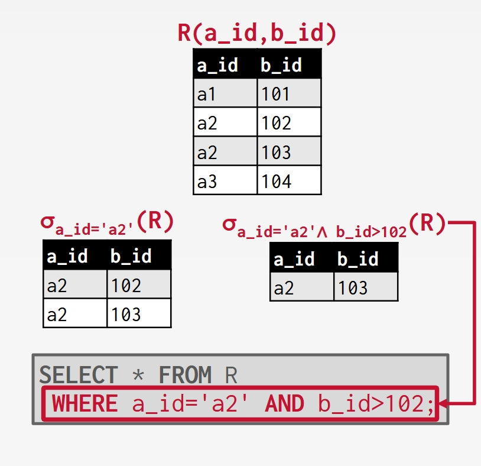

    $$
    \sigma_{a_id = 'a2'}(R)
    $$

    The corresponding SQL query is:

    ```sql
    SELECT * FROM R WHERE a_id = 'a2';
    ```

#### Projection

*Projection*（[**投影**](../关系代数及其演算.md#投影)）takes in a relation and outputs a relation with tuples that contain only specified attributes.

- Syntax: 

    $$
    \pi_{attributes}(R)
    $$

    We can rearrange the ordering of the attributes in the input relation as well as manipulate the values.

!!! example
    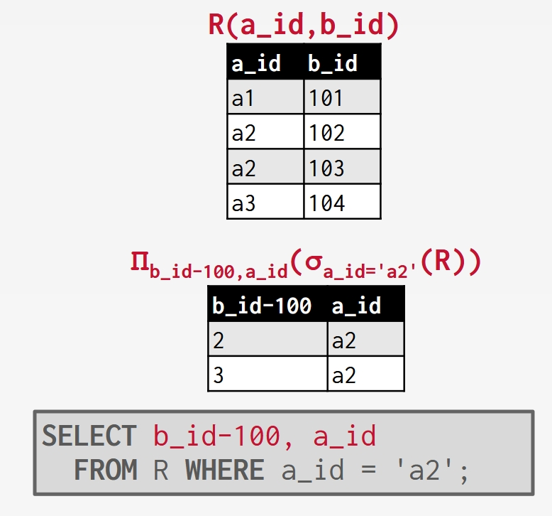

    $$
    \pi_{a_id, b_id}(R)
    $$

    The corresponding SQL query is:

    ```sql
    SELECT a_id, b_id FROM R;
    ```

    For rearrange, we can use selection and projection together:

    $$
    \pi_{b_id, a_id}(\sigma_{a_id = 'a2'}(R))
    $$

    The corresponding SQL query is:

    ```sql
    SELECT b_id, a_id
        FROM R WHERE a_id = 'a2';
    ```

#### Union

*Union*（[**并集**](../关系代数及其演算.md#并)）takes in two relations and outputs a relation that contains all tuples that appear in at least one of the input relations.

- Syntax:

    $$
    R \cup S
    $$

    !!! warning
        The two input relations have to have the exact same attributes.

!!! example
    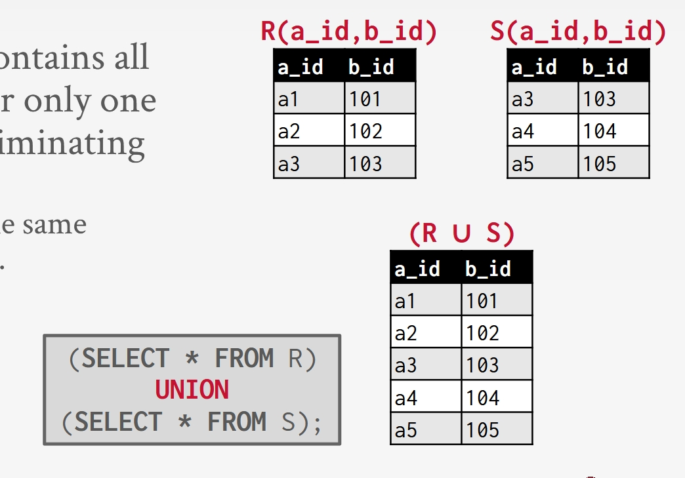

    The corresponding SQL query is:

    ```sql
    (SELECT * FROM R) UNION ALL (SELECT * FROM S);
    ```

#### Intersection

*Intersection*（[**交集**](../关系代数及其演算.md#交)）takes in two relations and outputs a relation that contains all tuples that appear in both of the input relations.

- Syntax:

    $$
    R \cap S
    $$

    !!! warning
        The same as union, the two input relations have to have the exact same attributes.

!!! example
    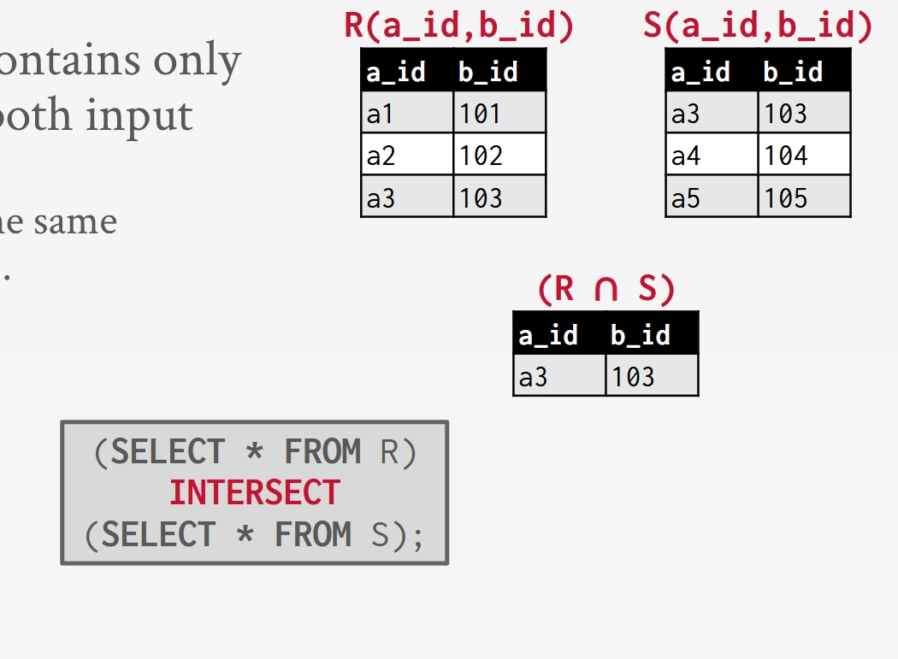

    The corresponding SQL query is:

    ```sql
    (SELECT * FROM R) INTERSECT (SELECT * FROM S);
    ```

#### Difference

*Difference*（[**差集**](../关系代数及其演算.md#差)）takes in two relations and outputs a relation that contains all tuples that appear in the first relation but not the second relation.

- Syntax:

    $$
    R - S
    $$

    !!! warning
        The same as above, the two input relations have to have the exact same attributes.

!!! example
    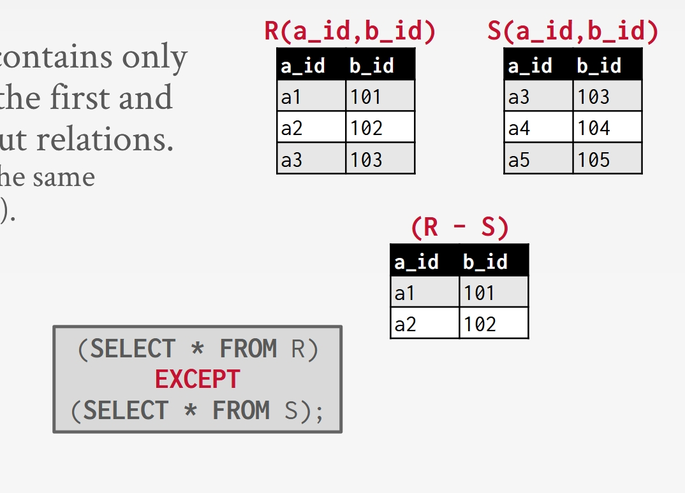

    The corresponding SQL query is:

    ```sql
    (SELECT * FROM R) EXCEPT (SELECT * FROM S);
    ```

#### Product

*Product*（[**广义笛卡尔积**](../关系代数及其演算.md#广义笛卡尔积)）takes in two relations and outputs a relation that contains all possible combinations of tuples from the two input relations.

- Syntax:

    $$
    R \times S
    $$

!!! example
    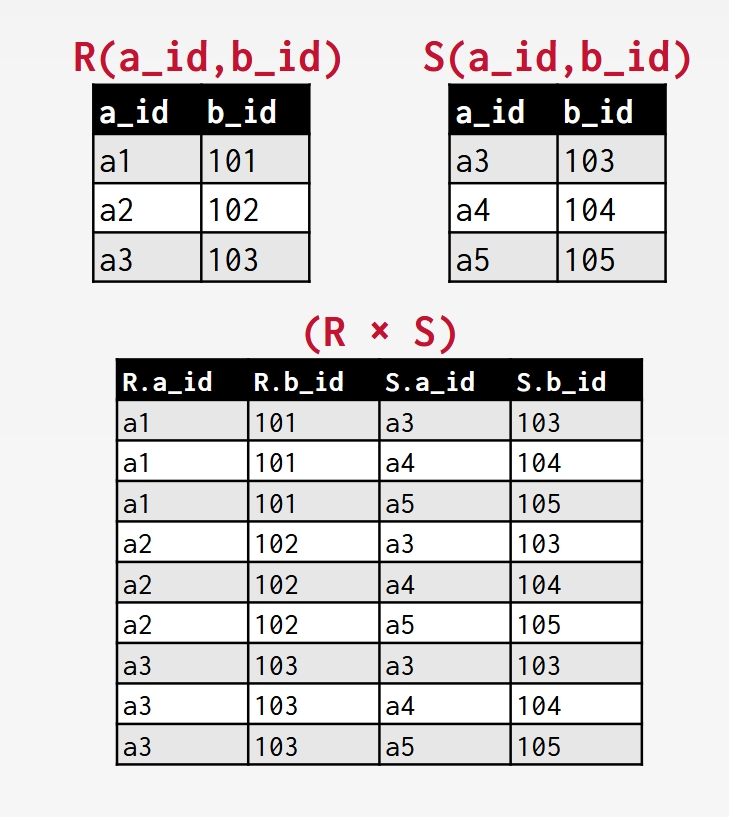

    The corresponding SQL query is:

    ```sql
    SELECT * FROM R CROSS JOIN S;
    ```

    Or simply:

    ```sql
    SELECT * FROM R, S;
    ```

#### Join

*Join*（[**连接**](../关系代数及其演算.md#连接)）takes in two relations and outputs a relation that contains all the tuples that are a combination of two tuples where for each attribute that the two relations share, the values for that attribute of both tuples are the same.

- Syntax:

    $$
    R \bowtie S
    $$

!!! example
    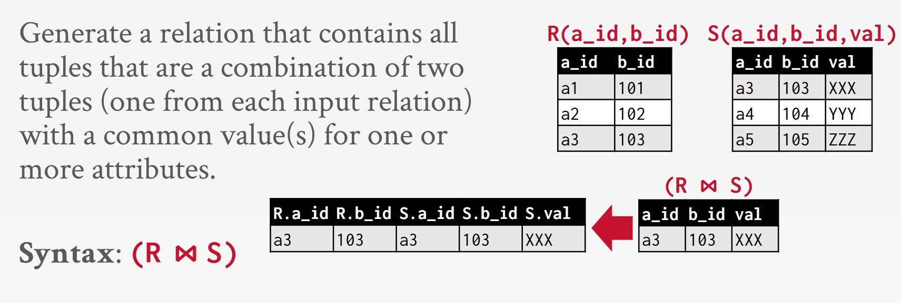

    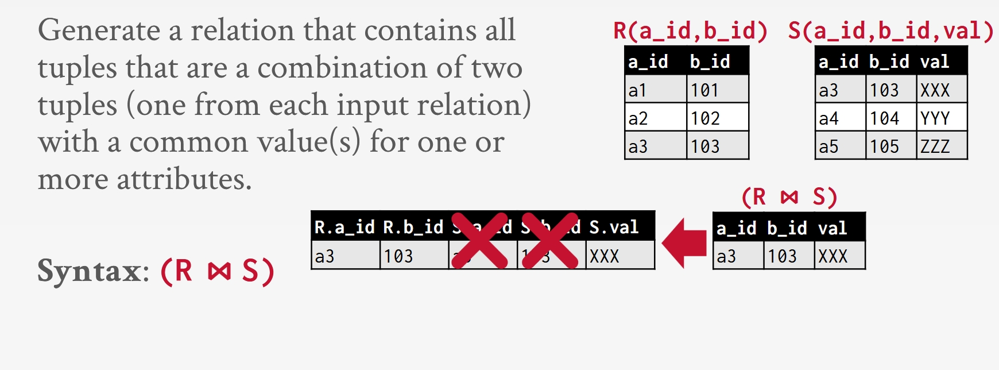

    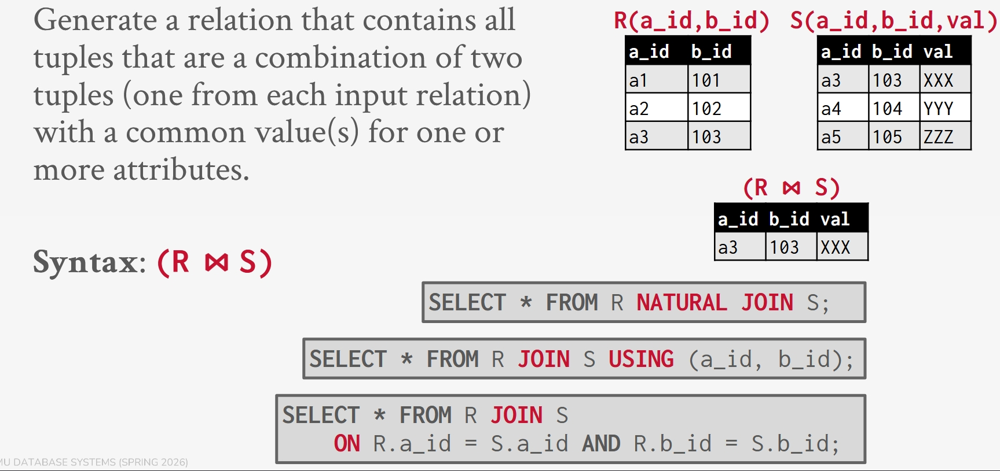

    The corresponding SQL query has three options:

    ```sql
    SELECT * FROM R NATURAL JOIN S;
    ```

    ```sql
    SELECT * FROM R JOIN S USING (a_id, b_id);
    ```

    ```sql
    SELECT * FROM R JOIN S
        ON R.a_id = S.a_id AND R.b_id = S.b_id;
    ```

#### Some Extra Operators

- Rename: $\rho_{new\_name}(R)$

- Assignment: $R \leftarrow \sigma_{predicate}(R)$

- Division: $R \div S$

- Duplicate Elimination: $\delta(R)$

- Aggregate: $\gamma_{function}(R)$

- Sorting: $\tau_{attribute}(R)$

#### Some Tips with Observation[^1]

Relational algebra defines the fundamental operations to retrieve and manipulate tuples in a relation. It
also defines an ordering of the high-level steps to compute a query.
For example, $\sigma_{b_id = 102}(R \bowtie S)$ represents joining R and S and then selecting / filtering the result. However,
$(R \bowtie (\sigma_{b_id = 102}(S)))$ will do the selection on $S$ first, and then join the result of the selection with $R$.

These two statements will always produce the same answer. However, if $S$ has 1 billion tuples and there is only 1 tuple in $S$ with $b_id = 102$, then $(R \bowtie (\sigma_{b_id = 102}(S)))$ will be significantly faster than $\sigma_{b_id = 102}(R \bowtie S)$. How would you know this if you were using Pandas or another procedural DML?

A better approach is to state the high-level result you want (retrieve the joined tuples from $R$ and $S$ where $b_id$ equals $102$), and let the DBMS decide the steps it should take to compute the query. In SQL (a declarative language) we only express what we want to be computed and we do not specify how to compute the result. The DBMS is responsible for finding the best strategy to execute the query (through Query Optimization). This powerful abstraction has made SQL the de facto standard for writing queries on a relational DBMS since the user of the DBMS does not need to know anything about the internals and can query the database in the most efficient way.

**The relational model is independent of any query language implementation**.

## Other Data Models

### Document Data Model

The document data model is a collection of record documents containing a hierarchy of named field/value pairs.

- A field's value can be either a scalar type, an array of values, or another document.

- Modern implementations use JSON. Older systems use XML or custom object representations.

!!! tip
    Avoid object-relational impedance mismatch by tightly coupling objects and database.

    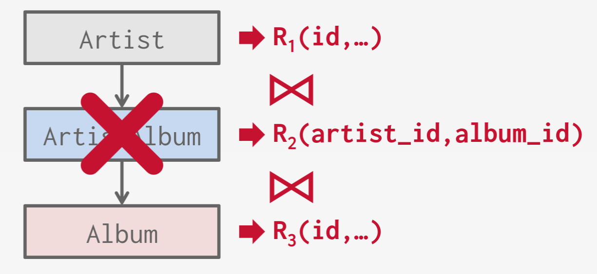

    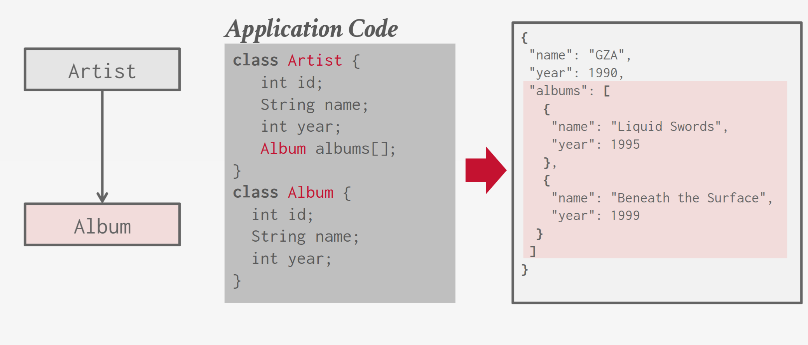

### Vector Data Model

The vector data model represents one-dimensional arrays used for nearest-neighbor search (exact or approximate).

- Used for semantic search on embeddings generated by ML-trained transformer models (think ChatGPT).

- Native integration with modern ML tools and APIs (e.g., LangChain, OpenAI).

At their core, these systems use specialized indexes to perform NN searches quickly.

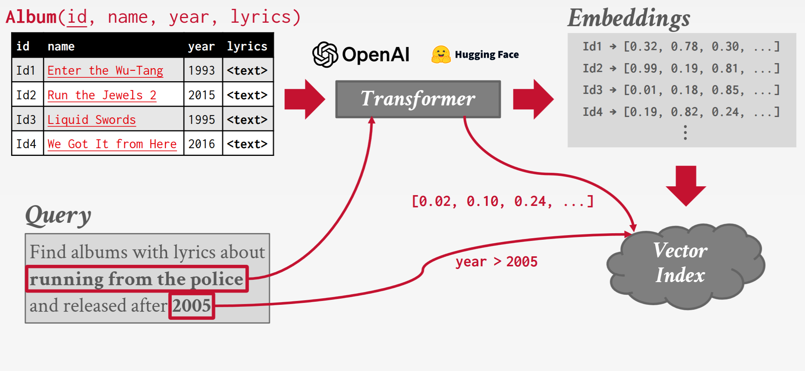


[^1]: [Lecture #01: Relational Model & Algebra | CMU 15-445/645 Notes](https://15445.courses.cs.cmu.edu/spring2026/notes/01-relationalmodel.pdf)