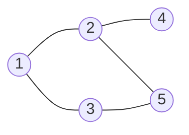

# 图的遍历

## 广度优先搜索

类似二叉树中的[层序遍历](二叉树的遍历.md#层次遍历)。

### 算法思想

从任意一个顶点开始访问，按照距离起始顶点的远近，逐层访问所有顶点。即先访问所有与起始顶点直接相邻的顶点（第一层），再访问与第一层顶点相邻且未访问的顶点（第二层），以此类推，直到所有顶点都被访问。

### 性能分析

### 求解单源最短路径问题

### 广度优先生成树

## 深度优先搜索

> [深度优先搜索 | Linux C 编程一站式学习](https://akaedu.github.io/book/ch12s03.html)
>
> [图的遍历 | Hello 算法](https://www.hello-algo.com/chapter_graph/graph_traversal/)

**深度优先搜索** (*Depth-First Search*, DFS) 类似二叉树的[先序遍历](二叉树的遍历.md#先序遍历): 访问当前顶点后, 沿一条边尽量往深处走, 走不通再[基于栈进行回溯](栈.md#栈的典型应用), 换下一条边.

树没有环, 先序遍历不会重复碰到同一结点. 图可以有环, 必须另备 `visited[]`, 每个顶点只访问一次, 否则会在环上打转.

### 算法思想

从任意顶点 $v$ 出发:

1. 访问 $v$, 并标记为已访问

2. 在 $v$ 的邻接点里挑一个尚未访问的 $w$, 对 $w$ 递归做同样的事 (继续深入)

3. $v$ 的邻接点全部访问过之后, 回溯到调用 $v$ 的那个顶点, 换另一条未走完的边

4. 若图不连通, 对每个尚未访问的顶点再调一次 DFS, 直到所有顶点都被访问

#### 迷宫模型

想象一个[迷宫模型](https://akaedu.github.io/book/ch12s03.html), 走进死胡同就退回岔路口, 换另一条路, 这就是**回溯**(*backtrack*)的基本思想.

初学时可能会纠结迷宫应该怎么实现, 其实若规模不大, 只需一个二维数组, 用`0`表示通路, `1`表示障碍:

```c
int maze[MAX_ROW][MAX_COL] = {
    {0, 1, 0, 0, 0},
    {0, 1, 0, 1, 0},
    {0, 0, 0, 0, 0},
    {0, 1, 1, 1, 0},
    {0, 0, 0, 1, 0},
};
```

用`2`来表示已经走过的格子:

```c
void visit(int row, int col, struct point pre)
{
    struct point visit_point = { row, col };
    maze[row][col] = 2;
    predecessor[row][col] = pre;
    push(visit_point);
}
```

上面的`visit`函数中:

- `pre`表示当前格子的前一个格子

- `visit_point`表示当前遍历到的格子

- `maze[row][col] = 2`表示当前格子已经走过, 用`2`来覆盖

- `predecessor[row][col] = pre`表示当前格子的前一个格子是`pre`, **用于辅助记录路径**, 即每次遍历到某个格子时, 记录下它是从哪个格子走过来的.

- `push(visit_point)`表示将当前格子[压栈](栈.md#入栈), 便于后续的**回溯**:

    ```c
    void push(struct point p)
    {
        stack[top++] = p;
    }
    ```

    思考我们需要回溯时的情况, 在DFS中, 只有在走不通时才需要回溯, 因此我们需要一个栈来**记录路径**, 记录的内容也很简单, 就是**走过的格子**. 这样, 栈中的序列就**自底向上**存储了**从起点到当前格子的路径**.

    基于栈[LIFO](栈.md#定义)的特性, 我们每次回溯时, 只需要[弹出栈顶元素](栈.md#出栈), 返回值就是当前格子的前一个格子, 这样我们就可以**回溯到前一个格子**, 继续尝试其他方向:

    ```c
    struct point pop()
    {
        return stack[--top];
    }
    ```

    **后进先出**逼着算法**先把一条路走到底**, 这才叫深度优先. 每个格子的前驱只有一个, 后继却可能有多个 (探索时往好几个方向都试过), 所以用前驱数组能从终点倒推回起点, 却不能只存一个后继来正向打印整条正确路线.

##### 迭代实现

思考完遍历访问的方式以及路径存储与回溯的形式后, 我们就可以开始实现DFS的主逻辑了:

```c
int main()
{
	struct point p = { 0, 0 };

	maze[p.row][p.col] = 2;
	push(p);	
	
	while (!is_empty()) {
		p = pop();
		if (p.row == MAX_ROW - 1  /* goal */
		    && p.col == MAX_COL - 1)
			break;
		if (p.col+1 < MAX_COL     /* right */
		    && maze[p.row][p.col+1] == 0)
			visit(p.row, p.col+1, p);
		if (p.row+1 < MAX_ROW     /* down */
		    && maze[p.row+1][p.col] == 0)
			visit(p.row+1, p.col, p);
		if (p.col-1 >= 0          /* left */
		    && maze[p.row][p.col-1] == 0)
			visit(p.row, p.col-1, p);
		if (p.row-1 >= 0          /* up */
		    && maze[p.row-1][p.col] == 0)
			visit(p.row-1, p.col, p);
		print_maze();
		sleep(1);
	}
	if (p.row == MAX_ROW - 1 && p.col == MAX_COL - 1) {
		printf("(%d, %d)\n", p.row, p.col);
		while (predecessor[p.row][p.col].row != -1) {
			p = predecessor[p.row][p.col];
			printf("(%d, %d)\n", p.row, p.col);
		}
	} else {
		printf("No path!\n");
	}

	return 0;
}
```

上面是[参考文献](https://akaedu.github.io/book/ch12s03.html)中的实现, 采用了[迭代](迭代与递归.md#迭代)的方式:

抹去细节, 只保留主要逻辑就是这样:

```c
/* 将起点标记为已走过并压栈; */
while (/*栈非空*/) {
    /* 弹出栈顶格子 p; */
    if (/* p 是终点 */) break;
    /* 否则按右 / 下 / 左 / 上探索相邻格子; */
    if (/* 相邻格可走且未走过 */)
        /* 标记为已走过, 记下前驱为 p, 压栈; */
}
```

##### 递归实现

既然我们用到了栈, 回顾[递归调用的本质](迭代与递归.md#递归调用栈), 我们完全可以直接让系统帮我们维护一个栈, 这样我们就可以避免显式使用栈带来的维护成本.

#### 基于图的DFS抽象

将迷宫模型抽象成到数据结构[图](图的基本概念.md#图), 把每个格子当成一个顶点, 上下左右可走的相邻格当成边, 我们就可以基于数据结构来实现DFS.

下面这张[无向图](图的基本概念.md#无向图)从 $1$ 出发, 邻接点按编号从小到大:



使用DFS的一个查找路径如下:

```
visit 1, 邻接 2, 3
  visit 2, 邻接 1(已访), 4, 5
    visit 4, 邻接 2(已访) → 回溯
    visit 5, 邻接 2(已访), 3
      visit 3, 邻接 1(已访), 5(已访) → 回溯
序列: 1, 2, 4, 5, 3
```

若邻接表里 $1$ 的边表是 $3$ 再 $2$, 序列就变成 $1, 3, 5, 2, 4$. 两种都是合法 DFS, 邻接点次序不同, 遍历序列就不同.

#### 递归实现

递归版把「当前路径」放在[调用栈](迭代与递归.md#递归调用栈)里, **回溯就是函数返回**.

408中习惯用 [`FirstNeighbor` / `NextNeighbor`](图的存储及基本操作.md#FirstNeighbor-与-NextNeighbor) 枚举邻接点.

```c
bool visited[MAX_VERTEX_NUM];

void DFS(Graph G, int v) {
    visit(v);
    visited[v] = true;
    for (int w = FirstNeighbor(G, v); w >= 0; w = NextNeighbor(G, v, w))
        if (!visited[w])
            DFS(G, w);          // 树边 (v, w)
}

void DFSTraverse(Graph G) {
    for (int i = 0; i < G.vexnum; ++i)
        visited[i] = false;
    for (int i = 0; i < G.vexnum; ++i)
        if (!visited[i])
            DFS(G, i);          // 每个连通分量调一次
}
```

`DFSTraverse` 外层循环保证非连通图也能扫全. 无向图里调用 `DFS` 的次数等于[连通分量](图的基本概念.md#连通连通图和连通分量)个数.

递归本质是系统帮你维护一个栈. 显式[栈](栈.md)也能写出 DFS, 栈顶是当前正在走的顶点, 还有未访问邻接点就压进去继续深入, 没有了就弹栈回溯, 正如上面的[迷宫模型](#迷宫模型)所示.

#### 迭代实现

在数据结构的抽象下, DFS的迭代实现

### 性能分析

时间 = 访问 $|V|$ 个顶点 + 检查每条边的邻接关系, 瓶颈在「找出邻接点」怎么存.

| 存储 | 找一个顶点的全部邻接点 | 整图 DFS |
| --- | --- | --- |
| [邻接矩阵](图的存储及基本操作.md#邻接矩阵) | 扫一行 $O(\|V\|)$ | $O(\|V\|^2)$ |
| [邻接表](图的存储及基本操作.md#邻接表) | 跟边走 $O(\deg(v))$ | $O(\|V\| + \|E\|)$ |

空间:

- `visited[]` 必占 $O(|V|)$

- 递归栈 (或显式栈) 最坏 $O(|V|)$: 图退化成一条链时, DFS 生成树高为 $|V|-1$

- 合计 $O(|V|)$, 与 BFS 同阶 (BFS 的空间在队列上)

!!! tip "序列唯一吗"
    [邻接矩阵](图的存储及基本操作.md#邻接矩阵)表示唯一, 按列号从小到大扫邻接点时, 给定起点的 DFS 序列唯一.
    [邻接表](图的存储及基本操作.md#邻接表)边表次序随建表而变, 序列一般不唯一; 题目若画出了具体邻接表, 则按该表执行, 序列就定了.

!!! warning "DFS 不保证最短路"
    无权图上从起点到终点, DFS 找到的只是「某条」路径. 同一迷宫用[队列](队列.md)做[广度优先](#广度优先搜索), 才是边数最少的那条. 带权最短路见 [Dijkstra / Floyd](图的应用.md#最短路径).

### 深度优先生成树和生成森林

DFS 中, 从 $v$ 第一次走到尚未访问的 $w$ 时, 边 $(v, w)$ 称为**树边**. 全部树边加上被访问的顶点, 构成一棵[生成树](图的基本概念.md#生成树生成森林).

上面的例子, 序列 $1, 2, 4, 5, 3$ 对应树边 $1{-}2$, $2{-}4$, $2{-}5$, $5{-}3$:

```
    1
    |
    2
   / \
  4   5
       \
        3
```

剩下的边 $1{-}3$ 连到祖先, 是**回边**, 说明图里有环. 连通无向图有 $n$ 个顶点, 生成树恰好 $n-1$ 条树边.

DFS 树往往又高又瘦 (一条路走到底); BFS 树往往又矮又宽 (按层铺开). 二者都是生成树, 但都不是[最小生成树](图的应用.md#最小生成树): MST 要边权之和最小, 和遍历次序无关.

邻接表不唯一时, 深度优先生成树也不唯一, 道理和遍历序列一样.

图不连通时, 对每个连通分量各长出一棵 DFS 树, 这些树合起来叫**深度优先生成森林**. 有向图里从某点出发未必能到所有顶点, 一次 DFS 只覆盖「从该点可达」的部分, 要从每个未访问顶点再出发, 同样得到森林.

## 图的遍历与图的连通性
