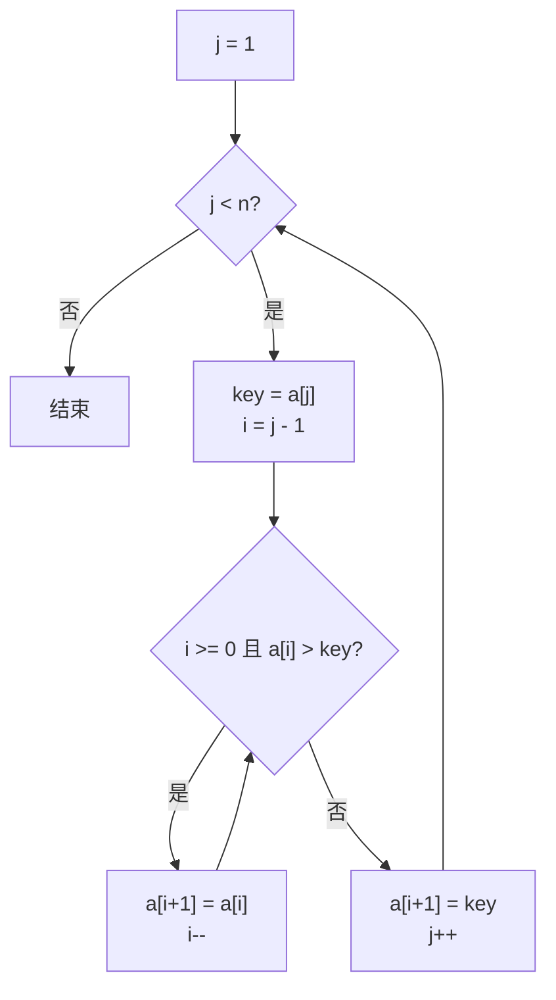

# 插入排序

> [插入排序 | Linux C 编程一站式学习](https://akaedu.github.io/book/ch11s02.html)
>
> [插入排序 | Hello 算法](https://www.hello-algo.com/chapter_sorting/insertion_sort/)
>
> [插入排序 | 维基百科](https://zh.wikipedia.org/wiki/%E6%8F%92%E5%85%A5%E6%8E%92%E5%BA%8F)

**插入排序**（*Insertion Sort*）的基本思想是: 每次将一个待排序记录按其关键字大小插入到前面已经排好序的子序列中, 使有序区间逐渐增长, 直到整个序列有序.

这和整理扑克牌常用手法很像: 手里的牌始终有序, 每抓到一张新牌, 就从右往左找到它该待的位置插进去.

由这一思想可以派生出三种算法:

- [直接插入排序](#直接插入排序): 边比较边后移, 找到位置后插入

- [折半插入排序](#折半插入排序): 用[折半查找](顺序查找和折半查找.md#折半查找)定位, 再统一后移

- [希尔排序](#希尔排序): 按增量分组做直接插入, 让元素一次能跳得更远

三者都属于**内部排序**, 且都是原地算法(空间复杂度 $O(1)$). 与[交换排序](交换排序.md)、[选择排序](选择排序.md)并列, 是408中定义的内部排序的三大类之一.

## 直接插入排序

**直接插入排序**（*Straight Insertion Sort*）每次取未排序区间的第一个元素, 插入到左侧有序区间的合适位置.

把数组想象成一排固定座位而不是手里的牌: 两个相邻单元之间**插不进**一个新单元, 因此插入点右侧的元素必须依次**后移一位**, 腾出空位. 这和[顺序表的插入](线性表的顺序表示.md#插入)是同一件事.

初始时, 只有 $a[0]$ 一个元素, 单元素序列天然有序. 随后依次处理 $a[1], a[2], \ldots, a[n-1]$.

以 $\{10, 5, 2, 4, 7\}$ 为例 (竖线左侧是本趟开始前已经有序的前缀):

```
10 |  5,  2,  4,  7
5,  10 |  2,  4,  7
2,  5,  10 |  4,  7
2,  4,  5,  10 |  7
2,  4,  5,  7,  10 |
```

抓到 $7$ 时, 只需从右往左依次和 $10$、$5$ 比较: $7 < 10$, 继续往左; $7 > 5$, 插在这里. 无需再看左侧的 $4$ 和 $2$, 因为左侧已经有序. 这个前提就是下面要写的循环不变式.



### 算法实现

下面是 $0$ 下标写法, 待排序区间为 $a[0..n-1]$:

```c
void insertion_sort(int a[], int n) {
    int i, j, key;
    for (j = 1; j < n; j++) {
        key = a[j];          // 本趟待插入元素
        i = j - 1;
        while (i >= 0 && a[i] > key) {
            a[i + 1] = a[i]; // 比 key 大的元素后移
            i--;
        }
        a[i + 1] = key;      // 空位插入
    }
}
```

!!! note "哨兵写法"
    408中常把元素放在 $A[1..n]$, 用 $A[0]$ 当**哨兵**（*sentinel*）, 这样既能暂存待插入值, 又能作为循环终止条件, 从而省掉 `i >= 0` 的边界判断.

    ```c
    void InsertSort(ElemType A[], int n) {
        int i, j;
        for (i = 2; i <= n; i++) {
            if (A[i] < A[i - 1]) {     // 小于前驱才需要插入
                A[0] = A[i];           // 哨兵
                for (j = i - 1; A[0] < A[j]; --j)
                    A[j + 1] = A[j];
                A[j + 1] = A[0];
            }
        }
    }
    ```

    注意哨兵不能当成普通数据元素使用.

### 循环不变式

考虑如何证明"循环体执行 $n-1$ 次后, 整个数组一定有序".

可以借用[CLRS](https://zh.wikipedia.org/wiki/%E7%AE%97%E6%B3%95%E5%AF%BC%E8%AE%BA)的**循环不变式**（*Loop Invariant*）, 若某个判断满足下面三条, 就可以用数学归纳法证明循环正确:

1. **初始化**: 第一次执行循环体**之前**该判断为真

2. **保持**: 若第 $N$ 次循环之前为真, 则第 $N$ 次循环之后仍为真

3. **终止**: 循环结束后该判断为真, 足以说明问题已解决

直接插入排序的不变式是**第 $j$ 次循环之前, 子序列 $a[0..j-1]$ 已排好序**.

对应:

1. 第一次循环前 $j = 1$, $a[0..0]$ 只有一个元素, 显然有序 (归纳基础, 相当于[递归](迭代与递归.md#递归)的 Base Case)

2. 若 $a[0..j-1]$ 已有序, 算法把所有大于 `key` 的元素后移并插入 `key`, 结束后 $a[0..j]$ 仍有序 (递推关系)

3. 循环结束时 $j = n$, 于是 $a[0..n-1]$ 整体有序

这说明, 用不变式证明循环, 和用 Base Case + 递推证明递归, 是同一套思路, [递归与循环在证明上是等价的](迭代与递归.md).

### 算法分析

设表长为 $n$, 采用带哨兵的写法.

[时间复杂度](算法和算法评价.md#时间复杂度)由「关键字比较次数 + 元素移动次数」决定算法和算法评价. 第 $i$ 趟 ($i = 2, 3, \ldots, n$) 是把 $A[i]$ 插入 $A[1..i-1]$.

- **最好** (表已正序): 每趟只与前驱比较 $1$ 次, 不移动. 比较 $n-1$ 次, 移动 $0$ 次, $O(n)$

- **最坏** (表逆序): 每趟都要插到表头, 并撞上哨兵才停

    $$
    \text{比较次数} = \sum_{i=2}^{n} i = \frac{(n+2)(n-1)}{2}
    $$

    $$
    \text{移动次数} = \sum_{i=2}^{n} (i+1) = \frac{(n+4)(n-1)}{2}
    $$

    算法复杂度 $O(n^2)$

- **平均** (插入位置在有序区中均匀分布): 约为最坏情况的一半, 仍是 $O(n^2)$

- **空间复杂度** $O(1)$, 原地排序.

- **稳定性**: 后移条件是 `a[i] > key` 而不是 `>=`, 相等元素不会跨过彼此, **稳定**.

- **适用存储**: [顺序表](线性表的顺序表示.md)与[链表](线性表的链式表示.md)都可以. 链表上定位仍是 $O(n)$, 但插入本身是 $O(1)$, 无需成片移动元素.

!!! tip
    直接插入是**自适应**的: 序列越接近有序, 内层 `while` 越早结束. 小规模数据或「基本有序」时, 它往往比平均 $O(n \log n)$ 的复杂算法更快. Java 的 `TimSort`、许多 introsort 实现都在短区间上回退到插入排序.


## 折半插入排序

相比较直接插入排序, **折半插入排序**（*Binary Insertion Sort*）把"找位置"和"腾空位"拆分开来:

1. 左侧已是有序顺序表, 用[折半查找](顺序查找和折半查找.md#折半查找)确定插入位置

2. 再把插入点到 $A[i-1]$ 的元素**统一后移**, 写入待插入值

```c
void BinaryInsertSort(ElemType A[], int n) {
    int i, j, low, high, mid;
    for (i = 2; i <= n; i++) {
        A[0] = A[i];
        low = 1;
        high = i - 1;
        while (low <= high) {
            mid = (low + high) / 2;
            if (A[mid] > A[0])
                high = mid - 1;   // 插入点在左半
            else
                low = mid + 1;    // 相等也往右, 保证稳定
        }
        for (j = i - 1; j >= high + 1; --j)
            A[j + 1] = A[j];
        A[high + 1] = A[0];
    }
}
```

`A[mid] == A[0]` 时 `low = mid + 1`, 插入点落在相等元素右侧, 相对次序不变, 因此折半插入仍然稳定.

### 算法分析

- 每趟折半查找约 $\lfloor \log_2 i \rfloor + 1$ 次比较, $n$ 趟合计 $\Theta(n \log n)$. **比较次数只取决于 $n$**, 与初始序列无关

- 元素移动次数与直接插入相同, 仍依赖初始序列, 最坏 $O(n^2)$

- 因此**整体时间复杂度仍为 $O(n^2)$**; 最好情况是 $O(n \log n)$ (几乎不移动, 但折半每次都要做), **不是** $O(n)$

- 空间 $O(1)$; 需要随机访问, **只适用于顺序表**

!!! warning
    用了折半查找并没有从源头上优化算法复杂度. 插入排序的瓶颈在移动, 不在比较. 数据量不大、比较代价明显高于移动时, 折半插入才有实际收益.

## 希尔排序

**希尔排序**（*Shell Sort*, 1959, Donald Shell）又称**缩小增量排序**. 它抓住了直接插入的两个性质:

1. 对**接近有序**的序列, 插入排序接近线性

2. 每次却只能把元素移动**一个位置**, 逆序时小元素要挪很久才能到前面

于是先让相距较远的元素各自有序 (一次能跳一大步), 再逐步缩小间距; 最后间距为 $1$ 时退化为直接插入, 但此时序列已经「宏观有序」, 只需微调.

### 过程

取增量序列 $d_1 > d_2 > \cdots > d_t = 1$. 第 $k$ 趟把下标相差 $d_k$ 的记录分成一组, 组内做直接插入. 常用且便于手算的是**希尔增量**: $n/2,\ n/4,\ \ldots,\ 1$.

以 $\{8, 9, 1, 7, 2, 3, 5, 4\}$ 为例:

| 增量 | 分组 | 组内插入后 |
| --- | --- | --- |
| $4$ | $(8,2),\ (9,3),\ (1,5),\ (7,4)$ | $2,\ 3,\ 1,\ 4,\ 8,\ 9,\ 5,\ 7$ |
| $2$ | $(2,1,8,5),\ (3,4,9,7)$ | $1,\ 3,\ 2,\ 4,\ 5,\ 7,\ 8,\ 9$ |
| $1$ | 整表 | $1,\ 2,\ 3,\ 4,\ 5,\ 7,\ 8,\ 9$ |

最后一趟增量必须为 $1$, 否则不能保证全部排完.

```c
void ShellSort(ElemType A[], int n) {
    int dk, i, j;
    for (dk = n / 2; dk >= 1; dk /= 2) {
        for (i = dk + 1; i <= n; ++i) {
            if (A[i] < A[i - dk]) {
                A[0] = A[i];           // 暂存, 不是哨兵
                for (j = i - dk; j > 0 && A[0] < A[j]; j -= dk)
                    A[j + dk] = A[j];
                A[j + dk] = A[0];
            }
        }
    }
}
```

!!! note "和直接插入哨兵的区别"
    希尔分组后下标会跳到 $j \leqslant 0$, 不能靠 $A[0]$ 挡越界, 必须显式判断 `j > 0`. $A[0]$ 在这里只是临时变量.

### 算法分析

- **空间复杂度** $O(1)$

- **时间复杂度**依赖于增量序列, 目前没有公认的最优序列. 希尔增量最坏 $O(n^2)$; 某些序列 (如 Hibbard $2^k-1$) 最坏可达 $O(n^{3/2})$; 408 常记「特定范围内约 $O(n^{1.3})$」

- **不稳定**: 相等关键字可能被分到不同子表, 组内排序会打乱相对次序. 例如 $\{5_a, 5_b, 2\}$, 增量 $2$ 的一组是 $(5_a, 2)$, 排完变成 $\{2, 5_b, 5_a\}$

- **只适用于顺序表**: 按 $d_k$ 跳跃访问, 链表做不到随机定位(其实也可以, 但是每次定位都要 $O(n)$ 的开销)

增量序列只要**最后一项为 $1$** 就能正确工作; 选取与严格复杂度证明仍是未完全解决的问题.

## 三种插入排序对照

| | 直接插入 | 折半插入 | 希尔 |
| --- | --- | --- | --- |
| 最佳时间复杂度 | $O(n)$ | $O(n \log n)$ | 与增量有关 |
| 平均 / 最坏时间复杂度 | $O(n^2)$ / $O(n^2)$ | $O(n^2)$ / $O(n^2)$ | 约 $O(n^{1.3})$ / 可到 $O(n^2)$ |
| 空间复杂度 | $O(1)$ | $O(1)$ | $O(1)$ |
| 稳定性 | 是 | 是 | 否 |
| 适用存储 | 顺序表 / 链表 | 仅顺序表 | 仅顺序表 |

!!! tip "插入排序的抉择"
    - 规模很小, 或几乎已经有序: 直接插入

    - 顺序表、比较代价明显高于移动、规模仍不大: 折半插入

    - 中等规模、不要求稳定、只要原地: 希尔 (现代库更常直接上[快排](交换排序.md#快速排序) / [归并](其他内部排序.md#归并排序) / TimSort)
