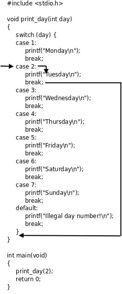
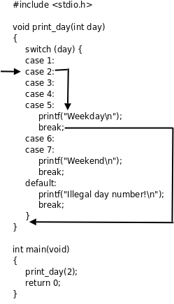

# switch语句

switch语句可以产生具有多个分支的控制流程.



## 基本语法

```c
switch (expression) {
  case constant1:
    // code
    break;
  case constant2:
    // code
    break;
  default:
    // code
}
```

## 注意事项

- 每个`case`语句后的表达式必须是**常量表达式**, 这个值和全局变量的初始值一样必须在编译时计算出来.

- 由于[浮点数](../../计算机系统与体系结构/cs61c/Floating%20Point.md)并不适合作精确比较, 所以上述的常量表达式应为**整型常量表达式**.

- 进入`case`后如果没有遇到`break`语句就会一直往下执行，后面其它`case`或`default`分支的语句也会被执行到，直到遇到`break`，或者执行到整个`switch`语句块的末尾。通常每个`case`后面都要加上`break`语句，但有时会故意不加`break`来利用这个特性.

    

<!-- ## 编译优化 -->
